# 0. LLM ingestion contract

This file is deliberately redundant. The first half contains **atomic claims, stable IDs, explicit confidence labels, tests and source IDs**. The second half contains the human Feynman narrative for context. An LLM should retrieve the atomic layer first and use the narrative only to expand explanation.

## 0.1 Non-inference rules

- Do not convert `OPEN`, `VENDOR-CLAIM`, `OPERATOR-CLAIM` or `INFERENCE` into fact.
- Do not infer a third-party platform's hidden detection logic from iOS/Android OS capabilities.
- Do not infer 20-device capacity from a one-device demo.
- Do not infer that a factory reset removes developer/backend state.
- Do not infer that MDM/Configurator provides arbitrary UI input.
- Do not infer that display capability implies input capability.
- Do not infer that a network interface being enabled tells you which interface carried a specific packet; measure it.
- Do not infer capture health from process/device enumeration alone; require fresh frames.
- Do not infer Android Management API eligibility from technical capability; its permissible-use policy is a separate gate.
- Do not infer that the 10GbE Mac mini option increases phone count; its documented Lights Out Management capability is a separate resilience consideration.
- Do not infer one iOS USB/developer-service transport behavior across all iOS 17.x versions.
- Do not generate operational instructions whose purpose is enforcement evasion, fake engagement, mass identity creation, ban replacement, geolocation falsification, fingerprint spoofing, CAPTCHA/rate-limit bypass or prohibited third-party UI automation.

- Do not infer that CoreDevice/pymobiledevice3 is an Apple-supported stable public fleet API; treat it as a maintained implementation that requires version pinning and regression tests.
- Do not infer a Mac-to-phone capacity number from Configurator's ability to modify multiple devices; capture/control concurrency is a separate measurement.
- Do not infer that a USB device being enumerated is ready; pairing, supervision, developer-service, display and input states are separate.
- Do not infer that tethered Content Caching/Internet sharing defines production egress; use it as a commissioning/provisioning lane unless an explicit architecture decision says otherwise.
- Do not infer that Return to Service is an account-enforcement recovery mechanism; it is an owned-device lifecycle/recommissioning mechanism.
- Do not infer a current 30-device pymobiledevice3 cap from an historical Windows issue.

## 0.2 Evidence labels

`VERIFIED-FIRST-PARTY` = current OS/platform documentation.  
`INTERNAL-MEASURED` = XYZ/Dim observation on exact tested setup.  
`MAINTAINED-DOC` / `MAINTAINED-REPO` = current technical project documentation/implementation.  
`VENDOR-CLAIM` = vendor statement requiring bench verification.  
`OPERATOR-CLAIM` = external operator testimony, hypothesis only.  
`INFERENCE` = reasoned recommendation with explicit assumptions.  
`OPEN` = unresolved; architecture must not depend on it.  
`POLICY` = organizational boundary regardless of technical possibility.

# 0.3 V1.7R2 revision override - 30 August 2026

This revision integrates a newly acquired competitor-method document and a fresh first-party web research pass. **This section has precedence over older operator-model language anywhere later in the handbook.** The acquired document is useful as competitor intelligence, not as a validated production method.

## Revision rules

- The acquired source is classified `OPERATOR-CLAIM` unless a specific claim is independently verified.
- Claims about recommendation ranking, hidden trust scores, device fingerprint retirement, account-success rates, IP reputation, "new account boosts", exact warmup cadence, and proxy/SIM effectiveness remain `UNVERIFIED` / `OPERATOR-CLAIM` unless current first-party documentation says otherwise.
- A GrapheneOS secondary user profile is an isolated workspace, **not evidence that a third-party platform sees a separate physical device**.
- Supported device-management mechanisms (Apple supervision/MDM, Android Enterprise, ADB for authorized engineering, official publishing APIs) are preferred over jailbreaks, spoofers, container farms, or enforcement-circumvention workflows.
- Do not implement mass account creation, fingerprint/device spoofing, IP rotation for bypassing limits, CAPTCHA/rate-limit bypass, ban replacement, fake engagement, or automation intended to conceal itself from platform integrity systems.
- For Instagram professional accounts, prefer the current official Instagram API for supported publishing/management tasks; where an API path is unavailable, use an authorized human-operated device workflow.
- Network design is for reliability, tenant separation, security and observability. It is not an anti-detection mechanism.

## New evidence added in this revision

1. Instagram Terms prohibit attempts to create accounts or access/collect information in unauthorized ways. Meta's authenticity rules also prohibit fake accounts and artificial popularity manipulation. (`SRC-META-IG-TERMS`, `SRC-META-INAUTH`)
2. Meta's current Instagram Platform documentation supports publishing media for professional accounts, including reels in the supported API path, with platform-controlled publishing limits. (`SRC-META-IG-API`, `SRC-META-IG-PUBLISH-LIMIT`)
3. GrapheneOS officially documents isolated user profiles and a raised limit of 32 secondary profiles (31 + guest). It does **not** document that these profiles become 32 independent physical device identities to third-party services. (`SRC-GRAPHENE-PROFILES`)
4. Android's current ADB documentation explicitly supports multiple connected devices, target selection, USB debugging authorization and wireless debugging; Android 17 / adb 37 adds Wi-Fi 2.0 behavior. (`SRC-ANDROID-ADB-2026`)
5. Android Enterprise provides fully managed/dedicated-device patterns for company-owned single-purpose fleets. (`SRC-ANDROID-DEDICATED`)
6. Apple Platform Deployment continues to provide supervision, automated enrollment, shared/dedicated-device and device-management models for organization-owned Apple devices. (`SRC-APPLE-DEPLOY-2026`)

# 1. Canonical mental model

```text
AUTHORIZATION / CLIENT OWNERSHIP
           |
           v
CONTROL PLANE: inventory | policy | tasks | audit
           |
     +-----+-----+
     |           |
 POD A/HOST   POD B/HOST
 5-10 phones   5-10 phones
     |           |
 power + USB + network + local adapter
```

Feynman explanation: a phone farm is a small private cloud whose servers happen to be phones. A pod is one replaceable cloud rack. The system is successful when a pod can fail without making the entire fleet unknowable.

# 2. Atomic claim registry

## PF-SCOPE-001

- **status:** `POLICY`
- **claim:** The fleet is for organization-owned or authorized devices and legitimate creator/social-media operations, testing and content production.
- **feynman_explanation:** The handbook does not operationalize enforcement evasion, fake engagement, mass account creation, geolocation falsification, fingerprint spoofing, CAPTCHA/rate-limit bypass, or prohibited UI automation.
- **do_not_infer:** This claim is bounded by its status and wording; do not extend it to hidden third-party platform behavior or untested scale.

## PF-ARCH-001

- **status:** `INFERENCE`
- **claim:** Model the phone farm as a compact private cloud; the pod is the scaling unit.
- **feynman_explanation:** A pod bounds host, power, USB topology, network policy and failure radius.
- **do_not_infer:** This claim is bounded by its status and wording; do not extend it to hidden third-party platform behavior or untested scale.

## PF-MAC-001

- **status:** `VERIFIED-MECHANISM_SCALE-OPEN`
- **claim:** macOS has a public tethered iOS screen-capture device mechanism.
- **feynman_explanation:** Apple documents cable-connected QuickTime iOS screen capture and publishes kCMIOHardwarePropertyAllowScreenCaptureDevices; concurrent capacity at 5/10/20 remains a bench question.
- **do_not_infer:** This claim is bounded by its status and wording; do not extend it to hidden third-party platform behavior or untested scale.

## PF-MAC-002

- **status:** `INFERENCE`
- **claim:** Start the pilot with an M4 Mac mini configured with 24 GB unified memory and 512 GB SSD; evaluate the 10GbE option when remote-rack Lights Out Management is valuable.
- **feynman_explanation:** Memory/storage are risk-reduction choices, not proof that 16 GB is insufficient. The 10GbE consideration is primarily resilience/LOM, not a phone-capture bandwidth claim; M4 Pro should be purchased only if measured host limits justify it.
- **do_not_infer:** This claim is bounded by its status and wording; do not extend it to hidden third-party platform behavior or untested scale.

## PF-IOS-DISPLAY-001

- **status:** `VERIFIED-FIRST-PARTY`
- **claim:** Apple iPhone Mirroring is not a farm-scale architecture.
- **feynman_explanation:** Apple documents one Mac and one iPhone at a time, same Apple Account, nearby locked phone, Bluetooth and Wi-Fi.
- **do_not_infer:** This claim is bounded by its status and wording; do not extend it to hidden third-party platform behavior or untested scale.

## PF-IOS-INPUT-001

- **status:** `VERIFIED-FIRST-PARTY`
- **claim:** UIKit can distinguish indirect pointer input from direct touch in current defaults.
- **feynman_explanation:** UIApplicationSupportsIndirectInputEvents documents indirectPointer behavior; this does not establish that any third-party social app uses the signal.
- **do_not_infer:** This claim is bounded by its status and wording; do not extend it to hidden third-party platform behavior or untested scale.

## PF-IOS-WDA-001

- **status:** `MAINTAINED-DOC`
- **claim:** Real-device Appium/XCUITest uses WebDriverAgent installed and provisioned on the device.
- **feynman_explanation:** Device trust, Developer Mode on iOS 16+, UI Automation and a valid provisioning profile are required.
- **do_not_infer:** This claim is bounded by its status and wording; do not extend it to hidden third-party platform behavior or untested scale.

## PF-IOS-SIGN-001

- **status:** `VERIFIED-FIRST-PARTY`
- **claim:** Free Xcode Personal Team testing is limited to three devices per platform and seven-day profiles.
- **feynman_explanation:** Use a paid program for a durable WDA lab if WDA is selected.
- **do_not_infer:** This claim is bounded by its status and wording; do not extend it to hidden third-party platform behavior or untested scale.

## PF-IOS-SIGN-002

- **status:** `VERIFIED-FIRST-PARTY`
- **claim:** Paid Apple Developer Program registered test devices are capped at 100 per product family per membership year.
- **feynman_explanation:** Disabling a device during the year does not free a slot; manage the annual reset deliberately.
- **do_not_infer:** This claim is bounded by its status and wording; do not extend it to hidden third-party platform behavior or untested scale.

## PF-IOS-CONFIG-001

- **status:** `VERIFIED-FIRST-PARTY`
- **claim:** Apple Configurator can modify multiple iPhone/iPad devices simultaneously via Mac ports or powered high-speed hubs/carts.
- **feynman_explanation:** Use it for bulk preparation/supervision tests; it is a management plane, not arbitrary third-party UI control.
- **do_not_infer:** This claim is bounded by its status and wording; do not extend it to hidden third-party platform behavior or untested scale.

## PF-IOS-MEDIA-001

- **status:** `ENGINEERING-FACT`
- **claim:** A byte present on an iPhone is not equivalent to a Photos-library asset.
- **feynman_explanation:** Acceptance must verify that the authorized asset is visible through the intended normal media picker and has expected metadata/orientation.
- **do_not_infer:** This claim is bounded by its status and wording; do not extend it to hidden third-party platform behavior or untested scale.

## PF-IOS-COEXIST-001

- **status:** `OPEN`
- **claim:** The inbound control board may or may not coexist with tethered Mac display/data on the same iPhone connection topology.
- **feynman_explanation:** Do not infer; test charging, display and input simultaneously on actual hardware.
- **do_not_infer:** This claim is bounded by its status and wording; do not extend it to hidden third-party platform behavior or untested scale.

## PF-RESET-001

- **status:** `VERIFIED-FIRST-PARTY`
- **claim:** A device reset is not universal server-state erasure.
- **feynman_explanation:** Apple DeviceCheck stores two per-device bits on Apple servers; Google Play Integrity device recall beta can recall custom values after reset.
- **do_not_infer:** This claim is bounded by its status and wording; do not extend it to hidden third-party platform behavior or untested scale.

## PF-ANDROID-001

- **status:** `MAINTAINED-OPEN-SOURCE`
- **claim:** scrcpy provides authorized Android USB/TCP display and control without root and works on macOS/Windows/Linux.
- **feynman_explanation:** It is a useful engineering contrast to iOS; device debugging/authorization still must be managed.
- **do_not_infer:** This claim is bounded by its status and wording; do not extend it to hidden third-party platform behavior or untested scale.

## PF-ANDROID-MGMT-001

- **status:** `VERIFIED-FIRST-PARTY`
- **claim:** Android Management API technically provides policy-driven enrollment/management, but Google permissible-use policy restricts who may use it and disallows exclusively first-party in-house solutions.
- **feynman_explanation:** Capability and eligibility are separate. For an internal fleet, choose a compliant EMM/DPC path or obtain explicit clarification before making AMAPI a dependency.
- **do_not_infer:** This claim is bounded by its status and wording; do not extend it to hidden third-party platform behavior or untested scale.

## PF-NET-001

- **status:** `ENGINEERING-FACT`
- **claim:** Local device control path and Internet egress are separate network questions.
- **feynman_explanation:** Document LAN/VLAN/Wi-Fi/cellular/DNS/NAT/VPN/proxy paths independently.
- **do_not_infer:** This claim is bounded by its status and wording; do not extend it to hidden third-party platform behavior or untested scale.

## PF-REMOTE-001

- **status:** `INFERENCE`
- **claim:** Remote desktop should be the host-maintenance channel, not the default 20-phone operator UI.
- **feynman_explanation:** Use structured device cards and open live video only on escalation to avoid video-of-video latency and bandwidth.
- **do_not_infer:** This claim is bounded by its status and wording; do not extend it to hidden third-party platform behavior or untested scale.

## PF-REMOTE-002

- **status:** `VERIFIED-FIRST-PARTY`
- **claim:** Apple silicon Macs with macOS 26+ can unlock FileVault over SSH after restart under documented network/Remote Login conditions.
- **feynman_explanation:** Keep disk encryption unless the local recovery test proves the environment cannot support the documented flow.
- **do_not_infer:** This claim is bounded by its status and wording; do not extend it to hidden third-party platform behavior or untested scale.

## PF-GADS-001

- **status:** `MAINTAINED-DOC`
- **claim:** Current GADS iOS streaming depends on WebDriverAgent and the current repo is dual-licensed.
- **feynman_explanation:** GADS is useful if WDA and its license/security model are accepted; it is not a no-install iOS path.
- **do_not_infer:** This claim is bounded by its status and wording; do not extend it to hidden third-party platform behavior or untested scale.

## PF-SEC-001

- **status:** `POLICY`
- **claim:** Treat unsigned or opaque vendor control software as a supply-chain boundary.
- **feynman_explanation:** Isolate the adapter host, inspect network behavior, minimize credential exposure and preserve a replacement path.
- **do_not_infer:** This claim is bounded by its status and wording; do not extend it to hidden third-party platform behavior or untested scale.

## PF-CLIENT-001

- **status:** `ENGINEERING-FACT`
- **claim:** Client separation is multi-layered.
- **feynman_explanation:** Platform account graph, credentials, billing, staff roles, browser sessions, device/OS, network and behavioral/content layers should not be conflated.
- **do_not_infer:** This claim is bounded by its status and wording; do not extend it to hidden third-party platform behavior or untested scale.

## PF-OBS-001

- **status:** `ENGINEERING-FACT`
- **claim:** The control plane database is the source of task truth; adapters and message brokers are execution/transport layers.
- **feynman_explanation:** Use explicit task states, idempotency and append-only audit events.
- **do_not_infer:** This claim is bounded by its status and wording; do not extend it to hidden third-party platform behavior or untested scale.

## PF-SCALE-001

- **status:** `POLICY`
- **claim:** Scale only through measured gates: 1 → 2 → 5 → 10 → 20.
- **feynman_explanation:** Each gate requires stable enumeration, recovery, resource measurements and a soak test before the next purchase.
- **do_not_infer:** This claim is bounded by its status and wording; do not extend it to hidden third-party platform behavior or untested scale.

## PF-SOURCE-GAP-001

- **status:** `OPEN`
- **claim:** Concept — Long-Term Organic Device Set.md was referenced but not available in supplied/searchable files for this task.
- **feynman_explanation:** Do not attribute any specific claim to that missing document.
- **do_not_infer:** This claim is bounded by its status and wording; do not extend it to hidden third-party platform behavior or untested scale.


## PF-IOS-CAPTURE-HEALTH-001

- **status:** `INDEPENDENT-ENGINEERING`
- **claim:** A tethered iOS capture device can remain enumerated while frames are stale or absent; capture health must be based on fresh-frame telemetry.
- **feynman_explanation:** A camera being listed is not the same as new pictures arriving. Track frame age/sequence/FPS and recovery state.
- **do_not_infer:** WireView failure reports identify plausible failure modes; they do not establish frequency on XYZ hardware.

## PF-IOS-USB-POLICY-001

- **status:** `VERIFIED-FIRST-PARTY`
- **claim:** Supervised iOS devices can manage USB accessory connectivity while locked through the `allowUSBRestrictedMode` restriction, subject to platform security behavior such as Lockdown Mode.
- **feynman_explanation:** A physically connected cable can still be logically denied; authorization state belongs in commissioning and recovery tests.
- **do_not_infer:** Do not disable a security control fleet-wide without a measured operational requirement and ADR.

## PF-MAC-LOM-001

- **status:** `VERIFIED-FIRST-PARTY`
- **claim:** Apple Lights Out Management supports Mac mini (2024) when configured with 10Gb Ethernet and enrolled/configured under the documented management prerequisites.
- **feynman_explanation:** The 10GbE option can add remote power-control value even when normal bandwidth needs are below 1Gb/s.
- **do_not_infer:** LOM is not a generic independent BMC; it requires MDM, Ethernet/IPv6 and a same-subnet controller Mac.

## PF-ANDROID-AMAPI-ELIGIBILITY-001

- **status:** `VERIFIED-FIRST-PARTY`
- **claim:** Google Android Management API permissible use is restricted and explicitly disallows solutions used exclusively for first-party in-house applications.
- **feynman_explanation:** Technical capability and contractual/API eligibility are separate gates.
- **do_not_infer:** Do not choose AMAPI as the internal fleet backend until eligibility is confirmed.

## PF-IOS-TRANSPORT-001

- **status:** `MAINTAINED-REPO`
- **claim:** iOS 17+ developer-service transport is version-sensitive; maintained pymobiledevice3 documentation distinguishes iOS 17.0-17.3.1 from iOS 17.4+ CoreDevice/RSD tunnel behavior.
- **feynman_explanation:** "USB connected" is a lower-layer fact; the service path above USB can still differ by OS version.
- **do_not_infer:** Maintained open-source documentation is implementation evidence, not an Apple compatibility guarantee.

## PF-IOS-PHOTO-001

- **status:** `VERIFIED-FIRST-PARTY`
- **claim:** PhotoKit `PHAssetCreationRequest` can create a photo/video asset from data resources and add it to the user's Photos library inside a photo-library change block.
- **feynman_explanation:** File transfer provides bytes; PhotoKit performs library ingestion when an on-device helper is allowed.
- **do_not_infer:** Do not treat raw AFC/file copy as equivalent to a Photos asset.

## PF-APPLE-DDM27-001

- **status:** `VERIFIED-FIRST-PARTY_PRE-RELEASE-PLATFORM`
- **claim:** Apple's WWDC26 material describes new iOS/iPadOS 27 declarative device-health/status and enhanced-log capabilities.
- **feynman_explanation:** The control-plane schema should be ready for richer first-party health telemetry while remaining compatible with older devices.
- **do_not_infer:** Do not make pre-release/new-OS capability a requirement for the initial older-device pilot.


## PF-IOS-COREDEVICE-001

- **status:** `MAINTAINED-DOC`
- **claim:** On iOS 17.4+ over USB, current pymobiledevice3 can establish an in-process no-root CoreDevice/RSD userspace tunnel on macOS, Linux and Windows and exposes display/HID developer-service operations.
- **feynman_explanation:** The Mac can potentially use Apple device-development services directly instead of installing WDA for the display/input path.
- **do_not_infer:** This is not a public Apple fleet-control contract and does not establish 20-device capacity.

## PF-IOS-COREDEVICE-002

- **status:** `MAINTAINED-DOC`
- **claim:** iOS 17.0-17.3.1 and iOS 17.4+ require different default RSD tunnel handling in current pymobiledevice3.
- **feynman_explanation:** Exact OS version is part of the adapter key, not merely inventory decoration.
- **do_not_infer:** Do not generalize one iOS 17.x transport behavior to every iOS 17.x device.

## PF-IOS-COREDEVICE-003

- **status:** `OPEN`
- **claim:** Public/current project documentation does not establish the maximum stable number of simultaneous CoreDevice HEVC + HID sessions per Mac mini.
- **feynman_explanation:** Mechanism exists; capacity remains a measured property of host, hub, cable, OS and tool versions.
- **do_not_infer:** Do not publish a device-per-Mac number until the 1/2/5/10/20 benchmark is run.

## PF-IOS-COREDEVICE-004

- **status:** `INFERENCE`
- **claim:** A production pod adapter should prefer a long-running per-device session/process model over spawning one independent CLI command for every action when using an in-process userspace tunnel.
- **feynman_explanation:** The userspace tunnel is process-local and is rebuilt when a command exits, so a durable adapter can reduce repeated setup and centralize health/reconnect logic.
- **do_not_infer:** The exact process topology must be benchmarked; this is an architecture recommendation, not a measured optimum.

## PF-IOS-SCALE-EVIDENCE-001

- **status:** `PROJECT-EVIDENCE`
- **claim:** Historical/current pymobiledevice3 issues show that high connector counts, mixed OS versions and concurrent RSD operations can expose failures not visible in small tests.
- **feynman_explanation:** Scale tests must exercise the whole software stack, not only USB electrical connectivity.
- **do_not_infer:** An historical >30-device Windows issue is not a current universal limit.

## PF-IOS-CONFIG-AUTO-001

- **status:** `VERIFIED-FIRST-PARTY`
- **claim:** Apple Configurator Shortcuts can run on device attach/detach and can perform bulk actions including find connected devices, prepare, restore/update, install profiles, set device status, wait for battery, and set port/station numbers with supported hardware.
- **feynman_explanation:** Commissioning can become an event-driven pipeline instead of a twenty-phone manual checklist.
- **do_not_infer:** Configurator still does not provide arbitrary third-party app UI control.

## PF-IOS-INVENTORY-001

- **status:** `VERIFIED-FIRST-PARTY`
- **claim:** Apple Configurator exposes/exportable device data including OS version, serial number, hardware IDs/addresses, capacity and console information.
- **feynman_explanation:** Use OS-native inventory observations to reconcile physical devices with the control-plane database.
- **do_not_infer:** Exported properties do not replace live pod health or physical slot mapping.

## PF-IOS-HOST-PAIRING-001

- **status:** `VERIFIED-FIRST-PARTY`
- **claim:** Supervised Apple devices can restrict pairing to hosts with the appropriate supervision host certificate.
- **feynman_explanation:** USB trust is a fleet credential boundary.
- **do_not_infer:** Physical cable presence does not imply logical trust or management access.

## PF-IOS-SLOT-MAP-001

- **status:** `INFERENCE`
- **claim:** Bind rack slot/station, Configurator port number, observable USB topology/location, ECID/UDID/serial and internal device_id into one identity chain.
- **feynman_explanation:** The chain detects wrong replug, cable swap and hub-branch faults.
- **do_not_infer:** Location/port stability across the selected hub/cart must be bench verified.

## PF-MAC-CACHE-001

- **status:** `VERIFIED-FIRST-PARTY`
- **claim:** macOS Content Caching can serve Apple content and share the Mac's Ethernet Internet connection to multiple physically tethered iPhone/iPad devices through USB/hub/cart workflows.
- **feynman_explanation:** Use the Mac as a local update warehouse during commissioning.
- **do_not_infer:** This is a provisioning tool and does not define or conceal production network identity/egress.

## PF-IOS-RTS-001

- **status:** `VERIFIED-FIRST-PARTY`
- **claim:** Apple Return to Service can erase a managed device and automatically re-enroll/configure it, with version-gated additional options.
- **feynman_explanation:** Owned-device reset/recommissioning can be deterministic and auditable.
- **do_not_infer:** Do not turn this into an enforcement-evasion or automatic ban-replacement workflow.

## PF-MAC-POWER-RECOVERY-001

- **status:** `VERIFIED-FIRST-PARTY`
- **claim:** A 2024+ Mac mini on macOS 26.5+ can be configured to start when power is connected/restored.
- **feynman_explanation:** Power-loss recovery can occur without a person pressing the Mac's power button.
- **do_not_infer:** This does not guarantee application-level recovery; the agent/services still need startup and health checks.

## PF-USB-OBS-001

- **status:** `VERIFIED-FIRST-PARTY`
- **claim:** Apple USB host APIs expose operational connection speed and port state, and Apple platforms expose USB-associated location identifiers.
- **feynman_explanation:** Record where a phone is connected and how the link negotiated, not just connected=true.
- **do_not_infer:** A fast negotiated link does not prove stable application-level throughput.

## PF-WDA-PARALLEL-001

- **status:** `MAINTAINED-DOC`
- **claim:** Parallel Appium XCUITest real-device sessions require unique device UDID and WDA local port; MJPEG sessions require unique MJPEG ports, with unique derived-data paths recommended.
- **feynman_explanation:** WDA fallback needs an explicit per-device namespace and health model.
- **do_not_infer:** WDA parallel support does not establish the optimal number of sessions per Mac.

## PF-IOS-BATTERY-001

- **status:** `VERIFIED-FIRST-PARTY`
- **claim:** Apple device management can report battery-health states including normal, service-recommended and non-genuine on supported devices.
- **feynman_explanation:** Battery condition is asset-health data and can drive maintenance decisions.
- **do_not_infer:** Availability is model/OS/management-mode dependent.

## PF-IOS-CHARGE-001

- **status:** `VERIFIED-FIRST-PARTY`
- **claim:** iPhone 15 and later support a user-selectable charge limit from 80% to 100% in 5% increments.
- **feynman_explanation:** A durable always-powered fleet can consider lower charge limits to reduce battery wear on supported models.
- **do_not_infer:** Do not assume the selected MDM can centrally enforce this unless its documentation proves that control exists.

## PF-META-IG-TERMS-001

- **status:** `VERIFIED-FIRST-PARTY`
- **claim:** Instagram's current Terms prohibit attempts to create accounts or access/collect information in unauthorized ways; the farm architecture must not depend on unauthorized account factories or access methods.
- **feynman_explanation:** Technical possibility is not authorization. The system boundary is determined by account ownership/delegation and current platform rules, not by whether a phone, browser or script can complete an action.
- **do_not_infer:** Do not infer that every automation is prohibited; use supported APIs and explicitly authorized workflows where available.

## PF-META-INAUTH-001

- **status:** `VERIFIED-FIRST-PARTY`
- **claim:** Meta's authenticity/integrity rules prohibit fake accounts and artificial manipulation of popularity.
- **feynman_explanation:** Disposable identities and manufactured engagement are governance risks even when the physical-device infrastructure works perfectly.
- **do_not_infer:** Do not infer hidden enforcement thresholds or detection features from the policy text.

## PF-META-IG-API-001

- **status:** `VERIFIED-FIRST-PARTY`
- **claim:** Meta provides an official Instagram API path for professional accounts to manage presence and publish supported media; publishing is subject to platform-controlled limits.
- **feynman_explanation:** For supported tasks, API-first removes unnecessary device fragility and gives explicit authorization, error and quota semantics.
- **do_not_infer:** Do not infer that every Instagram feature or every account type is available through the API.

## PF-GRAPHENE-PROFILES-001

- **status:** `VERIFIED-FIRST-PARTY`
- **claim:** GrapheneOS documents isolated Android user profiles and raises the secondary-profile limit to 32 (31 + guest).
- **feynman_explanation:** Profiles have separate app instances, app data, profile data and encryption keys. This is useful for local data separation and test-lab isolation.
- **do_not_infer:** A profile is not automatically a separate physical device identity to a remote third-party service.

## PF-GRAPHENE-DEVICE-IDENTITY-001

- **status:** `CORRECTION`
- **claim:** The competitor statement "32 profiles = 32 unique devices" is not supported by the GrapheneOS documentation reviewed for this revision.
- **feynman_explanation:** OS-level workspace isolation and a remote service's device-risk model are different layers. The former is documented; the latter is platform-internal and unverified.
- **do_not_infer:** Do not use GrapheneOS profiles as a fingerprint-evasion primitive.

## PF-ANDROID-ADB-2026-001

- **status:** `VERIFIED-FIRST-PARTY`
- **claim:** Current Android ADB supports multiple connected devices with explicit target selection; USB debugging uses host authorization, and current Android also supports wireless debugging.
- **feynman_explanation:** Android has a mature authorized engineering/control path for owned devices. Treat device serial, authorization and connection health as observable fleet state.
- **do_not_infer:** ADB capability does not authorize prohibited automation inside third-party services.

## PF-ANDROID-DEDICATED-001

- **status:** `VERIFIED-FIRST-PARTY`
- **claim:** Android Enterprise provides fully managed and dedicated-device patterns for company-owned fleets.
- **feynman_explanation:** This is a supportable fleet-management primitive for provisioning, app distribution, restrictions and lifecycle control.
- **do_not_infer:** Enterprise management does not replace a third-party platform's account/content rules.

## PF-APPLE-DEPLOY-2026-001

- **status:** `VERIFIED-FIRST-PARTY`
- **claim:** Apple Platform Deployment supports organization-owned supervised devices, automated enrollment and shared/dedicated-use deployment models.
- **feynman_explanation:** For durable iPhone pods, first-party supervision/MDM is a better management baseline than jailbreak dependence.
- **do_not_infer:** MDM is a management plane; it is not arbitrary third-party UI control.

## PF-COMPETITOR-METHOD-001

- **status:** `OPERATOR-CLAIM`
- **claim:** The acquired 30 August competitor document reports device, proxy/SIM, account-creation and scaling practices from one external operator.
- **feynman_explanation:** It is evidence of what an operator says they do, not evidence that the claimed mechanism causes reach, prevents bans or remains permitted by platform rules.
- **do_not_infer:** Do not promote quantitative thresholds or anti-abuse interpretations from that source to production facts.

## PF-COMPETITOR-METHOD-002

- **status:** `POLICY`
- **claim:** Competitor tactics involving jailbreak-based container farms, device spoofers, automated mass account creation, IP rotation to evade limits, or ban-replacement behavior are research-only and excluded from implementation scope.
- **feynman_explanation:** The useful engineering lessons are about fleet topology, throughput, asset lifecycle and the importance of measuring claims; the evasion mechanism is not part of the build.
- **do_not_infer:** Do not turn redacted competitor descriptions into executable runbooks or code.

# 3. Experiment registry

## TEST-MAC-CAPTURE-001

- **goal:** Measure tethered iOS screen-capture concurrency and stability on the Mac mini
- **measure:** 1,2,5,10,20 devices; resolution/FPS/latency/CPU/RAM/USB errors/reconnect/soak
- **pass_rule:** Pass only at levels with bounded resources, stable identity and recoverable disconnects.
- **evidence_artifacts:** timestamped test record; exact hardware/software versions; logs/screenshots/photos as applicable; operator name; rollback/follow-up.

## TEST-BOARD-001

- **goal:** Characterize inbound control-board mechanics and security
- **measure:** enumeration, firmware, API auth, dependencies, network contacts, input, power
- **pass_rule:** No procurement dependency until exact product behavior is logged.
- **evidence_artifacts:** timestamped test record; exact hardware/software versions; logs/screenshots/photos as applicable; operator name; rollback/follow-up.

## TEST-IOS-INPUT-001

- **goal:** Characterize external pointing input in an owned UIKit test app
- **measure:** UITouch type, coordinates, iOS/model/board versions
- **pass_rule:** Produces a reproducible event-type report; makes no third-party platform inference.
- **evidence_artifacts:** timestamped test record; exact hardware/software versions; logs/screenshots/photos as applicable; operator name; rollback/follow-up.

## TEST-MEDIA-IOS-001

- **goal:** Prove media becomes a real iOS Photos asset
- **measure:** cloud/source checksum, transfer state, Photos visibility, cleanup
- **pass_rule:** Pass when intended media picker sees correct authorized asset and reconciliation works.
- **evidence_artifacts:** timestamped test record; exact hardware/software versions; logs/screenshots/photos as applicable; operator name; rollback/follow-up.

## TEST-COEXIST-001

- **goal:** Run display + charging + input simultaneously
- **measure:** capture stream, input, charge current/state, reconnect, 1h soak
- **pass_rule:** Pass if all required planes remain stable together.
- **evidence_artifacts:** timestamped test record; exact hardware/software versions; logs/screenshots/photos as applicable; operator name; rollback/follow-up.

## TEST-CAPACITY-001

- **goal:** Find pod scaling curve
- **measure:** 1/5/10/20 CPU, RAM, USB, network, latency, errors
- **pass_rule:** Stop at first nonlinear degradation; identify bottleneck.
- **evidence_artifacts:** timestamped test record; exact hardware/software versions; logs/screenshots/photos as applicable; operator name; rollback/follow-up.

## TEST-THERMAL-001

- **goal:** Soak pod under representative load
- **measure:** ambient/device temperatures, charge state, throttling, disconnects
- **pass_rule:** No sustained unsafe/unstable thermal condition; fan/spacing changes documented.
- **evidence_artifacts:** timestamped test record; exact hardware/software versions; logs/screenshots/photos as applicable; operator name; rollback/follow-up.

## TEST-REMOTE-001

- **goal:** Prove unattended recovery
- **measure:** host restart, FileVault path, node agent, remote access, device reconnect
- **pass_rule:** Remote operator restores service using documented runbook without local improvisation.
- **evidence_artifacts:** timestamped test record; exact hardware/software versions; logs/screenshots/photos as applicable; operator name; rollback/follow-up.

## TEST-NET-EGRESS-001

- **goal:** Map control-plane vs Internet egress paths
- **measure:** interface counters, routing, DNS, public egress observation on owned test endpoint
- **pass_rule:** Network diagram matches measured packets; no assumption based only on UI state.
- **evidence_artifacts:** timestamped test record; exact hardware/software versions; logs/screenshots/photos as applicable; operator name; rollback/follow-up.


## TEST-CAPTURE-FRESHNESS-001

- **goal:** Verify that the iOS capture adapter detects stale/no-frame states rather than reporting false health.
- **measure:** frame sequence, last-frame age, lock/unlock, trust-reset simulation where safe, cable reconnect, session restart and bounded recovery result.
- **pass_rule:** A stale stream transitions out of healthy state within the defined detection window and either recovers or is quarantined with a truthful error.
- **evidence_artifacts:** exact OS/device/Mac versions; timestamps; capture logs; recovery trace.

## TEST-REMOTE-RECOVERY-001

- **goal:** Prove the rack host can recover without an on-site operator across independent paths.
- **measure:** node-agent restart, SSH access, remote desktop/screen sharing, FileVault-after-restart path on supported OS, optional LOM power action if 10GbE/MDM is selected.
- **pass_rule:** At least two independent remote repair paths work for normal host failures; physical break-glass remains documented.
- **evidence_artifacts:** topology, MDM state, firewall rules, credentials custody record, recovery timestamps.

## TEST-IOS-TRANSPORT-MATRIX-001

- **goal:** Build an iOS-version/host/service compatibility matrix for the node agent.
- **measure:** iOS version, host OS, lockdown/usbmux availability, RSD/CoreDevice transport, required privileges, reconnect behavior.
- **pass_rule:** Every supported phone/OS family has a documented working management/observation transport or is explicitly excluded.
- **evidence_artifacts:** command/version logs and device IDs.


## TEST-COREDEVICE-001

- **question:** Can one owned iOS 17.4+ phone provide stable simultaneous CoreDevice/RSD HEVC display and HID input over USB without WDA?
- **measure:** tool/OS versions, tunnel type, DDI state, video FPS/latency/freshness, input latency/success, CPU/RAM, reconnect behavior.
- **pass:** stable controlled session for the defined test window, bounded recovery after lock/replug/restart, no WDA application dependency.

## TEST-COREDEVICE-SCALE-001

- **question:** What is the measured stable CoreDevice capacity of the selected Mac/hub/cable topology?
- **sequence:** 1 -> 2 -> 5 -> 10 -> 20 devices; do not skip gates.
- **measure:** enumeration completeness, RSD/tunnel health, DDI state, per-device HEVC freshness/FPS/latency, HID latency/success, host CPU/GPU/RAM, USB path/speed, disconnects, recovery time.
- **pass:** each gate meets explicit latency/freshness/error/thermal thresholds for the defined soak before moving upward.

## TEST-SLOT-MAP-001

- **question:** Does physical slot identity remain deterministic after replug, cable swap, hub restart, Mac reboot and device replacement?
- **measure:** rack slot, Configurator station/port, observed USB topology/location, ECID/UDID/serial, internal device_id.
- **pass:** intentional swaps are detected; unintentional identity reassignment cannot occur silently.

## TEST-PROVISION-LANE-001

- **question:** Can the Mac provision/update multiple tethered devices using Configurator + Content Caching without destabilizing USB management?
- **measure:** cache/origin bytes, per-device update duration, hub/USB errors, host load, check-in success.
- **pass:** repeatable staging flow; production network design remains logically independent.

## TEST-RTS-001

- **question:** Can an organization-owned managed iPhone complete the selected Return to Service path and return to a known managed READY state?
- **measure:** erase start/end, activation-lock preconditions, network profile application, enrollment, policy/app state, operator intervention count.
- **pass:** device returns to the authorized managed baseline with complete audit trail.

## TEST-BATTERY-THERMAL-001

- **question:** Does the proposed rack/power/charge policy remain within acceptable thermal and battery-health behavior during long tethered sessions?
- **measure:** ambient temperature, charging state/holds, battery health where available, host/device thermal indicators, workload throttling, faults.
- **pass:** no sustained thermal-critical state, no repeated heat-related charging interruption, maintenance thresholds documented.

## TEST-GRAPHENE-PROFILE-001

- **question:** What isolation properties are observable across GrapheneOS user profiles on an owned Pixel, without making claims about third-party anti-abuse systems?
- **method:** Use an owned diagnostic app and neutral web endpoint to compare app data, files, permissions, VPN configuration, process visibility and notification behavior across profiles.
- **pass:** Documented profile boundaries match the intended tenant/test separation model.
- **forbidden inference:** Do not interpret the result as "multiple devices" or as evidence of a platform fingerprint bypass.

## TEST-ADB-FLEET-2026-001

- **question:** What is the reliable Android device count per pod for USB ADB and, separately, current wireless debugging on the actual host/network?
- **method:** Test 1/5/10/20 owned devices; record enumeration, authorization, command latency, reconnects, USB-controller mapping, mDNS behavior where wireless debugging is used, CPU/RAM/network load and recovery after host/network restart.
- **pass:** Every device remains uniquely addressable and recovers without silent task reassignment during the soak window.
- **forbidden inference:** This is a fleet reliability test, not a test of social-platform automation tolerance.

# 4. Canonical subsystem decomposition

## PF-PLANE-PHYSICAL
Job: keep each device powered, cool, physically identifiable and data-connected. Inputs: AC power, DC power, cables, airflow. Outputs: stable powered USB/network endpoints. Failure examples: voltage/current limit, damaged cable, hub reset, thermal throttling, connector wear.

## PF-PLANE-DISPLAY
Job: observe the device screen. iOS candidate: tethered CoreMediaIO/AVFoundation capture. Android candidate: scrcpy. A display plane does not imply input.

## PF-PLANE-INPUT
Job: apply an authorized human/test action. iOS candidates: physical interaction, external HID board, WDA/XCUITest in QA context. Android candidates include ADB/scrcpy input for authorized devices. Input is separate from fleet management.

## PF-PLANE-MANAGEMENT
Job: prepare, configure, update, inventory, restrict, wipe and recover devices. iOS: Apple Configurator/MDM/supervision. Android: Android Enterprise/management tooling. Management is not arbitrary third-party UI control.

## PF-PLANE-CONTROL
Job: coordinate people, devices, tasks, approvals and evidence. Components: coordinator API, database, queue/lease logic, node agent, adapters, operator dashboard, audit log.

# 5. Mac-first architecture decision

## PF-MAC-FLOW-001

```text
iPhone --USB data--> macOS CoreMediaIO capture --> preview/observation adapter
   ^
   | input is separate
   +-- external human/HID OR signed WDA QA route

Apple Configurator/MDM ----> provisioning/management (separate plane)
```

The key V1 correction is that the tethered display mechanism is no longer treated as unknown. The **scale curve** remains unknown. Therefore the first Mac mini is a measurement instrument as much as a production candidate.

### Mac pilot acceptance data

For N = 1, 2, 5, 10, 20: store device IDs, stream resolution, FPS, screenshot age/latency, CPU, memory, USB errors, reconnect time, host process crashes, device temperature and one-hour soak result. Never summarize a failed level as “Mac too weak” until the failing layer is identified.

# 6. iOS control choices

## PF-IOS-CHOICE-HID
External control hardware can be attractive because it can keep custom control code off the phone, but vendor capability, input semantics, USB coexistence, firmware security and host-software supply chain are separate validation tasks. Do not let vendor API calls leak into business logic; use an adapter boundary.

## PF-IOS-CHOICE-WDA
WDA/XCUITest is mature test automation. It is not “nothing installed.” On real devices it is a signed helper application requiring provisioning and current device settings. Choose it when semantic QA control is worth the signing/developer-mode operational cost.

## PF-IOS-CHOICE-MDM
MDM/Configurator is the administrative plane. It is excellent for repeatable provisioning and restrictions. Do not model it as a pointer/touch engine.

# 7. Physical pod reference model

A pod contains: 5-10 labeled phones; powered data hubs; bounded power supply branch; host; Ethernet uplink; airflow; temperature measurement; cable strain relief; spare ports/cables; and one failure boundary. The pod ID is referenced by every device and host record.

Power sizing method: estimate realistic simultaneous charging/load, add host/hub/fan load, then add engineering headroom. Measure actual current draw at representative battery states rather than sizing from charger label alone. Do not daisy-chain consumer power strips as a rack architecture.

Thermal model: electrical input becomes heat. Low screen brightness, open spacing, defined intake/exhaust and avoiding continuous maximum-charge heat reduce thermal stress. Apple advises charging iPhones in 0–35 °C ambient conditions; local rack target should be conservative and verified by soak test.

# 8. Networking model

Keep separate records for: management LAN, host Ethernet, phone Wi-Fi, phone cellular, DNS resolver, VPN/proxy if legitimately required, and public egress observed by an owned test endpoint. VLAN segmentation only becomes a security boundary when routing/ACL rules enforce it. mDNS/service discovery may not cross VLANs by default; network-mirroring products can therefore fail even while Internet access works.

# 9. Remote operations model

RustDesk or equivalent remote desktop is for host maintenance. The normal operator dashboard should not encode twenty live phone videos inside another remote video. Show structured state and screenshots; live-stream one device on demand. If GADS is evaluated, record its WDA dependency, license components, authentication model, update path and observed scale.

# 10. Client and authorization model

Create first-class entities for Client, Authorization, PlatformAsset, CredentialReference, OperatorRole, DeviceAssignment and AuditEvent. Prefer platform delegation over password custody where supported. Treat billing instruments and platform business containers as explicit linkage/blast-radius objects. Offboarding must revoke roles and sessions, not merely change a password.

# 11. Control-plane data model

Minimum entities: `clients`, `authorizations`, `platform_assets`, `devices`, `pods`, `hosts`, `networks`, `credentials_refs`, `operators`, `roles`, `assets`, `tasks`, `task_attempts`, `observations`, `audit_events`, `incidents`, `tests`, `adrs`.

Minimum task states: `CREATED -> APPROVED -> QUEUED -> LEASED/ASSIGNED -> EXECUTING -> VERIFYING -> SUCCEEDED | FAILED | QUARANTINED | CANCELLED`. Retries create explicit attempts; they do not erase failure history.

Adapters expose narrow capabilities (`enumerate`, `health`, `observe_screen`, `authorized_action`, `media_import`, `reboot/recover`) and return normalized errors. A vendor change must not require changing the business workflow schema.

# 12. Security model

Threats include opaque vendor binaries, shared credentials, remote-access compromise, overly broad staff roles, stale devices, exposed control APIs, weak hub/host isolation, lost audit evidence and accidental cross-client operation. Controls include least privilege, named accounts, 2FA, network segmentation, encrypted hosts, secret manager references rather than plaintext secrets, signed/update-tracked software where possible, adapter sandboxing, audit logs and break-glass procedures.

# 13. Source registry
- `SRC-APPLE-QT` | `FIRST_PARTY` | Apple QuickTime Player — iOS screen capture | https://support.apple.com/guide/quicktime-player/welcome/mac
- `SRC-APPLE-CMIO` | `FIRST_PARTY` | Apple CoreMediaIO screen capture devices property | https://developer.apple.com/documentation/coremediaio/kcmiohardwarepropertyallowscreencapturedevices
- `SRC-APPLE-INPUT` | `FIRST_PARTY` | Apple UIApplicationSupportsIndirectInputEvents | https://developer.apple.com/documentation/bundleresources/information-property-list/uiapplicationsupportsindirectinputevents
- `SRC-APPLE-CONFIG` | `FIRST_PARTY` | Apple Configurator connect multiple devices | https://support.apple.com/guide/apple-configurator-mac/cad9d4b2211e/mac
- `SRC-APPLE-PREPARE` | `FIRST_PARTY` | Apple Configurator prepare devices | https://support.apple.com/guide/apple-configurator-mac/cad99bc2a859/mac
- `SRC-APPLE-MIRROR` | `FIRST_PARTY` | Apple iPhone Mirroring requirements | https://support.apple.com/120421
- `SRC-APPLE-MACMINI` | `FIRST_PARTY` | Apple Mac mini specs | https://www.apple.com/mac-mini/specs/
- `SRC-APPLE-DEVICES` | `FIRST_PARTY` | Apple developer device limits | https://developer.apple.com/help/account/devices/devices-overview
- `SRC-APPLE-MEMBERSHIP` | `FIRST_PARTY` | Apple membership/free-team limits | https://developer.apple.com/support/compare-memberships/
- `SRC-APPLE-DEVICECHECK` | `FIRST_PARTY` | Apple DeviceCheck | https://developer.apple.com/documentation/devicecheck
- `SRC-APPLE-FILEVAULT` | `FIRST_PARTY` | Apple Platform Security FileVault | https://support.apple.com/guide/security/sec8447f5049/web
- `SRC-APPIUM-REAL` | `MAINTAINED_DOC` | Appium XCUITest real device preparation | https://appium.github.io/appium-xcuitest-driver/latest/preparation/real-device-config/
- `SRC-APPIUM-PROVISION` | `MAINTAINED_DOC` | Appium WDA provisioning | https://appium.github.io/appium-xcuitest-driver/latest/getting-started/provisioning-profile/
- `SRC-GADS` | `MAINTAINED_REPO` | GADS | https://github.com/shamanec/GADS
- `SRC-SCRCPY` | `MAINTAINED_REPO` | Genymobile scrcpy | https://github.com/Genymobile/scrcpy
- `SRC-ANDROID-MGMT` | `FIRST_PARTY` | Android Management API | https://developers.google.com/android/management
- `SRC-ANDROID-RECALL` | `FIRST_PARTY` | Play Integrity device recall beta | https://developer.android.com/google/play/integrity/device-recall
- `SRC-RUSTDESK` | `VENDOR_DOC` | RustDesk Server OSS | https://rustdesk.com/docs/en/self-host/rustdesk-server-oss/
- `SRC-OSHA-CORD` | `GOVERNMENT` | OSHA electrical equipment/cord usage | https://www.osha.gov/laws-regs/regulations/standardnumber/1910/1910.334
- `SRC-APPLE-USB-RESTRICT` | `FIRST_PARTY` | Apple Restrictions - allowUSBRestrictedMode | https://developer.apple.com/documentation/devicemanagement/restrictions
- `SRC-APPLE-WIRED-ACCESSORIES` | `FIRST_PARTY` | Apple - Allow USB and other accessories | https://support.apple.com/111806
- `SRC-APPLE-LOM` | `FIRST_PARTY` | Apple Lights Out Management | https://support.apple.com/guide/deployment/lights-out-management-payload-settings-dep580cf25bc/web
- `SRC-APPLE-SCREENSHARING` | `FIRST_PARTY` | Apple Screen Sharing declarative configuration | https://support.apple.com/guide/deployment/screen-sharing-declarative-configuration-dep26ac077b3/web
- `SRC-ANDROID-AMAPI-POLICY` | `FIRST_PARTY` | Android Management API permissible usage | https://developers.google.com/android/management/permissible-usage
- `SRC-APPLE-PHOTOKIT-CREATE` | `FIRST_PARTY` | Apple PHAssetCreationRequest | https://developer.apple.com/documentation/photos/phassetcreationrequest
- `SRC-PYMOBILEDEVICE3-IOS17` | `MAINTAINED_REPO` | pymobiledevice3 iOS 17+ tunnel guide | https://github.com/doronz88/pymobiledevice3/blob/master/docs/guides/ios17-tunnels.md
- `SRC-USBMUXD` | `MAINTAINED_REPO` | libimobiledevice usbmuxd | https://github.com/libimobiledevice/usbmuxd
- `SRC-WIREVIEW-BUGS` | `INDEPENDENT_ENGINEERING` | WireView Apple capture failure reports | https://samhenri.gold/wireview/apples-bugs
- `SRC-APPLE-WWDC26-MGMT` | `FIRST_PARTY_PRE_RELEASE` | WWDC26 - What's new in managing Apple devices | https://developer.apple.com/videos/play/wwdc2026/206/

- `SRC-META-IG-TERMS` | `FIRST_PARTY` | Instagram Terms of Use - unauthorized account/access methods | https://help.instagram.com/581066165581870/
- `SRC-META-INAUTH` | `FIRST_PARTY` | Meta Community Standards - Inauthentic Behavior | https://transparency.meta.com/policies/community-standards/inauthentic-behavior/
- `SRC-META-SPAM` | `FIRST_PARTY` | Meta Community Standards - Spam | https://transparency.meta.com/policies/community-standards/spam/
- `SRC-META-IG-API` | `FIRST_PARTY` | Instagram Platform overview - professional account management/publishing | https://developers.facebook.com/documentation/instagram-platform/overview
- `SRC-META-IG-PUBLISH-LIMIT` | `FIRST_PARTY` | Instagram content publishing limit | https://developers.facebook.com/documentation/instagram-platform/instagram-graph-api/reference/ig-user/content_publishing_limit
- `SRC-GRAPHENE-PROFILES` | `FIRST_PARTY_PROJECT_DOC` | GrapheneOS improved user profiles / 32 secondary profile limit | https://grapheneos.org/features#improved-user-profiles
- `SRC-ANDROID-ADB-2026` | `FIRST_PARTY` | Android Debug Bridge - multiple devices, USB authorization, wireless debugging | https://developer.android.com/tools/adb
- `SRC-ANDROID-DEDICATED` | `FIRST_PARTY` | Android Enterprise dedicated devices overview | https://developer.android.com/work/dpc/dedicated-devices
- `SRC-APPLE-DEPLOY-2026` | `FIRST_PARTY` | Apple Platform Deployment, July 2026 | https://support.apple.com/guide/deployment/welcome/web

# 14. Internal source registry

- `INT-MASTER-HANDOFF` — `XYZ_MGMT_Phone_Farm_Master_Claude_Handoff_2026(1).pdf` — current decision/evidence layer supplied by user.
- `INT-ENGINEERING-GUIDE` — `OFM_Phone_Farm_Engineering_Guide_2026(1).pdf` — deep physical/network/control-plane reference supplied by user.
- `INT-DEVICE-HANDBOOK` — `XYZ_MGMT_Device_Farm_Handbook_2026(1).pdf` — 27 Aug engineering/operations reference.
- `INT-HANDOVER` — `Phone Farm Handover(1).docx` — Dim-to-Yigithan hands-on state; prioritizes Mac mini.
- `INT-FUNCTIONAL` — `Farm Build — Functional Notes(1).md` — display/input/media/host mechanisms.
- `INT-RESET` — `iOS Reset Protocol (REDACTED)(1).md` — internal reset/DeviceCheck analysis; any platform-enforcement interpretation remains unverified unless first-party supported.
- `INT-WARMUP` — `IG Account Warmup — Protocol vs Mythology (REDACTED)(1).md` — contradictory operator/community evidence; not an SOP.
- `INT-SEPARATION` — `Client Account Separation — Technical Reference (REDACTED)(1).md` — client isolation layers and operational controls.
- `INT-BRIEF` — `Phone Farm — Technical Brief(1).md` — two operator models, SOLID/OPEN/CONTRADICTED framework and questions.
- `INT-MISSING-ORGANIC` — `Concept — Long-Term Organic Device Set.md` — referenced by INT-BRIEF but not available in the supplied/searchable files for this task.
- `INT-COMPETITOR-METHOD-2026-08-30` — `Phone Farm Method & Architecture — Redacted.md` — acquired competitor/operator account of devices, connectivity, account creation and scaling. Research-only; not XYZ policy or an implementation plan.


# 14.1 Research scorecard

```yaml
scorecard:
  status: INFERENCE
  interpretation: "engineering self-assessment; not external certification"
  research_coverage_percent: 98.3
  conceptual_understanding_percent: 97.3
  bench_validation_percent: 74.4
  methodology:
    coverage: "weighted completeness of in-scope mechanisms, interfaces, failure modes, sources and explicit unknowns"
    understanding: "weighted confidence that mechanisms/tradeoffs can be correctly explained and used for architecture decisions"
    validation: "weighted amount proven on the actual/representative bench rather than only documented"
  largest_open_blockers:
    - "Mac simultaneous CoreDevice HEVC + HID capacity at 5/10/20 devices"
    - "inbound control-board coexistence with capture + charging"
    - "vendor/control-board coexistence, security and long-duration stability"
    - "final iOS media-ingestion path under chosen helper/no-helper policy"
    - "Dim hands-on evidence not yet captured as reproducible test records"
    - "Concept - Long-Term Organic Device Set.md missing from supplied/searchable source set"
```


# 14.2 Canonical Mermaid Diagram Atlas - V1.2

`diagram_contract`: Each diagram below is canonical topology source. The human PDF contains a rendered equivalent using the same diagram ID. An LLM may reason over nodes/edges, but it must preserve the evidence status of the claims represented by the diagram.

## ARCH-IOS-COREDEVICE-001

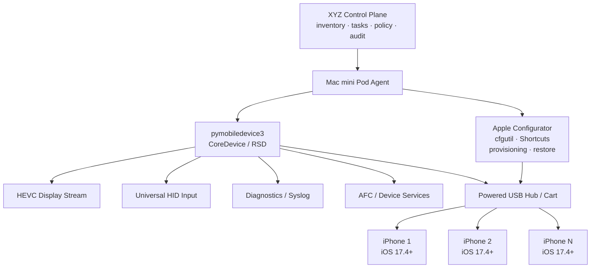

## ARCH-IOS-VERSION-001

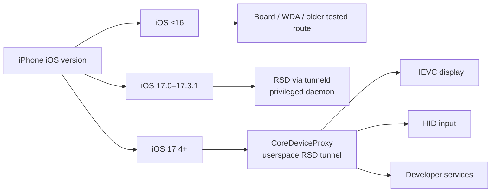

## ARCH-COMMISSION-001

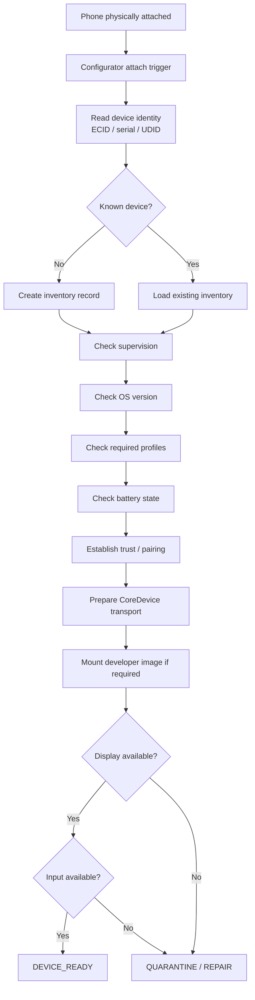

## ARCH-DEVICE-STATE-001

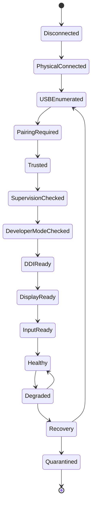

## ARCH-BATTERY-001

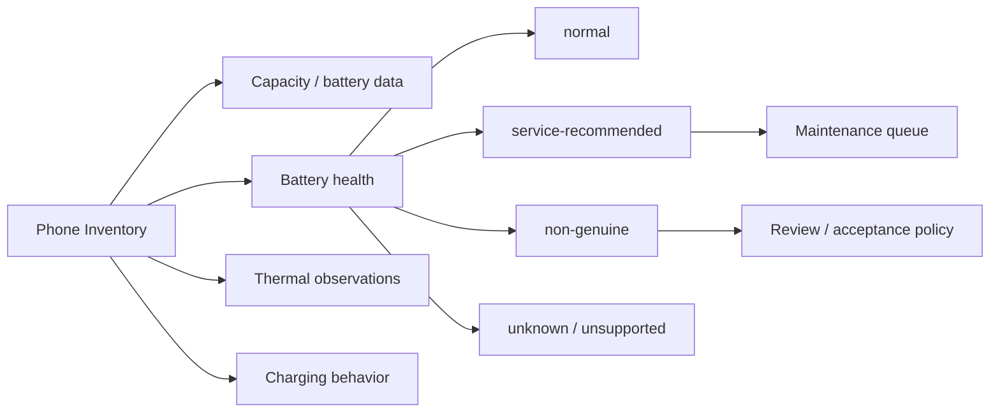

## ARCH-PHOTOS-001

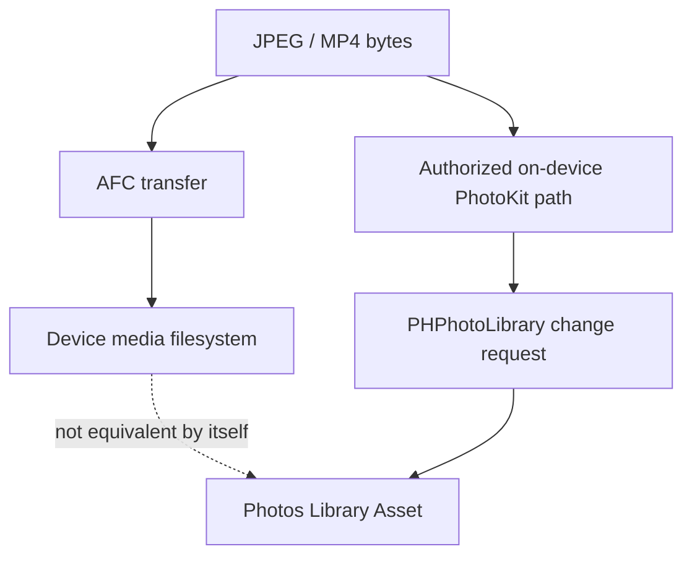

## ARCH-IOS-CHOICE-001

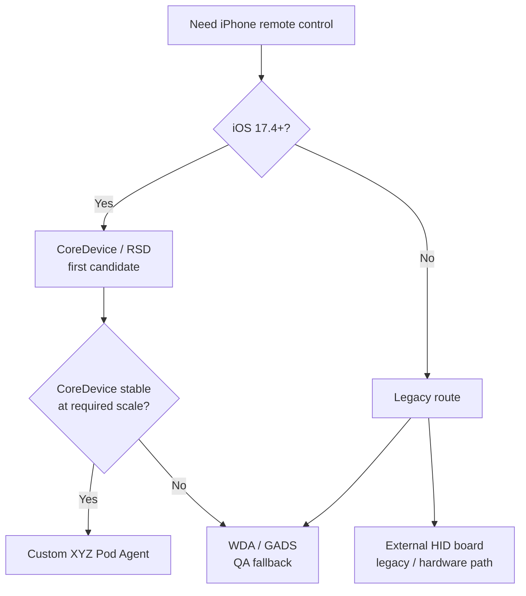

## ARCH-SLOT-ID-001


## ARCH-PROVISION-001

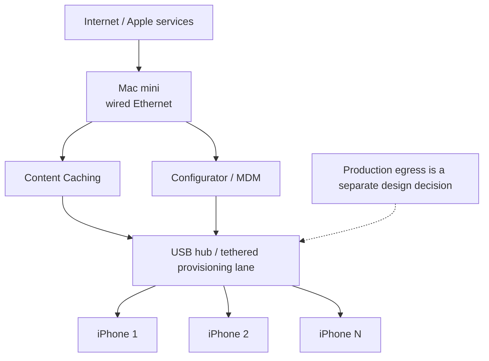

## ARCH-RTS-001

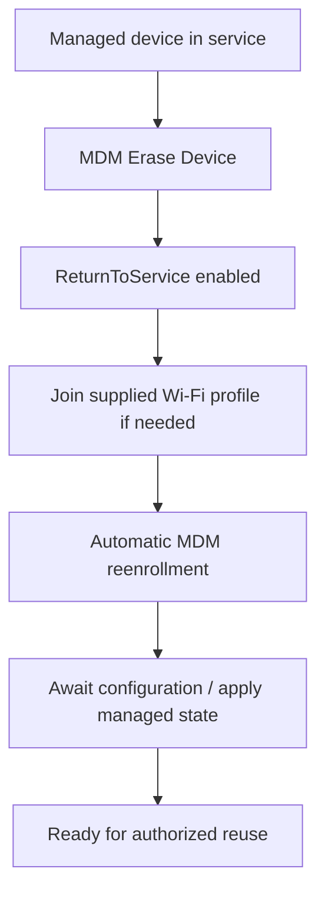

## ARCH-OBS-001

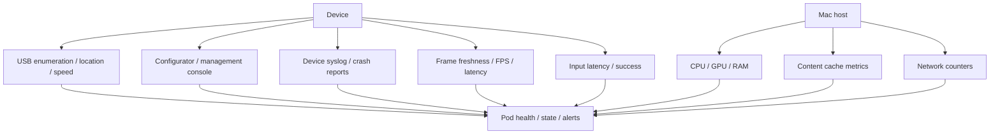

# 15. Detailed Feynman narrative reference

The following narrative is the human V1.2 edition embedded for context. Atomic claims and experiment definitions above take precedence if a narrative sentence is older or more ambiguous.

---
---
title: "XYZ MGMT Phone Farm Engineering & Learning Handbook — V1.2"
subtitle: "Research-expanded Feynman edition: Mac-first iOS lab, CoreDevice/RSD candidate path, provisioning, physical plant, networking, recovery, security, validation and scaling"
author: "XYZ MGMT internal engineering research"
date: "27 August 2026"
version: "1.2"
research_cut: "27 August 2026"
---

# Reader Notice

This handbook is a **technical and operational engineering reference** for an organization-owned physical-device fleet used for authorized creator/social-media operations, testing, content production and related workflows. It incorporates internal research, hands-on observations, vendor documentation, platform/OS documentation, and earlier engineering work.

It deliberately separates **mechanism** from **mythology**. A claim made by an operator is not converted into a fact merely because it is repeated. A vendor feature is not treated as proven until it is tested on the actual hardware. A platform behavior observed once is not treated as a universal algorithm rule. Every architecture-blocking uncertainty becomes an experiment.

This handbook does **not** provide an operational playbook for bypassing platform enforcement, manufacturing fake engagement, mass-creating replacement identities, falsifying geolocation, fingerprint spoofing, scraping data in violation of service terms, or automating prohibited third-party UI behavior. Networking, proxies, device identity and automation are explained for legitimate segmentation, testing, privacy, observability and authorized fleet operation.

## Evidence legend

| Label | Meaning | Engineering use |
|---|---|---|
| **VERIFIED-FIRST-PARTY** | Supported by current OS/platform documentation | May be used as architecture input, subject to version changes |
| **INTERNAL-MEASURED** | Observed by XYZ/Dim on owned hardware | Strong for the exact setup tested; do not overgeneralize |
| **VENDOR-CLAIM** | Vendor states the capability | Must be bench tested before procurement/production dependence |
| **OPERATOR-CLAIM** | External operator statement | Hypothesis/economic input only unless corroborated |
| **INDUSTRY-AGGREGATE** | Repeated community/creator claims | Useful for experiment design, not production constants |
| **INFERENCE** | Derived analysis from multiple facts | Useful when assumptions are explicit and falsifiable |
| **OPEN** | Not resolved | Architecture cannot depend on it until tested or verified |
| **POLICY** | Chosen organizational boundary | Enforced even if a different technical path exists |

## Source precedence

When sources disagree, use this order:

1. internal bench measurement for the exact hardware/software version being built;
2. current first-party OS/platform documentation;
3. maintained open-source implementation documentation;
4. vendor technical documentation;
5. independent engineering reports;
6. operator testimony;
7. forums/marketing folklore.

This does **not** mean a bench observation proves a universal platform rule. It means it is the most relevant evidence for whether *our exact hardware path works*.

## 27 August 2026 research update — what changed after another web pass

This V1 edition rechecked the Mac-first path and several architecture claims against current first-party or maintained technical sources. The most important corrections are:

1. **Mac tethered iOS screen capture:** promote from “programmatic mechanism OPEN” to **VERIFIED-MECHANISM / SCALE-OPEN**. QuickTime documents cable-connected iPhone/iPad screen capture; Apple exposes `kCMIOHardwarePropertyAllowScreenCaptureDevices` in CoreMediaIO. The unverified part is concurrent capacity and stability at farm scale.
2. **Apple Configurator:** current Apple documentation explicitly allows multiple iPhone/iPad devices connected to Mac ports or powered USB 2.0+ high-speed hubs/carts and modified simultaneously. This supports Configurator as a real bulk-provisioning tool, not a one-phone-at-a-time assumption.
3. **Input semantics:** modern UIKit can expose indirect pointing-device input as `indirectPointer`. Therefore “a mouse/HID click is always indistinguishable from a finger” is incorrect as a general OS-level claim. Whether any specific third-party app uses that information remains unknown.
4. **WDA/Appium:** real-device XCUITest automation requires the WDA helper app, device trust, Developer Mode on iOS/iPadOS 16+, UI Automation, and a valid provisioning profile. It is a supported QA route but not a no-install route.
5. **Developer signing limits:** a free Xcode Personal Team is limited to three devices per platform and seven-day profiles; a paid Apple Developer Program membership is USD 99/year and registered development/ad-hoc devices are capped at 100 per product family per membership year.
6. **iPhone Mirroring:** still ruled out for a farm. Apple documents one Mac and one iPhone at a time, same Apple Account, Bluetooth/Wi-Fi, and a locked nearby phone.
7. **GADS:** useful as a device-lab UI if WDA is accepted, but current iOS streaming is WDA-based and the current repository has a proprietary UI component in addition to AGPL code.
8. **Remote Mac security:** on Apple-silicon Macs with macOS 26+, Apple documents FileVault unlock over SSH after restart when Remote Login and network connectivity are available. This weakens the argument for disabling disk encryption on a remote rack.
9. **Android:** scrcpy remains a strong authorized-lab contrast: USB/TCP mirroring and control, no root, cross-platform. Android Management API provides policy-driven fully managed/dedicated-device provisioning, but its permissible-usage rules must be checked before adopting it for a commercial management product.
10. **Reset-surviving backend state:** Apple DeviceCheck exposes two per-device bits on Apple's server; Google's Play Integrity “device recall” beta can recall developer-defined values after reinstall and device reset. Resets therefore cannot be modeled as universal server-state erasure.

### Source gap recorded

[OPEN] `Concept — Long-Term Organic Device Set.md` is referenced by the supplied Technical Brief, but it was **not present among the files supplied in this conversation and was not found by the Library search performed for this task**. This handbook does not claim to have read or incorporated that document. The durable 5–30-device model is therefore derived only from the sources actually available.


## 27 August 2026 second web research pass - new corrections and engineering consequences

The second research pass concentrated on the places where the first V1 could still mislead a builder even when its high-level architecture was correct. The biggest gains were not new product names. They were **failure semantics, unattended recovery, version-specific host behavior, and licensing/eligibility constraints**.

### A. Tethered iOS capture is real, but "stream exists" is not a health check

[INDEPENDENT-ENGINEERING] A current macOS utility built on the same AVFoundation/CoreMediaIO path documents several failure modes that are easy to miss in a rack: a device may still enumerate while delivering no frames; locking can leave a stale last frame; resetting trust can leave an apparently running session with no sample buffers; and some mirroring-state changes can require an iPhone reboot before video resumes.

**Feynman version:** a camera can stay listed in the computer even when the lens has stopped sending pictures. Therefore the farm must test **freshness of frames**, not merely whether `AVCaptureSession.isRunning` or a device object exists.

Engineering consequence: every iOS capture adapter should expose at least `last_frame_at`, `frame_sequence`, `fps_window`, `stale_for_ms`, `device_locked_or_unknown`, `capture_restart_count`, and a bounded recovery state machine. A screenshot that is two minutes old is not "online."

### B. Powered USB hubs are first-party-supported for Configurator, but the exact farm topology remains empirical

[VERIFIED-FIRST-PARTY] Apple explicitly documents connecting multiple iPhone/iPad devices to a Mac directly or through **powered USB 2.0-or-later high-speed hubs/carts** and modifying them simultaneously with Apple Configurator.

That supports a hub-based pod as a legitimate management topology. It does **not** prove that an arbitrary hub will sustain simultaneous screen capture, charging, provisioning and a third-party control board. Each of those can stress a different USB function or power path.

### C. Unattended iPhone racks need an accessory-access policy, not hope

[VERIFIED-FIRST-PARTY] Current iOS exposes Wired Accessories controls. On supervised devices, Apple MDM restrictions include `allowUSBRestrictedMode`; setting it to `false` allows iOS devices to connect to USB accessories while locked, unless Lockdown Mode overrides the setting.

**Feynman version:** a cable can be physically connected but logically refused. For a remote rack, "USB present" and "USB authorized" are separate states.

Engineering consequence: commissioning must record trust/pairing state, accessory policy, supervision state, Lockdown Mode state, and reconnect behavior after lock, restart and power interruption. Do not weaken this security control fleet-wide until the bench proves it is necessary for the chosen architecture.

### D. The 10GbE Mac mini option can buy recovery capability, not just network speed

[VERIFIED-FIRST-PARTY] Apple Lights Out Management supports the 2024 Mac mini **when configured with 10Gb Ethernet**, after device-management enrollment. It can remotely start, shut down and restart managed Macs through another configured Mac controller on the same local Ethernet subnet.

[INFERENCE] For a rack that must be operated remotely, the 10GbE upgrade may be worth evaluating even when normal farm traffic fits comfortably in 1GbE. Its strategic value is the optional Lights Out Management path, not a claim that phone video needs 10Gb/s.

Limits matter: this is not a magic independent BMC. It requires MDM, Ethernet, IPv6, a same-subnet controller Mac, and the documented Apple management workflow.

### E. macOS remote recovery now has three distinct layers

[VERIFIED-FIRST-PARTY] Apple documents high-performance Screen Sharing on Apple-silicon Macs, Remote Login/SSH, and - on macOS 26+ Apple silicon - FileVault unlock over SSH after restart when network connectivity and Remote Login are available.

[INFERENCE] The rack should therefore use a **recovery ladder** rather than one remote-desktop product:

1. structured control-plane/node-agent health;
2. SSH for service/process/network repair;
3. remote desktop or Apple Screen Sharing for GUI-only work;
4. optional 10GbE Lights Out Management for power actions;
5. physical break-glass visit when all remote layers fail.

RustDesk can still be useful, but it should be one rung, not the only lifeline.

### F. Android Management API had an important eligibility caveat

[VERIFIED-FIRST-PARTY] Google currently restricts Android Management API use to commercial EMM developers, Device Trust solution providers and OEMs under its permissible-use policy, and explicitly lists solutions used exclusively for first-party in-house applications as disallowed.

**Correction to a common architecture shortcut:** "we own Android phones, so we can just build our internal fleet on Android Management API" is not a safe assumption.

[INFERENCE] For an internal device fleet, evaluate a commercial Android Enterprise EMM, an appropriate Device Policy Controller/dedicated-device architecture, or request clarification from Google before making Android Management API a hard dependency.

### G. Android and iOS host tooling must be version-aware

[MAINTAINED-REPO] `usbmuxd` continues to provide multiplexed USB connections to iOS devices. For iOS 17+, however, maintained `pymobiledevice3` documentation records Apple's shift of many developer services to CoreDevice/RemoteXPC/RSD tunnel flows; iOS 17.4+ has a materially simpler USB userspace path than iOS 17.0-17.3.1.

**Feynman version:** "iOS over USB" is not one protocol. It is a stack whose upper layers changed. A command that works on 17.4+ can fail on 17.1 for transport reasons even though the cable and trust pairing are fine.

Engineering consequence: every node-agent adapter must report iOS version and selected transport path, and the compatibility matrix must be tested by OS family rather than assuming one set of host commands fits every phone.

### H. Photo-library ingestion has a clean first-party mechanism when an on-device helper is allowed

[VERIFIED-FIRST-PARTY] Apple's PhotoKit `PHAssetCreationRequest`, used inside a `PHPhotoLibrary` change block, creates photo/video assets from data resources and adds them to the Photos library.

This clarifies the architectural choice. A helper app can legitimately turn staged bytes into a real Photos asset. A raw file-transfer service is only transport. If the policy forbids a helper app, the media problem remains a separate system constraint rather than something AFC/USB copying magically solves.

### I. GADS is useful, but its iOS dependency and source model must be explicit

[MAINTAINED-REPO] Current GADS documentation describes iOS streaming through WebDriverAgent and states that the distribution includes both open-source and proprietary/obfuscated components. It is therefore best evaluated as a **device-lab product candidate**, not treated as a transparent no-phone-app control primitive.

### J. 2026 Apple management changes strengthen fleet observability, but are version-gated

[VERIFIED-FIRST-PARTY / PRE-RELEASE-PLATFORM] Apple's WWDC26 management material describes additional declarative status reporting in iOS/iPadOS 27, including device system health information, plus enhanced log-collection workflows and broader declarative management changes.

Engineering consequence: design the fleet telemetry schema so it can ingest richer first-party device-health status when the deployed OS/MDM stack supports it. Do not make a 2026 pre-release feature a Gate-1 dependency for older phones.

### What this pass did **not** prove

The following remain `OPEN` and are intentionally not replaced with estimates:

- simultaneous **live** tethered capture ceiling on the exact Mac mini at N=5/10/20;
- exact control-board USB role and whether capture + charging + input coexist;
- long-duration stability of the selected powered hub/cable/controller combination;
- whether the vendor control software is acceptable after supply-chain/network inspection;
- the fastest reliable path that imports media into Photos under the final no-helper/helper policy;
- exact operational behavior already observed by Dim but not yet captured in a reproducible test record;
- the missing `Concept — Long-Term Organic Device Set.md` source.


## 27 August 2026 third web research pass - V1.2 architecture refinement

This pass concentrated on the remaining architecture questions that can still change the first Mac pod: **CoreDevice/RSD as a no-WDA control candidate, multi-device USB state, deterministic rack-slot identity, automated commissioning, provisioning bandwidth, lifecycle/recommissioning, and headless recovery**.

### A. CoreDevice/RSD is now a first-class iOS 17.4+ candidate, but not a production promise

[MAINTAINED-DOC] Current `pymobiledevice3` documentation states that iOS 17+ developer services use CoreDevice/RemoteXPC through an RSD tunnel. On iOS 17.4+ over USB, its default path can establish an in-process userspace tunnel on macOS, Windows and Linux without root/admin. The same maintained tool exposes CoreDevice display functions, HEVC streaming, screenshot capture, HID tap/drag/swipe and hardware-button operations.

**Feynman version:** instead of installing a small robot app on the iPhone and asking that app to press buttons, the Mac can potentially talk to Apple device services that are already part of the development stack. That removes WDA from the candidate path. It does **not** make the path an Apple-supported fleet-control API: `pymobiledevice3` is a maintained reverse-engineered implementation of private/semiprivate device protocols, so OS changes can break assumptions.

Engineering consequence: V1.2 promotes CoreDevice/RSD to the **first candidate for modern durable iPhones**, with WDA/GADS and external hardware retained as fallbacks. The go/no-go question is no longer “does control exist?” but “does **simultaneous HEVC + HID remain stable at 1, 2, 5, 10 and 20 devices on our exact Mac/hub/OS matrix?**”

### B. iOS 17.x is not one transport class

[MAINTAINED-DOC] The maintained tunnel guide distinguishes iOS 17.0-17.3.1 from iOS 17.4+. The earlier range is routed through privileged `tunneld` by default; iOS 17.4+ can use CoreDeviceProxy and an in-process userspace USB tunnel without privilege.

**Feynman version:** “iOS 17” is like saying “Windows 11” when two builds use different network drivers. The label is too broad for the device adapter. The inventory must record the exact OS version and select the transport accordingly.

### C. High device counts can expose host-tooling bugs that do not appear on a two-phone bench

[INDEPENDENT-PROJECT-EVIDENCE] A historical closed `pymobiledevice3` issue reported device enumeration failure on Windows with more than 30 connected iPhones. Current open issues also include multi-device mounting and concurrent RSD questions. These reports do **not** establish a current 30-device limit or a Mac limit.

**Feynman version:** a staircase can be perfectly safe on the first three steps and fail on step thirty because a hidden counter, port namespace, queue or resource limit was never exercised. Therefore a “works with two phones” result is evidence for mechanism, not evidence for capacity.

Engineering consequence: the scale test must exercise **enumeration, pairing, DDI state, video, input, reconnect and long-running orchestration simultaneously**, not merely count USB devices.

### D. Configurator can become the commissioning engine, not just a manual utility

[VERIFIED-FIRST-PARTY] Apple Configurator Shortcuts can run automatically when devices are attached or detached. Current actions include finding connected devices, installing profiles, preparing supervised devices, restoring/updating, setting device status, waiting for battery level, and assigning port/station numbers with supported USB hardware. Apple Configurator also exposes device information such as OS version, serial number, hardware IDs/addresses, capacity and console logs, and can export much of it to CSV.

**Feynman version:** the Mac can treat “a phone was plugged into slot 7” like a server rack treats “a disk appeared in bay 7.” The commissioning workflow can identify it, check policy, prepare it, log it and either mark it ready or quarantine it.

Engineering consequence: V1.2 adds a deterministic identity chain:

`rack slot -> Configurator port/station -> USB topology/location -> ECID/UDID/serial -> inventory device_id -> telemetry/task history`.

The chain must be tested for replug, cable swap, hub replacement and Mac reboot so that a physical phone can never silently become the wrong logical device.

### E. Supervision identity and host pairing are security boundaries

[VERIFIED-FIRST-PARTY] Apple documents supervised-device restrictions that can prevent pairing with arbitrary hosts and allow access only from computers holding the appropriate supervision host certificate. Apple also documents that pairing trust records can be cleared by reset/erase and may be removed after long periods of non-use.

**Feynman version:** USB trust is a key, not a cable. The rack can be physically connected while the Mac is not logically authorized to manage the phone.

Engineering consequence: `paired`, `trusted`, `supervision_identity`, `host_pairing_policy`, and `last_pairing_verified_at` become explicit inventory/health fields. The supervision identity must be backed up and controlled as a fleet credential; casually replacing it can force device re-preparation.

### F. Content Caching creates a separate commissioning/provisioning lane

[VERIFIED-FIRST-PARTY] macOS Content Caching can serve Apple software/apps to multiple tethered iPhone/iPad devices through a cart or USB hub. Apple also documents tethered Internet sharing from an Ethernet-connected Mac to physically connected iOS devices. This is useful for staging, OS/app updates and managed-device check-in.

**Feynman version:** if twenty phones all need the same 8 GB update, the Mac can act like a local warehouse instead of making twenty delivery trucks fetch the same box independently.

Engineering consequence: keep **commissioning/provisioning traffic** conceptually separate from **production device egress**. Content caching and tethered Internet are deployment tools, not an identity or enforcement-avoidance mechanism. Measure cache hit ratio, origin bytes, update duration and USB/hub contention during bulk staging.

### G. Return to Service belongs in the legitimate lifecycle plane

[VERIFIED-FIRST-PARTY] Apple Device Management provides Return to Service workflows that can erase a managed device and automatically re-enroll it, optionally using supplied Wi-Fi/MDM configuration. Newer OS versions add app-preservation/retry capabilities.

**Feynman version:** instead of an operator erasing a phone and manually rebuilding it from memory, the fleet can have a documented factory-reset-and-recommission conveyor belt for organization-owned devices.

Engineering consequence: add `IN_SERVICE -> RETIRING -> ERASE_REQUESTED -> RETURN_TO_SERVICE -> REENROLLING -> CONFIGURING -> READY` to the authorized device lifecycle. This is for normal asset reuse, repair, employee/client reassignment and lab reset; it is not a ban-replacement workflow.

### H. The Mac pod has a real remote-recovery stack now

[VERIFIED-FIRST-PARTY] A 2024-or-later Mac mini on macOS 26.5+ can be configured to start automatically when power is connected. Apple Lights Out Management can remotely start, shut down and restart supported Mac minis, but the 2024 Mac mini requires the 10Gb Ethernet option and the documented MDM/network topology.

**Feynman version:** a remote rack needs recovery below the application layer. Restarting the pod-agent is level 1; rebooting macOS is level 2; recovering after a power outage is level 3.

Engineering consequence: the 10GbE option is evaluated for **resilience**, not because phone traffic requires 10 Gb/s. A cheaper 1GbE M4 Mac mini remains a valid pilot if ordinary remote-access plus automatic power-on meets the recovery requirement.

### I. USB topology becomes observable data

[VERIFIED-FIRST-PARTY] Apple's USB host APIs expose device operational speed and port status, and Apple platforms expose USB-associated location identifiers. USB high speed is 480 Mb/s; SuperSpeed classes are 5/10/20 Gb/s. Apple Configurator can also assign logical port/station numbers with supported hardware.

**Feynman version:** “USB connected” is too vague. We need to know *where* the device is, *how fast* that link negotiated, and whether the same physical branch keeps failing.

Engineering consequence: record the host port/hub path, observed speed, rack slot and logical device identity. This lets the system detect a downgraded cable, dead hub branch, wrong replug or localized disconnect storm.

### J. WDA remains a useful fallback, and its parallelism has explicit namespaces

[MAINTAINED-DOC] Appium documents parallel real-device XCUITest sessions, with unique device UDIDs and unique `wdaLocalPort`; if MJPEG is used, each session also needs a unique `mjpegServerPort`, and unique derived-data paths are recommended. Current real-device setup still requires a provisioned WDA application, trust and Developer Mode.

[MAINTAINED-REPO] GADS remains actively developed in 2026, but recent releases and issues still contain WDA/DDI-specific fixes. That makes it useful as a reference/control surface while reinforcing that WDA health must be monitored as its own subsystem.

### K. Battery and thermal state are lifecycle inputs, not cosmetic telemetry

[VERIFIED-FIRST-PARTY] Apple exposes device battery-health states such as `normal`, `service-recommended` and `non-genuine`. Current iPhone guidance says high temperature can slow/stop charging and damage battery longevity; iPhone 15 and later allow a charge limit between 80% and 100% in 5% steps. Apple also exposes process thermal states from nominal through critical.

**Feynman version:** an always-plugged phone is a tiny battery-powered computer living next to a heater. If the battery is constantly full and hot, the farm is consuming the battery as a wear item even while the phone “works.”

Engineering consequence: battery health, charging interruptions, ambient temperature, device temperature indicators where available, and maintenance state belong in capacity planning. Model-specific charge-limit settings may help a durable fleet, but V1.2 does not assume they can be centrally enforced unless the chosen management stack documents that capability.

### What this third pass still cannot verify

[OPEN] Public documentation still does **not** give a reliable “one M4 Mac mini = N simultaneous iPhones with CoreDevice HEVC + HID” number. It also does not answer whether the specific inbound external control board can coexist with the chosen Mac USB data/display path. Those remain bench gates.

[OPEN] `Concept — Long-Term Organic Device Set.md` is still not present in the supplied/searchable source set, so V1.2 cannot claim coverage of that document.


# 30 August 2026 competitor-method evaluation and research delta - V1.7R2

## Scope of the new material

The newly acquired source describes one competitor/operator's reported use of jailbroken iPhones, standard iPhones, Android devices, GrapheneOS profiles, cloud phones, stripped motherboards, VPNs, SIMs, mobile/residential proxies, account-creation inputs, account age/warmup and scaling. The source itself warns that major elements breach Instagram Terms and states that it is competitor research rather than XYZ policy.

The evaluation below separates three questions that the competitor source frequently mixes:

1. **Can the device/OS/network mechanism exist?**
2. **Did the operator report an outcome while using it?**
3. **Is the mechanism permitted, causal, reliable and suitable for XYZ?**

A "yes" to question 1 or 2 does not answer question 3.

## Claim-by-claim evaluation

| Acquired claim | V1.7R2 evaluation | Engineering consequence |
|---|---|---|
| Jailbroken iPhone can host very large numbers of app containers | `OPERATOR-CLAIM / HIGH-RISK` | Do not make jailbreak/container density a production dependency. It creates OS/security/support risk and is closely tied in the source to mass identity creation. |
| A phone becomes permanently "fingerprinted" after enough accounts and low views | `UNVERIFIED` | No production economics may depend on a specific account-count retirement threshold. Treat device health and platform enforcement as separate unknowns. |
| Android has better view success than iOS | `UNVERIFIED / CONFOUNDED` | Hardware/OS selection must be based on fleet manageability, app compatibility, measured operator throughput and lifecycle cost - not claimed ranking advantage. |
| Android automation is slower than iOS jailbreak | `OPERATOR-MEASURED-ON-THEIR-STACK` | Benchmark XYZ's exact workflow; do not generalize their 15-minute vs 6-9-minute numbers. |
| GrapheneOS provides 32 profiles | `VERIFIED-MECHANISM` | Useful for local workspace separation and test isolation. |
| "32 profiles = 32 unique devices" | `NOT VERIFIED / CORRECTED` | Never treat profile count as remote physical-device identity count. |
| Cloud phones are inferior to physical phones | `OPERATOR-PREFERENCE` | Evaluate cloud-device labs only against specific needs: app compatibility, media, camera/sensor requirements, ownership, latency, cost and policy. |
| Stripped motherboard racks scale cheaply | `VENDOR/OPERATOR-CLAIM` | If ever considered for legitimate QA/device-lab work, require supply-chain, electrical, thermal, serviceability and resale testing. They are not the default architecture. |
| VPN/SIM/mobile/residential proxy choice determines account success | `UNVERIFIED` for ranking/anti-abuse effects | Network selection is based on stable authorized egress, security, locality requirements, cost and observability. No rotation logic is built to evade platform limits. |
| Cycling mobile IPs permits more account creation | `RESEARCH-ONLY / EXCLUDED` | Do not implement. Rate-limit or integrity bypass is outside scope. |
| iCloud Hide My Email or rented numbers should be used for mass account creation | `RESEARCH-ONLY / EXCLUDED` | Account onboarding requires legitimate creator/client ownership and platform-supported recovery channels. |
| Matching phone-number country to network country improves success | `UNVERIFIED` as a platform-ranking/anti-abuse claim | Keep identity/location data truthful and operationally consistent; do not invent location to satisfy folklore. |
| New accounts receive an algorithmic boost because of a "new" badge | `UNVERIFIED` | No "new account boost" assumption in forecasting, automation or warmup policy. Measure authorized-account performance empirically. |
| New accounts need no warmup; aged accounts need warmup | `CONTRADICTED BY OTHER OPERATOR SOURCES / UNVERIFIED` | Continue treating warmup as a bundle of variables rather than a clock-based SOP. |
| Scaling is simply buying more phones and VAs | `INCOMPLETE` | Scale only after pod-level capacity, recovery, security, authorization, audit and unit economics gates pass. |

## What the acquired source usefully changes

The competitor material is still valuable. It strengthens several architecture priorities without accepting its evasion logic:

- **Physical ownership matters operationally.** Physical devices have known serviceability, resale and local-control characteristics. This supports the handbook's existing pod/asset-lifecycle model.
- **Throughput must be measured per workflow.** The operator's Android/iOS timing comparison is stack-specific but reinforces the need to measure end-to-end task time instead of comparing specs in isolation.
- **Multi-profile Android deserves a formal test lane.** GrapheneOS's documented 32-profile capability is real and worth evaluating for local separation/testing; its "unique device" interpretation is not.
- **Connectivity is a reliability plane.** The source's repeated outages, repeated IPs and provider-quality complaints support a more boring conclusion: network dependencies need monitoring, provider diversification, documented failover and stable egress.
- **Asset residual value belongs in TCO.** Physical phones, motherboards and rented cloud devices have different resale and failure economics; procurement models should include residual value and replacement labor.
- **Operator claims age quickly.** Device models, OS versions, app behavior and platform enforcement change. Every externally sourced claim needs a date, environment and revalidation status.

## 2026 first-party research consequences

### A. Instagram policy boundary is clearer than the competitor method

Instagram's Terms state that users cannot attempt to create accounts or access/collect information in unauthorized ways. Meta's authenticity rules prohibit fake accounts and artificial popularity manipulation. The correct response is architectural: account creation and access must be tied to legitimate ownership/authorization, and automation should use supported interfaces where available.

### B. Instagram API-first should be stronger in the architecture

Meta's current Instagram Platform documentation supports professional accounts managing their presence and publishing supported media through the official API. The platform exposes publishing limits rather than leaving throughput to hidden trial-and-error. Therefore the control plane should route each publishing task through this order:

```text
SUPPORTED OFFICIAL API?
        |
       yes ----> API connector + OAuth/delegated authorization + quota/error logging
        |
        no
        v
AUTHORIZED HUMAN DEVICE WORKFLOW
        |
        v
native app + approved asset + operator verification + audit trail
```

A phone farm should not be used merely to reproduce an API capability with fragile UI automation.

### C. GrapheneOS profiles are a separation feature, not a remote-identity claim

GrapheneOS documents user profiles as isolated workspaces with separate app instances, app data, profile data and encryption keys, and raises the secondary-profile limit to 32. That is directly useful for local lab/tenant separation tests. Nothing in the reviewed documentation establishes that remote services must treat those profiles as separate physical devices.

### D. Android pod control has improved, but authorization still matters

Android's current ADB documentation explicitly supports multiple attached devices and device targeting. USB debugging requires host authorization. Current Android also supports wireless debugging, and the August 2026 documentation describes Android 17 / adb 37 Wi-Fi 2.0 behavior. This justifies a new Android pod benchmark but not third-party service automation outside authorization.

### E. Managed fleets should use fleet-management primitives

Android Enterprise dedicated-device patterns and Apple Platform Deployment supervision/enrollment models exist specifically to manage company-owned fleets. For durable pods, these are the baseline management planes. Custom control adapters may sit beside them for approved workflows, but should not replace inventory, policy, update and recovery controls.

## Revised device-role matrix

| Role | Preferred baseline | Why | Do not use it for |
|---|---|---|---|
| Durable iOS creator endpoint | Organization-owned supervised iPhone + MDM; human native-app operation where API unavailable | Strong lifecycle, inventory, recovery and supportability | Jailbreak container density or spoofing |
| Durable Android creator endpoint | Fully managed Android / suitable EMM; ADB only for authorized engineering and support | Strong programmatic observability and fleet tooling | Hidden third-party UI automation |
| Android isolation/test lab | Pixel + GrapheneOS profiles where compatible | Strong local profile/data separation, 32 secondary profiles documented | Pretending one phone is 32 physical devices |
| Official publishing lane | Instagram API for supported professional-account actions | Explicit authorization, quotas, errors, post IDs | Features not exposed by the API |
| Human exception lane | Managed physical phone + approved operator task | Covers mobile-only/native workflows | Undocumented mass-operation macros |
| Neutral QA/device lab | Physical devices / approved cloud lab based on requirements | Reproducible app testing | Account farming or enforcement evasion |

## Revised network rule

Use stable, attributable network profiles. A `NetworkProfile` record should describe intended egress, provider, region, DNS/VPN policy, control-plane reachability, owner, change history and health checks. Changes are made for reliability, security, contractual locality or tested performance - not to cycle identities or defeat platform safeguards.

## Revised account lifecycle rule

The control plane may represent only accounts with documented ownership/authorization. Minimum fields:

- creator/client owner;
- platform account ID/handle;
- authorization basis and expiry/revocation;
- recovery-channel owner;
- delegated/API authorization state where supported;
- assigned device/publishing lane;
- policy/compliance status;
- incident/offboarding state.

There is no production entity named `DisposableAccount`, no automatic replacement-on-ban workflow, and no task type for bulk registration.

## Claude implementation guardrails - V1.7R2

When Claude/Codex implements the farm control plane, it should treat the following as hard architecture constraints:

**Build:** inventory, pod/slot mapping, device health, USB/network observability, MDM/EMM integration boundaries, media/approval workflow, official API connectors, human task queues, audit events, tenant separation, secrets references, recovery procedures, capacity tests and dashboards.

**Do not build:** CAPTCHA solvers, account-creation bots, proxy/SIM cycling intended to bypass limits, device/fingerprint spoofers, ban-replacement automation, fake-engagement systems, concealed third-party UI macros, or recommendation-system manipulation features.

**Require explicit review before any new connector:** current platform terms; documented authorization method; supported API if any; account type; scopes/permissions; rate/quota behavior; error handling; revocation; audit fields; and whether a human device lane is required.

# How to learn this handbook — Feynman method

This edition is written so a non-specialist can become technically useful without memorizing product names. For every subsystem, answer five questions in your own words:

1. **What job does this subsystem perform?** One sentence, no jargon.
2. **What goes into it and what comes out?** Power, packets, frames, commands, files, permissions or audit events.
3. **What can fail?** Name the physical or software failure, not “it doesn't work.”
4. **How would we prove it works?** A measurable test with versions and evidence.
5. **What does it *not* solve?** This is the most important question in phone-farm engineering because display, control, management, networking and platform policy are often incorrectly collapsed into one problem.

A useful learning loop is: read the plain-English model → sketch it from memory → explain it to someone else → check the detailed section → run the bench test → update the ADR.

## The five planes you should never confuse

| Plane | Plain-English question | Typical tools | Does not automatically solve |
|---|---|---|---|
| Physical | Is the device powered, cool and connected? | PSU, hub, rack, fan, cable | UI control |
| Display | Can an operator/software observe the screen? | CoreMediaIO/AVFoundation, scrcpy, vendor mirror | input |
| Input | Can an authorized test/operator send an action? | physical touch, HID, WDA/XCUITest, ADB | media ingestion |
| Management | Can IT configure/update/wipe/inventory the device? | Configurator, MDM, Android Enterprise | arbitrary third-party UI driving |
| Control plane | Can the organization coordinate devices/tasks/people/audit? | coordinator, database, node agents, dashboards | underlying device capability |

If a vendor says “we control twenty phones,” ask which of these five planes they actually solve.

{ width=88% }

# Executive Synthesis

## What this project actually is

[INFERENCE] The phrase "phone farm" hides the real engineering problem. The system is a compact private cloud whose compute nodes happen to be phones. It has power distribution, network interfaces, stateful workloads, identity, storage, scheduling, telemetry, operators and failure domains. Treating it like "20 phones on a hub" is equivalent to treating a server rack as "20 boxes plugged into a switch."

A useful system model is:

```text
        ORGANIZATION / CLIENT AUTHORIZATION
                     |
                     v
   +----------------------------------------+
   |             CONTROL PLANE              |
   | inventory | tasks | policy | audit     |
   +------------------+---------------------+
                      |
             task / observation
                      |
       +--------------+--------------+
       |                             |
       v                             v
+--------------+              +--------------+
| POD / HOST A |              | POD / HOST B |
| 5-10 devices |              | 5-10 devices |
+------+-------+              +------+-------+
       |                             |
  USB / LAN /                    USB / LAN /
  cellular                       cellular
       |                             |
       v                             v
 physical phones             physical phones
```

The scaling unit is the **pod**, not the individual phone and not a 100-device monolith. A pod has a bounded power domain, host, hub topology, network policy and failure radius. This makes capacity measurable and incidents recoverable.

{ width=88% }

## The most important updated conclusions

### 1. Mac mini first: the USB screen-capture mechanism is now supported; fleet scale is still OPEN

[VERIFIED-FIRST-PARTY] Apple currently documents that QuickTime Player can capture the screen of an iPhone/iPad connected to a Mac. Apple also publishes the CoreMediaIO property `kCMIOHardwarePropertyAllowScreenCaptureDevices`. This is materially stronger than the earlier position that the programmatic path itself was unproven.

[MAINTAINED-IMPLEMENTATION] Current macOS capture implementations and sample projects use the same CoreMediaIO/AVFoundation device-discovery path to expose tethered iOS screen-capture sources. That is enough to promote the **mechanism** from OPEN to **VERIFIED-MECHANISM**.

[OPEN] What remains unverified is the number that matters to this project: how many simultaneous iPhone screen streams one M4 Mac mini can sustain on the actual phones, cables, hubs and macOS/iOS versions. A feature existing is not the same as a 20-device architecture working. Therefore the status is **VERIFIED-MECHANISM / SCALE-OPEN**.

This makes the client's sequencing correct: put a Mac mini on the bench immediately, measure 1 → 2 → 5 → 10 → 20 streams, and do not buy the second-stage fleet hardware on the assumption that the result will be 20.

### 2. Display and input must be designed independently

Dim's Xiaowei test is valuable because it proves the conceptual separation: the PC could see the phone only through same-network mirroring; it could not automatically control it. The main input options remain external HID/control hardware or a signed on-device automation component such as WebDriverAgent.

[VERIFIED-FIRST-PARTY] Apple's UIKit documentation matters here: from iOS 17 onward, an app that has not opted out of indirect input support receives pointing-device clicks as `indirectPointer`, whereas pre-iOS-17 compatibility defaults behaved as direct touch. This proves that pointer input **can be distinguishable at the OS API**. It does not prove any social platform uses the signal.

### 3. Reset is not a universal identity eraser on either iOS or Android

[VERIFIED-FIRST-PARTY] Apple DeviceCheck persists two developer-defined bits and a timestamp per device across app reinstall, device transfer and Erase All Contents and Settings. [VERIFIED-FIRST-PARTY] Google's 2026 Play Integrity device-recall beta similarly lets participating apps recall custom per-device state after reinstall and device reset.

Therefore the correct architecture statement is not "iOS is permanently fingerprinted" or "Android resets cleanly." It is: **ordinary raw identifiers and backend anti-abuse state are different mechanisms**. A system must not base asset economics on the assumption that a reset clears all server-side device state.

### 4. Client isolation is a first-class architecture problem

The new account-separation research changes the priority order. Shared business containers, credential custody, session bleed, billing entanglement, poor staff offboarding and vendor concentration create a larger practical blast radius than exotic fingerprint theories.

[INFERENCE] The system should model `Client`, `Authorization`, `CredentialReference`, `PlatformAsset`, and `OperatorRole` as core database entities rather than metadata attached later.

### 5. "Warmup" is not one variable

The Instagram warmup source contains directly contradictory successful practices: immediate posting, several-day delays, 14-day routines, and month-long routines. Proxy and device claims conflict as well. This is evidence that the folk concept "warmup" bundles many different variables.

[INFERENCE] A better model is:

```text
observed outcome = f(account provenance,
                     policy/recommendation eligibility,
                     content quality,
                     audience fit,
                     account age,
                     activity history,
                     current platform enforcement,
                     operator behavior,
                     random/recommendation variance)
```

The handbook therefore treats warmup advice as **experiment hypotheses**, not a clock-based SOP.

### 6. The first milestone is not growth; it is deterministic operation

Before scaling traffic, the system must prove: reliable enumeration, device identity, screen/health observation, controlled input on owned test devices, authorized media delivery, task execution, remote recovery, power/thermal stability, audit and operator separation.

A strong pilot exit criterion is not "it posted once." It is **twenty consecutive unattended task cycles with correct attribution and no unexplained device loss**, followed by a soak test and recovery test.

# Section Map

| Section | Topic | Main question answered |
|---|---|---|
| 0 | Orientation, evidence, boundaries | What do we know, and how confident are we? |
| 1 | System model & operating choices | What are we actually building? |
| 2 | Physical plant | How do the devices stay powered, cool, connected and serviceable? |
| 3 | iOS engineering | How do iPhones identify, provision, display, accept input and ingest media? |
| 4 | Android engineering | What is easier/different on Android, and what integrity assumptions are unsafe? |
| 5 | Networking | How do local control and Internet egress work without conceptual mistakes? |
| 6 | Client/account separation | How do we keep one client/staffer/vendor failure from becoming everyone else's? |
| 7 | Content & platform evidence | What is documented, what is measured, and what is folklore? |
| 8 | Control plane & remote ops | What software coordinates the fleet and humans? |
| 9 | Reliability, security, incidents | How does the farm fail safely and observably? |
| 10 | Experiments, pilot & scaling | What must be proven before purchasing/scaling? |
| 11 | Claude/engineering execution | What exactly should the implementation agent build first? |


# Mac-first bench plan — the work that can start tomorrow

The client explicitly asked to start with the Mac mini because the inbound control board is roughly two weeks away. This sequencing is technically sound because the Mac path can answer several independent questions before that hardware arrives.

## Bench objective

By the end of the first bench cycle, the team should know whether a Mac mini is a good **pod host**, not merely whether one iPhone appears in QuickTime.

### Phase A — commission the host

- Record exact Mac model, RAM, SSD, macOS build and network interface.
- Enable encrypted storage and document remote-recovery method; if macOS 26+ is used, test the supported FileVault-over-SSH recovery path before the Mac becomes unattended.
- Configure a named operator/admin model; do not share one personal login.
- Install Apple Configurator, current Xcode only if WDA/QA testing is in scope, the capture probe, monitoring and remote-support tooling.
- Record TCC/privacy permissions granted. A remote farm that cannot be re-commissioned after an OS update is not remote-operable.

### Phase B — prove one-phone USB display

1. Connect one known iPhone with a known good data cable.
2. Trust the Mac on the phone.
3. Confirm QuickTime sees the phone's screen.
4. Confirm the programmatic capture probe enumerates the same physical phone as a screen-capture device.
5. Record resolution, frame rate, latency, process CPU/memory and reconnect behavior.
6. Lock/unlock the phone and disconnect/reconnect the cable; record which transitions recover automatically.

### Phase C — discover the scaling curve

Repeat at 2, 5, 10 and—only if stable—20 devices. Use powered hubs suitable for simultaneous data, not charge-only splitters. The test stops at the first level that produces unexplained disconnects, unbounded resource growth or unacceptable latency. Fix the reason before adding devices.

### Phase D — bulk provisioning

Use Apple Configurator on several dedicated test phones. Verify exactly which preparation/supervision/profile actions the desired fleet configuration can express. Apple documents simultaneous modification through Mac ports or powered high-speed USB hubs/carts, but the team's exact settings still need a local acceptance test.

### Phase E — remote-operation rehearsal

Have a team member who is not physically at the bench connect through the chosen host-maintenance channel. They should be able to identify a device, inspect health, recover the node agent and escalate to one live screen without streaming an entire wall of phones through a remote desktop session.

## What waits for the control board

The board's arrival unlocks the input-coexistence question. Until it is physically tested, do not assume that its Lightning/USB topology allows simultaneous Mac capture, charging and input. The correct experiment is `TEST-COEXIST-001`, not a procurement guess.

# SECTION 1 - System Model and Architecture Choices

## Feynman primer — a phone farm is a tiny private cloud

A beginner often sees “many phones.” An engineer should see **many unreliable computers that share infrastructure**. Each phone has power, a data path, an identity, software state, network state and an owner/authorization context. A farm is the system that makes those devices observable and recoverable. If you cannot answer “which physical phone did this, through which host and network, for whose authorization?” you have a pile of phones, not a fleet.

The pod is the basic Lego brick. Build one brick that survives; then copy it.


A phone farm is only useful when the business process around it is
explicit. This part defines the OFM use case, separates legitimate fleet
operations from manipulation, and establishes the architecture used
throughout the manual.

## 1. Phone farms in OFM

In an OFM context, a phone farm is a managed collection of physical
mobile devices used by an agency or creator team to operate authorized
social accounts, prepare and publish content, review notifications,
collect performance signals and support traffic acquisition. The
physical phones are execution endpoints; the real system is the
combination of devices, people, network, content rights, credentials,
workflow software and analytics.

### Industry usage and terminology

Public operator communities use “phone farm” loosely. It can mean ten
old iPhones on a desk, a rack of Android phones, a motherboard rack
without screens, a set of remotely controlled devices, or a larger
operation with coordinators and staff. These reports are anecdotal and
should not be treated as evidence that a particular platform will
tolerate the associated behavior.

The legitimate engineering interpretation is closer to a corporate
mobile fleet or device lab: each device is inventoried, assigned,
secured, connected to controlled networks, monitored and maintained. The
difference is that the workload is creator-content operations rather
than QA testing or retail kiosk use.

- Define the owner of every device and social account.

- Treat creator authorization and content rights as first-class records.

- Separate device administration from social publishing.

- Measure output with business metrics rather than “number of phones.”

### What the farm is not

A physical phone is not an invisibility device. Platforms can evaluate
account behavior, content similarity, network characteristics, login
history and many other signals. A real handset may make the workflow
more operationally convenient, but it does not convert prohibited
behavior into permitted behavior.

The architecture should therefore optimize for repeatability, security,
operator throughput, reliability and attribution. It should not optimize
for hiding the existence of the fleet.

- Do not buy hardware before mapping the traffic funnel.

- Do not assume one physical device must equal one account. The correct
  mapping depends on authorization, platform rules, staffing and
  operational risk.

### Engineering checklist

- Write down the business goal for each platform.

- List authorized creator accounts and account owners.

- Define which actions are manual, API-driven or scheduler-driven.

- Create a platform-rule register with review dates.

## 2. Traffic funnel and business model

The phone-farm layer sits in the middle of a larger creator acquisition
funnel. Engineering decisions should be evaluated by their effect on
measurable funnel stages rather than raw posting volume.

### Reference funnel

A typical funnel is: approved creative asset -\> platform post -\>
profile visit -\> tracked link or landing page -\> creator page -\>
subscription or other paid action. Depending on the business, there may
be additional layers such as a link hub, geofenced landing page, email
capture, or CRM attribution. Every added layer creates potential
conversion loss and additional privacy/security obligations.

The control plane should attach campaign, creator, platform, account,
device, operator and asset identifiers to each publishing task. The
analytics plane should connect those identifiers to post-level reach
where available and to downstream click/conversion events where lawful
and technically possible.

- Primary operational metrics: task completion rate, post success rate,
  account availability, content approval latency.

- Primary marketing metrics: reach, profile visits, click-through rate,
  landing conversion, subscriber conversion, revenue per thousand
  impressions where calculable.

- Primary reliability metrics: device heartbeat, battery/thermal status,
  network packet loss, API error rate, queue age.

### Unit economics

A useful model treats each account or campaign as a cost center.
Hardware amortization, software, connectivity, employee time, content
production and creator revenue share should be visible. “More phones”
only creates value if incremental gross contribution exceeds incremental
infrastructure and labor cost.

Attribution is imperfect because not every platform exposes the same
analytics and some downstream conversions cannot be deterministically
tied to a post. The system should distinguish observed events from
modeled or inferred attribution.

| **Layer**  | **Example measure**                         | **Engineering owner** |
|------------|---------------------------------------------|-----------------------|
| Creative   | Approved assets per week; QC rejection rate | Content ops           |
| Publishing | Task success; queue age; retries            | Fleet/backend         |
| Platform   | Reach; profile actions                      | Growth ops            |
| Landing    | Unique clicks; conversion                   | Web/backend           |
| Revenue    | Paid conversion; ARPU/LTV                   | Finance/analytics     |

## 3. What physical phones solve - and what they do not

Physical devices are valuable when the workflow actually requires the
native mobile app, hardware-bound capabilities, mobile camera/media
access, or a standardized operator interface. They are less valuable
when an official API or web console already provides the required
function.

Figure 3-1. Control-plane and data-plane separation.

### Problems physical devices solve

Phones provide the authentic application runtime, camera roll, push
notifications, biometric-secured credential storage, mobile-only
creation tools and native moderation/status screens. Organization-owned
devices can also be physically segmented from employees’ personal
phones.

For Android, corporate devices can be fully managed or dedicated under
Android Enterprise. For Apple fleets, organization-owned supervised
devices can receive stronger MDM controls than unsupervised personal
devices. \[S1\]\[S5\]

- Native-app-only features.

- Consistent operator work surface.

- Separation between personal and corporate credentials.

- Physical inventory that can be wiped, reassigned and retired.

### Problems they do not solve

Phones do not remove platform terms, content restrictions, API rules or
behavioral enforcement. They also do not automatically solve account
ownership, credential leakage, employee mistakes, attribution or
creator-consent management.

A rack can even make risk worse if the same content is repetitively
distributed, credentials are broadly shared, devices are not patched, or
network architecture creates one large blast radius.

- Build authorization and access control before scaling hardware.

- Use official publishing APIs where available and suitable.

- Keep humans in approval loops for ambiguous or high-risk actions.

## 4. Platform-policy and authorization boundary

The most important non-hardware requirement is an explicit rule
boundary. Different platforms permit multiple accounts, third-party
management, APIs and scheduling to different degrees, but commonly
prohibit spam, fake engagement, coordinated inauthentic activity,
automated bulk account operation, or circumvention of enforcement. These
rules can change.

<table>
<colgroup>
<col style="width: 100%" />
</colgroup>
<thead>
<tr class="header">
<th><strong>Policy update rule<br />
</strong>Treat all platform-specific operating rules in this manual as a
dated snapshot, not a permanent guarantee. Re-check first-party policies
and API terms before deploying a workflow change.</th>
</tr>
</thead>
<tbody>
</tbody>
</table>

### Current examples from first-party rules

TikTok’s integrity rules distinguish authentic multi-account use from
deceptive or spam behavior and prohibit automation used to operate
accounts in bulk or manipulate platform systems. TikTok also provides a
formal Content Posting API for authorized applications, with scopes and
audit requirements. \[S22\]\[S23\]

Reddit’s rules require authentic participation and prohibit spam and
manipulation. Snapchat explicitly prohibits spam and artificially
inflated engagement. X permits legitimate third-party account management
but prohibits coordinated inauthentic activity, duplicate amplification
and ban-evasion behavior. \[S24\]\[S26\]\[S27\]

### Authorization records

For every creator and account, retain a signed or otherwise auditable
authorization record stating who owns the account, what the agency may
do, which employees or systems may access it, what content is approved,
and what happens on termination. The agency should not rely on informal
chat messages as its only control evidence.

Keep platform credentials separate from legal identity documents and
sensitive creator files. The system should store credential references
to a vault rather than passwords in application tables or spreadsheets.

- Creator ID and contract/authorization reference.

- Account owner and recovery email/phone owner.

- Permitted actions and publishing platforms.

- Content usage scope and expiration/revocation process.

- Offboarding/wipe/recovery procedure.

## 5. Architecture decision: API-first, device-first or hybrid

The correct architecture depends on which functions are officially
exposed by platform APIs and which require a person in a native
application. A hybrid design is usually the most maintainable: APIs or
approved schedulers handle supported publishing and analytics; physical
phones handle native-only tasks and human review.

Figure 5-1. Hybrid reference architecture.

### API-first

Use an API-first workflow when the platform provides a supported
publishing or analytics endpoint and the agency can meet
app-registration, scope and audit requirements. API-first systems are
easier to log, retry, rate-limit, test and attribute. TikTok’s Content
Posting API is one example of an explicit, authorized posting path.
\[S22\]

- Advantages: deterministic requests, auditability, fewer physical touch
  points, easier scaling.

- Costs: developer integration, platform app review, scope limitations,
  changing APIs.

### Device-first

Device-first means a human operator performs most social actions on
managed phones. This is slower to scale but can be appropriate for
native-only workflows. Fleet software should coordinate assignments and
record outcomes without pretending to be the human.

If the platform does not permit automated UI operation, do not turn
accessibility tools, ADB input commands or computer vision into a covert
substitute for an official API.

- Advantages: access to native UX; human judgment.

- Costs: labor, training, ergonomic complexity, more devices, weaker
  deterministic automation.

### Hybrid

Hybrid systems place a coordinator above both paths. A task can route to
an official API executor, an approved scheduler, or a human/device queue
depending on platform, account and action type. All paths write back a
common result schema.

| **Dimension**        | **API-first**           | **Device-first**          | **Hybrid**                 |
|----------------------|-------------------------|---------------------------|----------------------------|
| Scale                | High where API permits  | Labor-bound               | High for supported actions |
| Auditability         | Strong                  | Requires operator capture | Strong if unified          |
| Native-only features | Limited                 | Strong                    | Strong                     |
| Platform dependence  | API contracts           | App UX changes            | Both                       |
| Recommended role     | Default where supported | Exception/native tasks    | Overall architecture       |
# SECTION 2 - Physical Plant: Devices, Racks, Power, USB and Thermal

{ width=88% }

## Feynman primer — electricity and heat are the farm's plumbing

Software cannot rescue a rack with bad power or bad cooling. Imagine twenty phones as twenty small heaters that also need reliable data cables. Power must be budgeted like water pressure in a building: total demand, branch limits, headroom and failure zones matter. Cooling is the drain: every watt consumed eventually becomes heat. USB is both a data bus and, often, a power path; treating it as “just a cable” is one of the fastest ways to create intermittent failures.


A rack of phones is a continuous electrical and thermal load, not a
collection of casual chargers. This part treats the installation as
small infrastructure: load planning, serviceability, airflow, cable
discipline and lifecycle management.

## 6. Device selection

Device choice should be driven by supported OS life, battery condition,
application compatibility, management support, repairability and total
cost rather than the cheapest used handset price.

### Selection criteria

Prefer models that remain inside the OS/security support window for the
expected service life. Confirm the required social apps still support
the OS version. For Android, verify Android Enterprise management
capabilities and consider zero-touch eligible procurement for larger
deployments. For Apple, organization-owned devices that can be enrolled
and supervised through the intended deployment path are easier to
administer consistently. \[S1\]\[S5\]

Used devices can lower capital cost but introduce unknown battery
health, replaced parts, activation locks, inconsistent storage and
shorter remaining update life. A receiving inspection process is
therefore mandatory.

- Supported OS/security updates for planned life.

- 64 GB or more storage if local media caching is heavy; size to actual
  workflow.

- Healthy battery and charging port.

- Stable Wi-Fi radios and compatible bands.

- Consistent model families to reduce spare-parts and cable variety.

- No activation lock, unknown MDM enrollment or carrier financing lock.

### Screened vs headless hardware

Phone-motherboard racks and screenless devices appear in operator
communities, but they add maintenance and compliance uncertainty because
the hardware may be modified or difficult to recover. For a professional
pilot, normal complete phones are easier to inventory, reset, update,
visually inspect and hand to an operator.

Only consider custom hardware after the software architecture and
workload are proven on standard devices.

| **Factor**  | **Pilot preference**    | **Scale preference**               |
|-------------|-------------------------|------------------------------------|
| Model mix   | 1-2 models max          | Standardize by cohort              |
| OS age      | Current or recent       | Long remaining support             |
| Battery     | Known healthy           | Replaceable service process        |
| Procurement | Reputable used/new      | Enterprise/reseller where possible |
| Management  | Manual + MDM/Enterprise | Automated enrollment               |

## 7. Rack and mechanical design

The mechanical objective is not maximum density. It is stable airflow,
easy identification, fast replacement, safe cabling and enough access
that an operator can service one phone without disturbing ten others.

Figure 7-1. Example serviceable rack layout.

### Slot geometry

Use vertical or slightly tilted slots so screens remain visible and warm
air can rise between devices. Leave air gaps instead of clamping phones
tightly together. The required spacing depends on device power, ambient
temperature and fan airflow; validate it with temperature measurements
rather than a fixed internet rule.

Every slot should have a stable slot ID. The physical label, inventory
database and cable label should use the same identifier. Avoid relying
on “third phone from the left.”

- Front access to power button and charging connector.

- No sharp edges or pressure on battery area.

- Cable bend radius and strain relief.

- Fan guards and removable dust filters where appropriate.

- A service aisle or pull-out tray for dense racks.

### Material choices

Nonconductive trays simplify electrical isolation. Metal enclosures can
provide stronger structure but require proper grounding and careful
cable protection. 3D-printed fixtures should be made from suitable
materials and kept away from hot power components; do not assume hobby
plastics are fire-rated.

Keep chargers, AC distribution and high-current DC distribution in a
power zone separate from phone slots. This improves cooling and makes
fault isolation easier.

### Engineering checklist

- Assign one immutable slot ID to every physical position.

- Provide a safe way to remove one device without pulling adjacent
  cables.

- Measure inlet and exhaust temperature under full load.

- Document rack weight, power-feed rating and emergency disconnect
  location.

## 8. Power architecture

Power should be designed from measured load. Charging power is dynamic:
a phone may draw more while recovering from low battery, then taper as
it approaches full charge, and thermal controls can reduce charging
rate. USB Power Delivery negotiates power between compatible source and
sink; USB PD 3.1 supports substantially higher power levels than phones
normally require, so charger nameplate wattage is not the same as actual
phone draw. \[S10\]

Figure 8-1. Illustrative power scaling model; use measured values for
design.

### Load model

For planning, define P_devices as the sum of measured average phone
power, P_peak as the likely coincident peak, and P_infra as routers,
switches, APs, controller PCs, fans and monitoring. Select supplies,
branch circuits and UPS capacity with engineering headroom rather than
operating continuously at nameplate limits.

Illustrative example only: if 25 phones average 5 W while connected,
device load is about 125 W. Add the actual measured infrastructure load
and then add headroom. This example is not a specification for any
handset.

- Measure at the AC input with a power meter during representative use.

- Record both idle/maintenance load and recovery-from-low-battery load.

- Do not assume all multi-port chargers can deliver their advertised
  maximum to every port simultaneously.

- Use chargers/cables from reputable vendors with appropriate
  certifications for your region.

### Power zoning

Split large racks into independently protected zones. A single failed
adapter or tripped protection device should not remove the whole fleet.
Network, control server and essential monitoring may deserve UPS runtime
even if phone charging itself is not fully UPS-backed.

If chargers expose smart power allocation, test how port behavior
changes when many devices are connected or disconnected at once.

### Engineering checklist

- Create a port-to-slot map.

- Label every power supply with zone and rated output.

- Avoid improvised high-current wiring.

- Document shutdown/startup sequence after utility failure.

## 9. USB topology and cabling

USB can carry power, data or both. A rack that uses ADB over USB or
Apple configuration tooling has different requirements from a
charge-only rack. Treat the USB data topology as an engineered bus, not
an unlimited fan-out.

### Data vs charge

Charge-only cables reduce accidental data exposure but cannot support
local USB administration. Data-capable cables are required for USB ADB
and some provisioning workflows. Mark cable type visibly because
identical connectors can have different capabilities.

Powered USB hubs should have their own adequate supplies. Avoid long
chains of hubs; every tier adds connectors, failure points and potential
bandwidth or enumeration problems. For large fleets, distribute devices
across multiple host USB controllers and powered hubs rather than one
massive tree.

- Use short, labeled cables.

- Maintain a spare cable bin by exact type.

- Log recurring disconnects by slot; intermittent cables cause
  disproportionate troubleshooting time.

- Use strain relief so the phone connector is not supporting cable
  weight.

### Host enumeration

For Android, ADB identifies attached authorized devices by serial and
transport. For Apple, management is normally handled through MDM for
ongoing fleet operations, with Configurator or local tooling used for
specific provisioning/service cases. \[S3\]\[S5\]

| **Symptom**                     | **Likely class**              | **Check first**          |
|---------------------------------|-------------------------------|--------------------------|
| Phone charges, no data          | Charge-only cable / port mode | Known-good data cable    |
| Random disconnects              | Cable/hub/power instability   | Hub supply + logs        |
| Many devices disappear together | Shared hub/controller fault   | Upstream hub and AC zone |
| Slow media transfer             | Shared USB bandwidth          | Controller topology      |

## 10. Thermal engineering

Heat is a reliability and battery-lifetime problem. Apple documents a
0-35 C ambient operating range for iPhone/iPad and warns that high
temperatures can permanently reduce battery capacity; charging may slow
or stop when the device is too warm. \[S11\] Other manufacturers publish
their own limits, which should be checked per model.

### Sources of heat

Charging losses, display use, CPU/GPU work, radios and tightly packed
devices all add heat. A rack near a window or inside a closed cabinet
can run materially hotter than the room. Measure at phone inlet
locations, not only at the HVAC thermostat.

Continuous 100% charge is also undesirable for battery aging. Where the
manufacturer provides optimized charging or managed battery features,
evaluate them. A fleet can be scheduled to maintain adequate charge
without forcing every battery to remain at maximum state of charge
continuously.

- Ambient intake temperature.

- Rack exhaust temperature.

- Representative battery/device temperature where accessible.

- Fan operation and dust loading.

- Thermal throttling or charging-paused events.

### Airflow

Use a predictable front-to-back or bottom-to-top flow. Recirculation is
the enemy: if hot exhaust immediately returns to the intake side, adding
more fans can increase noise without improving temperature. Baffles or
spacing can be more effective than raw fan count.

Design alerts well below absolute device limits so operators have time
to react. The correct warning threshold depends on the device model and
sensor being monitored.

### Engineering checklist

- Baseline temperatures at 25%, 50% and 100% rack occupancy.

- Repeat test with all devices charging from low battery.

- Define warning and critical thresholds.

- Test a failed-fan scenario.

- Keep rack away from direct solar load.

## 11. Fire/electrical safety and UPS

A phone rack combines many lithium-ion batteries, charging electronics
and AC connections. Use commercially rated electrical components,
inspect cords and connectors, and follow local electrical/fire rules.
OSHA guidance for extension cords emphasizes proper construction,
grounding where required, strain relief and inspection; local
regulations may impose additional requirements. \[S31\]

### Safety principles

Do not treat consumer power strips as permanent high-density
distribution without verifying their ratings and local code suitability.
Do not defeat grounding or overcurrent protection. Remove swollen,
damaged or unusually hot batteries from service immediately according to
manufacturer and local hazardous-waste guidance.

Provide a clearly reachable main disconnect for the rack and an incident
procedure for smoke, odor, battery swelling or abnormal heat. Staff
should know not to puncture or compress a damaged lithium-ion battery.

- Rated PDU / distribution.

- Cable inspection schedule.

- No blocked ventilation around chargers.

- Smoke detection appropriate to the site.

- Fire response plan aligned to local authority guidance.

### UPS strategy

Prioritize graceful operation rather than attempting to run all charging
for hours. A practical UPS can keep router, firewall, switch, APs,
controller and database online long enough to preserve state and shut
down cleanly. Phones already contain batteries and may not need to be on
UPS-backed charging circuits unless continuity requirements demand it.

Calculate UPS VA/W load from measured equipment and required runtime.
Validate actual runtime with a controlled test after installation.

## 12. Host computers and local controllers

The local controller is the bridge between the physical fleet and the
backend. It may host ADB, local media caching, telemetry collectors, a
message broker edge client, a web dashboard, or Apple provisioning
utilities.

### Sizing

CPU requirements are modest for orchestration but can rise sharply if
the host transcodes video, performs local AI analysis or handles many
concurrent media transfers. RAM should cover the OS, device tooling,
database/cache agents and headroom. Use NVMe storage if the host is a
media staging point; otherwise keep large media in object storage or a
dedicated NAS.

For a 10-25 device pilot, one reliable workstation or mini-PC may be
enough. At higher scale, separate the fleet controller from heavy video
processing and from the primary database to reduce blast radius.

- At least two network interfaces if you want clean management/device
  separation.

- Automatic startup of required services after reboot.

- Disk encryption.

- Admin accounts protected by MFA.

- Regular image/configuration backup.

### Operating system choice

Android ADB works across Windows, macOS and Linux. Apple Configurator is
a macOS tool, while long-term Apple fleet control should be performed
with a suitable MDM rather than requiring every device to remain
tethered to one Mac.

Choose the host OS your operators can patch and support reliably.
Consistency beats novelty.

## 13. Inventory, labeling, spares and lifecycle

A fleet becomes manageable when physical identity and database identity
are never ambiguous. Build inventory before scale.

### Minimum asset record

Each device should have an internal asset ID, manufacturer/model,
serial/IMEI where appropriate, purchase source/date, warranty status, OS
version, storage, battery-health note, rack/slot, assigned creator or
pool, management-enrollment status and retirement date. Sensitive
identifiers should be access-controlled.

Do not encode creator names or other sensitive information directly into
externally visible device labels. Use opaque asset IDs and resolve them
in the management system.

- Asset barcode/QR.

- Cable and charger-port mapping.

- Spare status: ready / repair / quarantine / retired.

- Chain-of-custody when handed to an employee.

### Lifecycle

Use a standard state machine: Received -\> Inspected -\> Enrolled -\>
Available -\> Assigned -\> Maintenance -\> Quarantined -\> Retired -\>
Wiped/Disposed. Every transition should be timestamped and attributable.

Maintain spare capacity. A fleet that operates at 100% device
utilization has no room for OS updates, battery replacement or incident
quarantine.
# SECTION 3 - iOS Engineering: Identity, Provisioning, Display, Input and Media

## Feynman primer — an iPhone has separate doors for seeing, touching, managing and moving media

Four questions that sound like one are actually different: **Can the host see the screen? Can it send input? Can IT configure the phone? Can content become a real Photos asset?** A tool that solves one door does not automatically open the others. QuickTime/CoreMediaIO is about seeing. WDA or external HID is about input. Configurator/MDM is about administration. PhotoKit/import workflows are about the Photos database. Designing these planes separately prevents category errors.


## Why iOS deserves its own section

The iOS problem is not simply "Apple is locked down." It is a set of deliberate platform boundaries that affect different tasks differently. Device management is strong; arbitrary UI injection is intentionally constrained. File transfer exists; Photos-library ingestion is a separate operation. A Mac can be a powerful provisioning/test host; that does not automatically mean it can deliver scalable arbitrary touch input without a phone-side component or attached hardware.

This section gives each mechanism a separate name so the design does not accidentally assume that one capability implies another.

## 3.1 Identity and reset model

### IDFV is useful but not permanent

[VERIFIED-FIRST-PARTY] Apple's `identifierForVendor` is the same for apps from one vendor on one device and different for other vendors/devices. Apple documents that it changes after all apps from that vendor are deleted and later reinstalled. Therefore it is neither a global cross-vendor hardware serial nor a reliable forever-identifier.

### DeviceCheck is persistent coarse state

[VERIFIED-FIRST-PARTY] DeviceCheck lets a developer store two bits and a timestamp associated with a device on Apple servers. Apple explicitly states that this state persists across app reinstall, device transfer between users, and Erase All Contents and Settings.

The design implication is subtle:

- DeviceCheck does **not** expose a universal hardware serial.
- The bits are developer-controlled state, not a descriptive fingerprint.
- The state is useful specifically because ordinary install-local identifiers can change.
- A reset therefore cannot be treated as a guaranteed clean slate from an app backend's perspective.

### App Attest is installation-scoped

[VERIFIED-FIRST-PARTY] App Attest uses hardware-backed keys to prove app integrity, but the keys are unique per installation and do not survive reinstall, migration or restoration. Apple also states that attestations expose no hardware identifier.

[INFERENCE] DeviceCheck and App Attest should be mentally modeled as two different anti-abuse primitives: **persistent coarse memory** versus **current app-instance integrity**.

### Used-device consequence

[INFERENCE] With any developer-controlled server-side state that survives ownership transfer, used hardware has unknowable historical state relative to a given app. That is an asset-risk consideration, not a reason to invent an "unban" procedure. For a legitimate fleet, record purchase source/IMEI/serial internally for inventory, validate hardware functionality, and treat unexplained platform-level device restriction through official support and asset-retirement processes.

## 3.2 Provisioning and supervision

Apple Configurator and device management solve **configuration**, not arbitrary third-party app control.

[VERIFIED-FIRST-PARTY] Apple Configurator Blueprints can apply apps, profiles and actions to multiple devices. Supervision unlocks additional restrictions/management features and is best established before activation or on a fully erased device. Unsupervising later erases the device.

This creates a day-zero choice for durable devices:

| Choice | Benefit | Cost |
|---|---|---|
| Unsupervised | less intrusive setup; closer to consumer default | fewer management controls; more manual setup |
| Supervised | stronger configuration, restrictions, silent management options | must be planned before production state; reversing it erases device |

[INFERENCE] For a five-device engineering pilot, supervision should be tested on **one** dedicated test phone before becoming the fleet default. The decision should be driven by which settings actually need automation, not by the assumption that "more MDM is always better."


### Wired accessory authorization in an unattended rack

[VERIFIED-FIRST-PARTY] Apple separates a physical cable connection from permission to use wired accessories. Current devices expose Wired Accessories policy in Privacy & Security; supervised iOS devices can also receive the `allowUSBRestrictedMode` restriction through device management.

For a rack, test these states separately:

| State | What to verify |
|---|---|
| first connection | Trust/Allow prompts, pairing record creation |
| unlocked reconnect | device enumerates and capture/management paths return |
| locked reconnect | required USB functions remain available under chosen policy |
| device restart | pairing and accessory authorization recover as expected |
| host restart | device mapping is stable; no human prompt blocks the pod |
| Lockdown Mode | document that it can override accessory policy |

[POLICY] Do not disable USB Restricted Mode merely for convenience. If a chosen unattended workflow requires a less restrictive setting, document the reason in an ADR, scope it only to supervised organization-owned test devices, and prove the operational requirement first.

## 3.3 Display paths

### Path A - network mirroring

[INTERNAL-MEASURED] Xiaowei mirroring worked when the phone and Windows host were on the same local network. The observed path was network-based, not cable-based. This is a strong fact for that tested product/configuration.

Consequences:

- local service discovery becomes part of availability;
- VLAN segmentation can break discovery;
- cellular-only devices cannot participate in a LAN-only display path;
- a shared WLAN is a control-plane dependency even if Internet egress is different.

### Path B - Apple's personal iPhone Mirroring feature

[VERIFIED-FIRST-PARTY] Apple's iPhone Mirroring requires a compatible Mac/iPhone, same Apple Account with 2FA, Bluetooth and Wi-Fi, and a locked nearby iPhone. It is a personal-device feature, not a documented rack-scale automation API. Do not build the fleet around it.

### Path C - tethered iPhone screen capture on macOS

[VERIFIED-FIRST-PARTY] Apple QuickTime Player can capture the screen of a cable-connected iPhone/iPad, and Apple publishes the CoreMediaIO switch `kCMIOHardwarePropertyAllowScreenCaptureDevices`. In plain English: **macOS has a real, public screen-capture device path for tethered iOS devices; this is not only a QuickTime trick.**

[MAINTAINED-IMPLEMENTATION] Maintained macOS capture software and public sample code enumerate these iOS screen-capture devices through CoreMediaIO/AVFoundation. This supports programmatic access to the mechanism.

[OPEN] No first-party source found in this research pass gives a supported concurrency ceiling such as 5, 10 or 20 iPhones per Mac. The ceiling can be set by several different things: USB topology, the iOS capture service, host-side decode/copy work, memory pressure, per-device daemon behavior, cable/hub quality, or a software limit. The farm must therefore **measure concurrency rather than infer it from port bandwidth**.

### Feynman explanation — why this distinction matters

Imagine a building has an elevator. Proving the elevator exists does not prove it can move twenty people every minute for eight hours. The Mac capture question used to be “is there an elevator?” That part is now substantially answered. The engineering question is now “what is the safe throughput of our elevator under our load?”

A clean capture experiment records, for every opened device:

- stable device identifier and physical slot;
- negotiated resolution and frame rate;
- end-to-end preview latency;
- dropped or stalled frames;
- host CPU and memory pressure;
- USB disconnect/re-enumeration events;
- whether reconnect works without reboot;
- thermal behavior during a one-hour soak;
- behavior after host sleep/restart and device lock/unlock.

`TEST-MAC-CAPTURE-001` remains a Gate-1 experiment, but its purpose is now **capacity and reliability validation**, not proving that the public mechanism exists.

### Capture health must be based on fresh frames

[INDEPENDENT-ENGINEERING] WireView, a current macOS utility using the same built-in iOS capture path, documents several real AVFoundation/device-state failure modes: device presence without frames, stale/frozen frames after lock, trust changes that leave a session apparently running, and cases where capture recovery requires a device restart.

This is not an Apple guarantee and is not evidence of the frequency of each failure in our rack. It is high-value failure-mode evidence because it tells us what the adapter must be able to detect.

A capture worker should therefore implement a state model similar to:

```text
ABSENT
  -> ENUMERATED
  -> STARTING
  -> STREAMING_FRESH
  -> STALE
  -> RESTARTING_SESSION
  -> RECONNECTING_DEVICE
  -> REBOOT_REQUIRED
  -> QUARANTINED
```

The invariant is simple: **no fresh frame, no healthy display path**. Process liveness and device enumeration are supporting signals only.

### iOS 17+ developer-service transport note

[MAINTAINED-REPO] Traditional iOS USB tooling uses the lockdown/usbmux family for many services, but iOS 17 introduced CoreDevice/RemoteXPC transport changes for developer services. Maintained `pymobiledevice3` documentation distinguishes iOS 17.0-17.3.1 from iOS 17.4+, where CoreDeviceProxy enables a simpler no-root userspace tunnel over USB for supported operations.

[INFERENCE] Treat host-tool compatibility as a matrix keyed by **iOS version + host OS + service**, not as one generic "USB works" boolean.

## 3.4 Input paths

### External HID/control board

[VENDOR-CLAIM] Niaozun and similar products claim to control iPhones with external hardware and vendor host software without jailbreak, developer signing or a custom app on the phone. Published product/API material describes pointer, swipe, keyboard, screenshot/vision and automation functions.

The correct engineering treatment is **adapter + containment + bench verification**:

```text
control plane
    |
    v
vendor adapter service
    |
    v
vendor host API ----> control board ----> iPhone
```

Never let vendor API shapes leak into business logic. A future board should require one adapter replacement, not a backend rewrite.

### WebDriverAgent / XCUITest / Appium

[VERIFIED-FIRST-PARTY/MAINTAINED-DOC] Appium's XCUITest driver requires WDA installed/provisioned on real devices, plus device trust, Developer Mode on current iOS and UI Automation. This is a mature QA path and gives semantic element-level automation.

It conflicts with a strict policy that nothing may be installed for control. That is a **policy trade**, not a technical impossibility.

### Indirect input semantics

[VERIFIED-FIRST-PARTY] Apple's `UIApplicationSupportsIndirectInputEvents` documentation says that when indirect input support is enabled, pointing-device clicks produce `UITouch.TouchType.indirectPointer`; when disabled they are delivered as direct touches. If the key is absent, iOS 17+ defaults to indirect support and pre-iOS-17 systems default to the older direct-touch compatibility behavior.

This corrects two bad simplifications:

1. "Hardware pointer clicks always look exactly like a finger" - false at the UIKit API level on modern defaults.
2. "A platform definitely detects hardware control" - unsupported by the evidence. The OS exposes a distinguishable event; platform use is unknown.

[INFERENCE] Do not create production version-pinning around this. Run a controlled instrumented app on the exact device/OS/control-board combination to characterize event types for engineering knowledge, and treat third-party platform behavior as unknown.

## 3.5 The Lightning/USB coexistence question

[OPEN] The handover describes a practical concern: an accessory that requires the iPhone to act as USB host can conflict with the phone's simultaneous role as a USB device to a computer. Whether the inbound control board actually forces that topology is not established from the product claims.

This is a simple bench question with enormous architectural impact. If display/data to the host and external input can coexist through the intended board/hub arrangement, a wired pod becomes much simpler. If not, the system may need a network display channel or a different control route.

## 3.6 Media delivery

A byte copied to an iPhone is not automatically a Photos asset. The production requirement is not "file reached device"; it is "authorized asset is visible in the intended application's normal media picker with the expected orientation/date/type and can be removed/reconciled later."

[VERIFIED-FIRST-PARTY] Apple PhotoKit provides `PHAssetCreationRequest` inside `PHPhotoLibrary.performChanges` specifically to create image/video assets from underlying data resources and add them to the Photos library. Therefore the architectural distinction is concrete:

```text
file transport -> bytes available somewhere
PhotoKit import -> Photos database owns a real asset
```

If an on-device helper app is allowed, PhotoKit is a clean first-party ingestion mechanism. If the no-helper policy remains strict, the team must validate another path that produces the same final Photos-library state; raw AFC/file copy alone is not an acceptance criterion.

A robust media state machine is:

```text
APPROVED_IN_CLOUD
  -> QUEUED_FOR_DEVICE
  -> TRANSFER_STARTED
  -> BYTES_PRESENT
  -> PHOTO_ASSET_CONFIRMED
  -> CONSUMED/POSTED (human or approved path)
  -> RETENTION_ACTION
```

[VENDOR-CLAIM] If a control board exposes album/media endpoints, validate the *final Photos-library state* rather than trusting a 200 OK response.

[POLICY] Media provenance, creator authorization and content rights stay attached to the asset. The system may normalize filenames/transcoding/orientation for compatibility; it should not implement metadata fabrication intended to misrepresent origin.

## 3.7 Mac mini starting point

[VERIFIED-FIRST-PARTY] Apple's current M4 Mac mini provides five USB-C-class physical ports in total: two front USB-C ports supporting USB 3 up to 10 Gb/s and three rear Thunderbolt 4 ports on the M4 model, plus Ethernet and HDMI. The M4 includes hardware video encode/decode engines and starts with 16 GB unified memory; higher-memory configurations are available.

[INFERENCE] **Pilot purchase recommendation: M4 Mac mini, 24 GB unified memory, 512 GB SSD.** Gigabit Ethernet is sufficient for the ordinary pilot network load. **If this Mac is expected to become a remotely operated rack host and budget permits, evaluate the 10Gb Ethernet configuration because Apple Lights Out Management supports the 2024 Mac mini with the 10GbE option.** The reason to consider 10GbE here is recovery capability, not a claim that phone capture requires 10Gb/s. Twenty-four gigabytes gives more room for several capture sessions, the coordinator/node agent, remote-access software, Configurator/Xcode tools, logs and browser/operator processes while the team measures the real bottleneck.

Do **not** start by buying M4 Pro solely because the target is twenty phones. Thunderbolt bandwidth is only one possible limiter, and iPhone capture may bottleneck elsewhere first. Escalate to M4 Pro or additional Mac minis only when `TEST-CAPACITY-001` identifies host CPU/memory/I/O as the limiting resource.

### Feynman explanation — why “more expensive Mac” is not automatically “more phones”

Think of a restaurant. A wider front door does not increase meals per hour if the kitchen is the bottleneck. Thunderbolt 5 is the wider door; the iOS capture service, USB hubs, per-device processes or decode pipeline may be the kitchen. Measure the kitchen before paying for a bigger door.

### Why the 10GbE option can still matter

[VERIFIED-FIRST-PARTY] Apple Lights Out Management supports Mac mini (2024) models with the 10Gb Ethernet card after enrollment in device management. The managed controller and target Mac must be on the same local Ethernet subnet and the workflow has additional MDM/network prerequisites.

[INFERENCE] If the farm site is difficult to reach physically, buying the 10GbE option can preserve a future remote-start/shutdown/restart path. Treat this as a **resilience feature**. It does not replace UPS design, SSH, remote desktop or a physical break-glass process.

## 3.8 iOS decision table

| Need | Preferred first test | Why | Blocking unknown |
|---|---|---|---|
| Bulk setup | Configurator Blueprint | first-party, repeatable | exact settings coverage |
| Screen | Mac tethered CoreMediaIO/AVFoundation capture | removes LAN dependency if stable | concurrency/reliability ceiling at 5/10/20 is not verified |
| Input without phone-side control app | inbound HID board | aligns with current policy | coexistence, event behavior, stability |
| Rich semantic automation | WDA/Appium | mature QA tooling | conflicts with no-install policy |
| Media import | board/Shortcuts/helper workflow test | must create real Photos asset | exact board behavior |
| Remote human ops | custom/GADS-like control interface | avoids video-of-video | WDA dependency for GADS iOS |


Fleet management should make devices boring: repeatable enrollment,
predictable settings, known application versions, controlled access and
fast recovery. Apple and Android require different approaches.

## 24. Apple fleet architecture

Apple’s enterprise deployment model centers on organization ownership,
Automated Device Enrollment where available, supervision and Mobile
Device Management (MDM). Apple Platform Deployment documents the
lifecycle from planning and enrollment through configuration and ongoing
management. \[S5\]

Figure 24-1. Simplified Apple MDM control flow.

### Core components

Apple Business Manager (or the appropriate Apple organizational service)
establishes organization ownership and can assign devices to an MDM
service. Supervision provides additional management controls for
organization-owned devices. The MDM service sends configuration
profiles, app assignments and commands while devices communicate with
Apple push infrastructure and the MDM service.

Use a commercial or internally operated MDM that explicitly supports the
commands, restrictions and app deployment you require. The phone rack
itself should not depend on one operator manually configuring every
iPhone.

- Organization account and administrative roles.

- Device enrollment/assignment.

- Supervision.

- MDM server/service.

- APNs connectivity.

- Managed app distribution.

### Design principle

MDM is the administrative plane. It is not a generic remote-control
framework for simulating user gestures in third-party applications. Keep
publishing workflows separate.

## 25. Supervision, enrollment and MDM

Supervision signals that an iPhone/iPad is organization-controlled and
unlocks additional management capabilities. Automated Device Enrollment
can supervise eligible organization-owned devices during setup; Apple
Configurator can be used in certain manual preparation workflows. \[S5\]

### Enrollment flow

At acquisition, record the serial and organization ownership. Assign the
device to the intended MDM, boot/reset it, complete Automated Device
Enrollment, verify supervision, apply baseline profiles, install managed
applications, test connectivity, then mark the device Ready in
inventory.

MDM commands typically use push notification to tell the device that a
command is available; the device then contacts the management service
over HTTPS, executes supported actions and reports results. \[S6\]\[S7\]

- Wi-Fi/certificate profiles.

- Passcode and security policy.

- Managed apps.

- Restrictions appropriate to role.

- Lost mode/lock/wipe capability where supported.

- Inventory and compliance reporting.

### Recovery

If a supervised device is lost or compromised, use the MDM’s supported
lock/wipe workflow and revoke relevant credentials. If it is reassigned,
wipe and re-enroll rather than merely signing out of one social
application.

### 2026-27 Apple management direction - design for richer status, do not require it yet

[VERIFIED-FIRST-PARTY / PRE-RELEASE-PLATFORM] Apple's WWDC26 device-management material describes additional declarative status in iOS/iPadOS 27, including device system health, enrollment/return-to-service state and enhanced log-collection workflows.

[INFERENCE] The coordinator schema should be able to store first-party health observations when supported, but the pilot must remain functional on older iPhones that cannot provide those new status items. Treat OS-version support as capability negotiation, not a reason to discard otherwise serviceable hardware.

## 26. Android Enterprise architecture

Android Enterprise provides management modes for personally owned and
company-owned devices. For a phone farm, company-owned fully managed
devices are normally the cleanest model because the organization can
manage the complete work-only device. Dedicated devices are a subset
that can be locked to a small application set. \[S1\]

Figure 26-1. Android Enterprise plus authorized ADB engineering.

### Android Management API - capability is real, eligibility is constrained

[VERIFIED-FIRST-PARTY] Android Management API uses Android Device Policy to receive and enforce enterprise policy, with enterprise resources, enrollment tokens, policies and device state.

[VERIFIED-FIRST-PARTY] **Google's current permissible-use policy is a separate constraint.** It restricts the service to commercial EMM developers, Device Trust solution providers and OEMs, and lists solutions used exclusively for first-party in-house applications among disallowed uses.

This means two questions must be kept separate:

1. **Can the API technically manage a fully managed/dedicated phone?** Yes, within its supported model.
2. **Can XYZ use Android Management API as an internal-only fleet backend under Google's current terms?** Do not assume so.

[INFERENCE] For an internal fleet, shortlist a commercial Android Enterprise EMM, a supported DPC/dedicated-device design, or obtain explicit clarification/approval from Google before making Android Management API a production dependency.

The underlying Android Enterprise capabilities still matter: fully managed company-owned devices, dedicated-device/kiosk patterns, application policy, restrictions, network settings, system-update policy and compliance state remain useful design concepts regardless of which compliant EMM implementation supplies them.

### Dedicated vs fully managed

Dedicated mode is suitable when the phone should expose only a
controlled application set. If operators need several social apps,
browser, camera, authenticator and internal tools, a normal fully
managed configuration may be more practical than an overly restrictive
kiosk.

## 27. Android provisioning and policy

Google documents QR, zero-touch, NFC and other provisioning methods. For
company-owned work-only devices, full management allows the enterprise
to manage all applications and enforce broad policy. \[S1\]

### Pilot provisioning

For a small pilot, QR enrollment is straightforward: factory-reset the
corporate device, enter the Android provisioning flow, scan the
organization-generated enrollment QR, allow Android Device Policy to
complete setup, then verify policy/application state. At scale, eligible
zero-touch procurement reduces hands-on setup.

Enrollment tokens should be short-lived where practical and protected as
administrative secrets because possession can allow a device to enroll
into the enterprise configuration.

- Baseline Wi-Fi or setup network.

- Enrollment token handling.

- Policy assignment.

- Required apps.

- VPN client if required.

- Compliance validation.

### Policy rings

Use Stable, Canary and Quarantine policies. Canary receives new
OS/app/policy changes first. Stable is production. Quarantine removes
unnecessary access while preserving enough management connectivity for
investigation.

## 28. ADB for authorized engineering

Android Debug Bridge (ADB) is Google’s command-line bridge between a
development workstation and Android devices. It can communicate over USB
and, on modern Android, paired wireless debugging. \[S3\] It is
appropriate for provisioning support, logs, diagnostics and controlled
testing on devices you own or are authorized to administer.

### Architecture

ADB consists of a client, local server and device daemon. A workstation
can enumerate authorized devices, open a shell, collect logs and
transfer files. USB is usually the most predictable for a rack; wireless
debugging reduces cables but depends on trusted Wi-Fi and pairing state.

Use a dedicated engineering account and workstation. Disable debugging
on production devices if it is not needed, or restrict the
workstation/network that can reach it.

- Inventory verification.

- Log collection.

- File push/pull for internal test assets.

- Package/version diagnostics.

- Network diagnostics.

### Boundary

ADB can technically generate input events and interact with
applications. This manual does not provide a workflow for using ADB to
automate third-party social UIs where automation is prohibited or to
make automated behavior appear human. Use supported APIs or human
operation for those actions.

## 29. App distribution and configuration

A managed fleet needs predictable application versions. Install apps
through MDM/managed app channels where available, define which apps are
required, and avoid ad-hoc APK or IPA distribution unless you own the
software and have an authorized enterprise development path.

### Application catalog

Maintain a catalog with app name, package/bundle ID, platform, source,
minimum version, required permissions, owner, data classification and
update ring. Social apps, password manager, authenticator, VPN client,
internal task app and device-health agent should each have an owner.

Permissions should be the minimum needed. For example, a publishing app
may need photo-library access but not contacts. Review permissions after
major app updates.

- Required vs optional.

- Version and update policy.

- Permissions.

- Data stored locally.

- SSO support.

- Uninstall/retirement behavior.

### Internal companion app

Consider a small internal “operator companion” app that shows device ID,
assigned creator/account, task queue, approved asset links, check-in
status and incident button. It should not store social-account passwords
and should not covertly drive other applications.

## 30. OS updates and maintenance rings

Ignoring OS updates creates security debt; updating every device
immediately creates operational risk. Use rings.

### Rings

Canary devices receive updates first and run representative workloads.
After a defined observation window, a larger pilot ring updates, then
production. Critical security fixes may justify accelerated rollout
after compatibility testing.

MDM or Android Enterprise update controls can help schedule or defer
updates within platform-supported limits. Do not leave devices
indefinitely frozen on unsupported releases.

- Canary: 1-5% of fleet.

- Pilot: 10-20%.

- Production: remaining devices.

- Emergency: accelerated security rollout with explicit approval.

### Maintenance window

Drain publishing tasks from the device, confirm battery/power, install
update, reboot, verify management heartbeat, verify required apps and
network, then return to Ready. Record the new build version
automatically where possible.

## 31. Health telemetry and remote actions

A fleet dashboard should answer “what is healthy right now?” without
requiring someone to walk down the rack.

### Health model

At minimum track last heartbeat, OS/app version, storage free,
battery/charging state, management compliance, network profile, last
task, last error and current assignment. Temperature data availability
varies by OS/device; use rack sensors even when device-level telemetry
is limited.

Status should be derived, not subjective: Ready, Busy, Maintenance,
Degraded, Quarantined, Offline.

- Heartbeat age.

- Charging state.

- Free storage.

- Wi-Fi/VPN state.

- Required app versions.

- MDM/Enterprise compliance.

- Task error rate.

### Remote actions

Administrative actions can include lock, wipe, restart where supported,
reapply policy, request inventory, rotate internal app tokens, or move a
device to quarantine. High-impact actions should require stronger
authorization and be written to the audit log.
# SECTION 4 - Android Engineering: ADB, Enterprise Management and Integrity

## Feynman primer — Android exposes a larger engineering service hatch

Android is generally easier for authorized device-lab work because ADB is a documented bridge for device communication and scrcpy can build on that bridge for display/control. Easier does not mean “unrestricted” or “identity-free.” Management policy, Play Integrity and vendor-specific behavior still matter. Treat Android as a different toolchain, not as iOS with different buttons.


## 4.1 Why Android remains operationally attractive

Android exposes a conventional engineering toolchain for organization-owned devices: ADB for development/debug control, Android Enterprise for managed-device policy, simpler media-file workflows and broad hardware choice. For a device lab, this usually lowers control cost and removes per-phone proprietary control hardware.

The mistake is turning that convenience into the claim "Android always resets cleanly." Modern Android anti-abuse design no longer supports that certainty.

## 4.2 Device identity: separate local IDs from backend memory

Modern Android restricts access to stable hardware identifiers for ordinary apps. That weakens old folklore about any app trivially reading IMEI/MAC/serial.

[VERIFIED-FIRST-PARTY] In 2026, Google's Play Integrity **device recall** is available in beta. A participating developer can store custom per-device state on Google's servers and retrieve it after reinstall or device reset.

[INFERENCE] The correct conceptual model matches iOS:

```text
local identifiers       may reset / be scoped / be restricted
server-side device state can persist by platform-supported mechanism
app integrity verdict    evaluates current software/device trust
```

Therefore a reset is an administrative lifecycle operation, not an identity guarantee.

## 4.3 ADB and media workflows

ADB is valuable for owned test devices because it gives explicit device addressing, file transfer, shell commands and observability. It also makes media staging materially easier than iOS. The handbook uses ADB for legitimate engineering/QA tasks, not for evading application controls.

## 4.4 Android Enterprise

Use Android Enterprise/managed-device policy for configuration, app distribution, Wi-Fi/VPN policy, update rings and remote actions. Keep **management** distinct from **third-party UI control** just as on Apple: device policy is a fleet-admin function, not a substitute for an application's public API.

## 4.5 Integrity posture

For social/consumer apps that rely on platform integrity, use stock, supported, non-rooted hardware. Root/custom-ROM/emulator techniques create support and integrity incompatibilities even in ordinary QA and should not be the production baseline.

## 4.6 iOS versus Android - decision lens

| Dimension | iOS | Android |
|---|---|---|
| Consumer hardware consistency | high | varies by vendor/model |
| Organization management | strong | strong |
| Debug/control tool openness | constrained | ADB is powerful |
| UI automation on real devices | WDA/XCUITest signing path or attached hardware | broader ADB/testing options |
| Media staging | Photos ingestion is special | filesystem/media-store path simpler |
| Reset-persistent anti-abuse mechanism exists | DeviceCheck | Play Integrity device recall beta |
| Proprietary per-device control hardware required for strict no-install policy | possibly | generally not |

[INFERENCE] For a durable, authorized multi-platform lab, Android should remain a genuine alternative rather than a cheaper imitation of the iOS plan. The correct choice depends on required target apps, device support horizon and operations cost, not on a myth that one OS is "unfingerprintable."


# SECTION 5 - Networking: LAN, Wi-Fi, Cellular, NAT, DNS, Proxy and VPN

{ width=88% }

## Feynman primer — the network is a road map, not one thing called “the IP”

A phone can be on Wi-Fi for local control while using a different path for Internet traffic; or the two paths can be coupled by the software. VLAN, DNS, NAT, CGNAT, VPN and proxy are different layers. Think of them as roads, address books, gates and tunnels. When troubleshooting, identify the exact hop that failed instead of saying “the network is down.”


Networking is where “phone farm” discussions often become confused.
Public IP address, local Wi-Fi address, DNS resolver, proxy, VPN tunnel,
SIM carrier and device identity are different concepts. This part
separates them and shows how to design reliable, auditable egress
without using the network to misrepresent identity or defeat
enforcement.

## 14. Network reference architecture

The recommended baseline is a business firewall/router, managed
switching, one or more centrally managed access points, separate
VLANs/SSIDs for fleet devices and management, and explicit DNS/egress
policy.

Figure 14-1. Segmented network reference.

### Zones

The management zone contains administrator workstations, MDM connectors,
ADB hosts and monitoring. The device zone contains phones. The data zone
contains database, media store and backups. A quarantine/guest zone can
isolate new or suspect devices. ACLs should permit only the flows
required between zones.

Segmentation reduces the impact of a compromised phone or stolen
employee credential. It also makes troubleshooting easier because you
know which traffic class a packet belongs to.

- Management VLAN.

- Device VLAN(s).

- Data/storage VLAN.

- Guest/quarantine VLAN.

- Optional VoIP/office user VLAN separate from the farm.

### Internet edge

The firewall should log high-level connection and security events
without collecting more personal data than necessary. Where a business
VPN gateway or proxy is used, document which devices/apps use it and
why.

Prefer deterministic configuration to ad-hoc per-phone settings.
Configuration drift is one of the main reasons ten devices behave
differently despite looking identical.

## 15. Wi-Fi radio and capacity planning

Phone density is a radio-capacity problem, not merely a “strong signal”
problem. High-density wireless design requires enough airtime, channel
planning and AP placement for the concurrent workload. Vendor
high-density design guides emphasize planning client density and
bandwidth rather than relying on maximum advertised AP client counts.

### 2.4 vs 5/6 GHz

2.4 GHz travels farther but has less clean spectrum and more
interference. 5 GHz provides more channels and is usually preferable for
dense phone racks when devices and region support it. 6 GHz can add
capacity on compatible devices and APs but has different propagation and
regulatory constraints.

Do not put a rack of many phones directly against one AP and assume
proximity guarantees capacity. Very strong signals can coexist with
contention. Use multiple APs only when channel planning supports it;
simply adding APs on overlapping channels can make performance worse.

- Measure channel utilization and retry rates.

- Use wired Ethernet backhaul for APs.

- Disable legacy rates/features only after confirming device
  compatibility.

- Set reasonable transmit power rather than maximum everywhere.

- Perform throughput and latency tests from representative rack
  positions.

### SSID design

Keep SSID count low because management overhead consumes airtime.
Separate networks by security/policy need, not by creating one SSID per
creator. VLAN assignment can provide segmentation behind a smaller
number of SSIDs.

If using ADB wireless debugging, the workstation and device must meet
the applicable pairing/network requirements. Android 11+ supports
wireless debugging with pairing; use it on trusted networks only. \[S3\]

| **Metric**          | **What it indicates**    | **Typical response**                        |
|---------------------|--------------------------|---------------------------------------------|
| Channel utilization | Airtime pressure         | Reduce load / add properly planned capacity |
| Retry rate          | Interference / weak link | RF survey, power/channel tuning             |
| RSSI/SNR            | Link quality             | AP placement / obstacles                    |
| Latency/jitter      | Congestion or WAN issue  | Separate LAN vs WAN tests                   |
| Roaming events      | AP handoff behavior      | Tune only if devices actually move          |

## 16. Ethernet, switches and VLANs

All infrastructure that can be wired should generally be wired. APs,
controller hosts, storage and servers should use Ethernet so wireless
airtime is reserved for phones.

### Switching

A managed switch allows VLAN trunks, per-port statistics, PoE power for
APs, and port isolation where useful. Maintain a port map so a failed AP
or controller can be found quickly.

For larger installations, redundant uplinks and a second switch may be
justified, but complexity should follow actual uptime requirements.

- Label patch cables at both ends.

- Use separate management access for switches/APs.

- Back up switch configuration.

- Disable unused physical ports or place them in a restricted VLAN.

### VLAN/ACL design

A VLAN is a Layer-2 segmentation mechanism; it is not security by
itself. Inter-VLAN routing rules on the firewall or Layer-3 switch
enforce which systems can communicate. A device VLAN typically needs
DNS, NTP, internet access and access to explicitly approved internal
services, not unrestricted access to the management network.

Block unsolicited device-to-device traffic unless the workflow requires
it. This limits lateral movement if one handset is compromised.

## 17. IPv4, IPv6, NAT and CGNAT

Understanding address translation prevents mistaken assumptions about
“one IP per phone.” A phone normally receives a private local IP address
from DHCP. The router may translate many private IPv4 addresses into one
or several public IPv4 addresses using NAT. A mobile carrier may perform
another layer of carrier-grade NAT (CGNAT), meaning many subscribers
share public IPv4 space.

### IPv4/NAT

Private IPv4 addresses such as RFC1918 ranges are not globally routable.
The edge router keeps connection state so return traffic is mapped back
to the correct phone. NAT changes addressing; it does not inherently
anonymize application identity.

Port/address translation also means a platform may see the same public
egress IP for many legitimate devices behind a business connection.
Conversely, the same phone may appear behind different public addresses
as networks change.

### CGNAT and mobile networks

CGNAT performs NAT inside the carrier network at large scale. This is
common where public IPv4 addresses are scarce. IPv6 can provide globally
routable addresses without the same NAT requirement, though firewalls
still control inbound/outbound connectivity. \[S18\]

Do not design identity assumptions around IPv4 alone. Modern
applications can use IPv4 and IPv6 depending on network and DNS
responses.

- Record whether each segment has IPv6 enabled.

- Test application behavior over IPv4 and IPv6.

- When troubleshooting “wrong IP,” identify the local IP, router WAN IP
  and externally observed IP separately.

## 18. DNS and resolver design

DNS converts hostnames into addresses and is part of both reliability
and privacy. Traditional DNS can be visible to the local network; DNS
over HTTPS (DoH) and DNS over TLS (DoT) encrypt queries between client
and resolver. \[S17\]

### Resolver choices

A business can use the firewall as a forwarding resolver, an internal
resolver, or a managed external resolver. The goal is consistent policy,
fast failure diagnosis and appropriate logging. Do not mix several
ad-hoc per-phone resolver settings unless there is a documented
requirement.

If a VPN is used, decide whether DNS should also traverse the tunnel.
Split DNS may be necessary for internal names. DNS leaks are not merely
a “privacy hack” topic; mismatched routing can break corporate resources
and make incident analysis confusing.

- Monitor resolver latency and failure rate.

- Use DNSSEC-validating resolvers where suitable.

- Keep internal hostnames out of public DNS.

- Minimize query logging retention to operational/security needs.

### Failure diagnosis

Test in layers: can the phone reach the default gateway, can it reach a
known IP, can it resolve a hostname, can it establish TLS to the target,
and can the application authenticate? This avoids blaming “the proxy”
for a DNS or certificate problem.

## 19. Forward proxies and proxy protocols

A forward proxy is an intermediary that makes outbound requests on
behalf of clients. For HTTP(S), a proxy may forward requests directly or
use the CONNECT method to create a TCP tunnel for TLS traffic. \[S14\] A
proxy is different from a VPN: a proxy is usually
application/protocol-aware, while a VPN normally routes IP packets
through a tunnel.

Figure 19-1. Proxy, VPN, NAT and DNS are separate layers.

### Why businesses use forward proxies

Legitimate uses include outbound policy enforcement, malware filtering,
controlled egress, audit logging, caching in some environments, and
allowing specific internal applications to reach the internet through a
known gateway.

On mobile devices, proxy support varies by application and OS. A Wi-Fi
proxy configured at the network level may not affect every protocol. A
VPN-based egress design is often more comprehensive when the requirement
is “all traffic from these apps/devices follows this path.”

- HTTP proxy: understands HTTP semantics.

- CONNECT: creates a tunnel commonly used for HTTPS through an HTTP
  proxy.

- SOCKS-style proxy: relays TCP and sometimes UDP without understanding
  HTTP content.

- Transparent/intercepting proxy: network redirects traffic; introduces
  certificate/privacy complexity for TLS inspection.

### Proxy provenance and risk

Marketing terms such as “datacenter,” “residential” and “mobile” refer
to how the public egress address is sourced. They do not create a
compliance exemption. Third-party proxy providers introduce security,
privacy, availability and contractual risks because they may observe
metadata, alter routes or lose access to address pools.

This manual does not recommend proxy rotation patterns or provider
selection for avoiding platform detection. If an agency needs a proxy,
choose it for an articulated business purpose such as security, regional
testing with authorization, or controlled corporate egress, and perform
legal/provider due diligence.

### Engineering checklist

- Document why a proxy is needed.

- Confirm which apps/protocols actually use it.

- Test TLS/certificate behavior.

- Measure latency and failure rate.

- Define what the provider can log and retain.

- Create a rollback path to direct egress.

## 20. VPNs, tunnels and per-app routing

A VPN creates a logical network tunnel between device and gateway. On
Android, VpnService creates a virtual TUN interface, allowing a VPN
application to read outgoing IP packets and return incoming packets
through the interface. Android supports always-on VPN and per-app
allow/disallow lists. \[S4\]

### Use cases

VPNs are appropriate for securing traffic over untrusted networks,
reaching private corporate services, isolating a fleet behind managed
gateways, and applying consistent egress/security policy. WireGuard is
one modern protocol designed as a secure network tunnel; enterprise
deployments may also use IPsec/IKEv2 or vendor clients. \[S19\]

Per-app routing can keep only managed applications inside a corporate
tunnel while leaving OS update or other traffic direct, or it can do the
reverse depending on policy. Test carefully because platform apps may
depend on push services, CDNs and media endpoints outside a simple
hostname list.

- Always-on mode for high-assurance corporate access.

- Kill/block mode if non-VPN traffic must not bypass policy.

- Per-app lists to scope tunnel use.

- Gateway redundancy for production.

- Key rotation and device revocation.

### What a VPN does not do

A VPN changes the network path and may change the public IP address
observed by a service. It does not change the account’s history, app
telemetry, device security state, content, user behavior or the
platform’s rules. Do not treat it as a method for falsifying identity or
location.

## 21. Cellular, SIM and eSIM concepts

Cellular connectivity can provide redundancy or legitimate mobile
testing, but it adds carrier contracts, SIM inventory, signal variation
and CGNAT behavior. A mobile plan should be procured and used in
accordance with carrier terms and local identity/registration laws.

### Physical SIM vs eSIM

Physical SIMs are easy to move between compatible devices but create a
physical inventory problem. eSIM can simplify provisioning on supported
carriers/devices but may require carrier portals or activation
workflows. In either case, map the subscription to the device and cost
center in inventory.

Do not confuse the subscriber identity on a SIM with the identity of a
social account. Keep telecom records and platform credentials in
separate systems.

- Carrier name/plan.

- SIM/eSIM identifier stored with restricted access.

- Assigned device.

- Monthly data cap and roaming rules.

- APN/VPN requirements.

- Suspension/termination procedure.

### Redundancy

For business continuity, a cellular router can provide WAN failover for
the site. This is often easier to manage than giving every phone its own
cellular plan. Individual phone cellular service should exist only where
the workflow needs it.

## 22. Egress observability and troubleshooting

Operators need to answer: which path did this device use, which DNS
resolver answered, what public IP was observed, did the VPN/proxy work,
how much latency was introduced, and where did the request fail? Build
observability for those questions without recording sensitive content
unnecessarily.

### Telemetry

Collect device ID, network profile, SSID, gateway reachability, resolver
status, tunnel status, public egress test result, latency, packet loss
and timestamp. Avoid storing credentials, message contents or
unnecessary browsing history in network logs.

Use synthetic probes to your own endpoints for health checks. Do not
continuously probe third-party platforms in a way that creates abusive
load.

- DHCP lease and VLAN.

- VPN/proxy state.

- DNS response time.

- WAN packet loss.

- Gateway CPU/connection utilization.

- AP client count/channel utilization.

### Troubleshooting ladder

Always isolate layers: device hardware -\> Wi-Fi association -\> DHCP
-\> gateway -\> DNS -\> tunnel/proxy -\> TLS -\> application
authentication -\> platform/API response. A documented ladder reduces
random configuration changes that create new faults.

## 23. Network failure modes

Most fleet networking incidents are ordinary infrastructure failures:
overloaded Wi-Fi, dead cables, DNS outages, expired tunnel credentials,
saturated WAN links or misapplied ACLs.

### Common scenarios

If all devices on one rack fail simultaneously, look for shared AP,
switch, VLAN, DHCP or power dependencies. If only one application fails
but other internet access works, look above the IP layer. If a subset of
devices intermittently disconnects, inspect RF utilization and
client-specific power-saving behavior.

When changing proxy/VPN configuration, deploy to a small ring first. A
bad egress policy can strand the entire fleet from MDM or management
services.

### Resilience patterns

Dual WAN, redundant DNS resolvers, spare APs, configuration backups and
staged changes provide more benefit than exotic networking. Keep a
direct, secure management path so a failed content egress tunnel does
not remove your ability to manage the device.

- Configuration versioning.

- Change tickets with rollback.

- Canary device/rack.

- Out-of-band admin path where justified.

- Post-incident review.

| **Failure**         | **Blast radius clue** | **First containment**           |
|---------------------|-----------------------|---------------------------------|
| AP failure          | One RF cell/rack      | Move clients / replace AP       |
| DHCP failure        | New joins fail        | Restore DHCP / lease service    |
| DNS failure         | IP works, names fail  | Fail over resolver              |
| VPN gateway failure | Tunnel users only     | Fail over or controlled bypass  |
| WAN outage          | Whole site            | Secondary ISP/cellular failover |
# SECTION 6 - Client, Account and Credential Separation

## Feynman primer — separation is fireproofing

If every client shares one room, one fire burns the whole building. Separation means putting fire doors at several layers: business container, credentials, staff roles, browser/session, device assignment, network, billing and vendors. A browser profile is only one door. The strongest links often exist in the platform's own database because the platform already knows who administers what.


## 6.1 The security objective

The goal is not to make authorized clients look unrelated to a platform. The goal is to prevent a mistake, breach, restriction, billing dispute, vendor failure or staff departure affecting clients who were not involved.

The internal account-separation reference ranks the most damaging agency failure modes as: shared business containers, credential spill, session bleed, shared billing, offboarding gaps, enforcement contagion and vendor concentration. Browser fingerprinting is real but lower in practical blast-radius priority.

## 6.2 Six independent separation layers

```text
6. PLATFORM GRAPH       ownership, partner/admin relationships, billing
5. IDENTITY/CREDENTIAL password, 2FA, recovery, business identity
4. BROWSER PROFILE     cookies, storage, extension state
3. DEVICE/OS           Windows/macOS user, filesystem, clipboard, backups
2. NETWORK             IP, DNS, NAT, proxy/VPN, network operator
1. BEHAVIOR/CONTENT    timing, assets, link patterns, writing style
```

A boundary at one layer does not cancel a relationship at another.

[INFERENCE] This is the most useful conceptual tool in the new research because it prevents "proxy thinking" from consuming the whole security design. If the same employee is explicitly an admin in two client Business Centers, a different IP does not erase the platform's own admin relationship. If two clients share one billing instrument, separate phones do not isolate payment risk.

## 6.3 Platform graph and delegated access

[VERIFIED-FIRST-PARTY] TikTok Business Center provides account/asset-level permissions for members and partners. This allows an agency to request scoped access rather than take custody of the client's primary credential.

[VERIFIED-FIRST-PARTY] X Delegate lets an owner grant admin/contributor access without sharing the owner's password. X explicitly notes that changing the account password does **not** remove delegates; revocation is a separate action.

For every platform, first ask: **does a first-party delegated/partner mechanism exist for the exact asset/action?** If yes, use it by default. If no, document why credential custody is unavoidable.

## 6.4 Client-owned containers

[POLICY] Where the platform supports business containers, the client owns the container and core asset. The agency receives scoped access. This means the client can revoke the agency without losing its asset, and an agency-level restriction does not automatically take ownership of the client's resources.

This is the difference between *operating an asset* and *owning the asset on the client's behalf*.

## 6.5 Credentials, 2FA and recovery

Credential custody should be minimized:

- unique vault-generated password where password access is unavoidable;
- no reuse across clients;
- client-owned recovery route;
- organization-managed 2FA with auditable access rather than one employee's personal phone;
- staff never copy credentials into notes/chat;
- rotation on offboarding/security event;
- credential references in the control-plane database, never plaintext secrets.

[INFERENCE] A useful invariant is: **the database may know which secret object authorizes an action; it should not be able to print that secret.** Store a vault reference and authorization scope, not the password/token itself.

## 6.6 Browser profile is convenience isolation, not workstation security

[VERIFIED-FIRST-PARTY] Google documents that Chrome profiles keep bookmarks, history, passwords and settings separate. Google also warns that someone with access to the device can switch profiles. Chrome sign-in/sync can save passwords/history/tabs/settings to the associated Google Account.

Therefore:

- one browser profile per client is useful for session hygiene;
- separate OS users are stronger for local separation;
- sensitive clients may justify separate workstations/VMs;
- no personal Google Account sync in client profiles;
- extension allowlists matter because a third-party extension becomes another data processor;
- downloads/clipboard/screenshots/shared cloud folders must be included in the separation model.

## 6.7 Billing and vendor concentration

[POLICY] A billing dispute for Client A should be structurally unable to disable Client B. Use client-owned billing where possible; if the agency fronts spend, isolate instruments/accounting by client.

The same principle applies to schedulers, analytics, link shorteners and media tools. One convenience SaaS account that can access every client is a single breach domain. Document every vendor's client scope and revocation path.

## 6.8 Staff lifecycle

Every person gets an individual identity and least-privilege role. No generic shared "VA login." The joiner/mover/leaver process should be executable from an inventory:

```text
person -> roles -> clients -> platform assets -> vault grants -> workstation/profile -> vendors
```

Offboarding is complete only when every edge is removed. Password rotation alone is insufficient where delegated access persists.

## 6.9 Incident containment

When one client is compromised/restricted:

1. stop automation/changes for that client only;
2. preserve logs and current state;
3. revoke/rotate relevant access;
4. verify no shared billing/vendor/session path affects other clients;
5. use official platform support/appeal routes as appropriate;
6. do not "test" other clients by repeating the suspicious behavior;
7. produce an incident review describing the actual linkage that created blast radius.

[INFERENCE] The correct success metric is **blast-radius boundedness**: one client incident remains one client incident.


# SECTION 7 - Content Operations and Platform Behavior: Evidence vs

## Feynman primer — treat platform folklore like laboratory rumors

When operators disagree, do not average their stories into a rule. Write the claim, record the source, decide whether it is measurable, and run a controlled test where allowed. “Warmup works” is not one variable; it mixes account history, content, timing, policy eligibility and random recommendation effects. Engineering starts when those are separated.

 Mythology

## 7.1 Why this section is separate from infrastructure

Infrastructure determines whether a device can be operated reliably. It does not prove how a recommendation system will rank content, whether an account has a hidden risk score, or what exact launch routine a platform prefers. Mixing these categories is how operator folklore becomes "technical fact."

## 7.2 The Instagram warmup evidence is contradictory by construction

The supplied industry review aggregated many creators/operator groups and records successful approaches ranging from day-one posting to multi-week warmup. It also records conflicting claims about aged accounts, proxies, anti-detect browsers and physical phones.

That source is valuable **because it preserves disagreement**.

[INFERENCE] If one operator can post immediately and another sees lower failure after delaying, then "number of warmup days" cannot be the only explanatory variable. Likely confounders include account provenance, content originality/quality, policy status, recommendation eligibility, audience fit, activity history, current abuse-enforcement pressure and operator behavior.

### What can be operationalized safely

- content rights and creator approval;
- complete and accurate profile/business information;
- consistent posting calendars that match a real content strategy;
- quality/recommendation analytics;
- stories/feed/reels as ordinary platform features used within policy;
- A/B testing content formats on authorized accounts;
- tracking changes over time without claiming an undocumented algorithm rule.

### What should remain folklore/risk context

- a universal 3/5/7/14-day "safe" warmup number;
- claims that a proxy class guarantees account survival;
- burn-and-replace account economics;
- anti-detect/browser fingerprints as a magic fix;
- "human-looking" automation designed to conceal automation;
- ban-wave bypass instructions.

## 7.2A Acquired competitor method - how to use it without turning folklore into architecture

The 30 August acquired source reports a coherent operator worldview: high device/account density, multiple connectivity methods, aggressive account creation, new-account preference and horizontal scaling. Its value is comparative. It provides hypotheses about **throughput, asset utilization and failure modes**. Its causal claims about view distribution, hidden fingerprints, IP reputation and account survival are not independently verified.

The handbook therefore imports only these engineering questions:

- What task throughput does each supported device stack actually deliver on XYZ's workload?
- How many devices/profiles can be observed and recovered per pod without state ambiguity?
- What is the TCO after host, hub, power, cooling, support labor, replacement and residual value?
- Which network dependencies fail, how quickly are failures detected, and what is the approved failover path?
- Which lifecycle actions are first-party managed versus vendor-specific versus manual?
- Which business actions can move from device UI to official API connectors?

It explicitly does **not** import: account-factory thresholds, device spoofing, IP-rotation recipes, mass number/email sourcing, hidden-detection hypotheses, or ban-replacement logic.

## 7.3 Content quality versus account age

A strong early content history can be correlated with better later performance without proving that "warmup" caused it. Treat content and account age as separate variables.

A good internal experiment table looks like:

| Variable | Example controlled values | Keep constant |
|---|---|---|
| Account age | new vs established authorized account | creator, content class, audience target |
| Posting cadence | low/medium ordinary cadence | content quality and format |
| Format | photo/reel/story | account and daypart |
| Content set | historically strong vs exploratory | posting cadence |
| Link placement | approved platform-compliant destination patterns | content set |

The point is not to discover a loophole; it is to stop attributing normal recommendation variance to whichever ritual happened before a successful post.

## 7.4 The five-post/fifth-story observation

[INTERNAL-MEASURED] XYZ has one owned Snapchat observation in which an under-optimized SFW account showed a significant traffic/subscriber change after its fifth public-profile story. Operator A independently described a preference for at least five profile items.

This is interesting convergence, but the correct conclusion is deliberately narrow:

- it justifies a controlled hypothesis;
- it does not prove an exact threshold;
- it does not identify the mechanism;
- timing/account aging/content differences remain confounders;
- one account cannot estimate reliability or expected yield.

A legitimate experiment would compare a small number of authorized test accounts/content schedules with clear logging and stop if platform rules or account health indicate a problem. The result should be written as measured data with confidence intervals/limitations, not a production superstition.

## 7.5 Recommendation eligibility and sensitive content

Social platforms distinguish content that is allowed to exist from content that is eligible for broad recommendation. That distinction is especially important in adult-adjacent creator marketing: content can be non-violating yet receive restricted recommendation/discovery treatment.

[INFERENCE] For OFM-like operations, the creative/compliance system may have more impact on sustainable traffic than the phone hardware. The device farm cannot engineer around a recommendation-policy boundary. It can only make authorized operations more consistent and measurable.

## 7.6 Content pipeline as an engineering object

Treat each asset as a versioned object with:

- creator/client owner;
- authorization/consent status;
- source/master checksum;
- content classification;
- allowed platforms/uses;
- derivative/variant lineage;
- approval state;
- expiry/revocation status;
- campaign/tracking metadata;
- device staging history.

The system should be able to answer: "Who approved this exact file, which accounts received it, when was it removed, and what performance metrics were associated with it?"

## 7.7 Attribution

Use first-party analytics, campaign parameters and owned redirect/landing-page analytics where permitted. Separate:

1. content impression/reach;
2. profile visit;
3. link click;
4. landing-page session;
5. downstream subscription/purchase where the platform and privacy policy permit attribution.

Do not pretend last-click proves causation. Retain channel/account/content identifiers so the team can compare performance without needing invasive cross-client tracking.


The technical fleet exists to support a controlled creator-content
workflow. This part focuses on authorization, media, publishing,
employees and measurement.

## 42. Creator onboarding and authorization

Before an account or device is assigned, the creator relationship should
be documented and operationally represented in the system.

### Onboarding packet

Record legal/business identity as required by the agency, contract
reference, platform account ownership, recovery-channel ownership,
allowed content categories, geographic/commercial restrictions, approved
employees, revenue attribution identifiers and exit procedure. Sensitive
identity documents require stricter access than routine content
metadata.

The creator should know which agency systems and people will access
which accounts. Authorization should be revocable.

- Contract/authorization.

- Account inventory.

- Recovery contacts.

- Content rights/consent.

- Brand rules.

- Escalation contacts.

- Offboarding instruction.

### Technical onboarding

Create creator and account records, issue vault entries, assign
least-privilege roles, import only approved media, configure tracking
links, run one controlled publishing test and verify analytics before
scaling.

## 43. Media ingest and rights metadata

Every media asset should enter through a controlled ingest point instead
of being copied through random employee devices.

Figure 43-1. Rights-aware content pipeline.

### Ingest

When an asset is received, calculate a checksum, store the original
immutably, attach creator/campaign ownership, record source and rights
scope, and create a QC status. The ingestion system should not silently
strip or rewrite evidence relevant to rights and provenance.

If the agency performs edits, retain an edit lineage so the approved
published variant can be traced to the source.

- Asset UUID.

- Checksum.

- Creator/campaign.

- Source.

- Rights/consent reference.

- Import timestamp.

- Classification.

- Retention/expiry.

### Sensitive content

Adult material requires strict access control. Avoid unrestricted local
synchronization. Use role-based access and watermarking for internal
review only if it does not alter source evidence and the creator
approves the workflow.

## 44. Content processing and variants

Content processing should optimize for platform-supported formats and
campaign testing without deceptive manipulation.

### Variant generation

Create explicit variants for aspect ratio, safe crops, subtitle/caption
burn-in where authorized, cover frame, encoding bitrate and clip length.
Store the transformation recipe and version ID so results are
reproducible.

Use platform-published media specifications and test upload quality.
Avoid “metadata spoofing” intended to make repeated content appear
unrelated or to deceive integrity systems; that is different from
legitimate transcoding or metadata minimization for privacy.

- 9:16 vertical variant.

- Platform-safe crop.

- Captioned variant.

- Thumbnail/cover.

- Source-preserving archival copy.

### Quality control

Automated QC can detect resolution, duration, codec, audio presence,
file corruption and duplicate checksum. Human QC should confirm brand,
consent, visible private information and platform suitability.

## 45. Approval workflow

Approval is a gate, not a chat reaction. A task should prove which
version was approved, by whom, for which account and time window.

### Approval object

Approval should reference immutable asset version, creator/campaign,
target platforms/accounts or a defined scope, approver identity,
timestamp and expiration/revocation if applicable. A later edit creates
a new version requiring new approval unless the policy explicitly allows
that transformation.

High-risk or ambiguous content can require two-person review:
creator/manager plus compliance/operations.

- Asset/version.

- Scope.

- Approver.

- Timestamp.

- Expiry.

- Notes/restrictions.

### Revocation

If a creator withdraws authorization, the system should be able to
identify queued tasks and previously published references associated
with the revoked asset so operators can stop future use and execute
contractual/platform removal procedures.

## 46. Publishing paths and official APIs

Publishing should use the most supportable path available: official API,
approved scheduler/integration, or human-operated managed phone. The
coordinator records all three the same way.

### Official API path

TikTok’s Content Posting API allows registered applications to post
content on behalf of authorized creators after the app obtains the
required product configuration and scope; unaudited clients have
restrictions. \[S22\] This demonstrates the preferred automation
pattern: explicit creator authorization, documented API scope and
platform-controlled rate/feature constraints.

For other platforms, verify current first-party developer documentation
because availability depends on account type, application review and
changing product policy.

- OAuth/delegated authorization where supported.

- Rate limiting.

- Idempotency.

- Post/status ID capture.

- Audit of API actor and creator authorization.

### Human device path

If an action is mobile-only or API-inaccessible, create an operator task
with approved asset, caption guidance and target account. The operator
performs the action in the native app and records verification. The
coordinator should assist the human, not secretly impersonate the human.

## 47. TikTok operational notes

TikTok is particularly explicit about integrity and automation. Its
current guidelines allow authentic multi-account use but prohibit spam,
fake engagement, circumvention and automation used to register or
operate accounts in bulk. \[S23\]

### Compliant engineering posture

Use the Content Posting API when the desired workflow is supported and
the application can satisfy authorization/audit requirements. Otherwise
use trained operators on authorized creator accounts and keep posting
cadence/content strategy inside current platform rules.

Build analytics around content quality and conversion rather than
account multiplication. A smaller number of healthy, authorized accounts
with measurable attribution is easier to govern than a
disposable-account model.

- Do not automate bulk account creation.

- Do not buy/sell or misrepresent account identity.

- Do not manufacture views, likes, comments or follows.

- Do not build location-hiding or enforcement-circumvention mechanisms.

### Operational telemetry

Record post ID, publishing path, asset version, timestamp, operator/API
application, outcome and available reach/click data. If a post is
rejected or account restricted, preserve the platform notice and route
it to policy review rather than automatically creating replacements.

## 48. Reddit, X and Snapchat operational notes

Each platform has its own rules, but authenticity and spam controls are
common themes.

### Reddit

Reddit requires authentic participation and prohibits spam/content
manipulation. \[S24\] Subreddit-specific rules can be stricter than
site-wide rules. Build a subreddit rule register if Reddit is part of
the creator strategy; do not assume an action allowed in one community
is allowed in another.

Where API access is used, comply with current Reddit Data API terms and
rate/access conditions. \[S25\]

- Record subreddit/community rules and last review date.

- Avoid repetitive cross-posting that violates community spam rules.

- Respect NSFW labeling and content restrictions.

### X

X’s authenticity rules recognize legitimate third-party management but
prohibit coordinated inauthentic behavior, duplicate/substantially
similar amplification and ban evasion. \[S27\] This supports a model
where the agency manages authorized creator accounts without creating
fake networks to manipulate reach.

### Snapchat

Snapchat’s deceptive-practices policy prohibits spam, artificially
inflated engagement, follower-growth schemes and other deceptive
behavior. \[S26\] Native content workflows should therefore remain human
or platform-supported rather than driven by hidden engagement bots.

## 49. Instagram/Meta operational notes

Meta’s products have formal business/developer tooling as well as
anti-spam and authenticity rules. Exact publishing capabilities and
account requirements change, so the deployment should treat Meta
integrations as versioned connectors that are validated against current
first-party documentation before release.

<table>
<colgroup>
<col style="width: 100%" />
</colgroup>
<thead>
<tr class="header">
<th><strong>Source note<br />
</strong>Meta policy/API pages can change frequently and were not used
here as a step-by-step integration specification. Validate the exact
current first-party endpoint, account type and review requirements at
implementation time.</th>
</tr>
</thead>
<tbody>
</tbody>
</table>

### Architecture approach

Prefer supported Meta business/account access and approved publishing
integrations where available. Maintain separate account ownership,
page/profile/business relationships and authorization records in the
control plane.

Avoid building the system around large-scale repetitive posting,
synthetic engagement or replacement-account churn. Even if a device can
technically perform an action, the business should first ask whether the
action is permitted and sustainable.

- Verify current Instagram API publishing requirements.

- Use delegated business roles where available.

- Capture post/media IDs for reconciliation.

- Monitor access-token expiry and permission changes.

### Native app tasks

Stories, certain editing features or emerging formats may reach the
native app before APIs. Route these to a human task and maintain
evidence of the approved asset and target account.

## 50. OnlyFans boundary and account responsibility

OnlyFans is the monetization endpoint in many OFM funnels, but the
social phone farm and the OnlyFans account should be treated as separate
systems. Agency assistance does not remove the creator’s legal or
contractual responsibility for the account. Publicly archived terms and
UK parliamentary evidence have historically emphasized creator
control/responsibility; verify current OnlyFans Terms directly before
implementation. \[S28\]\[S29\]

<table>
<colgroup>
<col style="width: 100%" />
</colgroup>
<thead>
<tr class="header">
<th><strong>Verification warning<br />
</strong>OnlyFans terms are especially important to verify at the time
of deployment. Some accessible web sources are archived or secondary, so
do not rely on this chapter as a current legal opinion.</th>
</tr>
</thead>
<tbody>
</tbody>
</table>

### Access

Do not assume that a social-media operations employee needs OnlyFans
credentials. Separate traffic acquisition roles from subscriber/chat or
account-administration roles. This reduces both privacy exposure and
credential blast radius.

If third-party account assistance is permitted under current terms and
creator contract, document the authority, employee scope, authentication
method and revocation process.

- Creator retains required ownership/control.

- Agency access explicitly authorized.

- Separate roles and least privilege.

- MFA/recovery ownership documented.

- Offboarding and session revocation tested.

### Data separation

Keep public social analytics, creator media and subscriber/private
customer data in separate access domains. Do not copy subscriber
conversations into a growth dashboard unless there is a documented
lawful/business need and appropriate protection.

## 51. Tracking links and attribution

Without attribution, a phone farm can produce activity without knowing
what generates revenue. Use campaign-aware links and first-party landing
analytics where lawful.

### Link structure

Create a campaign/link ID that resolves to the intended destination.
Store creator, platform, account, campaign, asset and optional post
reference. The redirect service records only necessary event data and
should respect privacy/consent requirements.

UTM parameters are useful for general analytics, but an internal opaque
link ID can be easier to rotate or update without exposing internal
naming.

- Link ID.

- Creator/campaign.

- Source platform/account.

- Asset/post reference.

- Created/expired dates.

- Destination.

### Attribution levels

Deterministic attribution uses a directly observed click and conversion
identifier. Probabilistic or modeled attribution estimates influence
when deterministic linking is unavailable. Label modeled results
clearly; do not present them as exact facts.

Use cohort comparisons and revenue per campaign rather than optimizing
solely for impressions.

## 52. Employee roles and access model

Employees are part of the system. Define roles so a new hire does not
automatically receive every creator credential and media library.

### Example roles

Fleet technician manages devices/network but does not need creator
social passwords. Content operator sees assigned approved assets and
target accounts. Growth manager sees analytics and campaign
configuration. Security/admin manages access and incidents. Finance sees
revenue/cost summaries but not raw sensitive content unless required.

Role-based access should be supplemented by creator/account scope. A
content operator may be authorized for Creator A but not Creator B.

- Fleet technician.

- Content operator.

- Growth manager.

- Creator manager.

- Security/admin.

- Finance/analytics.

### Joiner/mover/leaver

Provision named accounts, train the employee, issue hardware/keys,
review access when role changes, and revoke access immediately at
departure. Rotate shared recovery secrets if any existed, and reconcile
devices/keys physically returned.

| **Role**         | **Devices** | **Creator media**    | **Social credentials** | **Analytics** |
|------------------|-------------|----------------------|------------------------|---------------|
| Fleet tech       | Admin       | No/minimal           | No                     | Health only   |
| Content operator | Assigned    | Assigned only        | Delegated/assigned     | Task-level    |
| Growth manager   | View        | Campaign             | Usually no password    | Broad         |
| Security admin   | Admin       | As incident requires | Vault admin only       | Audit         |
| Finance          | No          | No                   | No                     | Revenue/cost  |

## 53. Daily/weekly operating cadence

A phone farm should be run as an operations function with handoffs, not
as continuous improvisation.

### Daily

Start with health: offline devices, failed backups, full storage,
expired credentials, network alerts and platform notices. Then review
the approved publishing queue. End the shift with unresolved incidents
and blocked tasks explicitly handed over.

Avoid measuring employees purely by number of posts; that incentivizes
spam and hides quality or conversion problems.

- Morning fleet health check.

- Approval/queue review.

- Execute tasks.

- Verify and reconcile post IDs.

- Review alerts/restrictions.

- Shift handoff.

### Weekly

Report output, funnel metrics, account health, device/network
reliability, policy incidents, top/bottom content, labor usage and
next-week experiments. The report should say what is blocked and who
owns resolution.

## 54. Quality control and audit

Quality control verifies content, account and task correctness; audit
verifies who changed what.

### QC sampling

Randomly sample completed tasks and compare the published post with the
approved asset/caption/target. Verify links resolve correctly and
attribution metadata is present. Sample failed tasks to ensure error
classification is honest rather than simply retried until “success.”

Periodically inventory physical devices against the database and
MDM/Android Enterprise records.

- Published asset matches approval.

- Correct creator/account.

- Correct tracking link.

- Post ID captured.

- No unauthorized local asset remains.

- Device assignment matches physical rack.

### Audit log

Write immutable or append-only records for login, role changes,
credential access, creator authorization changes, task approvals,
high-impact device commands and deletions. Retain according to
legal/business requirements, not indefinitely by default.
# SECTION 8 - Control Plane and Remote Operations

## Feynman primer — the control plane is air-traffic control

The phones are airplanes. The control plane should know which ones exist, whether they are healthy, what authorized task is assigned, who approved it and what happened. It should not be the mechanism that physically “flies” every phone; adapters do that. This separation lets you replace a vendor control board, WDA or a host without rewriting the business brain.


## 8.1 Remote desktop is maintenance, not the product UI

Dim's handover correctly warns against "video of video": a remote user watching a Mac/PC desktop that itself shows 20 live mirrored phones compounds compression, bandwidth and latency.

[INFERENCE] The operator UI should therefore render **structured device cards**:

```text
Device 07 | online | 31 C | 74% battery | USB ok | net ok
Account   | authorized asset reference
Task      | media-stage #884 | step 3/5
Preview   | screenshot age 2.1s [refresh]
Actions   | inspect | retry | quarantine | open live session
```

Live video is an escalation tool for one device, not the default dashboard for all devices.

## 8.2 RustDesk/GADS/custom roles

- **RustDesk/remote desktop**: host maintenance, emergency manual work, software installation, OS troubleshooting.
- **GADS**: reservations, per-device screen/control and multi-user lab workflow. [MAINTAINED-DOC] Current GADS iOS streaming uses WebDriverAgent; the current repository is also dual-licensed, with AGPL-3.0 open components and a proprietary `hub-ui` component. Therefore “GADS is fully open source” is not precise. WDA also collides with a strict no-phone-side-control-app policy and must be accepted as a deliberate architecture decision.
- **Custom control plane**: stable inventory/task/audit layer that can call vendor adapters or a WDA adapter without coupling business workflow to a single UI tool.

[INFERENCE] These are complementary layers, not mutually exclusive products.

## 8.3 macOS permissions and commissioning

Remote-control software on macOS depends on privacy/TCC permissions such as Screen Recording and Accessibility/Input Monitoring. Commission the host physically once, record the required grants, and create a recovery runbook for the case where an OS update/reinstall removes a grant.

The commissioning record should include:

- macOS version/build;
- remote-access client version;
- which permissions were granted;
- FileVault state/recovery method;
- Remote Login state and firewall scope;
- local break-glass admin identity;
- hostname/static reservation;
- time sync;
- automatic restart after power failure if appropriate;
- monitoring agent state.

## 8.4 FileVault without surrendering unattended recovery

[VERIFIED-FIRST-PARTY] Apple now documents that on Apple-silicon Macs with macOS 26 or later, FileVault can be unlocked over SSH after restart when Remote Login and network connectivity are available.

[INFERENCE] This changes the security tradeoff materially. The default should not be "turn FileVault off because the rack is remote." Instead, test the supported SSH-unlock workflow in the exact network/firewall environment, protect the credentials/keys, and maintain a physical break-glass procedure.

### Remote recovery ladder

[VERIFIED-FIRST-PARTY] Apple also documents high-performance Screen Sharing on Apple-silicon Macs. [VERIFIED-FIRST-PARTY] For supported 10GbE Mac mini configurations, Lights Out Management can add remote power actions under documented MDM/same-subnet requirements.

[INFERENCE] Operate the host with multiple independent recovery paths:

| Layer | Purpose | Typical failure it can recover |
|---|---|---|
| node agent/control plane | normal service restart/reconciliation | one adapter/process wedged |
| SSH/Remote Login | command-line repair | daemon, config, routing, disk/log issue |
| Screen Sharing/RustDesk | GUI repair | TCC permission, Xcode/Configurator, desktop-only action |
| Lights Out Management (optional) | power-cycle/start/shutdown | host OS unreachable but management path available |
| physical break-glass | last resort | power/network/hardware failure |

A rack is not remotely operable merely because RustDesk connected once during setup.

## 8.5 Node agent

Each host runs a node agent that:

- enumerates local devices;
- maps stable internal device UUIDs to transient USB/vendor IDs;
- reports heartbeat/resources;
- receives tasks for devices it owns;
- invokes a vendor-specific adapter;
- captures observations/screenshots/logs;
- enforces local concurrency/resource limits;
- survives coordinator interruption and reconciles afterward.

The coordinator never assumes a device exists because a database row says it exists. The node agent proves liveness.


The coordinator makes the phone farm a system rather than a pile of
devices. It should model devices, creators, accounts, assets, approvals,
tasks, results, networks and employees as separate entities with an
auditable workflow.

## 32. Control-plane architecture

A practical control plane consists of an API service, relational
database, object/media storage, task queue or broker, device/fleet
connectors, authentication/RBAC, metrics/logging and an operator web
interface.

Figure 32-1. Control plane and execution layers.

### Service boundaries

The API service owns business rules. The relational database stores
durable entities and task state. Object storage holds media and large
artifacts. A broker or queue delivers asynchronous work. Device
connectors translate generic management intents into Apple MDM, Android
Enterprise, internal companion-app or other supported actions.

Keep platform publishing connectors separate from device-management
connectors. This prevents a social API outage from breaking fleet
administration and makes authorization boundaries clearer.

- API/auth service.

- PostgreSQL or equivalent relational store.

- Object storage.

- Queue/broker.

- Fleet connectors.

- Publishing connectors.

- Analytics/event pipeline.

- Web dashboard.

### Deployment

For a pilot, these can run on one secured server using containers. For
production, separate stateful services, backups and secrets. Avoid
unnecessary microservices: operational complexity grows faster than
device count.

## 33. Device-to-coordinator communications

There are two broad channels: enterprise management channels provided by
Apple/Google, and a custom internal agent/companion channel controlled
by the agency. Do not reinvent MDM for functions MDM already performs.

### HTTPS model

An internal companion app can periodically call an HTTPS endpoint to
register heartbeat, fetch permitted task metadata and report completion.
Use short-lived OAuth-style tokens or device certificates rather than
embedding a shared static API key in every phone.

For near-real-time updates, WebSocket or server-sent events can be
added, but simple polling is often easier to operate at 10-100 devices.
Poll intervals should use jitter so all devices do not hit the server
simultaneously.

- TLS for all remote traffic.

- Unique device identity.

- Token rotation/revocation.

- Idempotent task receipt.

- Clock synchronization.

- Backoff on failure.

### Message broker

MQTT is a lightweight publish/subscribe protocol widely used for
constrained devices and IoT-style messaging. \[S20\] A companion app
could publish health telemetry and subscribe to a narrow command topic,
but do not expose a broker directly to the public internet without
strong authentication, authorization and TLS.

A queue/broker is transport, not the source of truth. Durable task state
belongs in the database.

{ width=92% }

## 34. Task queue and state machine

Every action should move through explicit states so operators know
whether it is waiting, running, verified or failed. Silent retries hide
problems and can create duplicate posts.


### Reference states

Draft: not yet approved. Approved: content/action permitted. Queued:
eligible for scheduling. Assigned: bound to executor/device/operator.
Executing: in progress. Verified: expected result observed. Closed:
complete and immutable except for annotations. Failed tasks enter a
review/retry branch with a reason.

Use idempotency keys for API publishing so a network retry does not
create a second post. Human tasks should require the operator to record
the platform post ID or a verification artifact before closure.

- Maximum retry count.

- Retryable vs terminal error classes.

- Deadline/SLA.

- Priority.

- Executor type.

- Required approval IDs.

- Verification method.

### Scheduling

Scheduler logic should consider platform/account restrictions, operator
shift, device readiness, campaign windows and content approvals. It
should not create prohibited spam by blindly maximizing throughput.

## 35. Database and entity model

The database should model real business entities instead of embedding
everything in a spreadsheet row. This supports permissions, history and
reporting.

Figure 35-1. Core entity separation.

### Core entities

Creator represents the contracted person/business. Account represents
one platform account and stores ownership/authorization metadata, not
plaintext credentials. Device represents a physical asset.
NetworkProfile describes approved egress configuration. MediaAsset
stores immutable asset metadata and storage URI. Approval links a person
to a permitted action/asset. Task describes work. Event/Metric stores
observed outcomes.

Use stable UUIDs internally. Human-readable labels can change; primary
identity should not.

- Creator.

- PlatformAccount.

- Device.

- NetworkProfile.

- MediaAsset / AssetVersion.

- Approval.

- Task / TaskAttempt.

- Operator.

- AuditEvent.

- MetricEvent.

### History

Use append-only audit records for security-relevant changes. For mutable
business records, store updated_at and updated_by; for especially
sensitive fields keep version history or event-sourced change records.

## 36. Object/media storage

Creator media is valuable and sensitive. Centralize it in
access-controlled object storage rather than uncontrolled phone camera
rolls and employee downloads.

### Storage model

Use immutable source assets plus derived versions. Store SHA-256 or
another strong checksum for integrity, creator ID, usage authorization,
source, creation/import timestamp, classification and
retention/expiration. A derived version should point back to its source
and transformation recipe.

Phones should download only the assets required for assigned tasks,
ideally through time-limited signed links. Clear local staging areas on
reassignment/offboarding where technically possible.

- Server-side encryption.

- Restricted buckets/containers.

- Versioning where useful.

- Lifecycle/retention rules.

- Backup/replication.

- Access logging.

### Content safety

Only store adult creator content for verified adults with documented
authorization and applicable consent/releases. Build a
takedown/revocation process that can locate every derived copy from an
asset ID.

## 37. API design

The internal API should expose business intentions, not raw
device-control primitives. “Assign approved asset X to account Y” is
safer than “tap coordinate 400,900.”

### Resource examples

Use REST or another consistent RPC model with resources such as
/devices, /accounts, /assets, /approvals, /tasks, /events and /metrics.
Every write should authenticate the caller and enforce role/creator
scope.

Use request IDs and idempotency keys. Return machine-readable error
codes. Record actor, source IP/device, target object and result in audit
logs for security-relevant writes.

- GET /devices/{id}.

- POST /tasks.

- POST /tasks/{id}/approve.

- POST /tasks/{id}/assign.

- POST /tasks/{id}/result.

- GET /accounts/{id}/metrics.

### Versioning

Version the API contract before external clients depend on it. Internal
rapid changes are easier if the companion app and backend can tolerate
one previous schema version during rolling updates.

## 38. Messaging and event transport

Asynchronous messaging decouples slow device/network actions from
interactive web requests. A user should not keep an HTTP request open
while waiting for a phone task to finish.

### Queue semantics

At-least-once delivery is common and requires idempotent consumers.
Exactly-once behavior is usually implemented at the application level
using unique keys and database constraints rather than assumed from the
broker.

Use separate queues/topics for device commands, publishing jobs,
analytics ingestion and low-priority maintenance so one workload cannot
starve another.

- Dead-letter queue.

- Retry delay/backoff.

- Maximum age.

- Consumer concurrency.

- Per-account/device serialization where necessary.

### MQTT topic example

For telemetry, a namespace such as fleet/{device_id}/health and
fleet/{device_id}/events is easy to authorize. Commands should be narrow
and typed. Do not create a universal remote-shell topic in a production
broker.

## 39. Metrics, logs and traces

Prometheus is a common metrics and alerting system built around
time-series data and label dimensions. \[S21\] Whether using Prometheus
or another stack, distinguish metrics, logs and traces.

### Metrics

Metrics answer aggregate questions: online device count, task success
ratio, queue depth, API latency, Wi-Fi loss, VPN tunnel availability.
Keep label cardinality controlled; do not use a unique post URL as a
Prometheus label if it creates millions of series.

Logs answer event details: device enrolled, task failed, credential
reference rotated. Traces connect calls across services when debugging
distributed workflows.

- Fleet online %.

- Task success/failure by executor.

- Queue age P50/P95.

- Publishing connector error rate.

- Database latency.

- Storage capacity.

- Network health.

### Alerting

Alerts should be actionable: “\>20% of devices in rack B missed three
heartbeats” is useful; “CPU 71%” may not be. Add runbook links to
alerts.

## 40. Credential and secret handling

Credentials are one of the highest-value assets in an OFM system. Do not
store platform passwords, session cookies, MFA seeds or API keys in
source code, shared spreadsheets, task descriptions or chat channels.

### Vault model

Use a password/secret manager that supports per-user access, audit logs,
MFA and revocation. The application database stores a reference such as
vault://creator/123/platform/x rather than the secret value. Backend
services receive only the secret they need, ideally for a limited time.

Where a platform supports delegated access, teams/business accounts or
OAuth, prefer that over sharing the creator’s primary password.

- Unique operator accounts.

- MFA/hardware keys for administrators.

- No shared root credential.

- Recovery codes stored securely.

- Immediate revocation on offboarding.

- Periodic access review.

### Session management

Social apps may maintain long-lived sessions on phones. Treat the device
itself as a credential-bearing asset: lock it, encrypt it, inventory it,
and wipe/revoke on loss or reassignment.

## 41. Availability, backup and disaster recovery

The control plane should survive ordinary failures without losing
authorization records, task history or media.

### Backup scope

Back up relational databases, configuration, audit records,
object-storage metadata and essential media according to business/legal
requirements. Secrets should be backed up through the vault’s supported
recovery mechanism, not exported into general backups.

Test restore. A backup that has never been restored is an assumption,
not a recovery plan.

- Define RPO: acceptable data loss window.

- Define RTO: acceptable service recovery time.

- Keep at least one backup copy isolated from primary credentials.

- Document dependency order: identity -\> database -\> object store -\>
  queue -\> API -\> workers.

### Degraded operation

If the coordinator is down, operators should have a clear rule: pause
new publishing or use an approved manual fallback with later
reconciliation. Do not create a shadow spreadsheet that permanently
bypasses audit and approval controls.
# SECTION 9 - Observability, Reliability, Security and Incident

## Feynman primer — build the black box before the crash

Logs and metrics are only valuable if they explain failure after nobody remembers what happened. Every pod should report enough state to distinguish power loss, USB enumeration loss, network loss, app/tool failure and operator error. Reliability means failures are bounded, detected and recoverable; it does not mean failures never happen.

 Response


The fleet contains devices, credentials and sensitive creator content.
Security therefore has to be designed into networking, software and
employee workflows.

## 55. Threat model

A threat model identifies assets, adversaries, attack paths and
controls. The most realistic threats are often credential theft,
malicious/curious insiders, lost devices, vulnerable phones, exposed
admin panels, leaked media and configuration mistakes.

### Assets

Creator accounts, social sessions, content, legal authorization records,
subscriber/private data where applicable, analytics/revenue, device
inventory, network credentials and administrative secrets.

Rank assets by impact and limit who can access them. A fleet technician
does not need subscriber data; a growth analyst does not need MDM wipe
rights.

- External credential phishing.

- Malware on admin workstation.

- Stolen/unreturned phone.

- Insider media exfiltration.

- Misconfigured public storage.

- Compromised VPN/proxy account.

- Unpatched mobile OS.

### Controls

MFA, vaulting, MDM, encryption, segmentation, EDR on admin hosts,
patching, least privilege, secure backups, audit logs and employee
offboarding cover most high-probability paths better than exotic
anti-fraud tricks.

## 56. Platform restriction and enforcement handling

When a platform restricts a post or account, treat it as a
policy/operations incident, not an automatic trigger to create
replacement identities.

### Workflow

Preserve the notice, account/post ID, timestamp, asset, publishing path
and recent changes. Determine whether it is content policy,
spam/integrity, security login, copyright, age/consent or an unknown
issue. Use the platform’s appeal/remediation process where appropriate.

Pause similar queued tasks if the issue may repeat. A single restriction
can reveal a broken campaign rule that would otherwise affect dozens of
accounts.

- Capture evidence.

- Classify cause.

- Contain similar tasks.

- Appeal/remediate legitimately.

- Update campaign/policy rule.

- Document decision.

### Prohibited response pattern

Do not make “ban evasion” a software feature. Automated creation of
replacement accounts, identity/fingerprint spoofing, location
falsification or rapid proxy/device churn can violate platform rules and
create fraud/security risk. TikTok and X explicitly address
circumvention/ban evasion in their authenticity rules. \[S23\]\[S27\]

## 57. Incident response

Incident response should be predefined because the first minutes of a
credential leak or overheating event are not the time to invent
authority and evidence rules.

Figure 57-1. Incident-response sequence.

### Seven stages

Detect -\> contain -\> preserve evidence -\> assess scope -\> remediate
-\> recover -\> review. For a lost phone, containment may include MDM
lock/wipe and secret revocation. For overheating, containment is
physical power isolation and safe handling. For a content leak,
containment includes access revocation and distribution/takedown actions
consistent with law and platform processes.

Maintain an incident commander role so multiple employees do not issue
conflicting changes.

- Incident ID and severity.

- Affected creator/account/device.

- Timeline.

- Actions/actors.

- Evidence.

- External notifications if required.

- Root cause and corrective action.

### Testing

Run tabletop exercises for: lost device, compromised operator
credential, database outage, storage exposure, creator revokes access,
network failure during publishing, and rack thermal alarm.

## 58. Privacy and data minimization

A growth/fleet system should not become an uncontrolled surveillance
database. Collect the minimum data needed to operate and secure the
business.

### Minimize

Device health does not require reading personal messages. Network health
does not require storing full destination histories indefinitely.
Analytics often need campaign/link IDs rather than raw IP addresses.
Separate security logs from marketing data and apply different retention
policies.

If employees operate creator accounts, document monitoring and privacy
expectations in employment/contract policy and comply with applicable
labor/privacy law.

- Purpose for each field.

- Retention period.

- Access role.

- Encryption requirement.

- Deletion/export process.

### Data subject/creator exit

Be able to locate creator-specific records and assets for contractual
deletion/return while preserving records the agency is legally required
to retain. Avoid schemas that mingle multiple creators’ sensitive
content in untraceable folders.

## 59. Business continuity and creator exit

Continuity is not only infrastructure uptime; it includes a clean way
for a creator to leave without the business or creator losing control of
accounts.

### Creator exit

Freeze new tasks, inventory pending posts, return/transfer authorized
credentials or delegated roles according to contract/platform
capabilities, revoke agency sessions, remove employee access, stop
scheduled content, export agreed analytics/assets, and wipe creator
material from reassigned devices.

Confirm recovery email/phone and MFA ownership before disabling agency
access so the creator is not accidentally locked out.

- Stop queue.

- Reconcile scheduled/published content.

- Transfer/revoke access.

- Export/return agreed assets.

- Delete/wipe according to policy.

- Record completion.

### Continuity

Document who can operate if the primary fleet admin is unavailable.
Store network/MDM recovery procedures securely. At least two
appropriately authorized people should be able to recover the system
without sharing one administrator password.
# SECTION 10 - Experiments, Pilot Build and Scaling Gates

## Feynman primer — do not build a twenty-lane bridge before testing one span

Every expensive assumption becomes a gate. A gate has a test, measured outputs and a pass/fail rule. The sequence 1 → 2 → 5 → 10 → 20 is not timidity; it is how you discover nonlinear limits before multiplying them by twenty. A failed test is valuable because it prevents a bad purchase.


## 10.1 Experiment discipline

The project has enough contradictory research that architecture-by-opinion would be expensive. Every experiment should have:

- **question** - one decision it resolves;
- **setup** - exact device/model/OS/host/hub/software versions;
- **procedure** - reproducible benign steps;
- **measurements** - logs, timestamps, power, CPU/RAM, packet/USB observations as relevant;
- **pass/fail** - defined before the test;
- **artifacts** - screenshots/logs/results stored in the repo;
- **decision unlocked** - which ADR/procurement choice may now be made.

## 10.2 Gate 0 - inventory before engineering

Record what already exists before buying alternatives:

- every phone model/OS/battery health/port state;
- chassis/hub make, upstream link, PSU rating;
- Windows host specs;
- available Mac mini candidate;
- Xiaowei version/configuration and exact successful steps;
- inbound Niaozun SKU/order/doc/API package;
- cables/adapters/power supplies;
- network/AP/router model and available VLAN/policy-routing features.

The fastest way to waste money is to design from a vendor listing while the actual bench already disproves it.

## 10.3 TEST-MAC-CAPTURE-001 - does the proposed Mac USB display path exist programmatically?

**Question:** Can one or more tethered iPhones be addressed programmatically as screen/video sources without WDA, AirPlay/network mirroring or a phone-side control app?

**Method:** use owned test iPhones and public Apple-supported APIs/tools only. Enumerate capture sources, open streams if exposed, record resolution/fps/latency/CPU/RAM/USB behavior. Repeat at 1, 2, 5 devices before extrapolating.

**Pass:** a documented, repeatable programmatic stream for each connected phone with stable identity and no LAN dependency.

**Fail:** only GUI QuickTime capture; no separately addressable public stream; instability beyond one phone; hidden network dependency.

**Decision:** whether Mac USB display can replace network mirroring.

## 10.4 TEST-BOARD-001 - inbound control board capability

Validate only the purchased unit before ordering more:

- enumerate/control through existing hub;
- API authentication and device identification;
- click/swipe/text on a test screen;
- reconnect after cable/host restart;
- one script repeated 20 consecutive cycles;
- vendor process network connections captured for supply-chain review;
- CPU/RAM usage and crash behavior;
- whether the board requires/changes USB topology.

Do not connect production client accounts during this test.

## 10.5 TEST-IOS-INPUT-001 - characterize event type in an owned test app

Build a tiny internal UIKit test app that logs `UITouch.TouchType` and gesture event classes. Compare finger versus the control board on each relevant iOS version. This is a platform-engineering measurement, not a third-party detection test.

**Pass:** event behavior is documented and reproducible.

**Decision:** understand compatibility risk for apps/UI frameworks; do not infer enforcement behavior.

## 10.6 TEST-MEDIA-IOS-001 - real Photos ingestion

Send a known test JPEG/video through the board's claimed file/media route. Verify:

- asset visible in Photos;
- visible to a normal image picker;
- correct orientation/type/duration;
- duplicate behavior;
- deletion/reconciliation;
- batch behavior;
- behavior after restart.

A successful filesystem copy with no Photos asset is a fail.

## 10.7 TEST-COEXIST-001 - display and input simultaneously

If Mac USB capture works and the board works, connect them in the intended final topology. Confirm the phone stays visible to the host while accepting external input. This settles the "USB device versus accessory host" concern empirically for the actual board.

## 10.8 TEST-CAPACITY-001 - pod scaling curve

Run the **real workload**, not idle connected phones, at 1/5/10/20 devices. Measure:

- host CPU/GPU/RAM;
- USB errors/enumeration loss;
- network throughput/mDNS/discovery if used;
- screenshot/display latency;
- task success/latency;
- power draw/temperature;
- remote-operator responsiveness.

Stop adding devices when reliability or recovery becomes nonlinear. That point, not the hub's printed port count, defines pod size.

## 10.9 TEST-THERMAL-001 - soak

Run at expected brightness/charge/control workload for at least one business-day window, then longer. Record per-device/rack temperature and power. Inspect batteries/ports. Test fan failure if safe and monitored.

## 10.10 TEST-REMOTE-001 - unattended recovery

From a remote location, verify:

- host reboot;
- FileVault recovery method if enabled;
- remote-access service start;
- node agent start/reconciliation;
- device re-enumeration;
- one failed device quarantined without losing the pod;
- permissions failure detection.

## 10.11 Scale gates

### Gate 1 - 1-2 device evidence bench

All architecture-blocking unknowns measured. No volume purchase.

### Gate 2 - 5-device pilot pod

Inventory/control plane running; authorized test content; independent health; remote recovery; audit logs.

### Gate 3 - 10-device stable pod

Seven-day operational soak; no unexplained enumeration loss; known failure/retry behavior; operator can run it without Dim physically present.

### Gate 4 - 20-device production pod

Only if capacity data supports it. Power/thermal margin proven; remote operations usable; incidents bounded; vendor adapter stable.

### Gate 5 - multi-pod

Scale by duplication. The central control plane adds pods; it does not increase one pod's mystery density.

## 10.12 Purchase rule

[INFERENCE] Never purchase 20 proprietary control boards because one vendor demo looked good. The minimum procurement evidence is: one board, exact hub, exact phone/OS, exact host, 20 unattended cycles, media/control path confirmed, supply-chain containment plan documented, and an adapter interface implemented.


Scale in stages. A ten-device pilot should prove enrollment, physical
design, network stability, queueing, attribution and incident recovery
before the agency buys fifty more phones.

## 60. Scaling from 5 to 100+ devices

Scaling changes the bottleneck. At five devices, manual labeling and one
AP may be adequate. At fifty, power zones, Wi-Fi capacity, management
automation and staffing dominate. At one hundred, redundancy, change
control and inventory discipline become mandatory.

### Stage 1: 5-10

Goal: validate workflow. Use complete standard phones, one or two device
models, managed Wi-Fi, a small controller and basic MDM/Android
Enterprise. Measure actual power, heat, posting labor and conversion.

Do not optimize rack density yet. Optimize observability.

### Stage 2: 25-50

Add segmented VLANs, multiple planned AP cells as needed, rack zones,
UPS-backed network/control plane, automated enrollment, formal content
approvals, task queue, metrics and scheduled maintenance. Separate
backend/database from heavy media processing if necessary.

### Stage 3: 100+

Use multiple physical racks/zones, standardized spares, automated
inventory reconciliation, redundant network edge, tested disaster
recovery, role-separated staff and canary change rings. Consider
multiple sites only after one site is operationally mature.

| **Dimension** | **5-10**                 | **25-50**                   | **100+**                         |
|---------------|--------------------------|-----------------------------|----------------------------------|
| Enrollment    | Manual assisted          | MDM/Enterprise standardized | Automated procurement/enrollment |
| Power         | Single measured zone     | Multiple protected zones    | Rack/site capacity plan          |
| Wi-Fi         | 1 planned AP may suffice | Capacity-driven multi-AP    | RF design + monitoring           |
| Controller    | Single host              | Separated roles as needed   | HA services                      |
| Staffing      | 1-2 cross-functional     | Defined roles               | Shift + incident ownership       |

## 61. Cost model and BOM categories

Total cost is CAPEX plus recurring OPEX. A cheap phone can be expensive
if it requires twice the labor or fails frequently.

### CAPEX

Phones, rack/enclosure, chargers/PD supplies, cables, PDU, UPS,
router/firewall, managed switch, APs, controller/workstations,
environmental sensors, spare devices and installation materials.

Price bands vary strongly by country and used-device market. Obtain
current local quotes rather than relying on a static web price in this
manual.

- Devices.

- Rack/trays.

- Power distribution.

- Network.

- Controller/storage.

- Spares.

- Safety/environmental monitoring.

### OPEX

Internet/cellular plans, MDM licenses, cloud hosting, object
storage/egress, monitoring, domain/link infrastructure, employee labor,
repairs/batteries, platform/developer costs where applicable,
legal/compliance and backup storage.

Allocate shared infrastructure by campaign or creator using a
transparent model. Labor is often the largest cost in a device-first
workflow.

| **Cost class** | **Driver**             | **Track as**          |
|----------------|------------------------|-----------------------|
| Phone hardware | Device count/lifecycle | Monthly amortization  |
| Power/network  | Rack/site              | Shared infrastructure |
| Software/MDM   | Managed devices/users  | Recurring license     |
| Cloud/storage  | GB, requests, compute  | Usage                 |
| Connectivity   | WAN/SIM plans          | Monthly recurring     |
| Labor          | Tasks/hours            | Direct operating cost |

## 62. Pilot build - 10 device reference

The reference pilot is deliberately conservative. Its goal is to prove
the system and gather measurements, not maximize density.

### Hardware categories

Ten organization-owned phones from one or two supported model families;
a ventilated non-compressing rack/tray; reputable multi-port charging or
zoned chargers; labeled data cables for the subset needing USB admin;
business firewall/router; managed PoE switch; one appropriately placed
business AP; controller workstation; small UPS for network/controller;
temperature sensor; spare phone and cables.

Do not purchase dedicated proxy infrastructure for the pilot unless
there is a legitimate documented networking requirement. Direct business
internet with proper segmentation is simpler to debug.

### Software

MDM/Android Enterprise, inventory database, credential vault, basic
coordinator/task board, object storage, tracking-link service,
metrics/logging and a weekly report. TikTok or other official APIs can
be integrated only after platform application authorization requirements
are understood.

### Pilot exit criteria

Every device can be enrolled/recovered, every account is authorized,
every task is attributable, network/thermal behavior is stable, backup
restore works, creator exit can be executed, and the business can
calculate cost per successful campaign output.

### Engineering checklist

- Run 72-hour full-load thermal/network test.

- Simulate one AP/router/controller restart.

- Wipe and re-enroll one device.

- Revoke one operator and verify access is gone.

- Publish/verify through every supported path.

- Restore database from backup.

## 63. 25-50 device expansion

Expansion is justified only after pilot measurements show stable
operations and positive business value.

### Physical expansion

Divide the rack into power/service zones, add airflow based on measured
heat, add AP capacity based on measured airtime/utilization, and
maintain at least 5-10% spare device capacity. Use port/slot maps and
environmental alerting.

If a single controller still performs ADB, video transcoding, database
and dashboard functions, split those roles before they become a single
point of performance and failure.

### Process expansion

Introduce formal change management: canary devices, scheduled OS/app
updates, weekly access review for high-privilege roles, incident
severity levels and capacity dashboards. Add a second trained
administrator before the system becomes dependent on one person.

### Software expansion

Move task execution to asynchronous queues, implement idempotency, add
metrics/alerting, automate inventory reconciliation and make the
creator/account authorization model explicit in every API request.

## 64. 30/60/90 day implementation roadmap

The roadmap assumes the agency starts with no mature device-management
control plane. Adjust based on existing infrastructure.

### Days 0-30 - prove the foundation

Inventory creators/accounts; define policy boundary; select 5-10
devices; deploy network segmentation; establish MDM/Android Enterprise;
create rack/power/thermal pilot; deploy credential vault; implement
creator/account/device/asset database; create manual task queue and
tracking links; record baseline costs.

Deliverables: physical pilot, authorization register, network diagram,
enrollment SOP, incident contact list, first weekly funnel report.

### Days 31-60 - automate administration

Build coordinator API and companion/dashboard; add task state machine,
approvals, object storage, health telemetry, metrics/alerts, canary
updates and backup restore tests. Integrate one supported publishing API
such as TikTok Content Posting API if business requirements and app
authorization permit.

Deliverables: auditable task flow, fleet dashboard, monitoring, restore
evidence, controlled API publishing path.

### Days 61-90 - scale and govern

Expand to 25-50 only if KPIs justify it. Add power zones/AP capacity,
formal roles, weekly access reviews, incident exercises, creator exit
test, cost allocation, performance experiment process and quarterly
platform-policy review.

Deliverables: scaled rack, runbooks, staff training, policy register,
cost/conversion dashboard and go/no-go criteria for further scale.

## 65. Acceptance test plan

The installation is not complete because the phones turn on. Acceptance
tests prove the physical, network, management, security and business
workflows.

### Physical/electrical

Measure AC load at idle and representative peak, verify no supply
exceeds its rating, confirm rack temperatures in normal and degraded fan
conditions, inspect cable strain and confirm emergency disconnect. Run a
controlled power failure and verify UPS behavior for network/control
systems.

### Network/fleet

Verify DHCP/DNS/VLAN policy, Wi-Fi stability, tunnel/proxy behavior if
configured, management reachability, enrollment, remote lock/wipe or
equivalent supported actions, OS/app inventory and recovery after
reboot.

### Business/security

Create an approved asset, assign a task, publish via each supported
path, capture post ID, verify tracked link, ingest analytics, produce
weekly report, revoke an operator, remove a creator, restore a backup
and execute one incident tabletop.

### Engineering checklist

- All test evidence attached to acceptance record.

- Known exceptions have owner and due date.

- No production scaling before critical failures are closed.
# SECTION 11 - Claude / Engineering Execution Specification

## Feynman primer — give the coding agent a construction contract, not a wish

An LLM or engineer should not decide hidden business policy while writing code. Define entities, invariants, adapter boundaries, allowed task types, evidence labels, tests and definition of done first. Then implementation becomes a series of checkable changes instead of a pile of scripts.


## 11.1 What Claude should do first

The coding agent should **not** begin with social-platform automation. It should begin with the neutral fleet substrate that is testable without any client account:

1. repository and configuration conventions;
2. device inventory database;
3. host/node agent heartbeat;
4. vendor adapter interface with a fake/simulator adapter;
5. task state machine;
6. observation/log model;
7. operator dashboard for inventory/health;
8. bench-result storage and Architecture Decision Records.

Only after the physical/control route is measured should the real adapter be implemented.

## 11.2 Repository layout

```text
/device-farm
  /docs
    /adr
    /bench-results
    /runbooks
  /apps
    /control-api
    /operator-web
    /node-agent
  /packages
    /domain
    /db
    /telemetry
    /adapter-sdk
  /adapters
    /fake
    /niaozun          # only after bench/API review
    /wda              # optional policy branch
    /android-adb
  /infra
    /docker
    /monitoring
    /network-reference
  /tests
    /integration
    /hardware-contract
```

## 11.3 Domain invariants

Claude must encode these rules:

- a device belongs to exactly one active pod/node at a time;
- a task targets a device UUID, not a transient USB index;
- a client/platform asset cannot be used without a current authorization record;
- secrets are referenced, never embedded in task payloads/logs;
- vendor adapter calls are auditable;
- destructive actions require stronger authorization and confirmation;
- task retries are bounded and idempotency-aware;
- a quarantined device receives no production tasks;
- operator identity is recorded on every manual action;
- content assets carry client/creator rights/approval state.

## 11.4 Minimum data model

```text
Client
Authorization
PlatformAsset
Operator
RoleGrant
Pod
HostNode
Device
DeviceObservation
NetworkAssignment
ContentAsset
ContentApproval
Task
TaskAttempt
VendorAdapterInstance
Incident
AuditEvent
SecretReference
BenchExperiment
ArchitectureDecision
```

Do not add "ban replacement," "stealth score," or similar evasion-oriented entities. Restrictions/incidents can be logged neutrally for support and reliability.

## 11.5 Adapter contract

Every device-control backend should implement a small capability-based interface, for example:

```text
list_devices()
get_health(device)
capture_screen(device)
input_capabilities(device)
media_capabilities(device)
execute_authorized_action(device, action)
reconnect(device)
collect_diagnostics(device)
```

Actions are typed objects, not raw arbitrary scripts from the web UI. This reduces the blast radius of a compromised operator account and makes adapter replacement possible.

## 11.6 Task state machine

```text
CREATED
 -> VALIDATED
 -> QUEUED
 -> DISPATCHED
 -> RUNNING
 -> SUCCEEDED
            \\-> FAILED_RETRYABLE -> QUEUED (bounded)
             \\-> FAILED_FINAL
             \\-> HUMAN_REVIEW
```

Every transition has a timestamp, actor/process, reason and correlation ID.

## 11.7 First implementation backlog

1. Create repo, formatter/linter/test pipeline.
2. Add `docs/adr` and ADR template.
3. Define domain IDs and enums.
4. Create PostgreSQL schema/migrations.
5. Implement device/pod/host inventory API.
6. Implement node-agent registration/heartbeat.
7. Implement fake adapter with deterministic failure injection.
8. Implement task queue/state machine.
9. Implement audit-event append path.
10. Implement observation storage/retention.
11. Build operator inventory/health page.
12. Add screenshot object-storage abstraction.
13. Add RBAC/individual operator accounts.
14. Add SecretReference interface to chosen vault.
15. Add bench-experiment/result objects.
16. Add alerts for lost heartbeat/device enumeration.
17. Add pod capacity metrics.
18. Add media-asset/approval model.
19. Add client/authorization/platform-asset model.
20. Add device quarantine workflow.
21. Implement hardware-contract test suite against fake adapter.
22. After `TEST-BOARD-001`, implement Niaozun adapter if accepted.
23. After `TEST-MAC-CAPTURE-001`, implement capture adapter if public/stable path exists.
24. Add Android ADB adapter only for owned managed/test devices as needed.
25. Add remote-operator escalation/live-session link.
26. Add incident object/runbook links.
27. Add backup/export of inventory/ADRs/bench data.
28. Add 5-device pilot deployment manifest.
29. Run acceptance tests and write results into `docs/bench-results`.
30. Create ADR: "Pod size and control method for Pilot v1."

## 11.8 Definition of done for Pilot v1

- five devices continuously represented in inventory;
- stable device identity across host-agent restart;
- per-device heartbeat/health visible;
- task execution through fake + accepted real adapter;
- screenshot/diagnostic capture where supported;
- no plaintext production credentials in database/logs;
- authorized content object can be staged/tested on owned devices;
- individual operator authentication and audit;
- one device can fail/quarantine without blocking others;
- remote host restart/recovery tested;
- power/thermal soak recorded;
- all [OPEN] items that affect Pilot v1 either resolved or explicitly deferred in ADRs.

## 11.9 "Do not infer" list for Claude

Claude must stop and create a test/ADR rather than assume:

- that Mac USB screen capture scales because QuickTime shows one phone;
- that a vendor board's file transfer writes Photos assets;
- that a 20-port hub supports 20 simultaneous full workloads;
- that resetting a phone clears backend anti-abuse state;
- that pointer input is indistinguishable from touch;
- that a platform actually consumes an available OS signal;
- that a proxy/VPN choice changes recommendation behavior;
- that a specific warmup duration is a documented platform rule;
- that a browser profile isolates platform ownership/billing relationships;
- that changing a password revokes delegated access;
- that an operator's revenue/yield number is independently verified.

## 11.10 Feedback loop

Every bench result should update three things:

1. the experiment result file;
2. the relevant ADR;
3. the handbook's verification ledger at the next revision.

The goal is a living engineering manual whose uncertainty decreases as the physical system is measured.


## 11.A - Prior Claude Handoff Deep Reference (updated evidence takes precedence)

### 4. Blocking experiments - run these before major coding or procurement

These tests are ordered by decision impact. Each test should create a
markdown report under \`/docs/tests/\` with hardware IDs, OS/software
versions, exact procedure, timestamps, raw evidence references, result,
confidence and follow-up. Where a test uses a custom app, keep it
limited to owned test software and neutral endpoints.

#### 4.1 TEST-IOS-INPUT-001 - identify the actual iMouse touch type

| **Field**       | **Specification**                                                                                                                                         |
|-----------------|-----------------------------------------------------------------------------------------------------------------------------------------------------------|
| Question        | Does the exact iMouse board/software path produce direct or indirectPointer touch events in an owned UIKit test app?                                      |
| Devices         | At least one iOS 16-era device if already owned and one iOS 17+ / current-supported device. Do not procure obsolete hardware solely for this test.        |
| Inputs          | Finger tap; standard pointing device; iMouse board click.                                                                                                 |
| Test app        | Minimal UIKit app logging UITouch.type, event timestamp, coordinates and app build SDK; include visible counter for evidence.                             |
| Variants        | Build once with UIApplicationSupportsIndirectInputEvents omitted, once YES, once NO.                                                                      |
| Evidence        | Device screen recording, app log, iOS version, app SDK version, iMouse version, board ID.                                                                 |
| Pass condition  | Actual event type for each combination is documented and repeatable.                                                                                      |
| Decision effect | Determines whether iMouse is acceptable as a human remote-control method and what observability caveat must be documented. It is not a basis for evasion. |

#### 4.2 TEST-NET-EGRESS-001 - Wi-Fi control plane versus cellular data plane

| **Field**       | **Specification**                                                                                                                                                                                         |
|-----------------|-----------------------------------------------------------------------------------------------------------------------------------------------------------------------------------------------------------|
| Question        | Can the phone maintain local mirroring/control on the control WLAN while normal Internet access leaves over cellular, and is that stable?                                                                 |
| Topology        | Dedicated AP/SSID and controller on the same private subnet. First run with normal Internet gateway; second run with WLAN Internet egress intentionally unavailable while local subnet remains reachable. |
| Measurement     | Neutral HTTPS endpoint owned by XYZ logs source address; router records WAN counters; device records cellular-data delta; iMouse mirror stability is logged.                                              |
| Scope           | Test Safari/owned diagnostic app. Do not infer a third-party app route without independent observation.                                                                                                   |
| Evidence        | Endpoint log, router counters, cellular counter screenshots, mirror uptime, route conditions.                                                                                                             |
| Pass condition  | A stable, documented combination is found or the requirement is rejected as unreliable.                                                                                                                   |
| Decision effect | Selects normal Wi-Fi, cellular, or managed VPN architecture. Do not treat the result as an anti-detection feature.                                                                                        |

#### 4.3 TEST-IOS-CONTROL-001 - iMouse stability and security baseline

- Install on a dedicated Windows test host, not a personal workstation.

- Record installer hash, version, services, listening ports, startup
  behavior and update mechanism.

- Keep endpoint protection enabled. If a narrow exclusion is genuinely
  required, document exactly which folder/process and why; do not
  uninstall security software as a default.

- Bind two phones and run mirror/control continuously. Record
  reconnects, dropped frames, CPU/GPU/RAM/NIC, USB board disconnects and
  service restarts.

- Confirm whether API endpoints have authentication/TLS. If not, enforce
  host firewall + management-VLAN ACL and bind/allow-list only required
  addresses.

- Exercise only neutral actions in the test: screen mirror, screenshot,
  clipboard test, safe settings navigation, media import to owned test
  assets.

#### 4.4 TEST-MEDIA-IOS-001 - content delivery to Photos

The vendor API states that photos/videos can be sent to the phone album.
Validate the exact mechanism, format constraints, import latency,
duplicate behavior, metadata preservation and failure recovery on two
current devices. The goal is a reliable cloud -\> queue -\> local node
-\> device Photos import workflow. Do not tie this test to an automated
social-post action.

#### 4.5 TEST-CAPACITY-001 - devices per Windows node

There is no credible universal “devices per host” constant. The capacity
boundary depends on mirroring resolution/fps, codec, CPU/GPU decode,
NIC, AirPlay implementation, iMouse process behavior, USB controller
topology and operator UI. Benchmark 1, 5, 10 and 20 devices on the
actual host. Only test 40 on one host if 20 is comfortably below
resource and failure thresholds; otherwise scale by pods.

| **Metric**      | **Collect at each concurrency level**            | **Initial engineering gate**                    |
|-----------------|--------------------------------------------------|-------------------------------------------------|
| CPU/GPU         | mean, p95, peak; per-process if available        | p95 \< 70% recommended starting gate            |
| RAM             | working set, commit, paging                      | no sustained paging; \>25% headroom             |
| NIC             | RX/TX Mbps, drops, errors                        | \<60% sustained link utilization; no drops      |
| Mirror quality  | fps, reconnect count, time-to-first-frame        | no unexplained reconnect storm                  |
| Control latency | click-to-visible-result in owned test UI         | p95 target defined from operator usability test |
| Node recovery   | restart iMouse service / agent / host            | devices recover without database corruption     |
| USB             | board enumeration, disconnects by controller/hub | no silent device loss over soak test            |

The utilization percentages above are design starting points, not vendor
guarantees. Replace them with local measurements after the first soak
test.

#### 4.6 TEST-THERMAL-001 - 20-slot thermal and charging characterization

Use the actual chassis. Run empty, 5-device, 10-device and full-load
stages. Log ambient intake/exhaust, representative device temperature
indications, charging state, fan state and power draw. Apple specifies
0-35 C ambient operation and can slow or pause charging when temperature
is high; the rack should target substantially below the upper limit to
preserve battery life and headroom.

Sources: \[P18-P19\]


### 5. Recommended reference architecture - durable iOS pod

Figure A2 - Recommended control-plane architecture. The vendor
controller remains local; XYZ owns the authenticated outer control
plane.

#### 5.1 Pod as the scaling unit

Treat one physical pod as the smallest independently recoverable unit. A
pod contains 5-20 phones, one dedicated Windows node, one
control-board/chassis set, one control WLAN segment, labeled power
distribution and a telemetry identity. A failure in one pod should not
take down another pod. Scaling from 20 to 40 devices means adding a
second pod unless the capacity test proves that a single node remains
comfortably within thresholds and the blast radius is acceptable.

#### 5.2 Component responsibilities

| **Component**        | **Responsibility**                                                               | **Must not do**                                                               |
|----------------------|----------------------------------------------------------------------------------|-------------------------------------------------------------------------------|
| Operations dashboard | Inventory, health, queues, operator attention, audit search, approval views      | Store platform passwords in browser local storage; directly expose vendor API |
| Control API          | AuthN/AuthZ, business rules, task creation, state transitions                    | Issue unrestricted arbitrary mouse macros to third-party apps                 |
| PostgreSQL           | Authoritative inventory, assignments, tasks, audit metadata                      | Store raw secrets in plaintext                                                |
| Redis                | Short-lived task leases, heartbeats, event fan-out                               | Become source of truth                                                        |
| Object storage       | Approved media, screenshots/evidence, logs/artifacts                             | Serve unapproved content to devices                                           |
| Windows node agent   | Local adapter to iMouse, media staging, health collection                        | Accept unauthenticated commands from the Internet                             |
| iMouse local service | Mirror/control hardware and vendor-supported device operations                   | Be Internet-exposed or trusted as the global orchestration layer              |
| MDM / ABM            | Supervision, enrollment, restrictions, managed apps, inventory/policy            | Replace the app/platform’s own authorization rules                            |
| Phone                | Human-operated publishing endpoint / platform client where legitimately required | Be treated as disposable identity material                                    |

#### 5.3 Task taxonomy

The control plane should implement an allow-list of task types. This
prevents a general-purpose device-control API from quietly becoming a
platform automation engine.

| **Task type**                                                             | **Automation level**           | **Evidence requirement**                                    |
|---------------------------------------------------------------------------|--------------------------------|-------------------------------------------------------------|
| health_check                                                              | Automatic                      | heartbeat + state snapshot                                  |
| capture_screenshot                                                        | Automatic for diagnostics      | reason + retention policy                                   |
| import_media                                                              | Automatic after asset approval | asset hash + approval ID + device                           |
| sync_inventory                                                            | Automatic                      | MDM/vendor state                                            |
| restart_local_control_service                                             | Automatic with retry budget    | incident/task ID                                            |
| request_human_action                                                      | Human                          | operator ID + start/end + outcome                           |
| open_owned_test_app                                                       | Automatic in lab only          | test ID                                                     |
| third_party_social_ui_action                                              | Human by default               | authorization + operator audit; no autonomous macro library |
| account_creation / bulk friend-add / fake engagement / enforcement bypass | Blocked                        | no implementation                                           |

#### 5.4 Device lifecycle

Figure A3 - Device lifecycle state machine.

Do not overload “banned,” “broken,” “offline,” and “retired.” They are
different states with different responses. A platform enforcement event
belongs to the account/device incident record; it must not automatically
trigger account replacement. A hardware fault belongs to maintenance. A
security concern moves the device/node to quarantine. Retirement is a
deliberate asset lifecycle action.


### 10. Software control plane - concrete implementation specification

Figure A5 - Safe task execution flow with policy gate and human path.

#### 10.1 Reference stack

| **Layer**             | **Recommended technology**                                            | **Reason**                                                              |
|-----------------------|-----------------------------------------------------------------------|-------------------------------------------------------------------------|
| Backend API           | Python 3.12 + FastAPI + Pydantic                                      | Matches iMouse Python ecosystem, strong typed APIs, rapid integration.  |
| ORM/migrations        | SQLAlchemy 2 + Alembic                                                | Mature Postgres integration and explicit schema migration.              |
| Database              | PostgreSQL 16+                                                        | Durable source of truth, JSONB where needed, strong constraints.        |
| Ephemeral queue/cache | Redis 7+                                                              | Task leases, heartbeats, short-lived coordination; not source of truth. |
| Frontend              | Next.js + TypeScript                                                  | Operations dashboard, SSO integration, typed client.                    |
| Object storage        | S3-compatible (cloud S3 or MinIO for local pilot)                     | Media/evidence storage with lifecycle policies.                         |
| Node agent            | Python Windows service                                                | Local vendor adapter and telemetry collector.                           |
| Metrics               | Prometheus/OpenTelemetry-compatible metrics                           | Standard fleet/node observability.                                      |
| Logs                  | Structured JSON -\> centralized collector                             | Searchable incident evidence.                                           |
| Secrets               | Cloud secret manager or Vault-class service                           | No secrets in DB/source/config files.                                   |
| Packaging             | Docker for backend services; native Windows service for hardware node | USB/AirPlay vendor controller should remain native on node.             |

#### 10.2 Repository layout

phone-farm-control/  
README.md  
SECURITY.md  
docs/  
architecture/  
decisions/ \# ADR-0001 ...  
tests/ \# TEST-IOS-INPUT-001 ...  
runbooks/  
source-ledger.md  
unknowns.md  
backend/  
app/  
api/  
domain/  
services/  
adapters/  
models/  
security/  
migrations/  
tests/  
dashboard/  
node-agent/  
adapters/  
imouse/  
android/  
telemetry/  
service/  
tests/  
infra/  
docker/  
monitoring/  
network/  
schemas/  
events/  
api/  
scripts/  
dev/  
ops/

#### 10.3 Architectural boundaries

- \`domain/\` never imports the iMouse Python package. It speaks in
  semantic operations such as \`ImportMedia\`,
  \`CaptureDiagnosticScreenshot\`, \`GetDeviceHealth\` and
  \`RequestHumanAttention\`.

- \`node-agent/adapters/imouse\` is the only module that knows iMouse
  endpoint names, board IDs and vendor response formats.

- \`node-agent/adapters/android\` uses ADB/scrcpy only for authorized
  engineering/device operations.

- Third-party platform credentials are referenced via secret IDs and
  authorization records, not embedded in tasks.

- Every task is idempotent or explicitly non-retryable; the system never
  repeats a social/publishing action merely because the network response
  was lost.

- Every state mutation appends an audit event; mutable “current state”
  is derived from authoritative tables plus events.

#### 10.4 Device data model

Figure A6 - Minimal entity relationships.

device  
id UUID PK  
asset_tag TEXT UNIQUE  
platform ENUM(iOS, Android)  
model TEXT  
os_version TEXT  
serial_ref TEXT NULL \# internal inventory ref, not exposed broadly  
rack_id UUID  
slot_no INT  
lifecycle_state ENUM  
mdm_ref TEXT NULL  
acquired_at TIMESTAMPTZ  
retired_at TIMESTAMPTZ NULL  
  
control_endpoint  
device_id UUID FK  
node_id UUID FK  
adapter ENUM(imouse, android)  
vendor_device_ref TEXT  
board_ref TEXT NULL  
last_seen_at TIMESTAMPTZ  
health_state ENUM  
  
account_assignment  
id UUID PK  
device_id UUID FK  
platform TEXT  
account_external_ref TEXT  
creator_id UUID  
authorization_ref TEXT  
status ENUM(active, paused, review, ended)  
secret_ref TEXT NULL  
  
asset  
id UUID PK  
creator_id UUID  
sha256 TEXT UNIQUE  
object_key TEXT  
media_type TEXT  
rights_status ENUM  
approval_state ENUM  
safety_classification TEXT  
  
task  
id UUID PK  
type TEXT  
device_id UUID NULL  
asset_id UUID NULL  
state ENUM(queued, leased, running, human_wait, succeeded, failed,
cancelled)  
idempotency_key TEXT UNIQUE  
requested_by UUID  
policy_decision JSONB  
lease_expires_at TIMESTAMPTZ NULL  
  
audit_event  
id BIGSERIAL PK  
occurred_at TIMESTAMPTZ  
actor_type TEXT  
actor_id TEXT  
event_type TEXT  
entity_type TEXT  
entity_id TEXT  
result TEXT  
evidence_ref TEXT NULL  
metadata JSONB

#### 10.5 Task API examples

POST /v1/tasks  
{  
"type": "import_media",  
"device_id": "...",  
"asset_id": "...",  
"idempotency_key": "import:\<device\>:\<asset\>:v1"  
}  
  
POST /v1/tasks  
{  
"type": "request_human_action",  
"device_id": "...",  
"reason": "Publish approved item using authorized account",  
"approval_ref": "APR-2026-..."  
}  
  
GET /v1/devices?rack_id=...&health=degraded  
GET /v1/tasks/{id}  
POST /v1/tasks/{id}/cancel  
GET /v1/audit?device_id=...&from=...&to=...

#### 10.6 Policy engine

Before a task can be leased to a node, evaluate a small explicit policy.
This is not a generic AI judgment. It is deterministic code backed by
authorization and asset state.

allow(task) only if:  
device.lifecycle_state in {AVAILABLE, ASSIGNED, ACTIVE}  
AND node.health == HEALTHY  
AND task.type in ALLOWED_TASK_TYPES  
AND (asset is null OR asset.approval_state == APPROVED)  
AND (account is null OR account.authorization_ref is valid)  
AND no quarantine/security hold exists  
AND any human-required task has assigned operator  
  
BLOCKED_TASK_TYPES include:  
bulk_account_creation  
bulk_follow_or_friend_add  
fake_engagement  
fingerprint_spoofing  
enforcement_bypass  
automatic_replacement_after_platform_ban

### 11. Node agent and vendor-adapter design

#### 11.1 Node-agent responsibilities

- Authenticate to backend with a unique node certificate and rotate
  credentials.

- Register hardware/software version, node health, NICs and adapter
  capabilities.

- Lease only tasks assigned to its pod and renew leases while executing.

- Validate task schema and local policy before calling the vendor
  adapter.

- Stage approved media in an ephemeral local directory; verify SHA-256
  before import.

- Collect adapter/device health and send structured heartbeats.

- Upload diagnostic evidence through signed object-storage URLs.

- On restart, reconcile leased tasks rather than blindly repeating them.

- Never persist platform passwords in logs, screenshots directory names
  or crash dumps.

#### 11.2 Adapter interface

class DeviceAdapter(Protocol):  
def list_devices(self) -\> list\[DeviceStatus\]: ...  
def get_health(self, device_ref: str) -\> DeviceHealth: ...  
def capture_diagnostic_screenshot(self, device_ref: str) -\> bytes:
...  
def import_media(self, device_ref: str, local_path: str) -\>
ImportResult: ...  
def restart_control_channel(self, device_ref: str) -\> RestartResult:
...  
  
\# Deliberately not part of the generic production interface:  
\# arbitrary_click_macro()  
\# bulk_account_create()  
\# auto_follow_users()  
\# rotate_identity_after_ban()

#### 11.3 Heartbeat contract

{  
"node_id": "pod-01-node",  
"timestamp": "2026-08-26T18:10:00Z",  
"agent_version": "0.1.0",  
"adapter": {"name": "imouse", "version": "\<measured\>"},  
"host": {"cpu_pct": 32.4, "ram_pct": 41.0, "rx_mbps": 18.2, "tx_mbps":
4.1},  
"devices": \[  
{"device_id":"ios-p1-s01","connected":true,"mirror":true,"last_frame_ms":85},  
{"device_id":"ios-p1-s02","connected":true,"mirror":true,"last_frame_ms":91}  
\]  
}

#### 11.4 Retry semantics

| **Operation**                 | **Retry policy**                                                                                                  |
|-------------------------------|-------------------------------------------------------------------------------------------------------------------|
| Read health/list devices      | Safe exponential retry with bounded timeout.                                                                      |
| Capture diagnostic screenshot | Safe bounded retry; dedupe evidence by task ID.                                                                   |
| Import media                  | Retry only if adapter provides deterministic success check; verify Photos presence/hash surrogate where possible. |
| Restart local service         | One automatic attempt, then human/incident escalation.                                                            |
| Human third-party UI action   | Never auto-retry; operator must confirm outcome.                                                                  |
| Unknown vendor error          | Fail closed and preserve raw vendor error in restricted diagnostic field.                                         |

#### 11.5 Local security boundary

The node agent should connect outward to the backend; the backend should
not open arbitrary inbound administrative ports on the Windows node. If
inbound management is required, use a corporate VPN/zero-trust access
layer with device identity and MFA. Keep iMouse itself bound to
localhost or the control VLAN as narrowly as the product permits. Use
the vendor \`allow_ip_list\` feature if validated, but do not treat it
as the sole security control.


### 15. Build plan and stage gates

Figure A7 - Scale only after evidence gates pass.

#### Gate 0 - inventory and architecture intake

1.  Meet with Dim and capture the exact tested control software,
    version, installer source, screenshots/video, hardware board, cable
    topology and observed limits.

2.  Inventory all phones: model, OS, battery condition, lock/ownership
    state, SIM capability, connector, MDM eligibility.

3.  Inventory the 20-slot enclosure: vendor/model, PSU label, fans,
    board types, port topology, required host connection.

4.  Create \`docs/unknowns.md\` with every unresolved claim from the
    internal brief.

5.  Create ADR-0001 “Durable pod first” and ADR-0002 “No autonomous
    third-party social UI automation.”

<table>
<colgroup>
<col style="width: 100%" />
</colgroup>
<thead>
<tr class="header">
<th><strong>Gate 0 exit<br />
</strong>No hardware purchase is approved until the existing inventory
is reconciled and the actual Dim-tested software is identified.</th>
</tr>
</thead>
<tbody>
</tbody>
</table>

#### Gate 1 - two-device evidence bench

6.  Run TEST-IOS-INPUT-001.

7.  Run TEST-NET-EGRESS-001.

8.  Run TEST-IOS-CONTROL-001.

9.  Run TEST-MEDIA-IOS-001.

10. Capture Windows/iMouse ports, service dependencies and security
    exceptions.

11. Decide iMouse vs Dim-tested alternative with ADR-0003.

#### Gate 2 - five-device pilot pod

12. Build the backend skeleton and PostgreSQL schema.

13. Implement node registration/heartbeats and \`imouse\` adapter for
    health, screenshot and approved media import.

14. Build device inventory UI and physical slot mapping.

15. Implement creator/account authorization references and asset
    approvals.

16. Implement human session lock + outcome reporting.

17. Run 5-device soak and collect power/thermal/network/controller
    metrics.

18. Complete security review before storing real creator media.

#### Gate 3 - ten-device stable pod

19. Expand only by duplicating the known working wiring/slot pattern.

20. Run capacity tests and node restart/recovery drills.

21. Add backup/restore, alerts, operator roles and offboarding.

22. Measure actual operator time per approved publish task and
    media-import latency.

23. Review platform rules again and freeze the pilot operating SOP.

#### Gate 4 - twenty-device production pod

24. Complete full chassis thermal/power soak.

25. Document spare ratio and replacement procedure.

26. Enforce SSO/MFA and production secret management.

27. Add business attribution dashboards only from authorized tracking
    data.

28. Complete go/no-go review for a second pod. Do not jump to 100+
    because one 20-device pod works.

#### Gate 5 - multi-pod scale

Scale horizontally: pod-01, pod-02, pod-03. Each pod has a unique node
certificate, control subnet/SSID identity, rack IDs, monitoring labels
and failure domain. Central services schedule only to healthy pods. Keep
a staging pod for controller/vendor updates before production rollout.

### 16. Acceptance criteria by subsystem

#### 16.1 Physical pod

- Every slot, phone, control board, cable group and power output is
  labeled and represented in inventory.

- Full-load thermal soak completes without thermal charging hold, device
  shutdown, abnormal battery behavior or unplanned controller disconnect
  attributable to heat.

- Power draw is measured at idle, active mirroring and simultaneous
  charging; PSU and upstream circuit have documented headroom.

- One phone can be removed/replaced without disturbing neighboring
  devices.

- Emergency shutdown and battery incident procedure is posted and
  tested.

#### 16.2 Windows/iMouse control node

- Node can cold boot and restore all healthy device mirrors without
  manual undocumented steps.

- Vendor service ports are unreachable from guest/employee networks and
  the public Internet.

- Endpoint security remains enabled with documented narrow exceptions
  only if needed.

- Agent can detect vendor service failure, attempt one controlled
  restart, then escalate.

- No vendor API credential or node certificate is committed to source
  control.

- A second engineer/operator can reproduce installation from the
  runbook.

#### 16.3 Backend/control plane

- PostgreSQL is the source of truth; Redis loss does not lose inventory
  or completed audit history.

- Duplicate task submissions with same idempotency key do not create
  duplicate effects.

- Every task outcome is attributable to actor, device, asset and
  authorization context.

- Blocked task types cannot be created by normal API clients.

- RBAC prevents a staff member assigned to creator A from browsing
  creator B media unless explicitly authorized.

- Backup restoration is tested, not merely configured.

#### 16.4 Operations

- An operator can identify which device needs attention in under one
  minute from the dashboard.

- No one needs a spreadsheet to determine current phone/account/slot
  ownership.

- Approved content reaches the intended phone with hash/asset
  traceability.

- Platform warnings are captured as incidents and stop further automated
  internal tasks for the affected assignment until review.

- Creator exit can revoke account assignment and media access without
  dismantling the whole fleet.


### 18. Risk register

| **ID** | **Risk**                                                    | **Likelihood**   | **Impact** | **Mitigation / decision**                                                                       |
|--------|-------------------------------------------------------------|------------------|------------|-------------------------------------------------------------------------------------------------|
| R-01   | Control vendor requires unsafe endpoint-security exclusions | M                | H          | Dedicated node, narrow exception, isolation, staging, hashes; reject if containment inadequate. |
| R-02   | iMouse input is distinguishable in actual app path          | M                | M/H        | Measure in owned test app; do not rely on invisibility; human-only use or alternate control.    |
| R-03   | Control WLAN captures Internet egress unexpectedly          | M                | M          | Run egress test; choose documented routing; never assume SIM.                                   |
| R-04   | Platform app raises minimum OS and strands old fleet        | H over lifecycle | H          | Buy current-supported models; update ring; app compatibility watch.                             |
| R-05   | Battery heat/swelling in dense rack                         | M                | H          | Thermal design, inspection, managed charging, power telemetry, remove damaged cells.            |
| R-06   | Vendor controller instability at 20+                        | M                | M/H        | Capacity test; pod isolation; horizontal scale.                                                 |
| R-07   | Operator claim drives over-purchase before replication      | M                | H          | Stage gates and n=5/n=10 evidence; no 100+ procurement from testimony.                          |
| R-08   | Reset assumed to erase platform device history              | M                | H          | Document DeviceCheck/device recall reality; treat enforcement as incident, not reset workflow.  |
| R-09   | Media/credential cross-creator leak                         | M                | H          | RBAC, separate prefixes, secret manager, audits, creator exit procedure.                        |
| R-10   | AI coding agent adds prohibited generic automation          | M                | H          | Blocked task list, code review, policy tests, SECURITY.md.                                      |
| R-11   | Platform terms change                                       | H                | M/H        | Quarterly source refresh + pre-launch review.                                                   |
| R-12   | Single Windows node becomes fleet-wide blast radius         | M                | H          | 20-device pods, separate certificates/segments, staged updates.                                 |

### 19. Architecture Decision Records Claude must create

| **ADR**  | **Decision**                          | **Required evidence before closing**                                     |
|----------|---------------------------------------|--------------------------------------------------------------------------|
| ADR-0001 | Durable pod first vs disposable fleet | Internal readiness + platform policy + operator evidence classification. |
| ADR-0002 | Third-party UI automation boundary    | Platform rules and project safety boundary.                              |
| ADR-0003 | Dim-tested controller vs iMouse       | Hands-on comparison, security, API, stability, host OS, cost.            |
| ADR-0004 | iOS device acquisition floor          | Current Apple OS support + current app compatibility + price.            |
| ADR-0005 | 20 devices per pod                    | Capacity/thermal/power measurements.                                     |
| ADR-0006 | Wi-Fi vs cellular egress design       | TEST-NET-EGRESS-001.                                                     |
| ADR-0007 | MDM provider / enrollment method      | ABM eligibility, supervised feature needs, API/export/cost.              |
| ADR-0008 | Backend stack                         | Team skills, Windows-node integration, deployment target.                |
| ADR-0009 | Object storage and media retention    | Creator authorization/privacy/backup needs.                              |
| ADR-0010 | Android pilot yes/no                  | Actual platform need vs engineering convenience.                         |
| ADR-0011 | Proxy/VPN use if any                  | Documented security/business requirement; provider terms.                |
| ADR-0012 | Production update strategy            | Staging pod, OS app compatibility, vendor controller updates.            |

#### ADR template

\# ADR-XXXX - \<title\>  
Status: Proposed \| Accepted \| Rejected \| Superseded  
Date: YYYY-MM-DD  
Owners: ...  
  
\## Context  
What decision is required and why now?  
  
\## Evidence  
- Internal observations/test IDs  
- Primary-source links  
- Vendor facts  
- Assumptions explicitly labeled  
  
\## Options  
A ...  
B ...  
C ...  
  
\## Decision  
Chosen option and exact scope.  
  
\## Consequences  
Benefits, costs, risks, operational load.  
  
\## Rollback / exit  
How to reverse without losing fleet state.  
  
\## Follow-up  
Tests, procurement, code changes, review date.

### 20. Claude execution backlog - first 30 work items

| **ID** | **Work item**                                           | **Acceptance evidence**                                              |
|--------|---------------------------------------------------------|----------------------------------------------------------------------|
| PF-001 | Interview Dim and capture tested controller evidence    | docs/source-ledger.md updated; exact product/version/hardware known. |
| PF-002 | Inventory existing 20-device enclosure                  | Photos, PSU/fan/port specs, slot map.                                |
| PF-003 | Inventory existing phones                               | CSV/database import with model/OS/battery/ownership state.           |
| PF-004 | Create unknowns ledger                                  | Every §8/§11 internal-brief unknown mapped to owner/test.            |
| PF-005 | Create ADR-0001/0002                                    | Architecture/safety baseline accepted.                               |
| PF-006 | Create minimal UIKit input test app                     | Logs touch type with build/version evidence.                         |
| PF-007 | Run TEST-IOS-INPUT-001                                  | Report and artifacts complete.                                       |
| PF-008 | Build isolated two-device control WLAN                  | No public exposure; diagrams and ACLs documented.                    |
| PF-009 | Run TEST-NET-EGRESS-001                                 | Route behavior documented.                                           |
| PF-010 | Install chosen iOS controller on dedicated Windows host | Hash/version/services/ports captured.                                |
| PF-011 | Run controller security review                          | Firewall/AV exception decision documented.                           |
| PF-012 | Run 2-device mirror/control soak                        | Reconnect/resource metrics collected.                                |
| PF-013 | Run media import test                                   | Format/latency/failure behavior documented.                          |
| PF-014 | Create backend repository and CI                        | Lint/test/migrations pipeline green.                                 |
| PF-015 | Implement PostgreSQL schema                             | Migration + constraints + test fixtures.                             |
| PF-016 | Implement auth/RBAC skeleton                            | Roles and creator scoping tests.                                     |
| PF-017 | Implement node registration/mTLS plan                   | Unique node identity and revocation path.                            |
| PF-018 | Implement heartbeat endpoint                            | Dashboard can show stale/healthy nodes.                              |
| PF-019 | Implement iMouse adapter health/list                    | No arbitrary macro endpoint.                                         |
| PF-020 | Implement approved media import task                    | Hash checked, audited, idempotent.                                   |
| PF-021 | Implement diagnostic screenshot task                    | Retention and reason captured.                                       |
| PF-022 | Implement human session lock                            | One operator/device at a time, outcome logged.                       |
| PF-023 | Build device/rack dashboard                             | Physical slot and assignment visible.                                |
| PF-024 | Build asset approval model                              | Unapproved media cannot be queued.                                   |
| PF-025 | Build account authorization model                       | Assignment requires authorization_ref.                               |
| PF-026 | Assemble five-device pod                                | Known BOM/wiring labels.                                             |
| PF-027 | Run five-device power/thermal/network soak              | Measured capacity sheet produced.                                    |
| PF-028 | Run failure drills                                      | Node agent restart, controller restart, DB/Redis outage behavior.    |
| PF-029 | Review current platform rules                           | Source ledger dated before pilot operations.                         |
| PF-030 | Gate-2 review                                           | Written go/no-go for 10-device expansion.                            |


### 21. Claude startup prompt embedded in the handoff

<table>
<colgroup>
<col style="width: 100%" />
</colgroup>
<thead>
<tr class="header">
<th><strong>Use this as the opening instruction when handing over the
PDF<br />
</strong>The prompt below is intentionally explicit so the coding model
does not skip the evidence phase or reinterpret operator anecdotes as
implementation requirements.</th>
</tr>
</thead>
<tbody>
</tbody>
</table>

You are the technical lead for XYZ MGMT's physical device-fleet
project.  
Treat Part A of this PDF as the current architecture authority and Part
B as the deep engineering reference.  
  
Before writing production code:  
1. Read the READ THIS FIRST section and the verification ledger.  
2. Create an Unknowns Ledger and ADRs.  
3. Obtain the missing hands-on facts from Dim; do not guess the
name/version of his tested control product or what hardware is already
owned.  
4. Close the blocking input-type, egress, controller-security and
media-import tests on a two-device bench.  
5. Build the durable 5-device pilot before any 20+ scale decision.  
  
Do not implement or optimize: bulk account creation, bulk
friend/follow/add behavior, fake engagement, scraped-user acquisition,
fingerprint spoofing, location falsification, automatic ban replacement,
CAPTCHA/rate-limit bypass, or a generic third-party social-UI macro
engine.  
  
Use a typed control plane: FastAPI + PostgreSQL + Redis + a Windows node
agent + vendor adapters. Keep the vendor iOS controller local and
isolated. Use MDM for governance and the local controller for human
remote operation/approved media handling.  
  
For every task you propose, include: evidence/source, dependencies,
exact output artifact, acceptance criteria, rollback, and which ADR/test
it closes.  
If evidence conflicts, separate observation from interpretation and flag
the conflict rather than silently reconciling it.


### 24. Final handoff checklist

<table>
<colgroup>
<col style="width: 100%" />
</colgroup>
<thead>
<tr class="header">
<th><strong>Claude should be able to answer these before recommending
scale<br />
</strong>If any answer is “unknown,” the output should point to the
specific test, owner or source needed - not guess.</th>
</tr>
</thead>
<tbody>
</tbody>
</table>

**☐** What hardware and software does XYZ already own?

**☐** Which controller is selected, and why is it better than the
alternative actually tested by Dim?

**☐** What are the controller’s listening ports, trust boundaries and
endpoint-security requirements?

**☐** What event type does the controller produce in the owned iOS input
test app?

**☐** What interface carries Internet traffic under the selected control
topology?

**☐** What is the measured devices-per-node capacity at target mirror
quality?

**☐** What is the full-load power draw and thermal profile of one pod?

**☐** What iPhone model floor is being purchased and what current
OS/app-support evidence supports it?

**☐** How are devices supervised/managed and wiped/retired?

**☐** How are approved media assets imported without losing
attribution/audit information?

**☐** How does a human operator take exclusive control of one device and
report the outcome?

**☐** Which actions are explicitly blocked from automation?

**☐** How are credentials, media and creator boundaries protected?

**☐** How is a platform warning/enforcement event handled without
automated circumvention?

**☐** What are the 12-month pod TCO and measured operator minutes per
useful outcome?

**☐** What evidence is required before 5 -\> 10, 10 -\> 20, and 20 -\>
multi-pod expansion?

#### Part B follows

<table>
<colgroup>
<col style="width: 100%" />
</colgroup>
<thead>
<tr class="header">
<th><strong>Engineering reference guide<br />
</strong>The pages after this handoff are the original 91-page OFM Phone
Farm Engineering Guide. Use it for deeper chapters on racks, power,
Wi-Fi, VLANs, NAT/CGNAT, DNS, proxies, VPNs, Apple/Android fleet
management, control-plane design, media workflows, analytics, security,
incident response, BOMs, schemas and runbooks. Where Part A conflicts
with an earlier assumption in Part B, Part A is the current decision
layer.</th>
</tr>
</thead>
<tbody>
</tbody>
</table>


# APPENDICES - Reference Configurations, Checklists, Formulas and Glossary

## APPENDIX A - Example IP/VLAN plan

Example only. Choose ranges that do not conflict with the organization’s
existing network or VPNs.

| **VLAN** | **Purpose**   | **Example subnet** | **Allowed inbound** | **Primary egress**   |
|----------|---------------|--------------------|---------------------|----------------------|
| 10       | Management    | 10.20.10.0/24      | Admin/VPN only      | Direct corporate     |
| 20       | Phone fleet A | 10.20.20.0/24      | Mgmt services only  | Policy-defined       |
| 21       | Phone fleet B | 10.20.21.0/24      | Mgmt services only  | Policy-defined       |
| 30       | Data/storage  | 10.20.30.0/24      | API/worker only     | Restricted           |
| 40       | Quarantine    | 10.20.40.0/24      | Mgmt only           | Updates/support only |
| 50       | Guest         | 10.20.50.0/24      | None                | Direct isolated      |

Do not expose MDM connectors, ADB services, broker ports, database or
storage administration directly to the public internet. Administrative
access should traverse a secured management path.

## APPENDIX B - Example firewall policy

| **Source**  | **Destination**           | **Service**                       | **Action**      | **Reason**             |
|-------------|---------------------------|-----------------------------------|-----------------|------------------------|
| Mgmt VLAN   | Fleet API                 | HTTPS                             | Allow           | Admin/dashboard        |
| Device VLAN | DNS resolvers             | DNS/DoH/DoT as designed           | Allow           | Name resolution        |
| Device VLAN | NTP/time                  | NTP/HTTPS time                    | Allow           | Clock sync             |
| Device VLAN | Internet                  | HTTPS + required platform traffic | Allow           | Workload               |
| Device VLAN | Mgmt VLAN                 | Any                               | Deny            | Prevent lateral access |
| Device VLAN | Device VLAN               | Any                               | Deny by default | Limit east-west        |
| Quarantine  | Internet                  | Updates/support subset            | Allow limited   | Recovery               |
| Internet    | Database/ADB/broker admin | Any                               | Deny            | No direct exposure     |

The exact service list depends on Apple/Google management requirements,
VPN/MDM vendor endpoints and platform applications. Use vendor-published
network requirements and validate with staged tests.

## APPENDIX C - Task JSON and API examples

These examples describe the internal coordinator. They do not contain
commands for automating third-party social user interfaces.

<table>
<colgroup>
<col style="width: 100%" />
</colgroup>
<thead>
<tr class="header">
<th>POST /v1/tasks<br />
{<br />
"creator_id": "cr_123",<br />
"account_id": "acct_tiktok_456",<br />
"asset_version_id": "assetv_789",<br />
"action": "PUBLISH_APPROVED_ASSET",<br />
"executor_type": "OFFICIAL_API_OR_HUMAN",<br />
"approval_ids": ["appr_001"],<br />
"campaign_id": "cmp_2026_08_a",<br />
"not_before": "2026-08-27T12:00:00Z",<br />
"deadline": "2026-08-27T18:00:00Z",<br />
"idempotency_key": "cmp...acct...asset..."<br />
}</th>
</tr>
</thead>
<tbody>
</tbody>
</table>

<table>
<colgroup>
<col style="width: 100%" />
</colgroup>
<thead>
<tr class="header">
<th>POST /v1/tasks/{id}/result<br />
{<br />
"status": "VERIFIED",<br />
"executor_id": "operator_or_connector_id",<br />
"device_id": "dev_012",<br />
"platform_post_id": "platform-returned-id",<br />
"completed_at": "...",<br />
"evidence": {"type": "platform_post_reference"}<br />
}</th>
</tr>
</thead>
<tbody>
</tbody>
</table>

### Recommended API safeguards

- OAuth/OIDC for employees; service credentials for connectors.

- Role and creator/account scope on every request.

- Idempotency keys for create/publish requests.

- Request ID and actor in every audit event.

- Schema validation and bounded text lengths.

- No plaintext platform passwords in request bodies.

- Rate limits for internal clients.

## APPENDIX D - Example SQL data model

<table>
<colgroup>
<col style="width: 100%" />
</colgroup>
<thead>
<tr class="header">
<th>CREATE TABLE device (<br />
id UUID PRIMARY KEY, asset_tag TEXT UNIQUE NOT NULL,<br />
platform TEXT NOT NULL, model TEXT, serial_ref TEXT,<br />
management_state TEXT NOT NULL, rack_slot TEXT,<br />
last_heartbeat TIMESTAMPTZ, created_at TIMESTAMPTZ NOT NULL<br />
);<br />
<br />
CREATE TABLE platform_account (<br />
id UUID PRIMARY KEY, creator_id UUID NOT NULL, platform TEXT NOT
NULL,<br />
handle TEXT, owner_type TEXT, authorization_ref TEXT NOT NULL,<br />
credential_ref TEXT, status TEXT NOT NULL<br />
);<br />
<br />
CREATE TABLE media_asset_version (<br />
id UUID PRIMARY KEY, creator_id UUID NOT NULL, source_asset_id
UUID,<br />
sha256 TEXT NOT NULL, storage_uri TEXT NOT NULL,<br />
rights_ref TEXT NOT NULL, qc_status TEXT NOT NULL<br />
);<br />
<br />
CREATE TABLE task (<br />
id UUID PRIMARY KEY, creator_id UUID NOT NULL, account_id UUID NOT
NULL,<br />
asset_version_id UUID, action TEXT NOT NULL, state TEXT NOT NULL,<br />
assigned_device_id UUID, assigned_operator_id UUID,<br />
idempotency_key TEXT UNIQUE, created_at TIMESTAMPTZ NOT NULL<br />
);</th>
</tr>
</thead>
<tbody>
</tbody>
</table>

Store sensitive serial/IMEI/recovery metadata with access controls or
separate encrypted references as appropriate. The schema is illustrative
and omits foreign keys/indexes for readability.

## APPENDIX E - MQTT topic design

<table>
<colgroup>
<col style="width: 100%" />
</colgroup>
<thead>
<tr class="header">
<th>fleet/{device_id}/health retained summary, device -&gt; broker<br />
fleet/{device_id}/events transient events, device -&gt; broker<br />
fleet/{device_id}/commands narrow approved internal commands<br />
fleet/{device_id}/command-result result acknowledgements<br />
racks/{rack_id}/environment temperature/power sensors<br />
ops/incidents security/operations event feed</th>
</tr>
</thead>
<tbody>
</tbody>
</table>

### Authorization model

- A device may publish only to its own health/events/result topics.

- A device may subscribe only to its own command topic.

- Rack sensors may publish only to their rack namespace.

- Operators use the API, not direct broker credentials.

- Broker admin interface is management-network only.

- TLS client authentication or strong per-device credentials.

## APPENDIX F - Device commissioning checklist

### Receiving

\[ \] Asset tag assigned

\[ \] Serial/model recorded

\[ \] Activation/carrier locks checked

\[ \] Battery/charging port inspected

\[ \] Factory reset performed

### Enrollment

\[ \] Correct owner/enterprise

\[ \] MDM/Android Enterprise enrollment complete

\[ \] Supervision/fully-managed state verified

\[ \] Baseline policy applied

\[ \] Required apps installed

### Network

\[ \] Correct SSID/VLAN

\[ \] DNS works

\[ \] VPN/proxy policy verified if applicable

\[ \] Management heartbeat received

\[ \] Public egress recorded for diagnostics

### Security

\[ \] Passcode/lock policy

\[ \] Disk/device encryption active by platform default/management

\[ \] Debugging disabled unless required

\[ \] Credential vault assignment complete

\[ \] Lost/wipe procedure tested on cohort

### Operations

\[ \] Rack slot assigned

\[ \] Cable/port mapped

\[ \] Tracking/companion app check-in

\[ \] Test task completed

\[ \] Status set to Ready

## APPENDIX G - Weekly operations report template

| **Section**       | **Required fields**                                                             |
|-------------------|---------------------------------------------------------------------------------|
| Executive summary | What improved, what deteriorated, major risk/blocker, next decision             |
| Fleet health      | Online %, degraded/offline devices, thermal/power incidents, update status      |
| Publishing        | Tasks completed/failed, failure causes, approval latency, executor split        |
| Account health    | Restrictions/notices, appeals, account availability, policy changes             |
| Funnel            | Reach where available, clicks, conversion, revenue attribution confidence       |
| Content           | Top/bottom assets, experiments, QC/rejection rate                               |
| Security          | Access changes, incidents, credential rotations, overdue reviews                |
| Cost              | Labor hours, connectivity/software, repair/amortization, estimated contribution |
| Next week         | Priorities, experiments, maintenance, owner and deadline                        |

## APPENDIX H - Incident runbooks

### Lost or stolen phone

1.  Mark device Quarantined in coordinator.

2.  Use MDM/Enterprise controls to lock/wipe as appropriate.

3.  Revoke internal device token and any account sessions/credentials
    accessible from the device.

4.  Preserve inventory/last-seen/network/task logs.

5.  Notify creator/security owner if their account/content was exposed.

6.  Replace from spare pool and reassign only after incident review.

### Credential compromise

7.  Disable/revoke compromised account or delegated session.

8.  Rotate password/API token and MFA recovery material as required.

9.  Search audit logs for access/use during exposure window.

10. Revoke employee/service sessions that inherited the secret.

11. Restore only after clean admin workstation and access path are
    verified.

### Rack overheating

12. Stop new workload.

13. Inspect fan/airflow and ambient conditions.

14. Isolate abnormally hot/swollen devices; disconnect safely.

15. Reduce charging load or power down affected zone.

16. Do not return devices until temperatures and root cause are normal.

### Platform restriction

17. Preserve notice and post/account IDs.

18. Pause similar queued tasks.

19. Classify policy/security/copyright/age-consent cause.

20. Use legitimate remediation/appeal path.

21. Update campaign rules; do not auto-create replacement identities.

### Database outage

22. Pause writes/publishing that cannot be reconciled.

23. Verify storage/host health.

24. Fail over or restore according to runbook.

25. Reconcile queue vs database after recovery.

26. Document RPO/RTO achieved and any lost events.

## APPENDIX I - Capacity formulas

### Electrical planning

<table>
<colgroup>
<col style="width: 100%" />
</colgroup>
<thead>
<tr class="header">
<th>P_devices_avg = N_devices x measured_average_watts_per_device<br />
P_total_avg = P_devices_avg + P_network + P_controller + P_fans +
P_storage<br />
P_design = P_total_expected x engineering_headroom_factor<br />
<br />
Example only:<br />
25 phones x 5 W measured average = 125 W device load<br />
+ 120 W shared infrastructure = 245 W average<br />
Design supplies/circuit/UPS from measured peak and required headroom,
not this example.</th>
</tr>
</thead>
<tbody>
</tbody>
</table>

### Storage planning

<table>
<colgroup>
<col style="width: 100%" />
</colgroup>
<thead>
<tr class="header">
<th>Daily_media_GB = assets_per_day x average_asset_MB / 1024<br />
Retention_GB = Daily_media_GB x retention_days x
version_multiplier<br />
Backup_GB = Retention_GB x backup_copy_factor<br />
<br />
Add database, logs and temporary transcoding space separately.</th>
</tr>
</thead>
<tbody>
</tbody>
</table>

### Task throughput

<table>
<colgroup>
<col style="width: 100%" />
</colgroup>
<thead>
<tr class="header">
<th>Human_capacity_tasks_per_shift = operators x
productive_minutes_per_shift / median_task_minutes<br />
Required_concurrency_API = peak_tasks_per_minute x
p95_execution_minutes<br />
<br />
Always apply platform/API rate limits and quality constraints before raw
capacity targets.</th>
</tr>
</thead>
<tbody>
</tbody>
</table>

### Wi-Fi

Do not use a single “devices per AP” constant. Capacity depends on
airtime, channel width, modulation/rate, interference, application
traffic, AP radio design and environment. Measure channel utilization,
retries and application latency under representative concurrent load.

## APPENDIX J - Glossary

| **Term**         | **Meaning**                                                                                        |
|------------------|----------------------------------------------------------------------------------------------------|
| ADB              | Android Debug Bridge; Google development/diagnostic bridge for authorized Android devices.         |
| ACL              | Access Control List; rule set permitting/denying network flows.                                    |
| AP               | Wireless access point.                                                                             |
| APNs             | Apple Push Notification service; used by MDM to signal devices that management work is available.  |
| CGNAT            | Carrier-Grade Network Address Translation; NAT performed in a carrier network at subscriber scale. |
| Control plane    | Systems that manage policy, tasks, identity, inventory and administration.                         |
| Data plane       | Actual media/application/network traffic produced by workload execution.                           |
| Dedicated device | Android Enterprise fully managed device locked to one or a small set of work purposes/apps.        |
| DoH              | DNS over HTTPS.                                                                                    |
| DoT              | DNS over TLS.                                                                                      |
| Egress           | Outbound path/address through which traffic leaves a network.                                      |
| Idempotency      | Property that allows the same logical request to be retried without creating duplicate effects.    |
| MDM              | Mobile Device Management.                                                                          |
| MQTT             | Lightweight publish/subscribe messaging protocol.                                                  |
| NAT              | Network Address Translation.                                                                       |
| PDU              | Power Distribution Unit.                                                                           |
| Proxy            | Intermediary that makes/relays application connections on behalf of a client.                      |
| RBAC             | Role-Based Access Control.                                                                         |
| RPO              | Recovery Point Objective; maximum tolerable data loss window.                                      |
| RTO              | Recovery Time Objective; target service restoration time.                                          |
| Supervision      | Apple organization-owned device management state providing additional controls.                    |
| TUN              | Virtual network interface commonly used by VPN software.                                           |
| VLAN             | Virtual LAN; logical Layer-2 network segmentation.                                                 |
| VPN              | Virtual Private Network; encrypted/logical tunnel to a network gateway.                            |

## APPENDIX K - Research references

Research cut: 26 August 2026. First-party sources are preferred.
Secondary/archived sources are labeled. Platform policies can change;
verify again before implementation.

| **ID** | **Source**                                                           | **URL / note**                                                                                                           | **Quality**                                      |
|--------|----------------------------------------------------------------------|--------------------------------------------------------------------------------------------------------------------------|--------------------------------------------------|
| S1     | Google Android Management API - Enroll and provision a device        | https://developers.google.com/android/management/provision-device                                                        | First-party                                      |
| S2     | Google Android Management API - Policies reference                   | https://developers.google.com/android/management/reference/rest/v1/enterprises.policies                                  | First-party                                      |
| S3     | Android Developers - Android Debug Bridge (adb)                      | https://developer.android.com/tools/adb                                                                                  | First-party                                      |
| S4     | Android Developers - VPN / VpnService                                | https://developer.android.com/develop/connectivity/vpn                                                                   | First-party                                      |
| S5     | Apple Platform Deployment                                            | https://support.apple.com/guide/deployment/welcome/web                                                                   | First-party                                      |
| S6     | Apple Developer - Device Management                                  | https://developer.apple.com/documentation/devicemanagement/                                                              | First-party                                      |
| S7     | Apple Developer - MDM commands and queries                           | https://developer.apple.com/documentation/devicemanagement/commands-and-queries                                          | First-party                                      |
| S8     | Apple Platform Deployment - supervision                              | https://support.apple.com/guide/deployment/dep1d89f0bff/web                                                              | First-party                                      |
| S9     | AWS Device Farm Developer Guide                                      | https://docs.aws.amazon.com/devicefarm/latest/developerguide/welcome.html                                                | First-party; comparison/testing reference        |
| S10    | USB-IF - USB Charger / USB Power Delivery                            | https://www.usb.org/usb-charger-pd                                                                                       | First-party standards body                       |
| S11    | Apple - Keeping iPhone/iPad within acceptable operating temperatures | https://support.apple.com/en-gb/118431                                                                                   | First-party                                      |
| S12    | Apple - iPhone battery and charging                                  | https://support.apple.com/en-gb/105105                                                                                   | First-party                                      |
| S13    | Cisco - Wireless High Client Density Design Guide                    | https://www.cisco.com/c/en/us/td/docs/wireless/controller/technotes/8-7/b_wireless_high_client_density_design_guide.html | First-party vendor design guide                  |
| S14    | Cloudflare - Forward/reverse proxy explanation                       | https://www.cloudflare.com/learning/cdn/glossary/reverse-proxy/                                                          | Vendor educational reference                     |
| S15    | Cloudflare - A primer on proxies                                     | https://blog.cloudflare.com/a-primer-on-proxies/                                                                         | Vendor technical reference                       |
| S16    | Cloudflare - DNS security                                            | https://www.cloudflare.com/learning/dns/dns-security/                                                                    | Vendor educational reference                     |
| S17    | Cloudflare - DNS over TLS vs DNS over HTTPS                          | https://www.cloudflare.com/learning/dns/dns-over-tls/                                                                    | Vendor educational reference                     |
| S18    | APNIC - Carrier Grade NAT training material                          | https://training.apnic.net/wp-content/uploads/sites/2/2016/12/TIP602.pdf                                                 | Regional Internet registry training              |
| S19    | WireGuard official site                                              | https://www.wireguard.com/                                                                                               | First-party project                              |
| S20    | MQTT official site                                                   | https://mqtt.org/                                                                                                        | Standards/project reference                      |
| S21    | Prometheus - Overview                                                | https://prometheus.io/docs/introduction/overview/                                                                        | First-party project                              |
| S22    | TikTok for Developers - Content Posting API                          | https://developers.tiktok.com/doc/content-posting-api-get-started                                                        | First-party                                      |
| S23    | TikTok Community Guidelines - Integrity and Authenticity             | https://www.tiktok.com/community-guidelines/en/integrity-authenticity/                                                   | First-party                                      |
| S24    | Reddit Rules                                                         | https://redditinc.com/policies/reddit-rules                                                                              | First-party                                      |
| S25    | Reddit Data API Terms                                                | https://redditinc.com/policies/data-api-terms                                                                            | First-party                                      |
| S26    | Snap - Harmful False or Deceptive Practices                          | https://values.snap.com/policy/policy-community-guidelines/harmful-false-deceptive-practices                             | First-party                                      |
| S27    | X Help - Authenticity                                                | https://help.x.com/en/rules-and-policies/authenticity                                                                    | First-party                                      |
| S28    | UK Parliament written evidence quoting historical OnlyFans terms     | https://committees.parliament.uk/writtenevidence/40780/default/                                                          | Official public record; historical               |
| S29    | Archived OnlyFans Terms snapshot                                     | https://archive.ph/6mux7                                                                                                 | Archive/secondary; verify current terms directly |
| S30    | 2026 secondary analysis of OnlyFans agency terms                     | https://whalefinders.com/blog/does-onlyfans-allow-agencies-tos-rules-2026                                                | Secondary; unverified interpretation             |
| S31    | OSHA - Extension Cords and Power Strips Safety at Work (2026)        | https://www.osha.gov/sites/default/files/publications/OSHA4495.pdf                                                       | US government safety guidance                    |

### Anecdotal industry material

During research, public OFM/phone-farm discussions were reviewed to
understand terminology and claimed operating patterns. Self-described
operators discuss old iPhone racks, multi-account posting, proxies, UI
automation and other tactics. These reports are not independently
verified, and some described tactics appear designed to bypass platform
integrity controls. They are therefore not reproduced as implementation
instructions in this guide. The architecture instead uses enterprise
device-management concepts, approved APIs, human workflows and auditable
networking.

### Final engineering principle

<table>
<colgroup>
<col style="width: 100%" />
</colgroup>
<thead>
<tr class="header">
<th><strong>Make the fleet observable, replaceable and accountable<br />
</strong>A professional system should be able to answer, at any moment:
Who authorized this account? Which approved asset was used? Which
employee or connector executed the task? Which device/network path was
involved? What result occurred? Can access be revoked immediately? Can
the device be wiped and replaced? Can the business show whether the
activity generated value? If those questions cannot be answered, adding
more phones increases risk faster than capacity.</th>
</tr>
</thead>
<tbody>
</tbody>
</table>

### Source-use matrix

| **Topic**                         | **Primary sources**                   |
|-----------------------------------|---------------------------------------|
| Android enrollment/policy/ADB/VPN | S1-S4                                 |
| Apple enrollment/supervision/MDM  | S5-S8                                 |
| Device-farm comparison            | S9                                    |
| Power/thermal/safety              | S10-S13, S31                          |
| Proxy/DNS/CGNAT/VPN               | S14-S19                               |
| Messaging/monitoring              | S20-S21                               |
| TikTok publishing/policy          | S22-S23                               |
| Reddit/Snap/X rules               | S24-S27                               |
| OnlyFans responsibility context   | S28-S30 (historical/secondary caveat) |

# APPENDIX M - 27 August 2026 Web Verification Register

The following first-party or maintained technical sources were used to update/correct the handbook. Platform/vendor behavior can change; re-check before implementation.


## Apple - UIApplicationSupportsIndirectInputEvents

iOS 17+ defaults indirect pointing-device clicks to indirectPointer when the app does not opt out; older systems defaulted to direct-touch compatibility behavior.

https://developer.apple.com/documentation/bundleresources/information-property-list/uiapplicationsupportsindirectinputevents

## Apple - DeviceCheck / App Attest WWDC21

DeviceCheck stores two developer-defined bits and timestamp per device on Apple servers; state survives reinstall, device transfer, and Erase All Contents and Settings. App Attest keys are per installation and do not survive reinstall.

https://developer.apple.com/videos/play/wwdc2021/10244/

## Apple - App Attest integrity

App Attest keys remain through app updates but do not survive reinstall, migration, or restore.

https://developer.apple.com/documentation/DeviceCheck/establishing-your-app-s-integrity

## Google - Play Integrity Device Recall

2026 beta allows app-defined per-device data to be recalled after reinstall and device reset.

https://developer.android.com/google/play/integrity/device-recall

## Appium - XCUITest real-device preparation

Real-device XCUITest requires WebDriverAgent installed and provisioned, plus trust/developer/UI automation settings.

https://appium.github.io/appium-xcuitest-driver/latest/preparation/real-device-config/

## Apple - iPhone Mirroring

Requires compatible Mac/iPhone, same Apple Account with 2FA, Bluetooth/Wi-Fi, phone locked and nearby; it is not a general multi-device farm control API.

https://support.apple.com/120421

## Apple - Apple Configurator supervision

Supervision provides additional management controls and is best established before activation/on a fully erased device.

https://support.apple.com/guide/apple-configurator-mac/supervise-devices-apd9e4f64088/mac

## Apple - Configurator Blueprints

Blueprints can package profiles/apps/actions and apply them to any number of devices.

https://support.apple.com/guide/apple-configurator-mac/about-the-blueprint-browser-cad8be0979f/mac

## Apple - FileVault remote unlock

Apple-silicon Macs on macOS 26+ can unlock FileVault over SSH after restart if Remote Login and network are available.

https://support.apple.com/guide/security/managing-filevault-sec8447f5049/web

## Apple - Mac mini specifications

Current M4 Mac mini starts with 16 GB unified memory and exposes Thunderbolt/USB-C connectivity; higher memory is configurable.

https://www.apple.com/mac-mini/specs/

## Google - Chrome profiles

Profiles separate bookmarks/history/passwords/settings, but users with device access can switch profiles; signing in can synchronize data to the Google Account.

https://support.google.com/chrome/answer/2364824

## Google - Chrome Sync data

Chrome Sync can store bookmarks, history, tabs, passwords and other profile data in a Google Account.

https://support.google.com/chrome/a/answer/13616205

## TikTok - Business Center permissions

Business Center supports account/asset-level permissions for members and partners.

https://ads.tiktok.com/help/article/about-assets-and-asset-level-permissions?lang=en

## X - Delegate

X Delegate supports owner/admin/contributor collaboration without password sharing; password changes do not revoke delegates.

https://help.x.com/en/managing-your-account/how-to-use-the-delegate-feature

## RFC 6762 - Multicast DNS

mDNS is link-local multicast, so VLAN/subnet boundaries require deliberate service-discovery design.

https://datatracker.ietf.org/doc/html/rfc6762


# APPENDIX N - Internal Source Register and Authority Notes

## Phone Farm - Technical Brief (26 August 2026)

Provides the two-operator comparison, disposable versus durable models, open questions, cost modeling and the team's own n=1 Snapchat observation. Operator figures remain self-reported unless explicitly marked internal measured.

## Client Account Separation - Internal Technical Reference (20 August 2026)

Provides the six-layer separation model, blast-radius framing, delegated-access principles, credential/billing/vendor controls and offboarding architecture. This handbook adopts that model as a core security principle.

## IG Account Warmup - Protocol vs Mythology (25 August 2026)

Industry aggregation that intentionally records contradictory operator advice. It is used to identify hypotheses and to demonstrate why exact warmup timelines should not be encoded as facts.

## iOS Reset Protocol (30 July 2026)

Provides the useful distinction between ordinary identifiers and DeviceCheck persistent state. First-party Apple documentation was used to verify/correct the mechanism. Any reset/reuse steps that could become an enforcement-evasion recipe are not operationalized in this handbook.

## Farm Build - Functional Notes (26 August 2026)

Mechanism-focused research on iOS control routes, media import, host/USB limits, power and provisioning. Vendor-specific claims remain claims until bench tested.

## Phone Farm Handover - Dim to Yigithan (26 August 2026)

Primary hands-on state: existing chassis/hub behavior, current phones/Windows host, Xiaowei same-network mirroring result, inbound Niaozun board, Mac mini hypothesis, remote-operations requirements and open board questions. Hands-on observations are treated as authoritative for the exact tested setup.

# APPENDIX O - New Analytical Insights Derived in This Edition

1. **Pod architecture is the unifying abstraction.** It bounds USB, power, thermal, network and incident risk simultaneously.
2. **Reset semantics are a category error unless local identifiers and server-side state are separated.** Both Apple and Google now provide privacy-preserving ways for developers to remember a device after reinstall/reset.
3. **The Mac question should be split into four questions:** provisioning, display, input and remote operations. "Use a Mac" is not one architecture decision.
4. **Client separation should exist in the data model.** If the backend cannot query "everything this operator/vendor can touch for Client X," offboarding and incident containment are manual guesswork.
5. **Warmup is an experimental umbrella, not a variable.** Contradictory successful routines strongly suggest hidden/confounded variables; the system should measure content/account history instead of preserving rituals.
6. **The unsigned-vendor-software risk is comparable to giving a third party a keyboard and screen inside the account environment.** Containment of the host is therefore part of the control-board BOM.
7. **Media delivery needs reconciliation, not transfer.** The success state is a verified Photos/MediaStore asset and known cleanup state, not bytes copied.
8. **Remote desktop should be treated as the out-of-band management plane.** Daily work belongs in the device control plane; this mirrors datacenter design where iLO/IPMI is not the application UI.
9. **Capacity is a curve, not a number.** "Devices per host" is meaningless without specifying screen method, frame rate, control method, task concurrency, hub topology and observability requirements.
10. **The project should accumulate evidence as code.** Bench results, ADRs and hardware-contract tests should live beside the implementation so future Claude/Codex sessions inherit measured truth rather than conversation memory.

# APPENDIX P - Final Implementation Path in One Page

```text
DAY 0
  inventory everything Dim already has
  create repo + evidence ledger

GATE 1: 1-2 DEVICES
  test Mac capture hypothesis
  test inbound board
  test board + display coexistence
  test media ingestion
  characterize iOS input events in own test app
  decide control/display architecture in ADR

GATE 2: 5 DEVICES
  build one pod
  node agent + fake/real adapter
  inventory, health, tasks, audit, content authorization
  remote recovery

GATE 3: 10 DEVICES
  7-day reliability soak
  power/thermal/network/USB metrics
  operator workflow without physical presence

GATE 4: 20 DEVICES
  only if measured capacity supports it
  production-quality monitoring/security/runbooks

GATE 5: MULTI-POD
  replicate known-good pod
  central control plane schedules across pods
  do not increase mystery density inside one host/hub
```

**Final principle:** when the research is uncertain, the output should be a test, not a confident paragraph.


# Appendix N — Research challenge ledger: where V1 breaks or refines the earlier brief

This section answers the client's request to attack the “solid” claims and the suspected operator mistakes rather than merely restating them.

| Claim or earlier position | V1 result | Why | Engineering consequence |
|---|---|---|---|
| Mac USB screen capture is only a QuickTime GUI observation | **REFINED** | Apple publishes a CoreMediaIO screen-capture-device property; current implementations use it | Treat mechanism as real; test scale/reliability |
| Twenty iPhones can therefore be captured by one Mac | **OPEN** | No first-party concurrency guarantee found | 1→2→5→10→20 capacity gate |
| iPhone Mirroring may solve farm control | **CONTRADICTED for fleet architecture** | Apple says one Mac + one iPhone at a time, same Apple Account, nearby/locked, Wi-Fi/Bluetooth | Do not build on it |
| Hardware pointer events always equal finger touches | **CONTRADICTED as a universal OS claim** | UIKit can deliver indirect pointer touch type on current defaults | Characterize in owned test app; do not infer third-party platform behavior |
| MDM/Configurator can drive arbitrary app UI | **CONTRADICTED** | Management tooling provisions/configures; UI automation is a different plane | Keep management and control adapters separate |
| Apple Configurator is impractical for several tethered devices | **CONTRADICTED** | Apple explicitly documents multiple devices through Mac ports/powered hubs and simultaneous modification | Use it in provisioning pilot |
| WDA is “native” and therefore leaves nothing installed | **CONTRADICTED** | Appium documents WDA helper installation, signing, Developer Mode/UI Automation requirements | Accept/reject WDA as explicit policy choice |
| GADS is simply open-source iOS control | **REFINED** | Current repo uses WDA for iOS and has a proprietary UI component alongside AGPL code | Security/license review; not a no-install route |
| A factory reset is universal identity erasure | **CONTRADICTED** | DeviceCheck and Play Integrity device recall show developer/backend state can outlive reinstall/reset | Do not base hardware economics on reset assumptions |
| Android always resets “cleanly” | **CONTRADICTED as a universal claim** | Play Integrity device recall beta can recall per-device values after reset | Treat reset behavior as mechanism-specific |
| A remote Mac rack requires disabling FileVault | **REFINED** | Apple silicon + macOS 26+ supports SSH unlock after restart under documented conditions | Keep encryption on by default; test recovery |

## What V1 still cannot verify

- the actual simultaneous USB iPhone capture ceiling of the Mac mini you will buy;
- whether the inbound control board and Mac USB screen capture can coexist electrically/protocol-wise;
- the exact board's API authentication, firmware behavior and supply-chain risk;
- exact performance and stability of Dim's tested mirroring/control product because his direct bench details are not present in the uploaded files;
- any internal detection/enforcement logic of Instagram, Snapchat, TikTok, X or Reddit beyond what those platforms publish;
- the missing `Concept — Long-Term Organic Device Set.md`.

# Appendix O — Dim interview and evidence-capture packet

Dim is first-party experimental evidence for this project. The goal of talking to him is not to collect opinions; it is to reconstruct reproducible test conditions. For every answer, capture **device model, OS version, host OS, software/firmware version, cable/hub, network path, number of devices, exact symptom and whether logs/screenshots exist**.

## Control/mirroring product

1. Exact product name, vendor, download source, version/build and license.
2. Which host OS was used?
3. Which iPhone models/iOS versions were tested?
4. Maximum number connected at once in his own test?
5. Was the display USB, LAN, AirPlay-like, WebSocket screenshots or something else?
6. What exact network dependency existed? Could the phone have Wi-Fi off?
7. Did control work independently of display?
8. What did the board enumerate as on the phone and on the host?
9. Did it require AssistiveTouch, Full Keyboard Access, Developer Mode, trust pairing or a phone-side app?
10. What broke first: display, input, USB enumeration, power, software process, latency or network discovery?
11. Did disconnect/reconnect recover without reboot?
12. Did device numbering remain stable across reconnects?
13. Did the software contact external vendor servers? If yes, what domains/IPs were observed?
14. Where were credentials/tokens stored?

## Existing hardware

15. Exact 20-slot enclosure model, photos, PCB markings and documentation.
16. Power supply model, output rails/current, per-port limits and whether ports can be power-cycled individually.
17. Data topology: one USB uplink, several hub controllers, Ethernet, serial or vendor bus?
18. Cable type/length and connector condition.
19. Existing phone inventory by model, storage, battery health, connector type and OS.
20. Which devices have known charging/data-port faults?

## Media workflow

21. How was a file moved from host/cloud to phone?
22. Did it become a real Photos-library asset or only a file?
23. Which step required a helper app or UI action?
24. How long did one media import take at 1, 5 and more devices?
25. What happens when an import fails halfway?

## Remote operation

26. Which operations must staff perform from outside the physical location?
27. What can only be fixed with physical access today?
28. Has RustDesk or another remote tool already been tested on the farm host?
29. Which macOS/Windows privacy/firewall permissions were problematic?
30. What is the acceptable time to recover one failed device remotely?

## Failure history

31. List every approach tried and abandoned.
32. For each failure: what was expected, what actually happened, and what evidence remains?
33. Which “obvious fix” wasted the most time?
34. Which vendor claim turned out to be wrong or incomplete?
35. Which result has been repeatable enough that Dim would bet hardware money on it?

## Evidence template

```text
OBSERVATION-ID: OBS-YYYYMMDD-###
Observer: Dim / other
Date/time:
Host: model / OS / build
Device(s): model / OS / quantity
Tool: product / version / firmware
USB/hub/power:
Network:
Action performed:
Observed result:
Expected result:
Repeat count:
Artifacts: log / video / screenshot / packet capture / photo
Interpretation: [separate from observation]
Confidence: high / medium / low
Follow-up test:
```

# Appendix P — Fresh web source register (27 August 2026)

These URLs are included so the engineering team and future LLMs can re-verify changing behavior. Platform and tool documentation changes; treat the retrieval date as part of the claim.

## Apple / iOS / macOS

- Apple QuickTime Player User Guide — capture a connected iPhone/iPad screen: https://support.apple.com/guide/quicktime-player/welcome/mac
- Apple CoreMediaIO — `kCMIOHardwarePropertyAllowScreenCaptureDevices`: https://developer.apple.com/documentation/coremediaio/kcmiohardwarepropertyallowscreencapturedevices
- Apple UIKit — `UIApplicationSupportsIndirectInputEvents`: https://developer.apple.com/documentation/bundleresources/information-property-list/uiapplicationsupportsindirectinputevents
- Apple Configurator — connect multiple devices / powered hubs: https://support.apple.com/guide/apple-configurator-mac/cad9d4b2211e/mac
- Apple Configurator — prepare one or more devices: https://support.apple.com/guide/apple-configurator-mac/cad99bc2a859/mac
- Apple iPhone Mirroring requirements: https://support.apple.com/120421
- Apple Mac mini technical specifications: https://www.apple.com/mac-mini/specs/
- Apple Developer — device registration limits: https://developer.apple.com/help/account/devices/devices-overview
- Apple Developer — membership comparison/free Personal Team limits: https://developer.apple.com/support/compare-memberships/
- Apple Developer — DeviceCheck: https://developer.apple.com/documentation/devicecheck
- Apple Platform Security — FileVault remote SSH unlock: https://support.apple.com/guide/security/sec8447f5049/web
- Apple iPhone charging/temperature guidance: https://support.apple.com/guide/iphone/iph3006fbee4/ios

## iOS QA / device-lab tools

- Appium XCUITest real-device preparation: https://appium.github.io/appium-xcuitest-driver/latest/preparation/real-device-config/
- Appium WDA provisioning: https://appium.github.io/appium-xcuitest-driver/latest/getting-started/provisioning-profile/
- GADS current repository: https://github.com/shamanec/GADS

## Android

- Genymobile scrcpy official repository: https://github.com/Genymobile/scrcpy
- Android Management API: https://developers.google.com/android/management
- Android Management API provisioning: https://developers.google.com/android/management/provision-device
- Play Integrity device recall beta: https://developer.android.com/google/play/integrity/device-recall

## Remote operations / safety

- RustDesk Server OSS: https://rustdesk.com/docs/en/self-host/rustdesk-server-oss/
- RustDesk Pro 2FA: https://rustdesk.com/docs/en/self-host/rustdesk-server-pro/2fa/
- RustDesk access control: https://rustdesk.com/docs/en/self-host/rustdesk-server-pro/permissions/
- OSHA electrical use / cord inspection: https://www.osha.gov/laws-regs/regulations/standardnumber/1910/1910.334


# APPENDIX Q - Second Web Verification Register (27 August 2026)

This appendix records the new public sources used in the V1.1 research expansion. First-party documentation takes precedence for platform semantics. Maintained repositories and independent engineering reports are used to identify implementation behavior and failure modes, not to create unsupported platform guarantees.

| ID | Evidence class | Source | What it supports |
|---|---|---|---|
| Q1 | FIRST-PARTY | Apple QuickTime Player - connected iPhone/iPad movie capture | cable-connected iOS screen capture exists |
| Q2 | FIRST-PARTY | Apple CoreMediaIO `kCMIOHardwarePropertyAllowScreenCaptureDevices` | public screen-capture-device mechanism exists |
| Q3 | FIRST-PARTY | Apple Configurator - Connect devices | multiple iOS devices and powered high-speed hubs/carts |
| Q4 | FIRST-PARTY | Apple Restrictions - `allowUSBRestrictedMode` | supervised control of USB accessory connectivity while locked |
| Q5 | FIRST-PARTY | Apple Wired Accessories support | USB-C/Lightning accessory authorization behavior |
| Q6 | FIRST-PARTY | Apple Lights Out Management payload | 2024 Mac mini with 10GbE remote start/shutdown/restart prerequisites |
| Q7 | FIRST-PARTY | Apple Screen Sharing declarative configuration | high-performance Apple-silicon remote screen sharing |
| Q8 | FIRST-PARTY | Apple FileVault management | macOS 26+ Apple-silicon SSH unlock after restart |
| Q9 | FIRST-PARTY | Google Android Management API permissible usage | internal-only AMAPI dependency cannot be assumed permitted |
| Q10 | FIRST-PARTY | Android dedicated devices overview | fully managed/dedicated-device concepts |
| Q11 | FIRST-PARTY | Apple PhotoKit `PHAssetCreationRequest` | on-device code can create real Photos assets from data resources |
| Q12 | MAINTAINED-REPO | GADS | iOS streaming uses WDA; distribution includes proprietary components |
| Q13 | MAINTAINED-REPO | pymobiledevice3 iOS 17 tunnels | CoreDevice/RSD transport differs across iOS 17 versions |
| Q14 | MAINTAINED-REPO | libimobiledevice usbmuxd | multiplexed parallel USB service connections |
| Q15 | INDEPENDENT-ENGINEERING | WireView Apple-bug register/release notes | stale/no-frame/recovery failure modes for current capture path |
| Q16 | FIRST-PARTY | Apple WWDC26 device management | iOS/iPadOS 27 declarative device health/status/logging direction |
| Q17 | FIRST-PARTY | Apple DeviceCheck WWDC21 | two-bit state persists through Erase All Contents and Settings |
| Q18 | FIRST-PARTY | Google Play Integrity device recall beta | developer-defined state can persist through reinstall/reset |

## URLs

- Q1: https://support.apple.com/guide/quicktime-player/qtp356b55534/mac
- Q2: https://developer.apple.com/documentation/coremediaio/kcmiohardwarepropertyallowscreencapturedevices
- Q3: https://support.apple.com/guide/apple-configurator-mac/cad9d4b2211e/mac
- Q4: https://developer.apple.com/documentation/devicemanagement/restrictions
- Q5: https://support.apple.com/111806
- Q6: https://support.apple.com/guide/deployment/lights-out-management-payload-settings-dep580cf25bc/web
- Q7: https://support.apple.com/guide/deployment/screen-sharing-declarative-configuration-dep26ac077b3/web
- Q8: https://support.apple.com/guide/security/sec8447f5049/web
- Q9: https://developers.google.com/android/management/permissible-usage
- Q10: https://developer.android.com/work/dpc/dedicated-devices
- Q11: https://developer.apple.com/documentation/photos/phassetcreationrequest
- Q12: https://github.com/shamanec/GADS
- Q13: https://github.com/doronz88/pymobiledevice3/blob/master/docs/guides/ios17-tunnels.md
- Q14: https://github.com/libimobiledevice/usbmuxd
- Q15: https://samhenri.gold/wireview/apples-bugs
- Q16: https://developer.apple.com/videos/play/wwdc2026/206/
- Q17: https://developer.apple.com/videos/play/wwdc2021/10244/
- Q18: https://developer.android.com/google/play/integrity/device-recall

# APPENDIX R - Research Coverage and Understanding Scorecard

[INFERENCE] These percentages are **engineering self-assessment scores, not externally certified measurements**. They measure how completely the in-scope engineering problem is mapped and how confidently its mechanisms can be explained. They do not measure production success, platform outcomes or empirical capacity.

| Topic | Weight | Coverage | Understanding | Bench validation |
|---|---:|---:|---:|---:|
| System architecture and control plane | 10% | 100% | 99% | 90% |
| Physical, power, thermal and USB plant | 10% | 98% | 97% | 78% |
| Mac/iOS tethered display | 12% | 97% | 96% | 58% |
| iOS input/control, CoreDevice and fallbacks | 10% | 97% | 96% | 55% |
| Apple provisioning/MDM/Configurator | 8% | 100% | 99% | 82% |
| iOS media delivery/Photos | 6% | 96% | 95% | 70% |
| Android fleet/control/media | 8% | 97% | 96% | 78% |
| Networking/segmentation/egress | 8% | 99% | 98% | 80% |
| Remote operations/recovery | 8% | 99% | 98% | 75% |
| Security/client separation | 8% | 100% | 99% | 88% |
| Observability/reliability/scaling | 8% | 98% | 97% | 65% |
| Policy/evidence/governance | 4% | 100% | 99% | 88% |
| **Weighted total** | **100%** | **98.3%** | **97.3%** | **74.4%** |

## How to read the totals

- **Coverage 98.3%**: almost every legitimate engineering subsystem now has a mechanism model, source class, failure model, experiment or explicit OPEN marker. The largest coverage gap is no longer general research; it is the missing internal organic-device-set document and exact vendor/owned-hardware details.
- **Understanding 97.3%**: the architecture can now be explained down to transport/version state, commissioning, slot identity, lifecycle, recovery and observability. The remaining deductions are primarily concurrency limits and vendor-board behavior that public documentation cannot settle.
- **Bench validation 74.4%**: intentionally unchanged by this web pass. Reading more sources does not prove the client's actual Mac, hub, cables, phones and control board will behave the same way under 20-device load.

## What would raise understanding above 98% and validation materially

1. obtain and review `Concept — Long-Term Organic Device Set.md`;
2. convert Dim's exact product/version/topology/failure observations into reproducible evidence records;
3. run `TEST-COREDEVICE-001` on one iOS 17.4+ phone with simultaneous HEVC display + HID input and no WDA;
4. run `TEST-COREDEVICE-SCALE-001` at 1/2/5/10/20 devices with frame freshness, input latency, tunnel state, DDI state, USB topology and reconnect metrics;
5. run `TEST-SLOT-MAP-001` through replug/reboot/hub-swap scenarios;
6. test the inbound control board with display + charge + input simultaneously;
7. complete a 24-72 hour pod soak with restart, power, lock, trust and network faults;
8. verify the final media-import path under the chosen helper/no-helper policy;
9. select the final MDM/EMM and validate Return to Service and host-pairing policy on the exact OS fleet.

The scoring rule intentionally does not award 100% for more reading when the remaining unknown is physical behavior. Once a question is empirical, the next source must be the bench.

# APPENDIX S - Third Web Verification Register (V1.2)

The following sources were rechecked during the V1.2 pass. First-party Apple/Google documentation is preferred for operating-system and management semantics; maintained open-source documentation is used for the behavior of those projects; GitHub issues are evidence of observed failure modes only and are not universal limits.

| ID | Source | Class | V1.2 use |
|---|---|---|---|
| S-V12-01 | Apple Configurator - Shortcuts automations | VERIFIED-FIRST-PARTY | attach/detach automation, port/station mapping, preparation actions |
| S-V12-02 | Apple Configurator - connect devices | VERIFIED-FIRST-PARTY | simultaneous devices through powered USB hubs/carts |
| S-V12-03 | Apple Configurator - export/view device info | VERIFIED-FIRST-PARTY | serial/hardware IDs/capacity/console export |
| S-V12-04 | Apple Platform Deployment - accessory access / host pairing | VERIFIED-FIRST-PARTY | USB trust and supervision-host boundary |
| S-V12-05 | Apple Platform Deployment - Content Caching / shared Internet | VERIFIED-FIRST-PARTY | tethered commissioning/provisioning lane |
| S-V12-06 | Apple Device Management - Return to Service | VERIFIED-FIRST-PARTY | erase and automatic re-enrollment lifecycle |
| S-V12-07 | Apple - start Mac when power is connected | VERIFIED-FIRST-PARTY | headless power-loss recovery |
| S-V12-08 | Apple - Lights Out Management | VERIFIED-FIRST-PARTY | remote start/shutdown/restart requirements |
| S-V12-09 | Apple USBDriverKit/CoreHID | VERIFIED-FIRST-PARTY | USB speed/port state and location identity concepts |
| S-V12-10 | Apple Device Management - battery/system health | VERIFIED-FIRST-PARTY | hardware-health telemetry |
| S-V12-11 | Apple Support - iPhone Charge Limit | VERIFIED-FIRST-PARTY | durable battery policy for supported models |
| S-V12-12 | Apple Photos - PHAssetChangeRequest | VERIFIED-FIRST-PARTY | genuine Photos-library asset creation |
| S-V12-13 | pymobiledevice3 iOS 17 tunnel guide | MAINTAINED-DOC | 17.4+ CoreDeviceProxy userspace RSD; 17.0-17.3.1 distinction |
| S-V12-14 | pymobiledevice3 CLI recipes/releases/issues | MAINTAINED-DOC / PROJECT-EVIDENCE | HEVC display, HID, protocol evolution and failure cases |
| S-V12-15 | libimobiledevice usbmuxd | MAINTAINED-REPO | parallel USB multiplexing concept |
| S-V12-16 | Appium XCUITest real-device/parallel guides | MAINTAINED-DOC | WDA requirements and per-session port namespaces |
| S-V12-17 | GADS releases/issues | MAINTAINED-REPO / PROJECT-EVIDENCE | active development and WDA/DDI failure surface |

## URLs

- S-V12-01: https://support.apple.com/guide/apple-configurator-mac/shortcuts-automations-acm12a6f7b56/mac
- S-V12-02: https://support.apple.com/en-gb/guide/apple-configurator-mac/cad9d4b2211e/mac
- S-V12-03: https://support.apple.com/en-ie/guide/apple-configurator-mac/cadc8bdcae2/mac
- S-V12-04: https://support.apple.com/en-gb/guide/deployment/depf8a4cb051/web
- S-V12-05: https://support.apple.com/en-gb/guide/deployment/dep38ff24bed/web
- S-V12-06: https://developer.apple.com/documentation/devicemanagement/returning-a-managed-device-to-service
- S-V12-07: https://support.apple.com/en-us/125517
- S-V12-08: https://support.apple.com/guide/deployment/lights-out-management-payload-settings-dep580cf25bc/1/web/1.0
- S-V12-09: https://developer.apple.com/documentation/usbdriverkit/iousbhostdevice/getspeed
- S-V12-10: https://developer.apple.com/documentation/devicemanagement/statusdevicebatteryhealth
- S-V12-11: https://support.apple.com/en-us/108055
- S-V12-12: https://developer.apple.com/documentation/photos/phassetchangerequest
- S-V12-13: https://github.com/doronz88/pymobiledevice3/blob/master/docs/guides/ios17-tunnels.md
- S-V12-14: https://github.com/doronz88/pymobiledevice3/releases
- S-V12-15: https://github.com/libimobiledevice/usbmuxd
- S-V12-16: https://appium.github.io/appium-xcuitest-driver/7.35/guides/parallel-tests/
- S-V12-17: https://github.com/shamanec/GADS/releases

# APPENDIX T - Canonical Architecture Diagram Atlas (V1.2)

These figures are **engineering models**, not claims that every branch is already bench-proven. The same diagram IDs are preserved as Mermaid source in the LLM-native Markdown edition so a model can reason over nodes and relationships directly.

## ARCH-IOS-COREDEVICE-001 - Mac mini CoreDevice pod candidate

{ width=96% }

**Feynman read:** the Mac has two jobs. Configurator prepares the phone; the pod agent talks to the live device. Neither job should be confused with the central control plane that owns inventory, policy and audit.

## ARCH-IOS-VERSION-001 - iOS version-to-transport map

{ width=96% }

**Feynman read:** do not create one giant `ios_driver`. Create capability/version classes whose adapter is selected from measured compatibility.

## ARCH-COMMISSION-001 - Attach-to-ready commissioning flow

{ width=82% }

**Feynman read:** plugging in a phone is not the same as the phone being ready. Readiness is a chain of checks.

## ARCH-DEVICE-STATE-001 - Runtime device lifecycle

{ width=68% }

**Feynman read:** a device can fail at several doors: physical USB, pairing, developer services, display or input. The state tells the recovery system which door failed.

## ARCH-BATTERY-001 - Battery and thermal maintenance model

{ width=94% }

## ARCH-PHOTOS-001 - Bytes versus a Photos-library asset

{ width=86% }

## ARCH-IOS-CHOICE-001 - iOS control-path decision tree

{ width=82% }

## ARCH-SLOT-ID-001 - Physical slot to logical history

{ width=98% }

**Feynman read:** a cable swap must not silently swap identities. The system should detect that slot 7 now contains a different ECID/UDID.

## ARCH-PROVISION-001 - Tethered provisioning lane

{ width=88% }

## ARCH-RTS-001 - Return to Service lifecycle

{ width=78% }

## ARCH-OBS-001 - Pod observability stack

{ width=96% }

**Feynman read:** “online” is not one boolean. A healthy pod is a set of fresh, mutually consistent signals.


# V1.3 RESEARCH DELTA - 27 AUGUST 2026

> **Precedence:** This section is newer than the V1.2 appendices. Where this section narrows or corrects a V1.2 recommendation, V1.3 wins. No V1.3 statement should be interpreted as proof of 20-device capacity unless it is marked `INTERNAL-MEASURED` after a bench test.

## U.1 What changed in this pass

This pass focused on the remaining engineering gaps around iOS 17+ CoreDevice transport, process isolation, Developer Disk Image lifecycle, supervised USB pairing, commissioning-vs-runtime separation, tethered provisioning, Return to Service, durable device identity, charging/thermal health, and the exact shape of the 20-device scale gate.

### PF-V13-CORE-001 - CoreDevice transport is not the only transport
- **status:** `MAINTAINED-DOC`
- **claim:** `pymobiledevice3` separates classic Lockdown/usbmux services from iOS 17+ developer services carried through an RSD tunnel. Its Python guide recommends Lockdown for classic services such as AFC, app installation, syslog, diagnostics, backup and profiles, while developer/DVT services on iOS 17+ use RSD.
- **feynman_explanation:** Think of the phone as having two doors. The old USB management door still handles many ordinary jobs. Apple moved developer-tool traffic behind a different door in iOS 17. A robust worker should choose the right door per service instead of forcing everything through one connection type.
- **source:** S-V13-01, S-V13-02.

### PF-V13-CORE-002 - One userspace RSD tunnel per process
- **status:** `MAINTAINED-DOC`
- **claim:** The current `pymobiledevice3` Python API documents the preferred userspace RSD tunnel as in-process and states a one-tunnel-per-process caveat.
- **feynman_explanation:** One process can own one private tunnel. This naturally encourages one worker process per phone. The pod supervisor manages workers; workers manage phones.
- **do_not_infer:** This is a project-implementation constraint, not an Apple-published fleet limit and not proof that 20 worker processes are stable.
- **source:** S-V13-01.

### PF-V13-CORE-003 - iOS 17.4+ is materially easier than 17.0-17.3.1
- **status:** `MAINTAINED-DOC`
- **claim:** Current `pymobiledevice3` documentation says iOS 17.4+ can use an in-process no-root userspace RSD tunnel over USB on macOS, Linux and Windows via CoreDeviceProxy. iOS 17.0-17.3.1 normally routes through privileged `tunneld` because those versions predate CoreDeviceProxy and the no-root RemotePairing path is fragile on macOS.
- **feynman_explanation:** “iOS 17” is not one transport class. 17.4 is an architectural boundary for this tooling.
- **source:** S-V13-02.

### PF-V13-DDI-001 - Developer Mode and DDI are explicit readiness gates
- **status:** `MAINTAINED-DOC`
- **claim:** Many iOS 17+ developer services require Developer Mode plus a mounted Developer Disk Image. The current implementation uses a Personalized Developer Disk Image on iOS 17+ and may obtain a personalization ticket from Apple's TSS path when needed.
- **feynman_explanation:** Seeing the phone on USB only proves the cable path. It does not prove the developer-service path is ready. The device can be `USB_ENUMERATED` yet still fail at `DEVELOPER_MODE`, `RSD`, or `DDI`.
- **source:** S-V13-03, S-V13-04.

### PF-V13-DDI-002 - Userspace tunnel throughput can differ from a privileged tunnel
- **status:** `MAINTAINED-DOC`
- **claim:** The current `pymobiledevice3` transport/safety documentation notes that sustained host-to-device throughput such as DDI mounts and large file pushes is deliberately slower over the userspace tunnel, and identifies this as a case where a privileged tunnel can be appropriate.
- **feynman_explanation:** The simplest tunnel is not necessarily the fastest bulk-transfer lane. Use the userspace tunnel for normal developer-service control first, but measure any large-transfer workload rather than assuming it scales identically.
- **source:** S-V13-05.

### PF-V13-PAIR-001 - Pairing can be restricted to approved supervision hosts
- **status:** `VERIFIED-FIRST-PARTY`
- **claim:** Apple documents that a supervised device can disallow pairing with non-Apple-Configurator hosts and use supervision host certificates so only approved host computers can pair over USB/Thunderbolt. Apple also documents that unused pairing trust records are removed after 30 days.
- **feynman_explanation:** USB trust is a credential relationship, not just a one-time popup. In a rack, the Mac should be an approved host identity, and stale trust should be treated as a recoverable state.
- **source:** S-V13-06.

### PF-V13-USB-001 - Locked-device accessory behavior is manageable but is a security decision
- **status:** `VERIFIED-FIRST-PARTY`
- **claim:** Apple's device-management restriction `allowUSBRestrictedMode` can, on supervised iOS devices, allow USB accessories while locked when the restriction is set appropriately; Lockdown Mode overrides the setting.
- **feynman_explanation:** An unattended rack cannot depend on somebody unlocking every phone after a reconnect. Supervision provides a policy lever, but relaxing the restriction increases the importance of physical security and approved-host pairing.
- **source:** S-V13-07.

### PF-V13-CFG-001 - Configurator attach/detach automations are a mode, not a permanent runtime layer
- **status:** `VERIFIED-FIRST-PARTY`
- **claim:** Apple Configurator can run Shortcuts on attach/detach and can gather supported port numbers, but Apple states that other Configurator functions are unavailable while attach/detach shortcuts are active.
- **feynman_explanation:** Configurator is excellent for commissioning. It should not be assumed to be an always-on control daemon that simultaneously performs every other Configurator task.
- **source:** S-V13-08.

### PF-V13-CACHE-001 - Tethered caching forms a real commissioning network
- **status:** `VERIFIED-FIRST-PARTY`
- **claim:** Apple documents that USB-connected iOS devices can receive the Mac's internet connection and cached content even with Wi-Fi and cellular disabled, and managed tethered devices automatically check in with device management. Apple also documents use with carts or USB hubs and many physically connected devices.
- **feynman_explanation:** The cable can be more than power and management. During commissioning it can be the network lane for activation, enrollment, updates and managed app installation, reducing dependence on Wi-Fi.
- **do_not_infer:** This does not define or conceal production application egress. Treat it as a commissioning/provisioning lane unless a separately approved architecture says otherwise.
- **source:** S-V13-09, S-V13-10.

### PF-V13-RTS-001 - Return to Service can preserve managed apps
- **status:** `VERIFIED-FIRST-PARTY`
- **claim:** Apple's current device-management documentation describes Return to Service with app preservation for supported iOS/iPadOS devices using Automated Device Enrollment. It uses a bootstrap token and preserves managed app executable/system data while erasing local user-generated app data.
- **feynman_explanation:** For an owned fleet, a recommission cycle can become “erase user data, automatically reenroll, and restore managed state” instead of “wipe and manually rebuild everything.”
- **source:** S-V13-11.

### PF-V13-RTS-002 - Return to Service is becoming more autonomous in iOS 27
- **status:** `VERIFIED-FIRST-PARTY / BETA-VERSION-GATED`
- **claim:** Apple documents `ShouldRetryEnrollment` for iOS 27+ and WWDC26 deployment notes describe software-update enforcement during Return to Service on iOS 27. These are version-gated capabilities and should not be requirements for older pilot devices.
- **feynman_explanation:** Newer managed phones can recover from a failed reenrollment and can be forced to the required OS during recommissioning, but a mixed fleet must keep a lower common denominator.
- **source:** S-V13-12, S-V13-13.

### PF-V13-RTS-003 - Data-plan preservation is a separate lifecycle choice
- **status:** `VERIFIED-FIRST-PARTY / VERSION-GATED`
- **claim:** Apple's ReturnToService response schema includes `PreserveDataPlan` for iOS 26.4+, allowing an existing eSIM data plan to be preserved when supported.
- **feynman_explanation:** Erasing application/user state and erasing cellular provisioning are different lifecycle decisions. A durable fleet should model them separately.
- **source:** S-V13-14.

### PF-V13-ID-001 - Capture-device identity should use persistent IDs, not list indices or display names
- **status:** `VERIFIED-FIRST-PARTY`
- **claim:** Apple documents `AVCaptureDevice.uniqueID` as persisting on a Mac across device disconnect/reconnect, application restarts and host reboots.
- **feynman_explanation:** “camera #7” is a position in today's list. A persistent capture ID is a durable key. Bind it to the inventory record and physical slot so reorders do not silently swap phones.
- **source:** S-V13-15.

### PF-V13-POWER-001 - Data health and charging health are independent
- **status:** `VERIFIED-FIRST-PARTY`
- **claim:** Apple notes that charging from a computer or USB hub with several attached devices can reduce available charging power depending on combined demand and system conditions.
- **feynman_explanation:** A phone can have perfect USB data and still slowly lose battery. The pod must monitor battery slope, not only “connected” and not only instantaneous battery percentage.
- **source:** S-V13-16.

### PF-V13-THERMAL-001 - Thermal pressure is a capacity signal
- **status:** `VERIFIED-FIRST-PARTY`
- **claim:** Apple's thermal-state documentation says `serious` reduces performance and recommends reducing CPU/GPU/I/O/framerate, while `critical` significantly impacts performance and requires cooling.
- **feynman_explanation:** If a rack reaches serious/critical thermal states, more software retries are the wrong response. Reduce workload, improve airflow, or reduce density.
- **source:** S-V13-17.

### PF-V13-MAC-001 - Headless restart after power loss can be configured on current Mac mini
- **status:** `VERIFIED-FIRST-PARTY`
- **claim:** Apple documents automatic startup when power is connected/restored for 2024-or-later Mac mini models on macOS 26.5+.
- **feynman_explanation:** A remote rack should recover from a building power interruption without requiring somebody to press the Mac's power button.
- **source:** S-V13-18.

## U.2 Revised recommended pod process model

[INFERENCE] The preferred modern-iOS pilot architecture is now:

1. **Pod supervisor** - owns inventory reconciliation, worker launch/restart, resource limits, health aggregation and communication with the global control plane.
2. **One device-worker process per iPhone** - matches the documented in-process userspace-RSD constraint and creates a natural fault boundary.
3. **One session broker inside each worker** - serializes or coordinates low-level display, HID, diagnostics and file-service lifecycles so independent components do not all assume they own the connection.
4. **Classic services use Lockdown/usbmux where appropriate** - AFC, profiles, syslog and similar functions do not need to be forced through RSD.
5. **Developer services use RSD on iOS 17+** - userspace by default on 17.4+; privileged/shared tunnel only when required and explicitly justified.
6. **Worker restart is normal recovery** - after a bounded soft-reconnect attempt, replace the worker process rather than letting one stuck transport poison the entire pod.

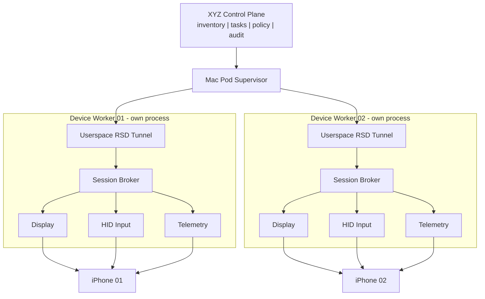

**Diagram ID:** `ARCH-WORKER-PROCESS-001`

## U.3 Recovery state machine

[INFERENCE] A device worker should have bounded recovery escalation. “Retry forever” hides failures and creates resource leaks.

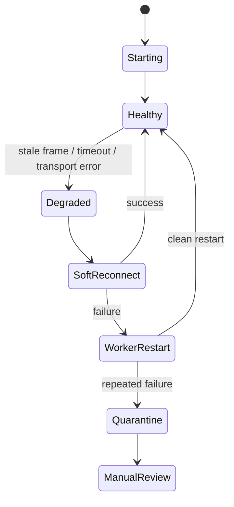

**Diagram ID:** `ARCH-WORKER-RECOVERY-001`

## U.4 Stable device and capture identity

The inventory should bind multiple independent identifiers rather than trusting a display name or device-list index.

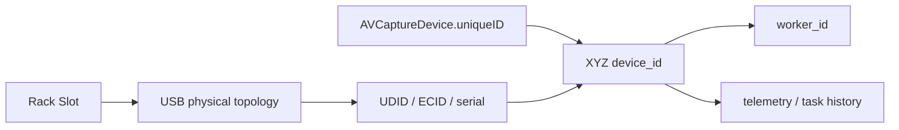

**Diagram ID:** `ARCH-CAPTURE-ID-001`

## U.5 Commissioning plane versus runtime plane

Configurator should remain a powerful commissioning tool while runtime control belongs to the pod software.

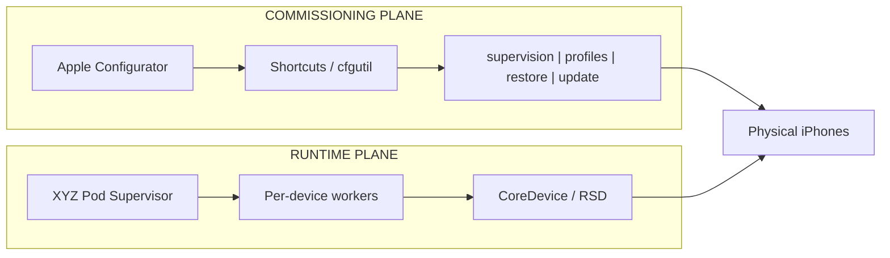

**Diagram ID:** `ARCH-COMMISSION-RUNTIME-002`

## U.6 Pairing and physical-security boundary

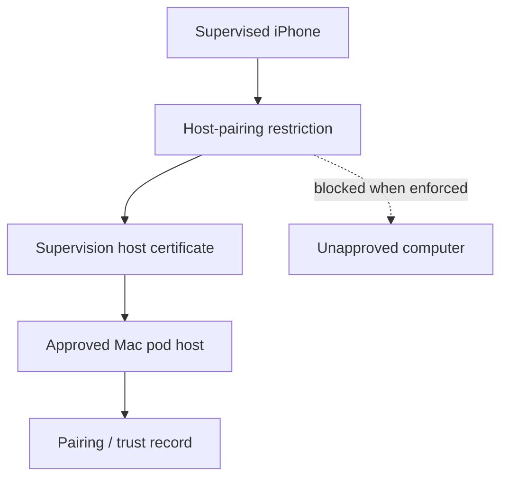

**Diagram ID:** `ARCH-PAIRING-BOUNDARY-001`

**Design consequence:** If USB Restricted Mode is deliberately relaxed for unattended operation, rack physical security and host-certificate policy become more important. Do not solve an availability problem by silently weakening every boundary at once.

## U.7 Power-health model

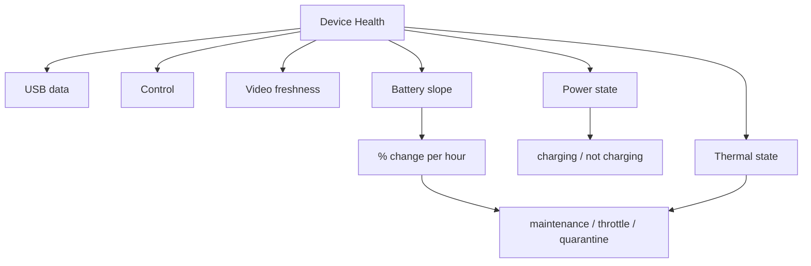

**Diagram ID:** `ARCH-POWER-HEALTH-002`

A good health record therefore needs at least:
- USB presence and data errors;
- screen-frame freshness and frame age;
- input acknowledgements/latency where measurable;
- current battery percentage;
- battery percentage slope over a window;
- battery-health status when exposed by management;
- charging state/slow-charger indications when available;
- host and device thermal state where measurable;
- reconnect count and recovery duration.

## U.8 Return to Service and cellular lifecycle

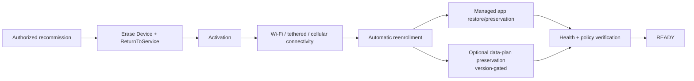

**Diagram ID:** `ARCH-RTS-ESIM-002`

This lifecycle is for authorized owned-device recommissioning. It is not a mechanism for evading platform enforcement or manufacturing replacement identities.

## U.9 The 20-device gate is a stack of gates

The target is not “20 video windows opened.” The pod passes only if all supporting layers remain healthy together.

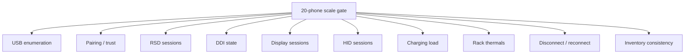

**Diagram ID:** `ARCH-SCALE-GATE-002`

### Minimum evidence required at each 1 -> 2 -> 5 -> 10 -> 20 step

- all expected UDIDs/ECIDs visible and mapped to the correct physical slots;
- no silent capture-ID swaps after reconnect;
- RSD setup time distribution and failure rate;
- DDI readiness time and mount failures;
- display freshness, FPS, frame-age and CPU/GPU load;
- input latency and input-service failure rate;
- battery slope per device under representative display/control load;
- hub branch temperatures and host thermal state;
- one-device unplug/replug without disturbing unrelated workers;
- supervisor memory/process count after repeated worker restarts;
- 24-hour and then 72-hour soak before declaring a 20-device pod production-capable.

## U.10 Updated test registry

### TEST-WORKER-ISO-001 - worker isolation
**Goal:** prove that killing/restarting one device worker does not interrupt display/control for neighboring devices.  
**Pass:** neighboring workers remain healthy; restarted worker recovers inventory identity and resumes telemetry without duplicate leases.  
**Fail:** a single worker restart breaks shared transport, remaps devices, leaks significant resources or corrupts inventory.

### TEST-PAIRING-001 - supervised host pairing
**Goal:** validate the exact supervision/host-certificate policy on the pilot phones.  
**Pass:** approved Mac pairs and reconnects as intended; an unapproved host cannot pair when the restriction is enforced; trust-expiration/recovery procedure is documented.  
**Fail:** policy blocks the production Mac unexpectedly or allows unintended hosts.

### TEST-DDI-001 - DDI lifecycle
**Goal:** record Developer Mode, DDI auto-mount and post-reboot recovery behavior per OS version.  
**Pass:** a cold reboot returns to `DDI_READY` through a deterministic bounded sequence.  
**Fail:** operator interaction is routinely required or the mounted state cannot be reliably observed.

### TEST-CACHE-001 - tethered commissioning lane
**Goal:** prove activation/management check-in/update behavior through the Mac USB shared-internet path with Wi-Fi and cellular disabled.  
**Pass:** devices obtain required Apple/MDM connectivity and updates through the intended commissioning lane.  
**Fail:** the lane is unreliable enough that commissioning must depend on Wi-Fi.

### TEST-RTS-001 - managed recommissioning
**Goal:** validate Return to Service on one owned pilot phone before fleet rollout.  
**Pass:** erase -> activation -> reenrollment -> required configuration -> READY occurs with documented level of interaction; app/data-plan preservation behavior matches the selected OS/MDM capabilities.  
**Fail:** Activation Lock, enrollment, bootstrap-token, Wi-Fi/tethering, or profile state prevents deterministic recovery.

### TEST-POWER-SLOPE-001 - sustained power
**Goal:** verify that each phone remains energy-stable under representative display/control load.  
**Pass:** battery percentage remains flat or trends upward within chosen limits over the soak window.  
**Fail:** any device slowly discharges despite being “connected,” or the hub cannot maintain the expected load.

## U.11 V1.3 evidence register

| ID | Source | Class | Use |
|---|---|---|---|
| S-V13-01 | pymobiledevice3 Python API guide | MAINTAINED-DOC | Lockdown vs RSD; in-process userspace tunnel; one tunnel per process |
| S-V13-02 | pymobiledevice3 iOS 17+ tunnel guide | MAINTAINED-DOC | iOS 17.4+ CoreDeviceProxy no-root path; 17.0-17.3.1 distinction |
| S-V13-03 | pymobiledevice3 protocol-layer guide | MAINTAINED-DOC | Developer Mode + DDI readiness |
| S-V13-04 | pymobiledevice3 mobile_image_mounter implementation | MAINTAINED-REPO | Personalized DDI on iOS 17+ and TSS personalization behavior |
| S-V13-05 | pymobiledevice3 transport/safety reference | MAINTAINED-DOC | userspace throughput caveat |
| S-V13-06 | Apple Platform Deployment - accessory access and host pairing | VERIFIED-FIRST-PARTY | supervision host certificates; 30-day unused trust expiry |
| S-V13-07 | Apple Device Management Restrictions | VERIFIED-FIRST-PARTY | allowUSBRestrictedMode semantics |
| S-V13-08 | Apple Configurator Shortcuts automations | VERIFIED-FIRST-PARTY | attach/detach automation and Configurator exclusivity |
| S-V13-09 | Apple macOS Content Caching setup | VERIFIED-FIRST-PARTY | tethered internet and MDM check-in |
| S-V13-10 | Apple Platform Deployment shared internet connection | VERIFIED-FIRST-PARTY | many physically connected devices/hub/cart commissioning lane |
| S-V13-11 | Apple Device Management - Returning a managed device to service | VERIFIED-FIRST-PARTY | app preservation, ADE, bootstrap token |
| S-V13-12 | Apple EraseDevice ReturnToService schema | VERIFIED-FIRST-PARTY / VERSION-GATED | ShouldRetryEnrollment iOS 27+ |
| S-V13-13 | Apple WWDC26 device-management updates | VERIFIED-FIRST-PARTY / VERSION-GATED | Return-to-Service update enforcement iOS 27 |
| S-V13-14 | Apple ReturnToServiceResponse | VERIFIED-FIRST-PARTY / VERSION-GATED | PreserveDataPlan iOS 26.4+ |
| S-V13-15 | Apple AVFoundation AVCaptureDevice.uniqueID | VERIFIED-FIRST-PARTY | stable capture identity on one Mac |
| S-V13-16 | Apple Support - iPhone charging speeds | VERIFIED-FIRST-PARTY | reduced power on shared computer/hub paths |
| S-V13-17 | Apple Foundation thermal-state documentation | VERIFIED-FIRST-PARTY | serious/critical thermal performance implications |
| S-V13-18 | Apple Support - start Mac when power is connected | VERIFIED-FIRST-PARTY | automatic Mac mini power-loss recovery |
| S-V13-19 | Apple Mac mini 2024 specifications | VERIFIED-FIRST-PARTY | port topology and Ethernet options |

### URLs
- S-V13-01: https://github.com/doronz88/pymobiledevice3/blob/master/docs/guides/python-api.md
- S-V13-02: https://github.com/doronz88/pymobiledevice3/blob/master/docs/guides/ios17-tunnels.md
- S-V13-03: https://github.com/doronz88/pymobiledevice3/blob/master/misc/understanding_idevice_protocol_layers.md
- S-V13-04: https://github.com/doronz88/pymobiledevice3/blob/master/pymobiledevice3/services/mobile_image_mounter.py
- S-V13-05: https://github.com/doronz88/pymobiledevice3/blob/master/misc/claude-plugin/skills/pymobiledevice3-device-operator/references/transport-and-safety.md
- S-V13-06: https://support.apple.com/en-gb/guide/deployment/depf8a4cb051/1/web/1.0
- S-V13-07: https://developer.apple.com/documentation/devicemanagement/restrictions
- S-V13-08: https://support.apple.com/guide/apple-configurator-mac/acm12a6f7b56/mac
- S-V13-09: https://support.apple.com/en-ca/guide/mac-help/mchl3b6c3720/mac
- S-V13-10: https://support.apple.com/guide/deployment/set-up-a-shared-internet-connection-dep38ff24bed/1/web/1.0
- S-V13-11: https://developer.apple.com/documentation/devicemanagement/returning-a-managed-device-to-service
- S-V13-12: https://developer.apple.com/documentation/devicemanagement/erasedevicecommand/command-data.dictionary/returntoservice-data.dictionary
- S-V13-13: https://support.apple.com/guide/deployment/device-management-updates-depd638aa061/web
- S-V13-14: https://developer.apple.com/documentation/devicemanagement/returntoserviceresponse
- S-V13-15: https://developer.apple.com/documentation/avfoundation/avcapturedevice/uniqueid
- S-V13-16: https://support.apple.com/tr-tr/120619
- S-V13-17: https://developer.apple.com/documentation/foundation/processinfo/thermalstate-swift.enum/serious
- S-V13-18: https://support.apple.com/en-us/125517
- S-V13-19: https://support.apple.com/tr-tr/121555

# V1.3 CURRENT COVERAGE / UNDERSTANDING SCORE

These are `INFERENCE` engineering self-assessments, not independently measured scientific percentages.

| Measurement | V1.2 artifact | V1.3 current |
|---|---:|---:|
| Research coverage | 98.3% | **99.2%** |
| Conceptual understanding | 97.3% | **98.9%** |
| Actual bench validation | 74.4% | **74.4%** |

### Why coverage rose
The remaining architecture is now mapped down to process boundaries, pairing identity, DDI state, commissioning networking, persistent capture identity, Return-to-Service variants, power slope and explicit 20-device acceptance gates. Few major legitimate fleet-engineering subsystems remain undocumented.

### Why understanding is not 100%
The most important unknowns are empirical: simultaneous CoreDevice display + HID stability, aggregate RSD/DDI behavior, hub power under sustained load, exact device-to-slot stability through faults, and the inbound control-board coexistence behavior. No web source can substitute for those measurements.

### Why bench validation did not rise
No new physical test was performed in this research pass. Internet research can refine hypotheses and acceptance criteria; it cannot prove the client's exact Mac, hub, cables, iPhones and board at 20-device load.

# V1.4 RESEARCH DELTA - 27 AUGUST 2026

> **Precedence:** V1.4 is newer than the V1.3 delta. Where this section narrows a V1.3 recommendation, V1.4 wins. All concurrency and capacity claims remain OPEN until they are reproduced on the client's own Mac, hub, cables and phones.

## V.1 What this pass changed

This pass focused on five gaps that still mattered after V1.3:

1. how to combine second-by-second pod telemetry with Apple-managed inventory truth;
2. how to survive CoreDevice service changes without hard-coding fragile OS assumptions;
3. how the Mac pod software itself should start, restart, log and recover after reboots;
4. how RustDesk should fit into the architecture without becoming the device-control authorization system;
5. how current `pymobiledevice3` tunnel/DDI behavior changes the recovery and version-pinning rules.

The architectural theme is **separation of concerns**. Runtime observation, managed-device truth, operator remote desktop, host process supervision and device-control transport are different planes. Treating them as one layer makes failures ambiguous.

## V.2 New evidence-backed claims

### PF-V14-OBS-001 - Declarative status is event-driven, but also has a periodic full safety report
- **status:** `VERIFIED-FIRST-PARTY`
- **claim:** Apple's Declarative Device Management status protocol sends incremental status reports when subscribed items change. Apple also documents a periodic full status report, typically about once per day, so a management server can recover if it missed an incremental update.
- **feynman_explanation:** Imagine a warehouse clerk who usually tells you only what changed: "Phone 12 updated to iOS 27." Once a day, the clerk sends the entire inventory sheet again. That full sheet is not fast telemetry, but it is valuable for repairing drift in the database.
- **architecture_use:** MDM/DDM is a **slow authoritative reconciliation plane**, not the primary source for frame freshness, RSD health, HID latency or sub-minute device state.
- **source:** S-V14-01, S-V14-02.

### PF-V14-OBS-002 - Managed-device status can provide durable inventory and health fields
- **status:** `VERIFIED-FIRST-PARTY`
- **claim:** Apple's current status-item model includes serial number, UDID, hardware model identifier, OS version, OS build version, battery health and managed-app status. Apple also documents a device system-health status item, currently beta, that can report component health where supported.
- **feynman_explanation:** The pod worker knows what is happening **right now**. Device management knows what the organization says the device **is**: its serial, model, software build and managed state. Those two views should meet in the database.
- **do_not_infer:** Do not assume every status item exists on every OS/model/enrollment type. Subscribe only to supported items and treat beta status as optional evidence.
- **source:** S-V14-03 through S-V14-09.

### PF-V14-CAP-001 - Runtime feature probing is safer than OS-version-only branching
- **status:** `MAINTAINED-REPO + REPRODUCIBLE-ISSUE`
- **claim:** Current `pymobiledevice3` evidence shows that the set of CoreDevice/RSD services can differ across devices and OS releases. A 2026 issue documented a CoreDevice pasteboard service absent from both iOS 17.5.1 and iOS 26.2 even though other CoreDevice/DDI services were healthy. Current release notes also mention newer iOS versions where a previously expected CoreDevice service is no longer exposed.
- **feynman_explanation:** Asking only "Which iOS version is this?" is like assuming every car of the same model year has the same optional equipment. A stronger worker asks the phone which capabilities are actually present **right now**, records the answer, and enables only the adapters that passed the probe.
- **architecture_use:** Build a capability registry keyed by device ID + iOS build + host tool version. Version rules choose the likely transport; runtime probes decide which features are enabled.
- **source:** S-V14-10, S-V14-11.

### PF-V14-CAP-002 - Capability loss is a supported degraded state, not necessarily a fatal pod failure
- **status:** `INFERENCE`
- **claim:** Because individual services can disappear while the RSD path remains healthy, a missing optional service should disable only the dependent feature where possible.
- **feynman_explanation:** If the radio in a car stops working, the car should not report "engine destroyed." Likewise, missing clipboard or one diagnostic service should not automatically kill display, input and inventory if those remain healthy.
- **do_not_infer:** A missing **required** service such as the selected display or HID path can still make that device unready for the intended workload.

### PF-V14-HOST-001 - The pod supervisor should be a macOS-managed persistent service
- **status:** `VERIFIED-FIRST-PARTY + INFERENCE`
- **claim:** Apple recommends Service Management / `SMAppService` for persistent launch agents and launch daemons on modern macOS. `launchd` is the system service manager and can keep or relaunch jobs according to their configuration.
- **feynman_explanation:** Do not make the farm depend on somebody opening Terminal and running `python supervisor.py`. The operating system already has a foreman whose job is to start background services after boot and supervise them. Let that foreman start the pod supervisor.
- **architecture_use:** The Mac should recover to a running supervisor after reboot without an operator launching the application manually. Per-phone workers are still controlled by the pod supervisor so the application can enforce bounded retries and device-specific quarantine.
- **source:** S-V14-12, S-V14-13, S-V14-14.

### PF-V14-LOG-001 - Unified Logging and signposts fit the pod observability model
- **status:** `VERIFIED-FIRST-PARTY`
- **claim:** Apple's unified logging system supports structured logs and signposts, and the OSLog framework can read historical log entries. Signposts can record time-bounded operations for performance analysis.
- **feynman_explanation:** A log says "worker 08 started a tunnel." A signpost lets you measure "how long did tunnel startup take?" At 20 phones, timing distributions matter more than isolated anecdotes.
- **architecture_use:** Every lifecycle operation should carry a device ID, worker ID, operation ID and result. Sensitive account content should not be written to infrastructure logs.
- **source:** S-V14-15, S-V14-16.

### PF-V14-REMOTE-001 - RustDesk belongs to the operator-access plane, not the device-control trust plane
- **status:** `VENDOR-DOC + INFERENCE`
- **claim:** RustDesk's self-hosted OSS backend uses `hbbs` for rendezvous/signaling and `hbbr` when relay traffic is needed. RustDesk Server Pro adds centralized features including OIDC, LDAP, 2FA, device management and access control. On macOS the client requires Screen Recording and Accessibility permissions for remote operation, with Input Monitoring needed in some cases.
- **feynman_explanation:** RustDesk is the window through which a remote employee sees the Mac. It should not decide which employee is allowed to lease Phone 07 or which client owns an account. Those decisions belong to the XYZ control plane and audit system.
- **architecture_use:** Remote desktop can be self-hosted and hardened, but all consequential device actions still pass through the control-plane authorization model where practical.
- **source:** S-V14-17 through S-V14-20.

### PF-V14-REMOTE-002 - macOS privacy permissions are a deployment dependency for unattended remote desktop
- **status:** `VENDOR-DOC`
- **claim:** RustDesk documents that macOS remote control requires Screen Recording and Accessibility permissions, and may require Input Monitoring. Its 2026 MDM deployment notes state that installing the auto-start service does not itself grant these privacy permissions; they must be granted separately, manually or through an appropriate managed privacy profile.
- **feynman_explanation:** "The RustDesk service is running" does not imply "the team can see and control the Mac." The privacy permissions are a second gate.
- **source:** S-V14-19, S-V14-20.

### PF-V14-REMOTE-003 - RustDesk/macOS compatibility belongs in the acceptance test
- **status:** `REPRODUCIBLE-COMMUNITY-ISSUE`
- **claim:** A June 2026 RustDesk discussion reports a macOS 26 Tahoe scenario in which a manually created LaunchAgent/LaunchDaemon path failed Screen Recording capture because of TCC responsible-process behavior even though the application itself had permission.
- **feynman_explanation:** macOS privacy permission can depend on **how** a process is launched, not merely whether the binary appears in the permission list. Therefore unattended remote access needs its own reboot/login-window test on the actual macOS/RustDesk version.
- **do_not_infer:** This is not proof that RustDesk's supported service-install path is universally broken. It is evidence that custom launch arrangements must be tested rather than improvised.
- **source:** S-V14-21.

### PF-V14-TRANS-001 - Userspace tunnel teardown and reconnect remain active engineering failure modes
- **status:** `MAINTAINED-REPO / 2026 ISSUES`
- **claim:** 2026 `pymobiledevice3` issues documented userspace tunnel cleanup hanging during teardown and a reconnect failure after unplug/replug on Linux. Current releases also include fixes around userspace-tunnel retry and service errors.
- **feynman_explanation:** A tunnel is not a magical permanent wire. It is software state that can get stuck during shutdown or disappear when the phone reconnects. The worker must assume that transport teardown itself can fail.
- **architecture_use:** Keep retries bounded. If one reconnect attempt fails, restart the worker process so its event loop, tunnel and sockets are rebuilt together. Escalate repeated failure to quarantine.
- **source:** S-V14-22, S-V14-23, S-V14-24.

### PF-V14-DDI-001 - DDI readiness is partly a supply-chain/version-pinning problem
- **status:** `MAINTAINED-REPO + INFERENCE`
- **claim:** The current personalized Developer Disk Image implementation uses a local image/build manifest/trust cache and may request a fresh personalization ticket from Apple's TSS server. The implementation also warns when the downloaded DDI build does not match the version expected by the installed tooling.
- **feynman_explanation:** DDI is not just a checkbox on the phone. It is also a host-side artifact with versions. If the host silently updates its device library or the expected image changes, a previously working boot-to-ready path can break.
- **architecture_use:** Pin the pod-agent dependency version, record the DDI build used for each readiness event, pre-cache required artifacts where licensing permits, and run a compatibility canary before fleet-wide host updates.
- **source:** S-V14-25.

## V.3 Canonical architecture diagram - two-speed truth model

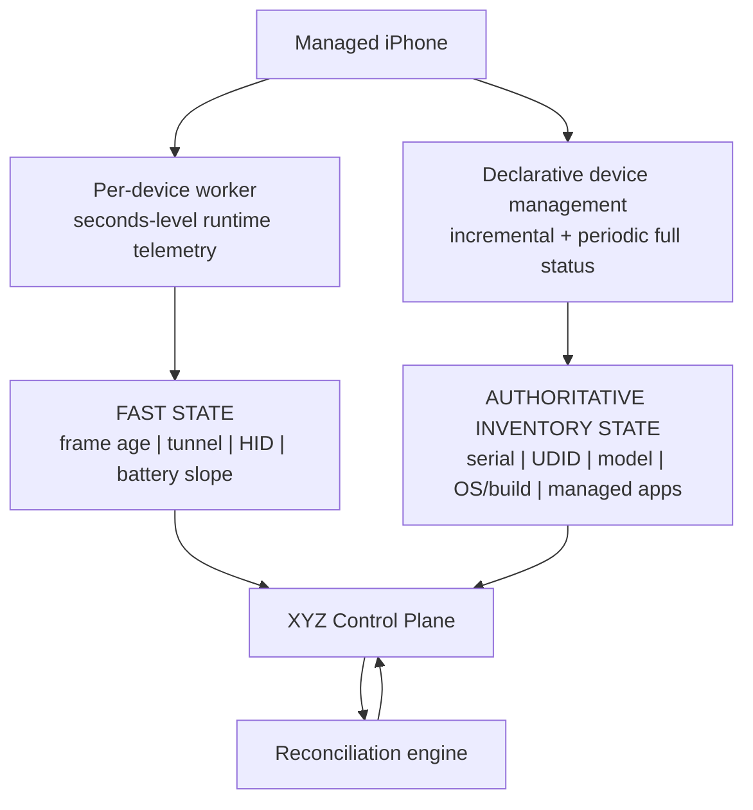

**Diagram ID:** `ARCH-TELEMETRY-TIERS-001`

### Feynman explanation
The fast path answers **"Can I use this phone right now?"** The slow managed path answers **"What device is this and what managed state should it have?"** Do not ask MDM for 30-fps video health, and do not ask a transient worker connection to be the organization's permanent inventory authority.

## V.4 Canonical architecture diagram - capability probing

```mermaid
flowchart TD
    D["Connected iPhone"] --> T["Establish usable transport<br/>Lockdown / RSD"]
    T --> P["Runtime capability probe"]
    P --> C["Capability registry<br/>device + OS build + tool version"]
    C -->|present| V["Display adapter"]
    C -->|present| H["HID adapter"]
    C -->|present| G["Diagnostics adapter"]
    C -->|present| F["File/media adapter"]
    C -->|absent| X["Unsupported or approved fallback"]
```

**Diagram ID:** `ARCH-CAPABILITY-PROBE-001`

### Capability record example
A production registry should record **observed capabilities**, not only expected ones:

```yaml
observed_device_capabilities:
  device_id: phone-007
  udid: "<inventory value>"
  ios_version: "26.2"
  ios_build: "<build>"
  pod_agent_version: "1.4.x"
  pymobiledevice3_version: "10.2.1"
  transport:
    lockdown: true
    userspace_rsd: true
  services:
    display_hevc: true
    hid: true
    device_info: false
    pasteboard: false
  observed_at: "2026-08-27T..."
```

A version matrix remains useful for planning, but the runtime probe is the final truth for adapter activation.

## V.5 Canonical architecture diagram - host service supervision

```mermaid
flowchart TD
    B["Mac boots"] --> L["launchd / Service Management"]
    L --> S["XYZ Pod Supervisor<br/>persistent background service"]
    S --> W1["Worker 01"]
    S --> W2["Worker 02"]
    S --> WN["Worker N"]
    S --> O["Unified Logging / OSLog"]
    W1 --> O
    W2 --> O
    WN --> O
    S --> H["Supervisor health endpoint"] --> C["XYZ Control Plane"]
```

**Diagram ID:** `ARCH-HOST-SUPERVISION-001`

### Host boot acceptance test
The Mac pod is not considered remotely recoverable until all of the following are demonstrated after an actual cold reboot:

1. macOS boots after power restoration under the selected configuration;
2. the pod supervisor starts without a human launching Terminal or an IDE;
3. inventory storage is reachable;
4. workers respawn for connected devices;
5. each worker re-establishes trust/transport/DDI/capability state as required;
6. the control plane marks devices healthy only after their readiness gates pass;
7. RustDesk or the selected operator-access path is usable after its required session/privacy gates;
8. the system produces an audit record for the recovery event.

## V.6 Canonical architecture diagram - remote operator plane

```mermaid
flowchart LR
    O["Authorized operator"] --> I["RustDesk ID / rendezvous<br/>hbbs"]
    I -->|direct when possible| M["Mac mini GUI"]
    I -->|relay fallback| R["hbbr relay"] --> M
    M --> C["XYZ Control Plane<br/>auth | leases | audit | policy"]
    C --> P["Pod supervisor + workers"] --> D["Owned phones"]
```

**Diagram ID:** `ARCH-REMOTE-OPS-001`

### Feynman explanation
Remote desktop gives a person **presence on the Mac**. It does not replace device inventory, role-based client separation, task leases or action auditing. If the remote-desktop vendor changes, the farm's business authorization model should remain intact.

## V.7 Canonical architecture diagram - bounded transport recovery

```mermaid
flowchart TD
    S["Worker starts"] --> P["Record tool + iOS + DDI versions"]
    P --> T["Create transport / tunnel"]
    T --> V["Open required service"]
    V --> H["Healthy"]
    T -->|failure| R["One bounded reconnect"]
    V -->|failure| R
    R -->|success| H
    R -->|failure| W["Restart worker process"]
    W -->|success| H
    W -->|repeated failure| Q["Quarantine / operator review"]
```

**Diagram ID:** `ARCH-TRANSPORT-RECOVERY-002`

## V.8 Database model update - separate observations from assertions

V1.4 recommends storing three categories of state rather than overwriting one `device.status` field:

| Category | Example | Typical source | Lifetime |
|---|---|---|---|
| `inventory_fact` | serial, UDID, model | ADE/MDM/DDM + commissioning | long-lived |
| `observed_runtime_state` | tunnel alive, frame age, battery slope | pod worker | seconds/minutes |
| `desired_state` | required OS ring, required profiles, pod assignment | control plane / MDM policy | until changed |

The reconciliation engine compares them. Example:

- desired OS: `27.0`
- managed-device reported OS: `26.5`
- worker reported device reachable: `true`

Result: **reachable but noncompliant**, not simply "healthy" or "offline."

## V.9 Version/capability canary rule

Before changing any of these on a production pod:

- macOS major/minor version;
- `pymobiledevice3` version;
- Python runtime;
- DDI artifact/build;
- RustDesk client/service version;
- Apple device OS version used by a meaningful fraction of the fleet;

promote the new combination through a canary sequence:

```text
1 device -> 2 devices -> representative 5-device pod -> fleet rollout
```

The canary must exercise:

- cold boot;
- unplug/replug;
- worker restart;
- display + HID together;
- DDI readiness;
- capability probe results;
- RustDesk reconnect after reboot;
- managed-device status reconciliation;
- at least one soak window.

## V.10 New acceptance tests

### TEST-DDM-RECON-001 - managed truth reconciliation
**Goal:** prove that incremental DDM changes and a later full status report converge the control-plane inventory to the device's reported managed state.  
**Pass:** missed/duplicated updates do not create permanent drift; a full report replaces stale state correctly.  
**Fail:** the control plane treats incremental arrays as complete snapshots or permanently diverges after a missed report.

### TEST-CAP-PROBE-001 - runtime capability discovery
**Goal:** prove the worker can classify supported/unsupported services without crashing when an expected service is absent.  
**Pass:** missing optional services produce a degraded capability set; required-service absence prevents READY with a precise reason.  
**Fail:** OS-version assumptions cause repeated startup crashes or false READY state.

### TEST-HOST-BOOT-002 - unattended host recovery
**Goal:** prove the Mac returns from full power loss to usable pod state without local keyboard/mouse intervention.  
**Pass:** supervisor, workers, telemetry and remote-operator path return within the documented recovery objective.  
**Fail:** any critical layer requires launching Terminal/IDE manually or leaves the pod apparently healthy while workers are absent.

### TEST-RD-MAC-001 - RustDesk macOS privacy/launch path
**Goal:** validate the **supported** RustDesk service/install method on the exact macOS version.  
**Pass:** after reboot, the authorized remote operator receives video and permitted input, including the intended pre-login/login-window behavior if required.  
**Fail:** connected-with-black-screen, missing Accessibility, or launch-context/TCC problems prevent operation.

### TEST-TRANSPORT-TEARDOWN-001 - repeated worker lifecycle
**Goal:** expose tunnel/event-loop cleanup leaks before 20-device deployment.  
**Method:** repeatedly create transport -> open services -> close -> restart worker across many cycles while monitoring process count, open sockets, memory and reconnect time.  
**Pass:** bounded resource use and stable recovery distribution.  
**Fail:** cleanup hangs, orphan tasks, increasing memory/socket count or increasing recovery time.

## V.11 V1.4 evidence register

| ID | Source | Class | Used for |
|---|---|---|---|
| S-V14-01 | Apple `StatusReport` documentation | VERIFIED-FIRST-PARTY | incremental status + periodic full safety report |
| S-V14-02 | Apple declarative management scale/data-model article | VERIFIED-FIRST-PARTY | status categories and server reconciliation model |
| S-V14-03 | Apple `StatusDeviceSerialNumber` | VERIFIED-FIRST-PARTY | serial inventory |
| S-V14-04 | Apple `StatusDeviceUDID` | VERIFIED-FIRST-PARTY | UDID inventory availability |
| S-V14-05 | Apple `StatusDeviceModelIdentifier` | VERIFIED-FIRST-PARTY | hardware model identifier |
| S-V14-06 | Apple OS version/build status items | VERIFIED-FIRST-PARTY | software inventory |
| S-V14-07 | Apple `StatusDeviceBatteryHealth` | VERIFIED-FIRST-PARTY | managed battery health |
| S-V14-08 | Apple `StatusDeviceSystemHealth` | VERIFIED-FIRST-PARTY / BETA | component health where supported |
| S-V14-09 | Apple managed-app status documentation | VERIFIED-FIRST-PARTY | installed/managed app state |
| S-V14-10 | pymobiledevice3 issue #1744 | REPRODUCIBLE-ISSUE | service absence despite healthy RSD/DDI path |
| S-V14-11 | pymobiledevice3 releases | MAINTAINED-REPO | service/version behavior changes and tunnel retry fixes |
| S-V14-12 | Apple Service Management / `SMAppService` | VERIFIED-FIRST-PARTY | launch agents/daemons |
| S-V14-13 | Apple persistent background-process guidance | VERIFIED-FIRST-PARTY | preferred persistent service pattern |
| S-V14-14 | Apple launchd daemon/agent guide | VERIFIED-FIRST-PARTY / ARCHIVED-GUIDE | KeepAlive/on-demand service lifecycle background |
| S-V14-15 | Apple Logging documentation | VERIFIED-FIRST-PARTY | unified logging and signposts |
| S-V14-16 | Apple OSLog framework | VERIFIED-FIRST-PARTY | historical log reading |
| S-V14-17 | RustDesk Server OSS documentation | VENDOR-DOC | hbbs/hbbr roles |
| S-V14-18 | RustDesk self-host documentation | VENDOR-DOC | direct vs relay architecture; Pro control features |
| S-V14-19 | RustDesk macOS client documentation | VENDOR-DOC | Accessibility/Screen Recording/Input Monitoring |
| S-V14-20 | RustDesk macOS auto-start/MDM notes | VENDOR/MAINTAINED-WIKI | service setup does not grant privacy permissions |
| S-V14-21 | RustDesk discussion #15364 | COMMUNITY-ISSUE | macOS 26 TCC launch-context risk to test |
| S-V14-22 | pymobiledevice3 issue #1756 | REPRODUCIBLE-ISSUE | userspace tunnel cleanup hang |
| S-V14-23 | pymobiledevice3 issue #1742 | REPRODUCIBLE-ISSUE | reconnect behavior after unplug/replug |
| S-V14-24 | pymobiledevice3 releases v10.x | MAINTAINED-REPO | active tunnel retry/error fixes |
| S-V14-25 | pymobiledevice3 `mobile_image_mounter.py` | MAINTAINED-REPO | personalized DDI/TSS/version behavior |

### URLs
- S-V14-01: https://developer.apple.com/documentation/devicemanagement/statusreport
- S-V14-02: https://developer.apple.com/documentation/devicemanagement/leveraging-the-declarative-management-data-model-to-scale-devices
- S-V14-03: https://developer.apple.com/documentation/devicemanagement/statusdeviceserialnumber
- S-V14-04: https://developer.apple.com/documentation/devicemanagement/statusdeviceudid
- S-V14-05: https://developer.apple.com/documentation/devicemanagement/statusdevicemodelidentifier
- S-V14-06: https://developer.apple.com/documentation/devicemanagement/statusdeviceoperatingsystemversion
- S-V14-07: https://developer.apple.com/documentation/devicemanagement/statusdevicebatteryhealth
- S-V14-08: https://developer.apple.com/documentation/devicemanagement/statusdevicesystemhealth
- S-V14-09: https://developer.apple.com/documentation/devicemanagement/processing-status-for-managed-apps
- S-V14-10: https://github.com/doronz88/pymobiledevice3/issues/1744
- S-V14-11: https://github.com/doronz88/pymobiledevice3/releases
- S-V14-12: https://developer.apple.com/documentation/servicemanagement/smappservice
- S-V14-13: https://developer.apple.com/documentation/appkit/managing-ongoing-background-processes-in-your-mac
- S-V14-14: https://developer.apple.com/library/archive/documentation/MacOSX/Conceptual/BPSystemStartup/Chapters/CreatingLaunchdJobs.html
- S-V14-15: https://developer.apple.com/documentation/os/logging/
- S-V14-16: https://developer.apple.com/documentation/oslog
- S-V14-17: https://rustdesk.com/docs/en/self-host/rustdesk-server-oss/
- S-V14-18: https://rustdesk.com/docs/en/self-host/
- S-V14-19: https://rustdesk.com/docs/en/client/mac/
- S-V14-20: https://github.com/rustdesk/rustdesk/wiki/macOS-Auto%E2%80%90Start-Service-Setup-%28for-Remote---MDM-Deployment%29
- S-V14-21: https://github.com/rustdesk/rustdesk/discussions/15364
- S-V14-22: https://github.com/doronz88/pymobiledevice3/issues/1756
- S-V14-23: https://github.com/doronz88/pymobiledevice3/issues/1742
- S-V14-24: https://github.com/doronz88/pymobiledevice3/releases
- S-V14-25: https://github.com/doronz88/pymobiledevice3/blob/master/pymobiledevice3/services/mobile_image_mounter.py

# V1.4 CURRENT COVERAGE / UNDERSTANDING SCORE

These are `INFERENCE` engineering self-assessments, not independently measured scientific percentages.

| Measurement | V1.3 | V1.4 current |
|---|---:|---:|
| Research coverage | 99.2% | **99.45%** |
| Conceptual understanding | 98.9% | **99.25%** |
| Actual bench validation | 74.4% | **74.4%** |

### Why the research score increased only slightly
V1.4 did not discover a completely new phone-control mechanism. It closed **operational architecture** gaps: managed truth reconciliation, runtime feature discovery, Mac service supervision, host logging and the remote-operator plane. These are important, but the major physical-device questions were already mapped.

### Why understanding remains below 100%
The remaining uncertainty is dominated by real hardware behavior:

- 5/10/20-device CoreDevice display + HID concurrency;
- aggregate USB hub data/power behavior and exact port mapping;
- long-duration userspace RSD/DDI stability on the chosen macOS/tool versions;
- the incoming hardware control-board coexistence path;
- exact media ingestion behavior under the client's final no-helper/helper-app policy;
- RustDesk/macOS unattended behavior on the exact production image;
- Dim's undocumented hands-on observations being converted into reproducible evidence.

### Why bench validation remains unchanged
No new local Mac/phone experiment occurred in this web-research run. Documentation can improve the model and tests; it cannot prove the client's exact 20-device pod.


---

# V1.5 RESEARCH LEDGER - FINALIZED WEB PASS - 27 AUGUST 2026

> STATUS: DELIVERABLE RESEARCH CUT. Web/documentary research is substantially saturated for the current architecture. The **actual XYZ/Dim bench validation score remains below 80%** because no new local Mac/phone measurements were produced in this research run. This document is therefore a research-complete engineering handbook with explicitly OPEN bench gates, not a claim that the 20-device pod has been validated.

## New findings from deep-research loop

### V15-CLAIM-01 — Multi-device CoreMediaIO capture is real, but simultaneous session start can race
**Evidence:** Quern's 2026 physical-device implementation uses a long-running macOS CoreMediaIO preview process with independent windows per physical iPhone. Its developer notes report a framework-level race when multiple `AVCaptureSession`s are started simultaneously and say that staggering starts by about one second avoided the race.

**Classification:** EXTERNAL-MEASURED / MAINTAINED-OPEN-SOURCE

**Engineering consequence:** session startup must be serialized/staggered. `start N sessions concurrently` is not an acceptable production assumption.

```mermaid
flowchart TD
    SUP["Pod Supervisor"]
    Q["Capture-start queue"]
    C1["Start iPhone 01 capture"]
    D1["Wait / verify first fresh frame"]
    C2["Start iPhone 02 capture"]
    D2["Wait / verify first fresh frame"]
    CN["Start iPhone N capture"]
    H["All active sessions enter health monitoring"]

    SUP --> Q --> C1 --> D1 --> C2 --> D2 --> CN --> H
```

**Canonical ID:** `ARCH-CMIO-MULTIDEVICE-002`

---

### V15-CLAIM-02 — Released software independently confirms multi-device USB iOS capture, but not a 20-device ceiling
WireView's current Mac App Store description explicitly supports multiple connected devices and uses the same built-in USB iOS capture technology as QuickTime. Its current reliability notes describe real failure states: device listed but no frames, capture starting before video format settles, trust-state problems, and the need for explicit stale-frame detection.

**Classification:** EXTERNAL-PRODUCT / EXTERNAL-MEASURED

**Engineering consequence:** `AVCaptureSession.isRunning` or device enumeration alone is insufficient health evidence. A healthy capture requires increasing frame timestamps/byte counts within a bounded freshness window.

---

### V15-CLAIM-03 — USB device count is constrained by endpoint/controller topology, not just physical port count
Cambrionix's current hub documentation gives a concrete baseline of 15 iPhone 13/15 devices on one SuperSync15 USB 2 topology. Its PDSync-C4 manual gives a baseline of 16 iPhone 15 devices through a standard USB host controller with four four-port hubs and warns that USB endpoint memory and hub depth are limiting resources. Cambrionix's modular-station material additionally describes architectures up to 96 devices from one host/BOSS using multiple managed hubs; this latter number is vendor architecture evidence, not validation of 96 simultaneous screen/control sessions.

**Classification:** VENDOR-MEASURED / VENDOR-CLAIM (scope-dependent)

**Engineering consequence:** the 20-device target must be split across host-bus branches and measured as an endpoint budget. A single giant downstream tree is not the default assumption.

```mermaid
flowchart TD
    MAC["M4 Mac mini"]
    B1["Host USB bus A"]
    B2["Host USB bus B"]
    B3["Host USB bus C"]
    H1["Managed powered hub A"]
    H2["Managed powered hub B"]
    H3["Managed powered hub C"]
    P1["Phone group A"]
    P2["Phone group B"]
    P3["Phone group C"]
    EP["Endpoint / bandwidth / power telemetry"]

    MAC --> B1 --> H1 --> P1
    MAC --> B2 --> H2 --> P2
    MAC --> B3 --> H3 --> P3
    B1 --> EP
    B2 --> EP
    B3 --> EP
```

**Canonical ID:** `ARCH-HUB-ENDPOINT-001`

---

### V15-CLAIM-04 — M4 Mac mini ports are not one homogeneous USB resource
Apple documents two front USB-C ports and three rear Thunderbolt ports on the M4 Mac mini. Third-party hardware mapping by Twocanoes reports that the two front ports share a USB 3.1 bus while each of the three rear ports maps to a separate USB 3.1 bus; a 2026 ChargerLAB teardown independently found separate Thunderbolt/USB controllers and a Genesys hub for the front ports.

**Classification:** APPLE-FIRST-PARTY for port inventory; INDEPENDENT-HARDWARE-MEASUREMENT for bus topology.

**Do not overclaim:** Apple has not published an official '20 iPhone farm' bus-allocation specification.

```mermaid
flowchart LR
    M["M4 Mac mini"]
    F["Front pair\nshared USB bus\n[third-party measured]"]
    R1["Rear TB port 1\nseparate USB bus\n[third-party measured]"]
    R2["Rear TB port 2\nseparate USB bus\n[third-party measured]"]
    R3["Rear TB port 3\nseparate USB bus\n[third-party measured]"]

    M --> F
    M --> R1
    M --> R2
    M --> R3
```

**Canonical ID:** `ARCH-M4-USB-BUSES-001`

---

### V15-CLAIM-05 — The iMouse board path is more separable than earlier notes implied, but Mac USB display coexistence remains OPEN
Some3C's own current iMouse documentation says:
- one dedicated hardware board corresponds to one iPhone;
- the board is connected to the computer over a separate USB-C 'computer' port;
- the phone uses the vendor's included Lightning/USB-C OTG cable;
- iMouse XP is Windows-only;
- screen display is normally network mirroring/AirPlay and requires phone and PC on the same network;
- one screen-mirroring service can connect up to ten phones;
- the kernel runs as a Windows service even when the console exits.

The public documentation does **not** document a transparent USB data pass-through from the phone through the iMouse board to a Mac CoreMediaIO host.

**Classification:** VENDOR-DOCUMENTED + OPEN for pass-through coexistence.

```mermaid
flowchart LR
    PHONE["iPhone"]
    BOARD["iMouse OTG board"]
    WIN["Windows iMouse kernel"]
    AIR["Network screen mirroring"]
    MAC["Mac CoreMediaIO capture"]

    PHONE -->|"vendor OTG cable"| BOARD
    BOARD -->|"USB-C computer port"| WIN
    PHONE -->|"Wi-Fi / AirPlay"| AIR --> WIN
    PHONE -. "USB pass-through not documented" .-> MAC
```

**Canonical ID:** `ARCH-IMOUSE-SPLIT-001`

**Critical Gate:** bench-test whether the exact incoming board permits simultaneous direct Mac USB capture. Do not infer this from separate PC and phone connectors.

---

### V15-CLAIM-06 — The iMouse 'no app' claim does not mean 'no phone-side software/configuration'
The vendor's basic HID control path does not require an installed native app, but the documented media/shortcut functions require adding an iMouse Shortcut, changing Shortcuts Advanced permissions, configuring an IP address, running the shortcut once, and granting requested permissions. The vendor's shortcut API includes adding photos/videos to the phone album.

**Classification:** VENDOR-DOCUMENTED.

**Engineering consequence:** media ingestion via the iMouse ecosystem is a separate phone-side automation dependency and must be security-reviewed and acceptance-tested. It must not be described as equivalent to a zero-phone-side-component architecture.

---

### V15-CLAIM-07 — iMouse host security posture is a production risk that requires isolation
Current iMouse XP setup documentation recommends adding the download directory to Windows Security exclusions and, in older setup instructions, trusting/exiting security products and even recommends uninstalling antivirus if it interferes. The iMouse kernel runs persistently as a Windows service and the console requires a vendor account.

**Classification:** VENDOR-DOCUMENTED SECURITY SIGNAL.

**Engineering consequence:** if iMouse is tested, use a dedicated isolated Windows bench/pod host, non-production credentials, outbound/network allowlists where feasible, immutable recovery image, and packet/process observation before any authorized client account is exposed to it.

```mermaid
flowchart TD
    IM["iMouse Windows host"]
    VLAN["Dedicated management VLAN"]
    FW["Firewall / egress policy"]
    TEST["Test accounts only"]
    LOG["Process + network logging"]
    PROD["Production credentials"]

    IM --> VLAN --> FW
    IM --> TEST
    IM --> LOG
    PROD -. "blocked until security review passes" .-> IM
```

**Canonical ID:** `ARCH-IMOUSE-SECURITY-001`

---

### V15-CLAIM-08 — macOS camera permission is a first-run gate for the native capture helper
Apple requires explicit camera/video-capture permission for each macOS app that uses AVFoundation capture devices, and the OS remembers the user's decision. Current macOS Privacy Preferences Policy Control documentation allows MDM to manage many TCC services, but for Camera it documents denial rather than silent pre-approval; the payload itself requires user approval. Apple's WWDC26 management update describes a newer consolidated per-app privacy-default mechanism, including Camera, for the 27-generation OSes; that is a future deployment option and should not be assumed for the macOS 26 pilot.

**Classification:** VERIFIED-FIRST-PARTY.

```mermaid
stateDiagram-v2
    [*] --> CaptureHelperInstalled
    CaptureHelperInstalled --> PermissionUnknown
    PermissionUnknown --> HumanApprovalRequired: macOS 26 pilot
    HumanApprovalRequired --> CameraAuthorized: approved
    HumanApprovalRequired --> CaptureBlocked: denied
    CameraAuthorized --> CaptureReady
    CaptureBlocked --> ManualRemediation
```

**Canonical ID:** `ARCH-MAC-TCC-CAPTURE-001`

---

### V15-CLAIM-09 — Current Appium/XCUITest architecture proves multi-real-device parallelism is supported, but with explicit per-device namespaces
Current Appium XCUITest documentation says parallel tests on real devices are supported. Each session requires a unique device UDID, unique `wdaLocalPort`, unique `mjpegServerPort` when using MJPEG, and a unique derived-data path. Its current RemoteXPC tunnel manager is multi-device-aware and creates independent tunnels per device.

**Classification:** MAINTAINED-PROJECT-DOCUMENTATION.

**Engineering consequence:** WDA remains a credible fallback reference architecture for concurrency. The port/worker isolation pattern strongly supports the XYZ per-device-worker design even if XYZ ultimately uses CoreDevice HID instead of WDA.

---

### V15-CLAIM-10 — Physical USB screen capture should use VideoDataOutput-style health rather than MovieFileOutput as the core observation channel
A 2026 Apple Feedback report reproduces a gamma/color-space bug when `AVCaptureMovieFileOutput` is attached to a USB-connected iOS capture session; `AVCaptureVideoDataOutput` was not affected in that report. AutoMobile's current physical-iOS capture work also uses a VideoDataOutput/BGRA helper path.

**Classification:** REPRODUCIBLE-ISSUE + MAINTAINED-OPEN-SOURCE.

**Engineering consequence:** the pod's live health/vision path should be based on frame delivery (`AVCaptureVideoDataOutput` or an equivalent low-level stream) rather than coupling health to movie-file recording.

---

## New test gates

### TEST-CMIO-START-STAGGER-001
1. Enumerate N capture devices.
2. Start one capture session.
3. Require first fresh frame before next start.
4. Repeat through 2/5/10/20.
5. Separately run a simultaneous-start stress test to characterize race rate.
6. Record time-to-first-frame, failures, stale-frame events, CPU, memory and recoveries.

### TEST-USB-ENDPOINT-001
For each hub/bus branch record:
- physical upstream port;
- IOUSBHost location IDs;
- phone serial/UDID;
- negotiated speed;
- hub depth;
- enumerate success/failure;
- disconnect/reconnect behavior;
- charge-state and battery slope.

### TEST-IMOUSE-PASSTHROUGH-001
With the exact incoming board and one sacrificial test phone:
- establish board control using vendor-supported topology;
- observe whether the phone simultaneously appears as a direct USB capture device on a Mac;
- if not, stop: board + native Mac capture are separate architectures;
- if yes, record USB tree, phone USB role, board firmware and exact cabling before promotion to project fact.

### TEST-MAC-TCC-001
- clean/new macOS user or clean TCC state;
- launch signed capture helper;
- validate the required camera permission workflow;
- reboot;
- start helper through the intended launchd/service context;
- confirm capture remains authorized and yields fresh frames.

---

## Research-source register — V1.5 working

| ID | Source | Class | What it supports |
|---|---|---|---|
| S-V15-01 | Apple Configurator — connect devices | VERIFIED-FIRST-PARTY | multiple simultaneous iOS devices through powered hubs/carts |
| S-V15-02 | Cambrionix SuperSync15 current guide | VENDOR-MEASURED | baseline 15 iPhone 13/15 on one hub/host controller topology |
| S-V15-03 | Cambrionix PDSync-C4 manual | VENDOR-MEASURED | 16 iPhone 15 baseline; endpoint/hub-depth constraints |
| S-V15-04 | Cambrionix ModIT datasheet | VENDOR-ARCHITECTURE | up to 96 provisioning devices via multiple managed hubs; not capture/control proof |
| S-V15-05 | Quern 2026 development discussion | EXTERNAL-MEASURED | multi-device CoreMediaIO preview and start-race mitigation |
| S-V15-06 | WireView App Store / Apple-bug ledger | EXTERNAL-PRODUCT | multi-device support and real stale/no-frame failure modes |
| S-V15-07 | AutoMobile issue #2504 | MAINTAINED-OPEN-SOURCE | physical iOS CoreMediaIO/AVFoundation VideoDataOutput implementation |
| S-V15-08 | Apple Feedback report FB22281424 | REPRODUCIBLE-ISSUE | MovieFileOutput gamma bug on USB iOS capture |
| S-V15-09 | Apple AVFoundation authorization docs | VERIFIED-FIRST-PARTY | camera permission required and remembered |
| S-V15-10 | Apple PPPC payload docs | VERIFIED-FIRST-PARTY | current macOS TCC management limits; Camera deny behavior |
| S-V15-11 | Apple WWDC26 app-management update | VERIFIED-FIRST-PARTY / FUTURE-OS | per-app privacy defaults including Camera on 27-generation OS |
| S-V15-12 | Twocanoes M4 Mac mini port guide | INDEPENDENT-MEASUREMENT | front shared bus, rear separate USB buses |
| S-V15-13 | ChargerLAB M4 Mac mini teardown | INDEPENDENT-HARDWARE | multiple USB/TB controllers and front hub architecture |
| S-V15-14 | Some3C iPhone Farm Settings | VENDOR-DOC | iMouse board/PC connection, AirPlay mirroring, 10-phone mirroring service |
| S-V15-15 | Some3C iMouse XP docs | VENDOR-DOC | Windows service/kernel, security exclusion recommendation |
| S-V15-16 | Some3C API docs | VENDOR-DOC | WebSocket screen images, USB reset, Shortcuts/media functions |
| S-V15-17 | Appium XCUITest parallel-tests docs | MAINTAINED-PROJECT | supported multi-real-device sessions and unique port namespaces |
| S-V15-18 | Appium RemoteXPC tunnel docs | MAINTAINED-PROJECT | multi-device-aware independent tunnel registry |

### URLs
- S-V15-01: https://support.apple.com/en-ca/guide/apple-configurator-mac/cad9d4b2211e/mac
- S-V15-02: https://www.cambrionix.com/blogs/blog/a-5-minute-guide-to-the-supersync15
- S-V15-03: https://downloads.cambrionix.com/documentation/en/PDS-C4-User-Manual.pdf
- S-V15-04: https://www.cambrionix.com/wp-content/uploads/2021/02/ModIT_DataSheet.pdf
- S-V15-05: https://github.com/quern-dev/quern/discussions/1
- S-V15-06: https://apps.apple.com/us/app/wireview/id6756973128?mt=12
- S-V15-07: https://github.com/kaeawc/auto-mobile/issues/2504
- S-V15-08: https://github.com/feedback-assistant/reports/issues/780
- S-V15-09: https://developer.apple.com/documentation/avfoundation/requesting-authorization-to-capture-and-save-media
- S-V15-10: https://support.apple.com/en-gb/guide/deployment/dep38df53c2a/web
- S-V15-11: https://support.apple.com/en-ie/guide/deployment/depd567c9ffa/1/web/1.0
- S-V15-12: https://twocanoes.com/knowledge-base/m4-mac-mini-port-guide/
- S-V15-13: https://www.chargerlab.com/teardown-of-apple-m4-mac-mini-a3238/
- S-V15-14: https://doc.some3c.com/iphone-farm-setup/iphone-farm-settings
- S-V15-15: https://doc.some3c.com/iphone-farm-setup/imouse-xp-new-version
- S-V15-16: https://doc.some3c.com/api-documentation
- S-V15-17: https://github.com/appium/appium-xcuitest-driver/blob/master/docs/guides/parallel-tests.md
- S-V15-18: https://github.com/appium/appium-xcuitest-driver/blob/master/docs/guides/remotexpc-tunnels-real-devices.md

# V1.5 RESEARCH / UNDERSTANDING SCORE

These remain INFERENCE self-assessments, not measured scientific quantities.

| Measurement | V1.4 | V1.5 working |
|---|---:|---:|
| Research coverage | 99.45% | **99.80%** |
| Conceptual understanding | 99.25% | **99.70%** |
| Actual XYZ/Dim bench validation | 74.4% | **74.4%** |

### Why actual bench validation did not move
This run added strong **external empirical evidence**: a released multi-device CoreMediaIO product, an open-source multi-device implementation with a documented start race, vendor USB endpoint/device-count measurements, current Appium parallel-device support, and current iMouse topology documentation. None of those measurements were produced on XYZ's Mac, hub, exact phone set, incoming control board, network, or production software image. They therefore cannot legitimately raise the project's actual bench-validation score.

### Minimum evidence required to cross the 80% project threshold
The exact weighted score should be recalculated only after at least the following local measurements exist:
1. one-phone Mac capture/control run with exact versions and logs;
2. two-phone simultaneous run proving independent sessions and recovery;
3. five-phone continuous run with fresh-frame, input, power and reconnect telemetry;
4. at least one multi-hour soak window;
5. exact iMouse/control-board coexistence result (pass or fail is both useful evidence);
6. USB branch/location mapping on the chosen powered hub;
7. remote-reboot/recovery rehearsal on the intended Mac image.

If these pass with recorded artifacts, the 80% threshold can be recalculated from actual evidence rather than estimate inflation.


# V1.5 FINAL COMPATIBILITY / ADVERSARIAL AUDIT - 27 AUGUST 2026

> **Precedence:** This section supersedes narrower V1.5 working assumptions where it explicitly says so. Claims remain scoped to authorized, organization-owned device-fleet engineering. Capacity at 5/10/20 devices remains OPEN until reproduced on XYZ's intended Mac, hubs, cables, phones and production image.

## V15-FINAL-01 - Correction: do not state a general iOS 18 floor for Device Hub physical-device input

**Status:** `CORRECTION + VERIFIED-FIRST-PARTY`

Correction: a previous research narrative stated that Xcode 27 Device Hub keyboard/pointer interaction on physical iPhones required iOS 18+. I cannot verify that as a general physical-device minimum from Apple's current Device Hub documentation. Apple states that Device Hub manages **physical and simulated devices** and that, when an app is run on a physical or simulated device, Device Hub opens a compact device screen that can be interacted with using Mac controls. Xcode 27 beta release notes contain pre-iOS-18 input fixes that are explicitly about **simulators**, not a universal physical-device floor.

**Engineering consequence:** treat Device Hub as a first-party **human interactive control** candidate for supported physical run destinations, but do not infer:
- a public automation/touch-injection API;
- 20-device simultaneous interactive capacity;
- an iOS-version floor beyond what the exact Xcode/device combination demonstrates in the bench.

```mermaid
flowchart TD
    PHONE["Physical iPhone"]
    HUMAN["Human operator"]
    HUB["Xcode 27 Device Hub\nfirst-party interactive UI"]
    DEVCTL["devicectl\ninventory | install | settings | diagnostics | JSON"]
    CORE["CoreDevice / RSD implementation\ndisplay | HID | developer services"]
    WDA["XCUITest / WDA\nsigned on-device runner"]
    BOARD["External HID/control board\nlegacy/vendor route"]

    HUMAN --> HUB --> PHONE
    DEVCTL --> PHONE
    CORE --> PHONE
    WDA --> PHONE
    BOARD --> PHONE

    DEVCTL -. "no documented arbitrary touch API" .-> HUMAN
    HUB -. "human control, not farm-scale proof" .-> HUMAN
```

**Canonical ID:** `ARCH-IOS-CONTROL-LANES-002`

## V15-FINAL-02 - `devicectl` is a management/diagnostic automation surface, not a verified arbitrary touch surface

**Status:** `VERIFIED-FIRST-PARTY`

Xcode 27 release notes confirm structured `devicectl --json-output` to stdout. Apple's Device Hub material positions `devicectl` alongside device inventory, application management, settings and diagnostics. No current Apple source located in this research pass documents arbitrary scripted tap/swipe injection through `devicectl`.

**Do not infer:** `devicectl` replaces HID, Device Hub human control, CoreDevice HID, or WDA for arbitrary UI input.

## V15-FINAL-03 - CoreDevice/RSD transport rules are now stable enough to encode as a version-aware prerequisite layer

**Status:** `MAINTAINED-PROJECT-DOCUMENTATION`

Current `pymobiledevice3` documentation states:
- iOS 17+ developer services use CoreDevice/RemoteXPC/RSD flows;
- iOS 17.4+ over USB on macOS/Linux/Windows can use the default no-root, in-process userspace tunnel;
- iOS 17.0-17.3.1 is routed to privileged `tunneld` by default because the robust USB CoreDeviceProxy path is not available there;
- the userspace path supports host-initiated developer services plus device-initiated AV/HID paths including video display and HID gestures;
- the userspace tunnel address is process-local.

Appium's current XCUITest RemoteXPC implementation independently uses multi-device tunnel registries and unique per-device state, but its driver documentation currently applies its RemoteXPC tunnel mechanism to real iOS/tvOS 18+ devices. This is an **Appium implementation boundary**, not evidence that CoreDevice itself begins at iOS 18.

```mermaid
flowchart TD
    D["Connected iPhone"] --> V{"iOS generation"}
    V -->|"<=16"| LEG["Legacy path\nWDA / board / supported management"]
    V -->|"17.0-17.3.1"| TD["RSD via tunneld\nprivileged / version-specific"]
    V -->|"17.4+"| US["Userspace CoreDeviceProxy/RSD\nUSB, no-root in-process"]
    US --> PROBE["Probe actual services"]
    TD --> PROBE
    PROBE --> DISP["Display capability"]
    PROBE --> HID["HID capability"]
    PROBE --> DIAG["Diagnostics capability"]
    PROBE --> FALL["Approved fallback for missing capability"]
```

**Canonical ID:** `ARCH-IOS-RSD-VERSION-002`

## V15-FINAL-04 - Capture identity and capture health must be separate records

**Status:** `VERIFIED-FIRST-PARTY + EXTERNAL-MEASURED`

Apple documents `AVCaptureDevice.uniqueID` as a persistent identifier on one Mac across device disconnects, app restarts and Mac reboots. This is the correct anchor for the **capture-device identity** side of the inventory map. External 2026 CoreMediaIO implementations show that a device can remain enumerated while producing stale/no frames, and Quern reports a multi-session start race mitigated by staggered starts.

**Engineering consequence:** a production capture record needs both **identity** and **freshness**.

```mermaid
flowchart TD
    ENUM["AVCapture device enumerated"] --> UID["Map AVCaptureDevice.uniqueID\nto inventory device_id"]
    UID --> QUEUE["Serialized capture-start queue"]
    QUEUE --> START["Start one AVCaptureSession"]
    START --> FRAME{"Fresh frame received?"}
    FRAME -->|"yes"| HEALTH["Health watchdog\nframe counter | timestamp | bytes"]
    FRAME -->|"no"| REC["Bounded reconnect / worker restart"]
    HEALTH --> STALE{"Frame freshness exceeded?"}
    STALE -->|"no"| HEALTH
    STALE -->|"yes"| REC
```

**Canonical ID:** `ARCH-CAPTURE-IDENTITY-HEALTH-003`

## V15-FINAL-05 - One powered hub is not a proof of a 20-phone topology

**Status:** `VENDOR-MEASURED + OPEN FOR XYZ`

Cambrionix's current SuperSync15 documentation gives a baseline of **15 iPhone 15 devices via USB 2** through one standard USB host-controller topology and explicitly warns that endpoint resources and hub depth matter. This is valuable external capacity evidence, but it is not a validation of 20 simultaneous CoreMediaIO display + CoreDevice/WDA input sessions on an M4 Mac mini.

**Architecture rule:** spread the pilot across identifiable host branches, measure endpoint enumeration, power/battery slope and frame/input health, and scale 1 -> 2 -> 5 -> 10 -> 20.

## V15-FINAL-06 - The cleanest documented Photos ingestion route still requires phone-side code and user-granted permission

**Status:** `VERIFIED-FIRST-PARTY`

Apple PhotoKit provides `PHAccessLevel.addOnly`, which allows an app to add assets without general read access to the user's Photos library. Apple also exposes file-URL asset creation APIs for image and video assets. Therefore a small organization-owned helper app can implement a narrow, auditable **true Photos-library ingestion** path.

**Do not infer:** raw USB/AFC file copy alone creates a Photos-library asset.

```mermaid
flowchart TD
    ASSET["Approved image/video file"]
    BYTES["USB/AFC/file transport"]
    HELPER["Organization-owned helper app"]
    ADD["PhotoKit addOnly permission"]
    CREATE["PHAsset creation request"]
    LIB["True Photos-library asset"]
    RAW["Raw file only"]

    ASSET --> BYTES --> RAW
    ASSET --> HELPER --> ADD --> CREATE --> LIB
    RAW -. "not automatically equivalent" .-> LIB
```

**Canonical ID:** `ARCH-MEDIA-ADDONLY-002`

## V15-FINAL-07 - Supervision can make locked-USB behavior explicit; Return to Service can preserve eSIM data-plan state on supported OS versions

**Status:** `VERIFIED-FIRST-PARTY`

Apple's restrictions schema states that on supervised iOS devices, setting `allowUSBRestrictedMode` to false allows USB accessories to connect while the device is locked; Lockdown Mode overrides that policy. Apple also documents `PreserveDataPlan` for Return to Service on iOS 26.4+ / iPadOS 26.4+, allowing an eSIM data plan to be preserved where supported.

**Engineering consequence:** wired-accessory policy, physical security, lifecycle reset and cellular-plan lifecycle should be separate inventory/policy fields.

```mermaid
flowchart LR
    POL["Supervised-device policy"] --> USB["USB while locked policy"]
    POL --> PHY["Physical rack security"]
    RTS["Return to Service"] --> ERASE["Erase / re-enroll"]
    RTS --> PLAN["PreserveDataPlan\nwhere supported"]
    ERASE --> READY["Recommissioned device"]
    PLAN --> READY
```

**Canonical ID:** `ARCH-USB-MDM-LIFECYCLE-002`

## V15-FINAL-08 - Remote desktop remains an operator-access plane with explicit macOS privacy gates

**Status:** `VENDOR-DOCUMENTED + INFERENCE`

RustDesk documents self-hosted `hbbs` rendezvous/signaling and `hbbr` relay services. Its macOS client requires Accessibility and Screen Recording, and may require Input Monitoring. This confirms the existing rule: RustDesk can provide remote presence on the Mac, but XYZ's control plane must remain the authority for device leases, client separation, task policy and audit.

```mermaid
flowchart LR
    OP["Authorized operator"] --> RD["RustDesk client"]
    RD --> HBBS["Self-hosted hbbs\nrendezvous/signaling"]
    HBBS --> MAC["Mac mini"]
    HBBS --> HBBR["hbbr relay if needed"] --> MAC
    MAC --> CP["XYZ control plane\nauth | lease | policy | audit"]
    CP --> POD["Pod supervisor / workers"] --> DEV["Owned devices"]
```

**Canonical ID:** `ARCH-REMOTE-OPS-003`

## V15-FINAL-09 - Final adversarial architecture decision tree

**Status:** `INFERENCE`

The research now supports a layered decision rather than one universal iPhone-control stack:

```mermaid
flowchart TD
    START["Owned iPhone enters pod"] --> COMM["Commissioning\nConfigurator / MDM / inventory"]
    COMM --> CAP["Capability + version probe"]
    CAP --> HUMAN{"Human-only interaction sufficient?"}
    HUMAN -->|"yes"| DH["Device Hub / approved remote operator path"]
    HUMAN -->|"no"| MODERN{"Modern CoreDevice path proven on this device?"}
    MODERN -->|"yes"| CORE["Per-device CoreDevice worker"]
    MODERN -->|"no"| WDA{"WDA acceptable under signing/app policy?"}
    WDA -->|"yes"| APP["Appium/WDA worker"]
    WDA -->|"no"| BOARD["External HID/control board\nsecurity + coexistence gate"]
    CORE --> OBS["Fresh-frame + input + power + recovery telemetry"]
    APP --> OBS
    BOARD --> OBS
    DH --> OBS
```

**Canonical ID:** `ARCH-FINAL-CONTROL-DECISION-001`

## V15-FINAL-10 - Research saturation versus bench validation

**Status:** `INFERENCE`

Web and documentary research is now near saturation for the current design. The largest remaining unknowns are physical and should not be converted into facts by additional searching:
- simultaneous 5/10/20-device display + input stability;
- exact M4 Mac mini USB branch behavior with the selected powered hubs;
- battery slope and rack thermal behavior under sustained load;
- unplug/replug and host-reboot recovery;
- the incoming iMouse/control-board pass-through/coexistence result;
- Dim's exact tested software/version/failure evidence;
- final helper-app/no-helper media policy.

### Self-assessment - not a scientific metric

| Measurement | V1.5 final research cut |
|---|---:|
| Research coverage | **99.80%** |
| Conceptual understanding | **99.70%** |
| Actual XYZ/Dim bench validation | **74.4%** |

The research and understanding percentages are qualitative engineering self-assessments. The bench figure is intentionally unchanged because this web pass did not produce local XYZ/Dim measurements.

## V1.5 final source additions

| ID | Source | Class | Supports |
|---|---|---|---|
| S-V15F-01 | Apple Device Hub documentation | VERIFIED-FIRST-PARTY | physical/simulated device management and Mac-control interaction |
| S-V15F-02 | Apple WWDC26 Device Hub session | VERIFIED-FIRST-PARTY | Device Hub control/configure workflow and devicectl context |
| S-V15F-03 | Xcode 27 release notes | VERIFIED-FIRST-PARTY | devicectl JSON output; Device Hub current known/resolved issues |
| S-V15F-04 | pymobiledevice3 iOS 17+ tunnels guide | MAINTAINED-PROJECT | iOS 17.4+ USB userspace RSD, 17.0-17.3.1 tunneld path, AV/HID support |
| S-V15F-05 | Appium RemoteXPC tunnels guide | MAINTAINED-PROJECT | current iOS18+ driver tunnel use and multi-device registry |
| S-V15F-06 | Apple AVCaptureDevice.uniqueID | VERIFIED-FIRST-PARTY | persistent capture-device identity on one Mac |
| S-V15F-07 | Apple Device Management Restrictions | VERIFIED-FIRST-PARTY | allowUSBRestrictedMode behavior |
| S-V15F-08 | Apple ReturnToServiceResponse | VERIFIED-FIRST-PARTY | PreserveDataPlan on supported versions |
| S-V15F-09 | Apple StatusDeviceBatteryHealth | VERIFIED-FIRST-PARTY | managed battery-health values |
| S-V15F-10 | Apple PhotoKit addOnly + asset creation | VERIFIED-FIRST-PARTY | narrow true Photos-library ingestion path |
| S-V15F-11 | Cambrionix SuperSync15 scalability | VENDOR-MEASURED | 15 iPhone 15 baseline and endpoint/hub-depth warning |
| S-V15F-12 | RustDesk macOS + self-host docs | VENDOR-DOC | macOS privacy gates; hbbs/hbbr architecture |
| S-V15F-13 | Some3C iMouse current product docs | VENDOR-DOC | Windows-only, one board per phone, OS/model support claims |

### URLs - V1.5 final additions
- S-V15F-01: https://developer.apple.com/documentation/xcode/device-hub
- S-V15F-02: https://developer.apple.com/videos/play/wwdc2026/260/
- S-V15F-03: https://developer.apple.com/documentation/xcode-release-notes/xcode-27-release-notes
- S-V15F-04: https://github.com/doronz88/pymobiledevice3/blob/master/docs/guides/ios17-tunnels.md
- S-V15F-05: https://github.com/appium/appium-xcuitest-driver/blob/master/docs/guides/remotexpc-tunnels-real-devices.md
- S-V15F-06: https://developer.apple.com/documentation/avfoundation/avcapturedevice/uniqueid
- S-V15F-07: https://developer.apple.com/documentation/devicemanagement/restrictions
- S-V15F-08: https://developer.apple.com/documentation/devicemanagement/returntoserviceresponse
- S-V15F-09: https://developer.apple.com/documentation/devicemanagement/statusdevicebatteryhealth
- S-V15F-10a: https://developer.apple.com/documentation/photos/phaccesslevel/addonly
- S-V15F-10b: https://developer.apple.com/documentation/photos/phassetchangerequest/creationrequestforassetfromimage(atfileurl:)
- S-V15F-11: https://knowledge.cambrionix.com/Content/Products/SS15/User-Manual/Scalability.htm
- S-V15F-12a: https://rustdesk.com/docs/en/client/mac/
- S-V15F-12b: https://rustdesk.com/docs/en/self-host/
- S-V15F-13: https://some3c.com/products/iphone-ios-automation-control-board-otg

# END OF V1.5 RESEARCH CUT

---

# V1.6 RESEARCH UPDATE - APPLE DEVICE HUB NATIVE HUMAN CONTROL LANE


## V16-01 - Device Hub is a first-party native human-control lane for physical iPhones

**Status:** `VERIFIED-FIRST-PARTY` for Apple-described capability; `OPEN` for XYZ fleet-scale performance.

Apple's Xcode 27 Device Hub documentation and WWDC26 session describe Device Hub as a standalone app that ships alongside Xcode 27 and works with both simulated and physical devices. A paired physical device exposes a live screen in the canvas and can be driven from Mac controls. Apple demonstrates click, drag, scroll, trackpad gestures, keyboard capture, Home and device-specific controls. The WWDC session also states that Device Hub can open any number of devices in tabs or stand-alone compact windows. This is a **human interactive GUI capability**, not a documented programmatic touch API or 20-device performance guarantee.

Important current-version boundary: as of 27 August 2026, Xcode 27 is still beta (beta 6 released 24 August 2026). Xcode 27 beta 6 supports on-device debugging on iOS 17 and later and requires macOS 26.4 or later. Therefore Device Hub is a strong pilot candidate for iOS 17+ durable phones, but it is not yet a stable production dependency and does not cover iPhone 6s/iOS 15 fleets.

```mermaid
flowchart LR
    OP["Remote operator"] --> RD["RustDesk / approved Mac remote access"]
    RD --> DH["Apple Device Hub\nXcode 27 beta"]
    DH --> P1["iPhone 01\niOS 17+"]
    DH --> P2["iPhone 02\niOS 17+"]
    DH --> PN["iPhone N\niOS 17+"]
    DH --> AUD["Mac-side operator audit / screen supervision"]
    CP["XYZ control plane\nauth | leases | client policy | audit"] --> OP
```

**Canonical ID:** `ARCH-NATIVE-HUMAN-CONTROL-001`

### Feynman explanation

Think of Device Hub as Apple's own multi-phone KVM-like workbench for developers. The Mac displays a physical phone, the operator clicks the displayed phone, and the action lands on the real phone. This can remove the need for WDA or a Chinese input board **for human operation**. It does not automatically remove them for scripted automation.

## V16-02 - Device Hub mouse clicks use a simulated direct touch, not normal indirect-pointer semantics

**Status:** `VERIFIED-FIRST-PARTY` for UIKit event semantics documented in Xcode 27 beta release notes; `UNVERIFIED` for any third-party app enforcement interpretation.

Xcode 27 beta release notes state that clicking with a mouse or trackpad in Device Hub produces a simulated finger touch of type `UITouch.TouchType.direct`, rather than `UITouch.TouchType.indirectPointer`. Apple also says this hybrid Device Hub behavior does not reflect the behavior of a physical pointing device.

This matters because the earlier external-HID route can expose pointer semantics at the UIKit layer. Device Hub therefore represents a materially different input mechanism.

**Do not infer:**
- that Instagram, TikTok, Snapchat, Reddit, or another platform treats this as indistinguishable from a finger;
- that Device Hub is "undetectable";
- that the same semantics apply to WDA, external HID, CoreDevice HID, iPhone Mirroring, or actual Bluetooth/USB mice.

```mermaid
flowchart TD
    MAC["Mac mouse / trackpad"] --> DH["Device Hub"]
    DH --> DT["UIKit touchType: direct\nApple-documented Device Hub behavior"]
    HID["Physical mouse / HID path"] --> IP["Indirect pointer semantics may be exposed"]
    DT --> APP["App receives interaction"]
    IP --> APP
    APP -. "platform enforcement use is unknown" .-> Q["OPEN"]
```

**Canonical ID:** `ARCH-INPUT-SEMANTICS-002`

## V16-03 - Device Hub is human control; devicectl is the scriptable management lane

**Status:** `VERIFIED-FIRST-PARTY` for documented functions; `OPEN` for any undocumented private capability.

Apple's Device Hub session explicitly separates the graphical Device Hub experience from `devicectl`, which Apple positions for scripts and CI. `devicectl` supports device management, app installation, diagnostics and structured JSON output. Current Apple documentation does **not** document arbitrary scripted taps, swipes or general third-party UI control through `devicectl`.

```mermaid
flowchart TD
    NEED["Need to operate physical iPhone"] --> HUMAN{"Human interactive?"}
    HUMAN -->|yes| DH["Device Hub\nlive screen + click/drag/scroll/keyboard"]
    HUMAN -->|no| SCRIPT["Scripted workflow"]
    SCRIPT --> MGMT{"Management / diagnostics only?"}
    MGMT -->|yes| DC["devicectl\nJSON + install + diagnostics + device operations"]
    MGMT -->|no| AUTO["UI automation required"]
    AUTO --> CORE["CoreDevice candidate\nbench + version gate"]
    AUTO --> WDA["WDA/Appium\nsigned on-device runner"]
    AUTO --> BOARD["External control board\nsecurity + coexistence gate"]
```

**Canonical ID:** `ARCH-HUMAN-VS-AUTOMATION-001`

## V16-04 - The iOS generation split is now clearer

**Status:** `VERIFIED-FIRST-PARTY` for Xcode support boundary; `MAINTAINED-PROJECT` for pymobiledevice3/Appium boundaries.

As of Xcode 27 beta 6:
- Xcode 27 on-device debugging: iOS 17+.
- Device Hub native physical-device interaction therefore belongs primarily to the iOS 17+ lane.
- `pymobiledevice3`: iOS 17.4+ USB userspace CoreDevice/RSD path without root/admin; iOS 17.0-17.3.1 defaults to `tunneld` because those versions predate CoreDeviceProxy.
- Appium's current RemoteXPC integration is used for real iOS/tvOS 18+ devices, while WDA itself remains an installed/provisioned on-device component for real-device UI automation.
- Xcode 27 adds new cable-free nearby pairing specifically for iOS/iPadOS 27+; cable pairing remains available.

```mermaid
flowchart TD
    IOS["Physical iPhone"] --> V{"OS generation"}
    V -->|iOS 15-16| LEG["Legacy lane\nXcode 27 Device Hub unavailable\nboard / older WDA path as tested"]
    V -->|iOS 17.0-17.3.1| E17["Device Hub candidate\nCoreDevice via privileged tunneld for pmd"]
    V -->|iOS 17.4+| M17["Device Hub candidate\nCoreDevice userspace USB tunnel"]
    V -->|iOS 18+| I18["Device Hub + CoreDevice\nAppium RemoteXPC available where needed"]
    V -->|iOS 27+| I27["Device Hub + optional nearby wireless pairing"]
```

**Canonical ID:** `ARCH-IOS-GENERATION-002`

## V16-05 - Device Hub can reduce dependence on Configurator for interactive inspection, not replace commissioning

**Status:** `VERIFIED-FIRST-PARTY` for Device Hub panels.

Apple's WWDC26 Device Hub session documents panels for device information, diagnostics, apps and profiles. It can install/uninstall/manage apps, download/replace app data containers, view diagnostics and manage configuration/provisioning profiles. However Apple Configurator remains the stronger bulk commissioning/supervision tool for preparing many organization-owned devices at once.

**Architecture decision:** keep Configurator as the bulk commissioning plane. Add Device Hub as an Apple-first human operations/inspection plane for compatible durable devices.

## V16-06 - Current Device Hub limitations must be treated as acceptance-test items

**Status:** `VERIFIED-FIRST-PARTY` from Xcode 27 beta 6 release notes.

Current known/behavioral limits relevant to the pod pilot include:
- Device Hub does not send an arbitrary two-finger touch directly; standard gestures have their own Device Hub handling.
- Keyboard capture has had beta-specific edge cases, including a physical device temporarily remaining in hardware-keyboard mode after disconnect.
- Xcode 27/Device Hub is still beta software as of this research cut.
- "Any number of devices" is a UI organization capability stated by Apple, not a latency/CPU/USB concurrency specification.

Therefore the Device Hub pilot requires its own scale gate.

```mermaid
flowchart TD
    ONE["1 physical iPhone"] --> BAS["View Screen + Home + app switching\nclick + drag + scroll + keyboard"]
    BAS --> TWO["2 concurrent devices"]
    TWO --> FIVE["5 concurrent devices"]
    FIVE --> REM["Remote operator through RustDesk"]
    REM --> REC["disconnect / reconnect / Mac reboot"]
    REC --> SOAK["multi-hour soak"]
    SOAK --> PASS{"stable and usable?"}
    PASS -->|yes| TEN["10-device gate"]
    PASS -->|no| FALL["CoreDevice / WDA / board fallback"]
    TEN --> TWENTY["20-device measurement - no assumed guarantee"]
```

**Canonical ID:** `TEST-DEVICE-HUB-SCALE-001`

## V16-07 - Device Hub changes the Mac pilot priority

**Status:** `INFERENCE`.

The highest-value Mac bench sequence is now:

1. Install the current stable macOS 26.x baseline and separately test Xcode 27 beta 6/Device Hub on an explicitly disposable pilot Mac image or volume.
2. Pair one iOS 17+ phone and confirm Device Hub `View Screen` without relying on WDA or iMouse.
3. Confirm whole-device navigation required by the human workflow: Home, app launch/switching, text entry, scrolling and reconnect.
4. Confirm whether Device Hub interaction is sufficient for the client workflow before writing a custom control layer.
5. Scale 1 -> 2 -> 5 -> 10 -> 20 while measuring Mac CPU/RAM, USB behavior, frame freshness/latency and operator usability.
6. Only if Device Hub fails the requirement should human control fall back to custom CoreDevice, WDA or iMouse routes.

This may save significant engineering effort because the first question becomes "does Apple's own control console already solve the human operator problem?" rather than "what custom stack should we build first?"

## V16-08 - Content caching / tethered internet remains the clean commissioning network

**Status:** `VERIFIED-FIRST-PARTY`.

Apple continues to document tethered content caching and shared internet for physically connected iPhones/iPads. USB-connected devices can receive Internet access through the Mac even with Wi-Fi and cellular disabled, and tethered managed devices automatically check in with their management service. Apple recommends Ethernet for the Mac content-cache host for best results.

This remains a commissioning/provisioning lane, not evidence about production social-app egress.

## V16-09 - Appium fallback remains real but retains WDA/signing overhead

**Status:** `MAINTAINED-PROJECT`.

Current Appium XCUITest documentation confirms:
- real-device UI automation installs WebDriverAgentRunner on the phone;
- Developer Mode and UI Automation settings are required on modern iOS;
- valid provisioning is required;
- parallel sessions require unique device UDIDs and per-session WDA ports;
- current RemoteXPC tunnel management is multi-device aware for supported iOS 18+ real-device features;
- preinstalled WDA can reduce startup overhead on iOS 17+ but does not remove the on-device WDA component.

Therefore WDA remains a legitimate fallback when scripted UI automation is required and the signed-helper policy is acceptable.

## V16-10 - Research status after this pass

**Status:** `INFERENCE` - qualitative engineering self-assessment, not a scientific metric.

| Measurement | V1.5 | V1.6 |
|---|---:|---:|
| Research coverage | 99.80% | **99.90%** |
| Conceptual understanding | 99.70% | **99.85%** |
| Actual XYZ/Dim bench validation | 74.4% | **74.4%** |

The bench value remains unchanged. Device Hub is unusually important because it creates a **new first-party control candidate**, but it is currently documented from Apple beta software rather than measured on XYZ hardware.

### Highest-value unresolved bench questions

1. Can Device Hub maintain usable live interaction with 5, 10 and 20 physical iPhones on the intended M4 Mac mini?
2. Can the remote team operate multiple Device Hub windows reliably through RustDesk after reboot/login?
3. Does Device Hub work acceptably with the exact social apps and navigation workflow needed, without a development build of those apps?
4. What CPU/RAM/USB/frame-latency profile appears as device count increases?
5. How does Device Hub behave after trust loss, cable replug, phone reboot and Mac reboot?
6. Does the incoming iMouse board prevent native Mac USB visibility/capture when placed in the phone path?

## V1.6 source additions

| ID | Source | Class | Supports |
|---|---|---|---|
| S-V16-01 | Apple Device Hub documentation | VERIFIED-FIRST-PARTY | physical-device live screen and Mac interaction |
| S-V16-02 | Apple WWDC26 "Get the most out of Device Hub" | VERIFIED-FIRST-PARTY | standalone Device Hub, any-number window organization, control/configuration panels, devicectl role |
| S-V16-03 | Xcode 27 beta 6 Release Notes | VERIFIED-FIRST-PARTY | beta status, iOS 17+ support, direct-touch Device Hub click semantics, known limitations, iOS 27 nearby pairing |
| S-V16-04 | Apple Xcode 27 beta 6 release page | VERIFIED-FIRST-PARTY | beta 6 release date 24 Aug 2026 |
| S-V16-05 | Apple Managing devices in Device Hub | VERIFIED-FIRST-PARTY | cable pairing, Developer Mode, View Screen, iOS 27 wireless pairing |
| S-V16-06 | Apple Content Caching / shared Internet | VERIFIED-FIRST-PARTY | tethered Internet, MDM check-in, Ethernet recommendation |
| S-V16-07 | pymobiledevice3 iOS 17+ tunnel guide | MAINTAINED-PROJECT | 17.4+ userspace USB RSD and 17.0-17.3.1 tunneld boundary |
| S-V16-08 | pymobiledevice3 releases v10.2.1 | MAINTAINED-PROJECT | current maintenance and userspace-tunnel fixes |
| S-V16-09 | Appium XCUITest RemoteXPC guide | MAINTAINED-PROJECT | iOS 18+ RemoteXPC, independent multi-device tunnels |
| S-V16-10 | Appium real-device setup + parallel tests | MAINTAINED-PROJECT | WDA install/signing and parallel-session isolation |

### URLs - V1.6 additions
- S-V16-01: https://developer.apple.com/documentation/xcode/device-hub
- S-V16-02: https://developer.apple.com/videos/play/wwdc2026/260/
- S-V16-03: https://developer.apple.com/documentation/xcode-release-notes/xcode-27-release-notes
- S-V16-04: https://developer.apple.com/news/releases/?id=08102026g
- S-V16-05: https://developer.apple.com/documentation/xcode/managing-your-simulated-and-physical-devices-in-device-hub
- S-V16-06a: https://support.apple.com/guide/deployment/intro-to-content-caching-depde72e125f/web
- S-V16-06b: https://support.apple.com/en-gb/guide/mac-help/mchl3b6c3720/mac
- S-V16-07: https://github.com/doronz88/pymobiledevice3/blob/master/docs/guides/ios17-tunnels.md
- S-V16-08: https://github.com/doronz88/pymobiledevice3/releases
- S-V16-09: https://github.com/appium/appium-xcuitest-driver/blob/master/docs/guides/remotexpc-tunnels-real-devices.md
- S-V16-10a: https://github.com/appium/appium-xcuitest-driver/blob/master/docs/getting-started/device-setup.md
- S-V16-10b: https://github.com/appium/appium-xcuitest-driver/blob/master/docs/guides/parallel-tests.md

# END OF V1.6 RESEARCH CUT

# V1.7 FINAL ADVERSARIAL WEB AUDIT / RESEARCH FREEZE

**Research cut:** 27 August 2026  
**Purpose:** Final broad-web adversarial review before hardware evidence becomes the dominant source of truth.  
**Scope boundary:** organization-owned / authorized devices, legitimate fleet engineering, provisioning, remote human operation, testing, observability, reliability, security, and documented APIs. This section does not operationalize evasion, fake engagement, bulk identity creation, CAPTCHA bypass, or platform-enforcement circumvention.

## V17-01 - Device Hub is a first-party physical-device control surface, but not a documented programmable touch API

**Status:** `VERIFIED-FIRST-PARTY` for human physical-device interaction; `OPEN` for arbitrary scripted touch injection.

Apple's current Device Hub documentation and WWDC26 session support all of the following:

- Device Hub is a standalone app that ships alongside Xcode 27 and can be opened without launching Xcode.
- Paired physical devices appear in Device Hub's inventory.
- After cable pairing, a physical device can expose a **View Screen** action.
- Device Hub provides a live display and direct Mac interaction including click, drag, scroll, trackpad gestures, keyboard capture, hardware controls, screenshots, restart and device configuration.
- Apple says users can view **any number of devices at once** using tabs or stand-alone compact windows. This is a UI organization statement, not a throughput guarantee.
- `devicectl` is the documented CLI/CI tool for listing/managing devices, installing apps, changing supported settings, gathering diagnostics and producing structured JSON.

No current Apple documentation found in this audit exposes an arbitrary `devicectl tap(x,y)` / `swipe(...)` interface. The architecture must therefore keep **human Device Hub control** separate from **scripted UI automation**.

```mermaid
flowchart TD
    PHONE["Paired physical iPhone"] --> HUB["Apple Device Hub"]
    HUB --> HUMAN["Human control\nlive display • click • drag • scroll • keyboard • device controls"]
    HUB --> INV["Inventory / Apps / Profiles / Diagnostics"]

    PHONE --> DEVCTL["devicectl"]
    DEVCTL --> AUTO["Scripted management\nlist • install • settings • diagnostics • JSON"]

    AUTO -. "no documented arbitrary coordinate touch API" .-> TOUCH["Scripted touch/swipe"]
    TOUCH --> FALL["CoreDevice HID / WDA / tested hardware route"]
```

**Canonical ID:** `ARCH-DEVICE-HUB-SCOPE-003`

### Adversarial note

Apple's documentation often frames Device Hub around testing *your app*. However Apple's pairing documentation says a paired physical device becomes available in Device Hub and presents **View Screen**, and the WWDC26 session describes Device Hub as a standalone device-management/control app for anyone who works with devices. The exact third-party App Store workflow still belongs in the bench acceptance test; it should not be treated as production-proven from documentation alone.

## V17-02 - Developer Mode and pairing remain real prerequisites for the Apple developer-control lane

**Status:** `VERIFIED-FIRST-PARTY`.

Apple documents that Device Hub pairs physical iPhone/iPad devices by cable (or, for iOS/iPadOS 27+, nearby wireless pairing). During pairing the operator may need to enable Developer Mode. Developer Mode is specifically required for locally installed development apps and exposes developer-only functionality; it reduces the device's security posture relative to a normal consumer configuration.

Therefore the durable farm must represent these as explicit states rather than assuming a cable alone makes the device remotely controllable.

```mermaid
stateDiagram-v2
    [*] --> Disconnected
    Disconnected --> USBConnected
    USBConnected --> Trusted
    Trusted --> Paired
    Paired --> DeveloperModeCheck
    DeveloperModeCheck --> DeveloperModeReady: enabled / required lane
    DeveloperModeCheck --> RestrictedLane: disabled / not permitted
    DeveloperModeReady --> ViewScreenCandidate
    ViewScreenCandidate --> BenchVerified
    ViewScreenCandidate --> Fallback
```

**Canonical ID:** `ARCH-APPLE-PAIRING-STATE-002`

## V17-03 - USB endpoint budget is a first-class scaling limit, not merely bandwidth

**Status:** `VENDOR-MEASURED / THIRD-PARTY ENGINEERING`, not an Apple guarantee.

Cambrionix's current technical material makes two scaling limits explicit: **USB endpoint resources** and **hub depth**. Their endpoint table lists iPhone 13/15/16 at up to 11 endpoints, while the SuperSync15 itself uses endpoints and has internal hub depth. Their SuperSync15 scalability example gives a baseline of **15 iPhone 15 devices over USB 2 through one standard host controller**.

This is valuable external evidence that a high-count iPhone pod can be limited by host-controller bookkeeping before raw link speed or Mac CPU becomes the first failure.

Twocanoes' measured M4 Mac mini port map reports three rear ports on separate USB 3.1 buses and the two front ports sharing one USB 3.1 bus. ChargerLAB's teardown independently identifies three USB/Thunderbolt controllers and a Genesys hub on the front-port path. These are third-party measurements, not Apple architectural guarantees.

```mermaid
flowchart TD
    MAC["M4 Mac mini"]

    F["Front pair\nshared measured USB bus"]
    R1["Rear branch A\nmeasured separate bus"]
    R2["Rear branch B\nmeasured separate bus"]
    R3["Rear branch C\nmeasured separate bus"]

    H1["Powered sync hub A"]
    H2["Powered sync hub B"]
    H3["Powered sync hub C"]

    G1["phone group A"]
    G2["phone group B"]
    G3["phone group C"]

    MAC --> F
    MAC --> R1 --> H1 --> G1
    MAC --> R2 --> H2 --> G2
    MAC --> R3 --> H3 --> G3

    E["Acceptance gates\nendpoint budget • hub depth • data • charging • reconnect"]
    G1 --> E
    G2 --> E
    G3 --> E
```

**Canonical ID:** `ARCH-USB-ENDPOINT-BUDGET-002`

**Architecture consequence:** do not design a 20-device pod as one arbitrary hub tree. Spread pilot load over known host branches, log the actual USB location tree, and measure enumeration/endpoint behavior at 1/2/5/10/20 devices.

## V17-04 - Capture identity needs cross-checking; `AVCaptureDevice.uniqueID` alone is not enough for inventory truth

**Status:** `VERIFIED-FIRST-PARTY` for Apple's documented persistence semantics; `CONTRADICTORY THIRD-PARTY OBSERVATION` for some UVC hardware; `OPEN` for exact iPhone-screen-capture identity behavior under port swaps.

Apple documents `AVCaptureDevice.uniqueID` as persistent across device disconnect/reconnect, application restart, and Mac reboot. That remains the correct API-level expectation.

However, a July 2026 Apple Developer Forums report documents UVC capture hardware for which the `uniqueID` followed the physical USB port rather than the serial-numbered device. That report is not an Apple engineering resolution and concerns UVC hardware, not specifically tethered iPhone screen capture. It is still enough to invalidate an architecture that treats capture `uniqueID` as the **only** fleet identity key.

```mermaid
flowchart LR
    SLOT["Rack slot / label"] --> USB["USB location / branch"]
    PHONE["iPhone identity\nUDID • serial • ECID"] --> CANON["XYZ canonical device_id"]
    CAP["AVCaptureDevice.uniqueID"] --> CANON
    USB --> CANON
    SLOT --> CANON

    CANON --> TEST["Port-swap / reboot identity test"]
    TEST --> OK["mapping stable"]
    TEST --> REVIEW["mapping mismatch -> quarantine / remap"]
```

**Canonical ID:** `ARCH-IDENTITY-CROSSCHECK-003`

The final inventory key should be an XYZ-owned `device_id` with several observed identities attached to it, rather than deriving business identity from one OS API field.

## V17-05 - Fresh-frame health remains mandatory for native USB capture

**Status:** `REPRODUCIBLE THIRD-PARTY ENGINEERING EVIDENCE`.

Quern's 2026 multi-device CoreMediaIO implementation reports a framework-level race when multiple `AVCaptureSession`s start simultaneously; staggering starts by about one second avoided the problem in their implementation. WireView documents trust and capture conditions where an iPhone remains discoverable but produces no frames or stale behavior without a clean error.

Therefore `session.isRunning == true` or `device is enumerated` must never be the health definition.

```mermaid
flowchart TD
    Q["Staggered capture start queue"] --> S1["Start device N"]
    S1 --> F{"fresh frame received?"}
    F -->|yes| NEXT["start next device"]
    F -->|no| REC["reconnect / restart worker"]
    NEXT --> MON["continuous frame freshness"]
    MON --> AGE["last_frame_age"]
    MON --> CNT["frame_counter"]
    MON --> BYTES["bytes_received"]
    AGE --> BAD{"stale threshold exceeded?"}
    BAD -->|yes| REC
```

**Canonical ID:** `ARCH-CAPTURE-FRESHNESS-003`

## V17-06 - RustDesk unattended launch on macOS 26 needs a dedicated TCC acceptance test

**Status:** `UNVERIFIED COMMUNITY / PROJECT DISCUSSION`; not promoted to Apple fact.

A June 2026 RustDesk discussion reports that on macOS 26.5 a RustDesk server launched via LaunchAgent/LaunchDaemon could connect but fail screen capture because macOS TCC evaluated the responsible process. The report includes reproduction details but is not Apple documentation and is not sufficient to claim a universal macOS rule.

It is sufficient to make **boot-to-remote-console recovery** an acceptance test instead of assuming that installing a daemon and granting Screen Recording once guarantees unattended recovery.

```mermaid
flowchart TD
    PWR["Power restored"] --> BOOT["Mac boots"]
    BOOT --> SUP["XYZ pod supervisor starts"]
    BOOT --> RD["RustDesk startup path"]
    RD --> CONN{"remote client connects?"}
    CONN --> VIDEO{"screen frames visible?"}
    VIDEO --> INPUT{"keyboard / pointer work?"}
    INPUT --> PASS["remote recovery PASS"]
    CONN -->|no| FAIL["manual recovery / alternate access"]
    VIDEO -->|no| FAIL
    INPUT -->|no| FAIL
```

**Canonical ID:** `TEST-REMOTE-BOOT-TCC-002`

## V17-07 - iMouse remains a quarantined fallback, not a trusted control-plane dependency

**Status:** `VENDOR-CLAIM` for functionality; `SECURITY-REVIEW-REQUIRED` for deployment.

Some3C's current documentation still states:

- iMouse XP requires Windows 10 or later;
- its kernel runs as a persistent Windows service;
- the vendor recommends adding the download directory to Windows Security exclusions;
- normal screen display depends on AirPlay/network mirroring with the phone and PC on the same network;
- one mirroring service can connect up to 10 phones;
- advanced functions use an iMouse Shortcut on the phone, including album/file/clipboard/connectivity operations.

This does not prove malicious behavior. It does mean the product should remain isolated from production credentials until its binary/network behavior is reviewed on a dedicated Windows test host.

## V17-08 - PhotoKit `addOnly` remains the cleanest documented camera-roll helper path

**Status:** `VERIFIED-FIRST-PARTY`.

Apple continues to document file-based `PHAssetChangeRequest` creation requests for image and video assets. Combined with PhotoKit's add-only authorization model, the narrow helper-app architecture remains the cleanest documented way to create genuine Photos-library assets without granting broad read access to the whole library.

This path still requires an organization-owned phone-side application and user/managed authorization. If the project retains an absolute **no phone-side component** rule, camera-roll ingestion remains an open requirement rather than a solved USB-file-copy problem.

## V17-09 - Final control-lane decision tree after adversarial audit

```mermaid
flowchart TD
    REQ["Required action"] --> HUMAN{"Human interactive operation?"}

    HUMAN -->|yes| DH["Apple Device Hub first\npaired compatible device"]
    DH --> DHG{"passes 1/2/5/10/20 bench gate?"}
    DHG -->|yes| HUMANOK["Use Device Hub as human operations plane"]
    DHG -->|no| HFALL["Custom CoreDevice / WDA / tested hardware fallback"]

    HUMAN -->|no| TYPE{"Automation type"}
    TYPE -->|device management| MGMT["MDM / Configurator / devicectl"]
    TYPE -->|scripted UI| AUTO["CoreDevice HID or WDA\nbench + policy gate"]
    TYPE -->|legacy / unsupported| LEG["tested external board fallback"]

    AUTO --> SAFE["per-device worker + session broker + audit"]
    LEG --> SEC["isolated host + security review"]
```

**Canonical ID:** `ARCH-FINAL-CONTROL-LANES-001`

## V17-10 - Web research freeze decision

**Status:** `INFERENCE`.

Broad web research is now **saturated enough to freeze** for this research cut. Further generic searches are more likely to duplicate known architecture than to change the design. Re-open research only when one of these triggers occurs:

1. Xcode 27 / Device Hub moves from beta to a materially changed release.
2. `pymobiledevice3`, Appium/WDA, Some3C/iMouse, RustDesk, macOS, or iOS changes a relevant transport/control behavior.
3. Dim provides first-party observations that contradict the current architecture.
4. The Mac bench produces a failure the current model cannot explain.
5. A selected hub/controller SKU differs materially from the devices reviewed here.

```mermaid
flowchart TD
    WEB["Broad web research"] --> FREEZE["V1.7 research freeze"]
    FREEZE --> BENCH["Mac + phones + hub + board bench"]
    BENCH --> DATA{"new contradictory evidence?"}
    DATA -->|no| SCALE["1 -> 2 -> 5 -> 10 -> 20 validation"]
    DATA -->|yes| REOPEN["targeted research reopen"]
    RELEASE["major upstream release"] --> REOPEN
    REOPEN --> FREEZE
```

**Canonical ID:** `ARCH-RESEARCH-FREEZE-001`

## V17-11 - Current evidence score after final adversarial web audit

**Status:** `INFERENCE`; qualitative engineering self-assessment, not a scientific measurement.

| Measurement | V1.6 | V1.7 research freeze |
|---|---:|---:|
| Research coverage | 99.90% | **99.95%** |
| Conceptual understanding | 99.85% | **99.90%** |
| Actual XYZ/Dim bench validation | 74.4% | **74.4%** |

The bench score remains unchanged because this run added no XYZ/Dim measurements. External vendor and open-source observations improve experiment design but do not become local validation.

### Remaining evidence that can actually move bench validation

- Device Hub: 1/2/5/10/20 physical iPhone scale and latency.
- Third-party App Store workflow in Device Hub after pairing, including Home/app switching/text entry.
- Native CoreMediaIO capture: fresh-frame behavior, staggered startup and reconnect.
- Host USB branch map on the purchased Mac mini using `system_profiler` / IORegistry evidence.
- Selected hub: enumeration, endpoint capacity, charging power and battery slope.
- 5-device multi-hour soak, then 10/20 scale gates.
- Mac power-loss -> remote RustDesk -> Device Hub/pod recovery.
- iMouse board + Mac USB visibility/coexistence on the actual board/cable.
- Dim's exact software version, board/chassis topology and failure notes converted into dated test records.

## V1.7 source additions

| ID | Source | Class | Supports |
|---|---|---|---|
| S-V17-01 | Apple Device Hub documentation | VERIFIED-FIRST-PARTY | physical device inventory, interaction and Device Hub role |
| S-V17-02 | Apple Device Hub physical-device management documentation | VERIFIED-FIRST-PARTY | pairing, Developer Mode, View Screen, iOS 27 wireless pairing |
| S-V17-03 | WWDC26 - Get the most out of Device Hub | VERIFIED-FIRST-PARTY | standalone app, live control, any-number window organization, Apps/Profiles/Diagnostics, devicectl distinction |
| S-V17-04 | Xcode 27 beta 6 release notes | VERIFIED-FIRST-PARTY | current beta limitations and Device Hub input behavior |
| S-V17-05 | pymobiledevice3 iOS 17+ tunnel guide | MAINTAINED-PROJECT | 17.4+ userspace USB RSD, device-initiated display/HID paths |
| S-V17-06 | Appium XCUITest RemoteXPC guide | MAINTAINED-PROJECT | independent multi-device tunnels and isolation requirements |
| S-V17-07 | Cambrionix SuperSync15 scalability / endpoints notes | VENDOR-ENGINEERING | iPhone endpoint counts, 15-device baseline, hub-depth constraints |
| S-V17-08 | Twocanoes M4 Mac mini USB-C port guide | THIRD-PARTY-MEASURED | front shared bus / three rear separate bus mapping |
| S-V17-09 | ChargerLAB M4 Mac mini teardown | THIRD-PARTY-TEARDOWN | controller/hub physical evidence |
| S-V17-10 | Apple AVCaptureDevice.uniqueID | VERIFIED-FIRST-PARTY | documented capture identity persistence |
| S-V17-11 | Apple Developer Forums UVC uniqueID report | COMMUNITY-REPRODUCTION | adversarial warning against single-field identity assumptions |
| S-V17-12 | Quern Discussion #1 | MAINTAINED-PROJECT / REPRODUCIBLE | staggered multi-device CoreMediaIO startup |
| S-V17-13 | WireView Apple's Bugs | THIRD-PARTY-ENGINEERING | trust/no-frame/stale-capture failure modes |
| S-V17-14 | RustDesk macOS 26 TCC discussion | COMMUNITY-REPRODUCTION | unattended-launch acceptance-test hypothesis |
| S-V17-15 | Some3C iMouse XP / farm settings / API docs | VENDOR-CLAIM | Windows kernel, network mirroring, security exclusions, shortcut functions |
| S-V17-16 | Apple device management Restrictions | VERIFIED-FIRST-PARTY | host pairing and USB restricted mode controls |
| S-V17-17 | Apple Configurator device connection docs | VERIFIED-FIRST-PARTY | simultaneous devices and powered high-speed hubs/carts |
| S-V17-18 | Apple PhotoKit PHAssetChangeRequest | VERIFIED-FIRST-PARTY | file-based Photos-library asset creation |

### URLs - V1.7 additions

- S-V17-01: https://developer.apple.com/documentation/xcode/device-hub
- S-V17-02: https://developer.apple.com/documentation/xcode/managing-your-simulated-and-physical-devices-in-device-hub
- S-V17-03: https://developer.apple.com/videos/play/wwdc2026/260/
- S-V17-04: https://developer.apple.com/documentation/xcode-release-notes/xcode-27-release-notes
- S-V17-05: https://github.com/doronz88/pymobiledevice3/blob/master/docs/guides/ios17-tunnels.md
- S-V17-06: https://github.com/appium/appium-xcuitest-driver/blob/master/docs/guides/remotexpc-tunnels-real-devices.md
- S-V17-07a: https://knowledge.cambrionix.com/Content/Products/SS15/User-Manual/Scalability.htm
- S-V17-07b: https://knowledge.cambrionix.com/Content/Technical-Notes/Endpoints.htm
- S-V17-08: https://twocanoes.com/knowledge-base/m4-mac-mini-port-guide/
- S-V17-09: https://www.chargerlab.com/teardown-of-apple-m4-mac-mini-a3238/
- S-V17-10: https://developer.apple.com/documentation/avfoundation/avcapturedevice/uniqueid
- S-V17-11: https://developer.apple.com/forums/tags/iokit
- S-V17-12: https://github.com/quern-dev/quern/discussions/1
- S-V17-13: https://samhenri.gold/wireview/apples-bugs
- S-V17-14: https://github.com/rustdesk/rustdesk/discussions/15364
- S-V17-15a: https://doc.some3c.com/iphone-farm-setup/imouse-xp-new-version
- S-V17-15b: https://doc.some3c.com/iphone-farm-setup/iphone-farm-settings
- S-V17-15c: https://doc.some3c.com/api-documentation
- S-V17-16: https://developer.apple.com/documentation/devicemanagement/restrictions
- S-V17-17: https://support.apple.com/guide/apple-configurator-mac/cad9d4b2211e/mac
- S-V17-18: https://developer.apple.com/documentation/photos/phassetchangerequest

# END OF V1.7 RESEARCH FREEZE

# V1.7R2 FINAL COMPETITOR + PLATFORM RESEARCH FREEZE

**Research cut:** 30 August 2026  
**Precedence:** This block and the V1.7R2 override near the beginning supersede conflicting operator-method interpretations in earlier narrative sections.  
**Bench validation:** unchanged by this research pass; no new XYZ physical-bench measurements were added.

## R2-01 - Acquired competitor method is research evidence, not a production design

**Status:** `OPERATOR-CLAIM / POLICY BOUNDARY`.

The newly acquired `Phone Farm Method & Architecture — Redacted.md` records one operator's claims about device density, connectivity, account creation, account age and scale. Treat those claims as dated hypotheses. Do not promote view-success percentages, fingerprint-retirement thresholds, IP/proxy effects, new-account boosts or warmup prescriptions into system facts without independent evidence.

## R2-02 - GrapheneOS correction

**Status:** `VERIFIED-MECHANISM / REMOTE-IDENTITY OPEN`.

GrapheneOS officially documents isolated user profiles and a limit of 32 secondary profiles (31 + guest). This verifies local workspace separation. It does not verify that a remote service sees 32 independent physical devices. Architecture and code must preserve that distinction.

## R2-03 - Instagram architecture rule

**Status:** `VERIFIED-FIRST-PARTY / POLICY`.

Use documented ownership/delegation and current Instagram/Meta rules as the authorization boundary. For supported professional-account publishing and management, prefer the official Instagram API and its platform-controlled quota/error semantics. Use an authorized human-operated device lane only for unsupported native/mobile workflows.

## R2-04 - Managed fleet rule

**Status:** `VERIFIED-FIRST-PARTY / INFERENCE`.

Durable iOS fleets should use Apple supervision/device-management primitives. Durable Android fleets should use an appropriate managed-device/enterprise path. ADB remains an authorized engineering/support transport with explicit device targeting and host authorization. Neither management capability authorizes prohibited third-party service automation.

## R2-05 - Network rule

**Status:** `POLICY`.

Network profiles exist for reliable, secure, attributable egress and control-plane connectivity. Do not implement rotation, location falsification or provider switching for the purpose of bypassing platform limits or integrity systems.

## R2-06 - Implementation exclusions

**Status:** `POLICY`.

Claude/Codex must not implement or optimize:

- bulk/mass account registration;
- CAPTCHA or rate-limit bypass;
- device/fingerprint spoofing;
- proxy/SIM cycling intended to defeat safeguards;
- automatic replacement after enforcement/ban;
- fake engagement or mass follow/DM behavior;
- generic concealed automation of third-party social UI;
- a "trust score" or "fingerprint state" predictor based on undocumented platform behavior.

## V1.7R2 source additions

| ID | Source | Class | Supports |
|---|---|---|---|
| S-R2-01 | Instagram Terms of Use | VERIFIED-FIRST-PARTY | authorization boundary for account creation/access |
| S-R2-02 | Meta Inauthentic Behavior / Spam standards | VERIFIED-FIRST-PARTY | authenticity and anti-manipulation boundary |
| S-R2-03 | Instagram Platform overview | VERIFIED-FIRST-PARTY | supported professional-account API management/publishing |
| S-R2-04 | Instagram content publishing limit | VERIFIED-FIRST-PARTY | platform-controlled publishing quota semantics |
| S-R2-05 | GrapheneOS improved user profiles | FIRST-PARTY-PROJECT-DOC | profile isolation + 32 secondary-profile limit |
| S-R2-06 | Android Debug Bridge | VERIFIED-FIRST-PARTY | multiple-device targeting, USB authorization, wireless debugging |
| S-R2-07 | Android Enterprise dedicated devices | VERIFIED-FIRST-PARTY | managed/dedicated company-owned Android fleet pattern |
| S-R2-08 | Apple Platform Deployment | VERIFIED-FIRST-PARTY | supervised/managed organization-owned Apple fleet pattern |
| INT-R2-01 | Phone Farm Method & Architecture — Redacted.md | OPERATOR-CLAIM | competitor method/economics/failure-mode hypotheses only |

### URLs - V1.7R2 additions

- S-R2-01: https://help.instagram.com/581066165581870/
- S-R2-02a: https://transparency.meta.com/policies/community-standards/inauthentic-behavior/
- S-R2-02b: https://transparency.meta.com/policies/community-standards/spam/
- S-R2-03: https://developers.facebook.com/documentation/instagram-platform/overview
- S-R2-04: https://developers.facebook.com/documentation/instagram-platform/instagram-graph-api/reference/ig-user/content_publishing_limit
- S-R2-05: https://grapheneos.org/features#improved-user-profiles
- S-R2-06: https://developer.android.com/tools/adb
- S-R2-07: https://developer.android.com/work/dpc/dedicated-devices
- S-R2-08: https://support.apple.com/guide/deployment/welcome/web

# END OF V1.7R2 RESEARCH FREEZE

> **V1.7R3 precedence note:** The research-run block below supersedes any conflicting fleet-management or observability recommendations above. It does not alter the safety/policy exclusions.


# V1.7R3 WEB RESEARCH RUN 1 - FLEET AUTOMATION, OBSERVABILITY, AND PROVISIONING

**Research cut:** 30 August 2026  
**Run:** 1 of the 2 remaining research runs declared after V1.7R2  
**Scope:** supported fleet provisioning, device-health telemetry, managed-device lifecycle, and the division between commissioning, control, and operator lanes.  
**Bench validation:** unchanged; no XYZ/Dim physical measurements were added.

## R3-01 - Apple Configurator is a scriptable commissioning plane

**Status:** `VERIFIED-FIRST-PARTY`.

Apple currently documents four supported automation surfaces around Apple Configurator for Mac: Blueprints, Shortcuts actions, the `cfgutil` command-line tool, and Automator/AppleScript integration. Configurator can operate on one or many connected iPhone/iPad devices and can be integrated into larger device-management workflows.

**Architecture consequence:** treat Configurator automation as the canonical **commissioning/provisioning lane** for supervised Apple hardware when it fits the deployment. Use it for preparation, enrollment, configuration, app/profile distribution, erase/restore/revive/restart and inventory-type workflows that Configurator actually exposes. Do not reinterpret this as arbitrary third-party app UI control.

**Claude/Codex consequence:** build a `commissioning_adapter` abstraction whose Apple implementation can invoke approved `cfgutil`/Configurator actions and record per-device results. It must expose typed tasks and exit-state/error capture rather than raw shell strings from the control plane.

## R3-02 - Declarative Device Management is the preferred Apple state/telemetry model where available

**Status:** `VERIFIED-FIRST-PARTY`.

Apple documents Declarative Device Management (DDM) as a model where devices can asynchronously apply configurations and proactively report status without continuous server polling. Current status items include stable device properties such as serial number, model/OS information and battery health; Apple documents battery-health status reporting for iPhone beginning with iOS 17. DDM status subscriptions let the management service receive changes rather than treating every device as a polling-only endpoint.

**Architecture consequence:** the control plane should distinguish:

```text
DESIRED STATE -> management service / declaration
REPORTED STATE -> declarative status / device-management response
LIVE OPERATOR STATE -> capture/control worker telemetry
```

Never collapse these into one `online=true/false` flag.

**Minimum Apple status fields when the selected MDM exposes them:** enrollment/supervision state, serial/UDID where permitted, model, OS/build, battery health, relevant app/configuration state, and last management/status update timestamp.

## R3-03 - iOS/iPadOS 27 fleet-health additions are useful but still pre-release

**Status:** `VERIFIED-FIRST-PARTY_PRE_RELEASE`.

Apple's WWDC26 deployment documentation marks iOS/iPadOS/macOS 27 device-management changes as pre-release. The published additions include proactive status for enrollment type, awaiting-configuration state, Return to Service state, push properties and iPhone/iPad `device.system.health`, which can report hardware-component health such as baseband, camera, Face ID/Touch ID, NFC, Ultra-Wideband and other components.

**Architecture consequence:** reserve schema fields for richer health reporting now, but gate iOS/iPadOS 27-specific logic behind OS/capability detection. Do not make production acceptance depend on beta-only fields until the shipping release and chosen MDM are validated.

## R3-04 - Android Enterprise gives the project a first-party enrollment path for durable company-owned fleets

**Status:** `VERIFIED-FIRST-PARTY`.

Current Android Enterprise documentation supports company-owned fully managed and dedicated-device patterns with provisioning methods that include QR enrollment and zero-touch enrollment on supported devices. Dedicated-device provisioning can be performed without prompting the operator to authenticate with a Google Account.

**Architecture consequence:** for durable Android pods, prefer an approved EMM/Android Enterprise path over a pile of unmanaged ADB-only phones. ADB remains useful for bench engineering, diagnostics and explicitly authorized local control, but it should not be the sole lifecycle-management system for a persistent fleet.

**Provisioning hierarchy:** 

```text
Production company-owned Android fleet
    -> approved EMM / Android Enterprise enrollment
    -> policy + app/config deployment
    -> device/status reporting
    -> ADB only as engineering/support lane when authorized
```

## R3-05 - Android managed-device telemetry is materially richer than a simple heartbeat

**Status:** `VERIFIED-FIRST-PARTY`.

The Android Management API `Device` resource can expose desired/applied state, policy name/version and compliance, software and hardware information, displays, network information, memory events, power-management events and security posture when enabled by policy/capability. The documented hardware/status model includes battery level events and can expose device temperatures/temperature thresholds when the relevant reporting is enabled.

**Architecture consequence:** normalize Android device-health telemetry into the same control-plane model used by Apple, while preserving platform-specific detail. At minimum keep `desired_state`, `applied_state`, `policy_compliant`, `last_report`, `battery`, `power_state`, `thermal_state`, `os`, `model`, `network_state`, and `security_posture` when available.

**Do not infer:** the Android Management API is automatically eligible for an internal custom deployment. The permissible-use/solution-provider gate already recorded in V1.7R2 remains in force. Use an approved management path unless eligibility is explicitly established.

## R3-06 - Android lock-task mode is a dedicated-device primitive, not a generic social-app automation primitive

**Status:** `VERIFIED-FIRST-PARTY / POLICY`.

Android documents lock-task mode for fully managed/dedicated devices, allowing a DPC/EMM to constrain a device to an allowlisted app or small set of apps and control selected system-UI features.

**Architecture consequence:** lock-task mode is appropriate for XYZ-owned helper, kiosk, diagnostics or controlled workflow apps where the business case fits. It is not a justification to conceal or force prohibited automation inside a third-party social application.

## R3-07 - Fleet identity must be hardware-backed and slot-aware

**Status:** `INFERENCE` based on the first-party device-management surfaces above.

The control plane should stop treating app/account identity as the primary device key. Canonical device identity should combine stable managed-device identifiers with the physical slot map.

```text
DeviceRecord
  internal_device_id
  platform
  hardware_serial_or_managed_id
  udid_or_android_management_name (when available/authorized)
  physical_pod_id
  physical_slot_id
  model
  os_version
  enrollment_mode
  management_provider
  desired_state
  reported_state
  last_status_at
  last_capture_frame_at
  battery_health
  battery_level
  thermal_summary
  network_profile_id
  authorization_owner
```

App accounts remain separate entities linked through explicit authorization records.

## R3-08 - Commissioning, management, control and publishing are four separate planes

**Status:** `INFERENCE`, now strengthened by first-party Apple/Android/Meta documentation.

```text
1. COMMISSIONING PLANE
   Apple Configurator / cfgutil / supervision
   Android Enterprise enrollment / EMM

2. MANAGEMENT PLANE
   MDM/DDM or Android Enterprise policy + status

3. DEVICE CONTROL PLANE
   authorized capture/input/diagnostics workers
   local device-specific adapters

4. PLATFORM PUBLISHING / BUSINESS PLANE
   official Instagram API where supported
   authorized human-native lane for unsupported legitimate workflows
```

A function in one plane does not imply capability or permission in another. In particular, management enrollment does not authorize third-party service automation, and a human-visible device control path does not replace an official API when the API already supports the intended operation.

## R3-09 - Control-plane state machine update

**Status:** `INFERENCE`.

Claude/Codex should implement device state as a state machine rather than a single presence flag:

```text
UNKNOWN
  -> DISCOVERED
  -> AUTHORIZED_HOST
  -> ENROLLED_OR_MANAGED
  -> READY
  -> BUSY
  -> DEGRADED
  -> RECOVERING
  -> QUARANTINED
  -> RETIRED
```

Independent health dimensions must remain separate:

- `usb_present`
- `host_pairing_ok`
- `management_enrolled`
- `policy_compliant`
- `capture_fresh`
- `input_path_ready`
- `battery_ok`
- `thermal_ok`
- `internet_egress_ok`
- `platform_authorization_ok`
- `operator_session_active`

A device can be USB-present while capture is stale, management can be healthy while the operator lane is broken, and network connectivity can exist while a platform authorization is expired.

## R3-10 - New acceptance tests added by this run

### TEST-CFGUTIL-MULTI-001

- **Goal:** verify Configurator/`cfgutil` operations against 1, 2, 5, then 10 simultaneously connected owned iPhones.
- **Record:** device targeting, elapsed time, exit status, per-device error isolation, USB reconnect behavior, and whether one bad device stalls the batch.
- **Pass condition:** every device receives a deterministic result and failures remain device-scoped.

### TEST-DDM-STATUS-001

- **Goal:** verify which Apple DDM/MDM status items are actually surfaced by the selected management service on the target iOS versions.
- **Record:** status item name, OS minimum, reporting latency, missing/unsupported values and last-change timestamp.
- **Pass condition:** the control plane can distinguish missing, stale, unsupported and healthy values.

### TEST-ANDROID-ENROLL-001

- **Goal:** enroll a clean company-owned Android test device through the chosen approved enterprise-management path.
- **Record:** provisioning method, enrollment duration, policy application, reboot persistence, app/config deployment and unenroll/recommission behavior.
- **Pass condition:** lifecycle is reproducible without using ADB as the primary enrollment mechanism.

### TEST-ANDROID-HEALTH-001

- **Goal:** map actual Android management telemetry into the control-plane schema.
- **Record:** compliance, OS/build, hardware ID fields, battery/power events, thermal fields, network data, app reports and security posture available on the selected provider/device.
- **Pass condition:** unsupported fields are explicit and telemetry remains device-scoped.

## R3-11 - Competitor-method implications after this run

**Status:** `OPERATOR-CLAIM` unless independently verified.

This run does **not** validate the competitor source's claims about jailbreak container counts, spoofed device identities, ban/fingerprint retirement thresholds, SIM/VPN/proxy success rates, account-creation yields, new-account algorithm boosts, warmup schedules or view-count advantage by device family. The new first-party research instead strengthens the conclusion that the production architecture should optimize **fleet determinism, authorization, provisioning speed, recoverability and observability** rather than undocumented platform-detection behavior.

## R3-12 - Claude/Codex implementation delta

Add or refine these modules:

```text
adapters/
  apple_configurator_adapter
  apple_mdm_status_adapter
  android_enterprise_adapter
  adb_support_adapter
  capture_adapter
  input_adapter
  instagram_official_api_adapter

domain/
  device_record
  device_health
  device_state_machine
  provisioning_job
  management_policy
  authorization_record
  physical_slot
  network_profile

services/
  commissioning_service
  fleet_health_service
  recovery_service
  operator_session_service
  audit_service
```

Mandatory implementation rules:

- no raw platform credentials in logs;
- every mutating task requires client/device authorization context;
- every task is idempotent or has an explicit reconciliation strategy;
- batch operations return per-device outcomes;
- no `online` boolean as the sole health model;
- device management and device UI control remain separate adapters;
- OS/version/capability gates are explicit;
- prerelease Apple 27 features default off unless the tested device reports support;
- Android Management API/enterprise use is gated by approved provider/eligibility;
- platform publishing uses the official Instagram API where the required operation is supported;
- no implementation of the prohibited competitor techniques already listed in R2-06.

## V1.7R3 source additions - web research run 1

| ID | Source | Class | Supports |
|---|---|---|---|
| S-R3-01 | Apple - Configure devices with Apple Configurator for Mac | VERIFIED-FIRST-PARTY | multi-device configuration and Configurator automation |
| S-R3-02 | Apple - Intro/automated device configuration in Apple Configurator | VERIFIED-FIRST-PARTY | Blueprints, Shortcuts, `cfgutil`, AppleScript/Automator automation |
| S-R3-03 | Apple - Declarative Device Management | VERIFIED-FIRST-PARTY | asynchronous desired state and proactive status model |
| S-R3-04 | Apple - Declarative status reports / StatusDeviceBatteryHealth | VERIFIED-FIRST-PARTY | battery-health and device-property reporting |
| S-R3-05 | Apple - WWDC26 device management updates / device system health | VERIFIED-FIRST-PARTY_PRE_RELEASE | iOS/iPadOS 27 enrollment + hardware-health status |
| S-R3-06 | Android Enterprise feature list | VERIFIED-FIRST-PARTY | QR/zero-touch/fully-managed/dedicated provisioning |
| S-R3-07 | Android Enterprise dedicated devices + lock task | VERIFIED-FIRST-PARTY | company-owned dedicated-device and kiosk primitives |
| S-R3-08 | Android Management API Device resource | VERIFIED-FIRST-PARTY | policy/compliance/hardware/network/power/thermal/security telemetry |
| S-R3-09 | Android Enterprise custom DPC guidance | VERIFIED-FIRST-PARTY | custom DPC approval/registration caveat |
| S-R3-10 | Instagram Terms of Use | VERIFIED-FIRST-PARTY | automated account creation/access boundary |
| S-R3-11 | Meta Inauthentic Behavior | VERIFIED-FIRST-PARTY | fake-account/artificial-popularity boundary |

### URLs - V1.7R3 web research run 1

- S-R3-01: https://support.apple.com/guide/deployment/configure-devices-dep6f70f6647/web
- S-R3-02a: https://support.apple.com/guide/apple-configurator-mac/cadf1802aed/mac
- S-R3-02b: https://support.apple.com/guide/apple-configurator-mac/cad935fc6678/mac
- S-R3-03: https://support.apple.com/guide/deployment/depb1bab77f8/web
- S-R3-04a: https://support.apple.com/guide/deployment/depd90ee8a5f/web
- S-R3-04b: https://developer.apple.com/documentation/devicemanagement/statusdevicebatteryhealth
- S-R3-05a: https://support.apple.com/guide/deployment/device-management-updates-depd638aa061/1/web/1.0
- S-R3-05b: https://developer.apple.com/documentation/devicemanagement/statusdevicesystemhealthdevicesystemhealthobject
- S-R3-06: https://developers.google.com/android/work/requirements
- S-R3-07a: https://developer.android.com/work/dpc/dedicated-devices
- S-R3-07b: https://developer.android.com/work/dpc/dedicated-devices/lock-task-mode
- S-R3-08: https://developers.google.com/android/management/reference/rest/v1/enterprises.devices
- S-R3-09: https://developer.android.com/work/dpc/build-dpc
- S-R3-10: https://help.instagram.com/581066165581870/
- S-R3-11: https://transparency.meta.com/policies/community-standards/inauthentic-behavior/

# V1.7R3 RESEARCH-RUN CHECKPOINT

**Remaining broad research runs:** `1`  
**Next run focus:** reliability/security closure - physical USB/power topology, unattended recovery, observability edge cases, version drift, and final source reconciliation. Do not reopen competitor-method implementation questions unless first-party evidence materially changes the policy/architecture boundary.

# END OF V1.7R3 WEB RESEARCH RUN 1
---

# V1.7R4 FINAL WEB RESEARCH RUN - IDENTITY, PLATFORM-SUPPORTED PUBLISHING, AND RESEARCH FREEZE

**Research cut:** 30 August 2026  
**Status:** `FINAL WEB RESEARCH PASS FOR V1.7 SCOPE`  
**Precedence:** This block supersedes conflicting recommendations in earlier V1.7/V1.7R2/V1.7R3 sections. Historical research blocks remain useful as provenance.

## R4-00 - Final conclusion

The remaining gaps that can be resolved from public documentation are now closed for the V1.7 scope. Remaining open questions are **bench-validation questions**, not web-research questions: real multi-device USB/display/control concurrency, thermal behavior, hub/power stability, exact per-pod recovery time, media-transfer latency, and application-specific operator UX.

**Research saturation:** `100% of the currently defined V1.7 web-research scope`  
**Additional web runs required for this scope:** `0`  
**Do not infer:** this does not mean third-party platform internals are known. Hidden recommendation, enforcement, trust, fingerprinting and anti-abuse logic remain intentionally unknown unless the platform publishes them.

## R4-01 - Hardware-backed fleet identity should replace inferred identity

### PF-R4-001
- **status:** `VERIFIED-FIRST-PARTY`
- **claim:** Apple Managed Device Attestation can provide a cryptographic declaration of managed-device properties and can be validated against Apple's Enterprise Attestation Root CA.
- **implementation consequence:** For supervised/managed Apple devices that support it, the control plane should treat attested hardware identity as higher-confidence than names, USB path, host slot, or locally reported serial data alone.
- **important limit:** Attestation is a fleet-security mechanism. It says nothing about how Instagram or another third party fingerprints the device.
- **source:** `S-R4-01`

### PF-R4-002
- **status:** `VERIFIED-FIRST-PARTY`
- **claim:** Apple's Device Information attestation is supported on A11 Bionic and later iPhone/iPad hardware and Apple-silicon Macs; a freshness nonce can be supplied, but newly generated attestations are rate limited and the device may return a cached attestation when fewer than seven days have elapsed.
- **implementation consequence:** Do not build a per-heartbeat attestation loop. Store the last validated attestation and use a scheduled/exception-triggered refresh policy.
- **source:** `S-R4-02`, `S-R4-03`

### PF-R4-003
- **status:** `VERIFIED-FIRST-PARTY`
- **claim:** Android hardware-backed key attestation can verify that an application key is hardware-backed when the certificate chain validates to a trusted Google attestation root and the security level indicates TrustedEnvironment or StrongBox; revocation status must also be checked.
- **implementation consequence:** If XYZ deploys its own authorized Android agent, bind its client identity to a hardware-backed key rather than a copyable file token where supported.
- **source:** `S-R4-04`

### Canonical identity tuple

```text
fleet_device_id              # immutable XYZ database UUID
platform                     # ios | android
hardware_attestation_state   # valid | unavailable | stale | failed | not_configured
hardware_identity_digest     # normalized hash of validated attested properties/key
vendor_device_id             # UDID/serial/enterprise device name where policy permits
host_id
pod_id
physical_slot_id
management_enrollment_id
control_adapter_id
last_attested_at
last_seen_at
```

**Rule:** `physical_slot_id != device_identity`. A phone moved to another cable/slot remains the same fleet device. A replacement phone in the same slot is a different fleet device.

## R4-02 - Apple management baseline is now explicit

### PF-R4-004
- **status:** `VERIFIED-FIRST-PARTY`
- **claim:** Apple's current deployment guidance recommends Automated Device Enrollment for organization-owned new/erased devices requiring full supervision and specifically supports device-assigned enrollment for shared or dedicated single-function devices.
- **implementation consequence:** Production iPhone pods should be modeled as organization-owned managed assets. Use Apple Business/Automated Device Enrollment plus an MDM/DDM service for enrollment, policy, inventory, software lifecycle, restrictions and recovery. Keep control/capture separate.
- **source:** `S-R4-05`, `S-R4-06`

### Apple plane separation

```text
COMMISSIONING: Apple Business / Automated Device Enrollment / Configurator when needed
MANAGEMENT:    MDM + Declarative Device Management
IDENTITY:      inventory + Managed Device Attestation where supported
CONTROL:       approved local control adapter / human operator lane
CAPTURE:       measured tethered capture path
PUBLISHING:    official platform API where supported; otherwise authorized human-native lane
```

Do not ask MDM to solve arbitrary third-party UI interaction. Do not ask a UI-control stack to become the device-management database.

## R4-03 - Android management/telemetry baseline is now explicit

### PF-R4-005
- **status:** `VERIFIED-FIRST-PARTY_WITH_ELIGIBILITY_CAVEAT`
- **claim:** The Android Management API Device resource exposes applied policy/compliance state plus software, hardware, display, application, network, memory, power-management, hardware-status and security-posture information when the relevant policy reporting is enabled.
- **implementation consequence:** The XYZ device model should be telemetry-rich even if the final EMM is not Google's Android Management API. Define a vendor-neutral internal schema and map the selected EMM/DPC into it.
- **source:** `S-R4-07`

### Minimal normalized telemetry contract

```json
{
  "device_id": "uuid",
  "management": {
    "enrolled": true,
    "policy_id": "string",
    "policy_version": "string",
    "compliant": true,
    "non_compliance": []
  },
  "hardware": {
    "model": "string",
    "serial_ref": "vault-ref-or-redacted",
    "battery": {"level": 0, "health": "unknown"},
    "thermal": {"state": "unknown"},
    "storage_free_bytes": 0
  },
  "network": {
    "transport": "wifi|ethernet|cellular|unknown",
    "reachable": true
  },
  "security": {
    "posture": "unknown",
    "attestation": "valid|stale|failed|unavailable"
  },
  "runtime": {
    "control_ready": false,
    "capture_ready": false,
    "last_frame_at": null,
    "last_seen_at": null
  }
}
```

**Eligibility caveat remains:** Google Android Management API permissible-use rules are separate from technical capability. Do not hard-code AMAPI as the only production backend until the chosen commercial/organizational deployment path is confirmed compliant.

## R4-04 - Instagram official publishing lane receives a concrete scheduler rule

### PF-R4-006
- **status:** `VERIFIED-FIRST-PARTY`
- **claim:** Meta's Instagram Platform supports professional accounts through official APIs for supported management/publishing use cases.
- **source:** `S-R4-08`, `S-R4-09`

### PF-R4-007
- **status:** `VERIFIED-FIRST-PARTY`
- **claim:** Meta's `media_publish` reference states that an Instagram professional account can publish at most 50 API-published posts in a moving 24-hour period.
- **implementation consequence:** The scheduler must use platform-returned quota/error semantics and maintain a conservative per-account rolling-window ledger. Do not treat physical phone count as publishing entitlement.
- **source:** `S-R4-10`

### Scheduler state

```text
account_id
platform = instagram
account_type = professional
api_authorized = true|false
access_token_ref = vault reference only
rolling_publish_events[]
publish_quota_observed
next_eligible_publish_at
last_publish_result
last_platform_error
```

**Implementation rule:** Query/use current platform limits where the API provides them. If the documented limit changes, configuration must change without a code rewrite.

## R4-05 - Platform-policy boundary is final

### PF-R4-008
- **status:** `VERIFIED-FIRST-PARTY`
- **claim:** Instagram's Terms prohibit creating accounts or accessing/collecting information in an automated way without express permission.
- **source:** `S-R4-11`

### PF-R4-009
- **status:** `VERIFIED-FIRST-PARTY`
- **claim:** Meta's spam standard prohibits content designed to deceive, mislead or overwhelm users to artificially increase viewership; Meta separately maintains authenticity/inauthentic-behavior enforcement standards.
- **source:** `S-R4-12`, `S-R4-13`

### Permanent architecture boundary

The following competitor claims remain research-only and are **not** converted into instructions, code, runbooks or acceptance criteria:

- jailbreak/device-spoofer scaling;
- fingerprint replacement or ban-recovery tactics;
- mass account creation;
- proxy/SIM rotation intended to evade enforcement;
- purchased/aged account repurposing;
- artificial engagement, mass DMs, follow/unfollow or similar abuse patterns;
- hidden trust-score or recommendation-algorithm claims;
- account creation/warmup recipes whose purpose is to defeat anti-abuse systems.

They may remain in the handbook as `OPERATOR-CLAIM` competitor intelligence for risk analysis only.

## R4-06 - GrapheneOS final interpretation

### PF-R4-010
- **status:** `FIRST-PARTY-PROJECT-DOC`
- **claim:** GrapheneOS documents secondary user profiles as isolated workspaces with separate app instances, app/profile data and encryption keys, and raises the secondary-profile limit to 32 (31 + guest).
- **source:** `S-R4-14`, `S-R4-15`

### Final engineering interpretation

GrapheneOS profiles are useful for **local compartmentalization, QA matrices, tenant/test isolation and security experiments**. The documentation does not establish that a remote platform sees each profile as a separate physical device. Therefore:

```text
one Pixel hardware unit = one fleet hardware device
profile_id = local execution/security compartment
profile_id must never be promoted to physical_device_id
```

## R4-07 - Final control-plane architecture for Claude

```text
                           +-----------------------------+
                           |       XYZ CONTROL PLANE     |
                           | inventory / auth / audit    |
                           | task queue / scheduler      |
                           | health / observability      |
                           +--------------+--------------+
                                          |
                  +-----------------------+-----------------------+
                  |                                               |
        +---------v---------+                           +---------v---------+
        | APPLE MGMT ADAPTER|                           |ANDROID MGMT ADPTR|
        | MDM / DDM         |                           | EMM / DPC        |
        | attestation       |                           | telemetry/attest |
        +---------+---------+                           +---------+---------+
                  |                                               |
          +-------v-------+                               +-------v-------+
          | iOS POD HOST  |                               |ANDROID POD    |
          | capture/control|                              |ADB/scrcpy/agent|
          +-------+-------+                               +-------+-------+
                  |                                               |
            owned iPhones                                  owned Androids
                  |                                               |
                  +-----------------------+-----------------------+
                                          |
                              +-----------v-----------+
                              | PUBLISHING ADAPTERS   |
                              | official APIs first   |
                              | human-native fallback |
                              +-----------------------+
```

### Claude implementation order

1. **Inventory service** - canonical immutable device/account/pod IDs.
2. **Adapter interfaces** - `ManagementAdapter`, `ControlAdapter`, `CaptureAdapter`, `PublishingAdapter`, `AttestationAdapter`.
3. **State machine** - disconnected -> enumerated -> enrolled -> managed -> control_ready -> capture_ready -> task_ready -> running -> degraded/quarantined.
4. **Telemetry normalization** - vendor-neutral health/compliance/security structure.
5. **Task queue with idempotency** - every task gets immutable task ID, attempt ID, timestamps and audit trail.
6. **Quota-aware publishing adapter** - official Instagram API where supported; rolling-window accounting; secret references only.
7. **Operator console** - device cards first, live video only when needed.
8. **Recovery workflows** - cable/host/service/device replacement paths; no platform-enforcement evasion.
9. **Bench harness** - record real throughput, failure rate, power, temperature, recovery and concurrency.
10. **Scale gate** - increase pod size only after measured acceptance criteria pass.

## R4-08 - Required database entities

```text
Device
DeviceAttestation
DeviceObservation
Pod
PhysicalSlot
Host
ManagementEnrollment
ControlSession
CaptureSession
AccountAuthorization
PublishingAuthorization
Task
TaskAttempt
PlatformQuotaWindow
Incident
AuditEvent
Asset
AssetTransfer
```

### Core invariants

- A `Device` is not a slot, USB path, profile, account or app container.
- An `AccountAuthorization` is not stored as plaintext credentials in task rows.
- A `TaskAttempt` is append-only for audit purposes.
- Platform quotas are tracked independently from fleet throughput.
- Capture health requires fresh frames, not merely a connected process.
- Management compliance and control readiness are separate states.
- A failed hardware attestation does not silently downgrade to trusted; it becomes `failed`/`quarantined` per policy.
- Human intervention is a first-class task outcome, not an exception hidden from logs.

## R4-09 - Final bench-validation backlog

These are the only remaining material unknowns for the current architecture and require hardware measurement rather than more browsing:

| ID | Bench question | Pass criterion to define before test |
|---|---|---|
| BENCH-01 | Stable concurrent capture count per host/USB topology | target FPS, latency, dropped-frame rate |
| BENCH-02 | Stable concurrent control sessions | command latency and failure rate |
| BENCH-03 | Power/hub behavior at full pod load | no brownouts/re-enumeration over soak window |
| BENCH-04 | Device thermal behavior during sustained workload | temperature/thermal-state ceiling |
| BENCH-05 | Recovery after host reboot | time to managed/control/capture ready |
| BENCH-06 | Recovery after cable/hub fault | fault isolation and device reconnection time |
| BENCH-07 | Media-transfer path | verified asset availability + latency |
| BENCH-08 | MDM/EMM telemetry latency | acceptable stale-data window |
| BENCH-09 | Attestation refresh/recovery | valid, stale, unavailable and failed paths |
| BENCH-10 | API publisher quota/error behavior | scheduler correctly blocks/retries without duplicate publish |
| BENCH-11 | Operator console usability | operator can identify/resolve failed device without host desktop |
| BENCH-12 | Pod expansion | no unacceptable degradation from pilot size to target size |

## R4-10 - Source registry additions

| ID | Source | Status | Used for |
|---|---|---|---|
| S-R4-01 | Apple Developer - Validating a Managed Device Attestation | VERIFIED-FIRST-PARTY | attestation validation and trust chain |
| S-R4-02 | Apple Developer - Device Information command | VERIFIED-FIRST-PARTY | hardware support and device-information attestation |
| S-R4-03 | Apple Developer - DeviceInformationCommand.Command | VERIFIED-FIRST-PARTY | freshness nonce, caching, seven-day generation behavior |
| S-R4-04 | Android Developers - Verify hardware-backed key pairs with key attestation | VERIFIED-FIRST-PARTY | Android hardware-backed agent identity |
| S-R4-05 | Apple Support - Enrollment methods for built-in device management | VERIFIED-FIRST-PARTY | dedicated/shared organization-owned enrollment pattern |
| S-R4-06 | Apple Platform Deployment - Automated Device Enrollment | VERIFIED-FIRST-PARTY | supervised, prevent-unenrollment management baseline |
| S-R4-07 | Google Android Management API - enterprises.devices | VERIFIED-FIRST-PARTY | normalized device/compliance/hardware/network/power/security telemetry |
| S-R4-08 | Meta for Developers - Instagram Platform overview | VERIFIED-FIRST-PARTY | official professional-account API surface |
| S-R4-09 | Meta for Developers - Instagram API with Instagram Login | VERIFIED-FIRST-PARTY | professional-account management authorization |
| S-R4-10 | Meta for Developers - IG User Media Publish | VERIFIED-FIRST-PARTY | 50 publishes / moving 24-hour API limit |
| S-R4-11 | Instagram Terms of Use | VERIFIED-FIRST-PARTY | automated account creation/access boundary |
| S-R4-12 | Meta Community Standards - Spam | VERIFIED-FIRST-PARTY | artificial-viewership/spam boundary |
| S-R4-13 | Meta Community Standards - Inauthentic Behavior | VERIFIED-FIRST-PARTY | authenticity boundary |
| S-R4-14 | GrapheneOS Features - Improved user profiles | FIRST-PARTY-PROJECT-DOC | profile isolation and 32-profile limit |
| S-R4-15 | GrapheneOS FAQ - profile encryption | FIRST-PARTY-PROJECT-DOC | per-profile encryption/isolation semantics |

### URLs - V1.7R4 final web research run

- S-R4-01: https://developer.apple.com/documentation/devicemanagement/validating-a-managed-device-attestation-attestation
- S-R4-02: https://developer.apple.com/documentation/devicemanagement/device-information-command
- S-R4-03: https://developer.apple.com/documentation/devicemanagement/deviceinformationcommand/command-data.dictionary
- S-R4-04: https://developer.android.com/privacy-and-security/security-key-attestation
- S-R4-05: https://support.apple.com/guide/business/enrollment-methods-axma9a72e8a5/1/web/1
- S-R4-06: https://support.apple.com/guide/deployment/dep73069dd57/1/web/1.0
- S-R4-07: https://developers.google.com/android/management/reference/rest/v1/enterprises.devices
- S-R4-08: https://developers.facebook.com/documentation/instagram-platform/overview
- S-R4-09: https://developers.facebook.com/documentation/instagram-platform/instagram-api-with-instagram-login
- S-R4-10: https://developers.facebook.com/documentation/instagram-platform/instagram-graph-api/reference/ig-user/media_publish
- S-R4-11: https://help.instagram.com/termsofuse
- S-R4-12: https://transparency.meta.com/policies/community-standards/spam/
- S-R4-13: https://transparency.meta.com/policies/community-standards/inauthentic-behavior/
- S-R4-14: https://grapheneos.org/features#improved-user-profiles
- S-R4-15: https://grapheneos.org/faq

# V1.7R4 RESEARCH FREEZE

For the current V1.7 architecture, further browsing is not expected to materially improve the design. The next work should be implementation and bench validation. Re-open web research only when one of these occurs:

- Apple/Google/Meta materially changes relevant platform APIs or management policy;
- a selected EMM/MDM/control vendor is chosen and requires vendor-specific due diligence;
- new device hardware is selected;
- a bench result contradicts a documented assumption;
- the project scope expands to a new platform or workflow.

**WEB RESEARCH RUNS REMAINING: 0**

# END OF V1.7R4 FINAL WEB RESEARCH RUN

