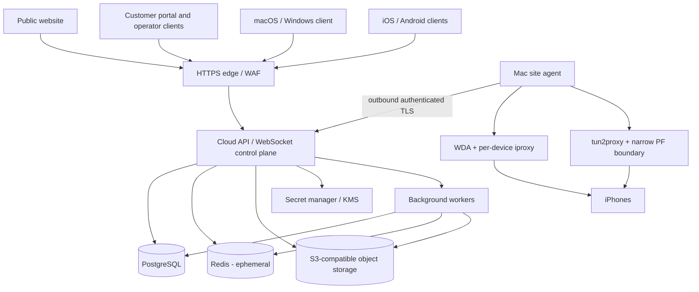

# Production architecture

Status: **accepted M01 direction; vendor and product decisions remain open**
Date: **2026-09-25**
Baseline: [M00_BASELINE.md](M00_BASELINE.md)

## Purpose

Productionize the existing Phone Farm control system incrementally. Preserve its proven device, lease,
authorization, site-agent, WDA, streaming, research and fail-closed network behavior while adding a commercial
cloud control plane.

This is not permission to replace the current server in one rewrite. M02 introduces stable service/persistence
interfaces; M03 and later milestones migrate bounded domains behind those interfaces.

## Architectural principles

1. The cloud owns authoritative customer/business state.
2. The Mac site agent owns USB, WDA, iproxy and local routing execution.
3. Clients use authenticated product APIs; they never connect to PostgreSQL, Redis, object storage or site-local
   tools directly.
4. A device has one active input owner, enforced at the final execution boundary.
5. Proxy-required devices fail closed unless device-originated verification proves the required route.
6. PostgreSQL is authoritative; Redis is disposable coordination; object storage holds large bytes; KMS/secret
   storage holds reusable secrets.
7. Tenant identity is derived from an authenticated membership, never trusted from a client-supplied ID.
8. Commands are typed product operations. No generic remote shell is introduced.
9. Migrations preserve compatibility, provide reconciliation evidence and retain the legacy store until rollback
   and restore are proven.
10. Test or CI evidence is never represented as physical-hardware or operational evidence.

## Target topology



## Component responsibilities

### Public website

Marketing, security, pricing, downloads, documentation, support, privacy, terms, login, signup and deletion-entry
pages. It owns no authorization decision and embeds no service credentials.

### Customer/operator portal

Organization, member, site, device, account, billing, security, session, audit and operations UI. UI visibility is
not authorization; every sensitive API operation is independently checked.

### Cloud API and WebSocket control plane

- authenticates users and site agents;
- derives organization/workspace context from membership;
- enforces permissions, entitlements and resource ownership;
- owns durable command/task/approval state;
- sends typed commands to the correct site;
- correlates acknowledgements, audit events and failures;
- authorizes object operations and returns short-lived signed access;
- exposes health without leaking tenant or infrastructure detail.

Initially this can remain a modular Node deployment. Productionization does not require premature microservices.
Bounded modules and separate worker processes can be extracted when reliability or scale requires them.

### Background workers

Process emails, webhooks, retention/deletion, migration/reconciliation, exports, AI/research work and other
retryable operations. Workers use PostgreSQL state transitions and idempotency keys; Redis may coordinate but is
never their only record.

### PostgreSQL

Authoritative organizations, identity, memberships, sessions, sites/devices, tasks, approvals, research metadata,
network metadata, file ownership, notifications, billing/entitlements, audit and incident state. Application
authorization remains primary; Row-Level Security is defense in depth.

### Redis

Rate limits, short-lived locks, WebSocket presence, cache and bounded idempotency windows. Loss of Redis may reduce
availability but must not grant access, duplicate physical input, lose billing state or consume an approval twice.

### Object storage

Screenshots, recordings, research evidence, uploads, diagnostics and exports. PostgreSQL owns metadata and tenant
authorization. Object keys are opaque and never sufficient for access.

### Secret manager / KMS

Proxy, SMTP, AI-provider, billing-webhook, signing and service credentials. PostgreSQL stores references and safe
metadata, not reusable plaintext secrets.

### Mac site agent

Discovers trusted iPhones, starts WDA and iproxy per UDID, manages streaming, performs deterministic device input,
executes opt-in network routing through the existing narrow privilege boundary, reports health and maintains one
outbound authenticated cloud connection. It retains only documented local configuration, cache, reconciliation
state and diagnostics.

## Primary flows

### Operator device command

```text
operator session
  -> organization membership + capability + entitlement
  -> device assignment/access check
  -> acquire/verify device lease generation
  -> persist typed command with idempotency key
  -> route to owning online site
  -> site revalidates device + generation immediately before input
  -> execute one deterministic action
  -> acknowledge applied/failed/uncertain
  -> persist result + correlated audit event
```

Timeout is not proof an action failed. Uncertain physical results are reconciled before an unsafe retry.

### Research/AI action

```text
durable task
  -> authorized account/device/provider selection
  -> observation/evidence
  -> untrusted structured model result
  -> schema + budget + policy + approval validation
  -> current lease/access recheck
  -> deterministic device action
  -> result verification
  -> research observation + platform action + audit
```

Security challenges, ambiguous visible state and prompt injection indicators cause human intervention, not bypass.

### File/evidence access

```text
client request
  -> authenticated membership
  -> exact resource authorization
  -> PostgreSQL metadata lookup
  -> short-lived signed object operation
  -> object storage
```

### Site enrollment and command link

Enrollment creates a revocable site identity. The agent connects outbound over TLS, proves that identity, advertises
only its local inventory and accepts only versioned typed commands. Commands carry organization/site/device,
correlation, lease generation, expiry and idempotency context.

## Availability and consistency

- PostgreSQL transactions protect authoritative state transitions.
- Database uniqueness/locking protects active leases, webhook events and approval consumption.
- Transactional outbox records external work in the same commit as its business transition.
- Site/device execution is asynchronous and explicitly acknowledges `applied`, `failed` or `uncertain`.
- Redis outage fails safe; clients may lose presence/caching but not authorization truth.
- Object-store outage blocks byte operations while metadata remains consistent and retryable.
- Site outage makes its devices unavailable without affecting other sites.
- One phone's WDA/routing failure remains isolated from other phones.

## Incremental migration

1. M01: approve/revise these boundaries and ADRs.
2. M02: extract service and persistence interfaces around current implementations with no behavior change.
3. M03: introduce database runtime, migrations, test database, health and transaction helpers.
4. M04+: migrate identity/organization first, then one domain at a time using import manifests, parity checks and
   explicit authority switches.
5. Retain legacy files read-only until migration acceptance and restore testing succeeds.

## Explicit non-goals for this architecture step

- selecting a cloud, identity or billing vendor;
- inventing prices, launch countries, legal text or retention periods;
- moving WDA/USB work to the cloud;
- adding generic site-agent command execution;
- enabling routing without explicit configuration and acceptance;
- declaring native mobile, signed releases or hardware behavior complete.

## Owner decisions required

- company/legal publisher, product name and production domain;
- repository licensing/visibility model;
- launch countries and data residency;
- identity provider versus internally operated identity;
- billing provider, plans and prices;
- retention/deletion periods;
- cloud provider/regions and availability tier;
- native mobile launch priority and distribution model.
