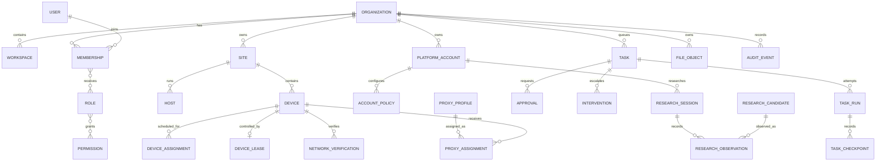

# Reconciled domain model

Status: **accepted M01 direction**
Date: **2026-09-25**
Sources: current code and [M00_BASELINE.md](M00_BASELINE.md), reconciled with the proposed database blueprint.

## Model rules

- `Organization` is the top-level tenant.
- `Workspace` is an optional organization subdivision, not a synonym for every current team/account concept.
- Immutable IDs are UUIDs. Usernames, labels, handles, endpoints and device display names are mutable attributes.
- Every tenant-owned aggregate has a direct or enforceable path to `organization_id`.
- Server-verified membership selects tenant context; client IDs only select among contexts already authorized.
- Cross-domain references that can create a tenant leak use composite tenant integrity where practical.
- Physical execution identity remains distinct from cloud business identity.

## Bounded contexts

| Context | Core aggregates | Current implementation mapping |
| --- | --- | --- |
| Tenancy | Organization, Workspace, OrganizationSettings | No organization record; `teamId` and research workspace are partial legacy boundaries |
| Identity | User, Email, Membership, Role, Permission, Invitation, Session, MFA, SecurityEvent | `operators.config.json`, explicit role capabilities, file sessions, TOTP/recovery fields |
| Billing | Plan, Customer, Subscription, Entitlement, Usage | Not implemented |
| Fleet | Site, SiteCredential, Host, Device, Capability, HealthEvent, Assignment | Site store, device registry/provisioner, monitor metadata, assignment store |
| Control | DeviceLease, Command, CommandResult | In-memory lease generation, durable task/hold state, WebSocket actions/site RPC |
| Automation | Task, Run/Attempt, Checkpoint, Schedule, ProviderSelection | Task queue, research runner, model selection |
| Accounts/Policy | PlatformAccount, AccountPolicy | Research account definitions and policy stores |
| Research | Session, Candidate, Observation, Tag, PlatformAction | Per-account run documents, candidate index, evidence references and action mirrors |
| Human control | Approval, Intervention | Approval store and intervention queue |
| Network | ProxyProfile, ProxyAssignment, NetworkVerification | Encrypted proxy pool, assignment lease, verifier and USB/routing state |
| Storage | FileObject, FileReference | Device files and research evidence on local disk |
| Notification | Notification, DeliveryAttempt | Account notification outbox plus SMTP sender state |
| Audit/Operations | AuditEvent, Incident | JSONL audit; no durable incident domain |

## High-level relationships

## Identity and tenancy reconciliation

### Organization

New authoritative tenant. It owns memberships, sites, devices, platform accounts, policies, tasks, research,
network configuration, files, billing and audit visibility.

### Workspace

Optional sub-boundary for teams or research/account grouping. Whether workspaces are exposed commercially is an
owner decision. Implementation must support an organization without a workspace and must not force current
`teamId` values to become workspace IDs automatically.

### Current `teamId`

A legacy authorization grouping used for people, assignments and queue boundaries. During migration it becomes
either a workspace reference or an organization-local team attribute only after reconciliation. Unknown/null
values fail closed for team-scoped management.

### User and membership

`User` represents the person/login identity. `Membership` binds that user to one organization with status and
roles. A username is no longer a foreign key. Historical records reference immutable user/membership IDs and keep
safe actor snapshots where legally justified.

### Roles and permissions

Current explicit capability strings are the seed permission vocabulary. Roles are organization-configurable
bundles, while server policies still check resource ownership and state. `Owner`, `Billing Admin`, `Researcher`
and `Reviewer` are proposed additions; exact default bundles require product/security approval.

## Fleet and control invariants

1. A physical UDID can map to at most one active logical device per site.
2. A hub-visible remote ID is a transport identifier, not the database primary key.
3. At most one active input lease exists for a device.
4. Lease acquisition/transfer and task binding are transactional.
5. Every command carries the expected lease generation and expires.
6. Site and device must belong to the same organization.
7. A disconnected device is not silently deleted and a health value is not ownership.
8. Local provisioning preferences may remain site-local but reconcile to the cloud device identity.

## Task and approval invariants

1. Task admission requires a supported worker kind and current account/device authorization.
2. One attempt claims a queued task at a time.
3. Checkpoints append to an attempt and survive worker restart.
4. Approval is bound to exact organization, account, action, target, content digest and expiry.
5. Approval consumption and action transition happen once in one transaction.
6. Timeout/transport loss may produce `uncertain`; it must not trigger a blind visible-action retry.
7. Human takeover invalidates AI execution before the next physical action.

## Research reconciliation

Current run documents combine sessions, candidates, observations, dedup indexes and review state. Production
normalization separates:

- `ResearchCandidate`: durable content identity per organization/platform/stable ID or canonical URL;
- `ResearchSession`: one bounded research execution;
- `ResearchObservation`: a candidate observed during a session with metrics/text/evidence/reason/score;
- `PlatformAction`: an observed or attempted external action linked to candidate/task/approval/device;
- review state/history: explicit actor/time transitions rather than an overwritten candidate field.

Migration must preserve `first_seen_at`, latest human review, run membership, duplicate aliases and exact comment
text. A candidate is not globally unique across organizations.

## Network reconciliation

- `ProxyProfile` stores safe endpoint metadata plus a secret reference, never a raw reusable password.
- `ProxyAssignment` is historical; one active assignment per device.
- `NetworkVerification` is immutable evidence with expiry and policy results.
- Local interface names, TUN identifiers, PIDs and transient USB IP observations remain host/runtime state unless an
  operational event is required for audit.
- `PROTECTED` is a derived current decision, not an editable database flag.

## File and evidence reconciliation

`FileObject` owns organization/workspace, opaque object key, content type, byte length, checksum, classification,
retention and creator. Domain records use typed references. Original filenames are display metadata, never paths or
authorization boundaries.

## Audit model

Audit events are append-oriented facts with actor, action, resource, result, organization, correlation, site,
device, source and redacted metadata. Normal product code cannot update/delete audit rows. Privacy/retention rules
may anonymize permitted fields through a separate audited operation.

## Concepts not promoted to first-class entities yet

- `AIWorker`: initially deployment/process metadata plus task-run provider/model fields; add a table only if workers
  need durable identity, credentials or assignment policy.
- every device capability: stable searchable capabilities may use rows; volatile WDA/runtime health remains events
  or structured state.
- every external event bus message: start with a transactional outbox; do not require Kafka before measured need.

## Owner decisions required

- whether workspaces are customer-visible and billable;
- whether one user may belong to multiple organizations at launch;
- default roles and who may create custom roles;
- identity provider versus internally operated identity;
- retention/anonymization rules for users, platform handles, evidence, audit and billing;
- which platform account metadata is legally/contractually allowed;
- billing plans, usage units and entitlement definitions.
