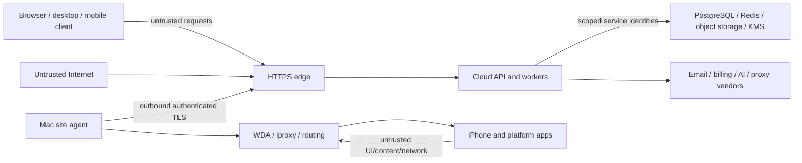

# Trust boundaries

Status: **accepted M01 direction**
Date: **2026-09-25**

## Boundary map

## Trust zones

| Zone | Trusted for | Never trusted for |
| --- | --- | --- |
| Public client | Holding its own short-lived session, rendering authorized data | Role, tenant, entitlement, object ownership or command authorization |
| HTTPS edge | TLS termination, request limits, routing | Product authorization or tenant derivation |
| Cloud API | Authentication, authorization, business invariants, command coordination | Model output, client IDs, vendor callbacks without verification |
| Background worker | Its scoped job and service permissions | Cross-tenant work without explicit tenant context |
| PostgreSQL | Authoritative committed relational state | Reusable secrets or large binary evidence |
| Redis | Bounded ephemeral coordination | Sole copy of leases, approvals, billing, tasks or authorization |
| Object storage | Durable bytes by opaque key | Product authorization based on key knowledge |
| Secret manager/KMS | Reusable secret material and encryption operations | General business data or browser access |
| Mac site agent | Local device inventory and deterministic physical execution | Commercial identity/billing authority or generic remote commands |
| WDA/iproxy/routing | Device automation and transport primitives | User/tenant authorization decisions |
| iPhone/platform content | Observed device/UI state | Instructions, policy, approval or trusted model context |
| External vendors | Contracted operation after scoped authenticated call | Internal entitlement or tenant authority |

## Identity types

- **Human user**: authenticates to the cloud; acts through one or more organization memberships.
- **Site identity**: revocable service identity bound to one organization/site installation.
- **Host instance**: one running site-agent installation with version and heartbeat.
- **Cloud service**: API, migrator, worker, audit writer or operations reader with separate least-privilege identity.
- **External provider**: billing/email/AI/proxy webhook or API identity validated per provider.
- **Device**: inventory resource, not an authentication principal by itself.

## Required checks by crossing

### Client to cloud

- HTTPS only in production;
- secure session/token storage, CSRF protection where cookie-authenticated, strict origin/CORS policy;
- current user/session/membership resolution;
- permission, entitlement, organization and exact resource checks;
- request schema, size and idempotency validation;
- redacted correlated audit.

### Cloud to data services

- separate non-owner database roles;
- transaction-local verified tenant context;
- RLS defense in depth and composite tenant FKs for high-risk relationships;
- scoped object/KMS permissions;
- encrypted transport and storage;
- no secret values in SQL logs, traces or error payloads.

### Cloud to site

- agent-initiated outbound TLS;
- enrollment followed by rotatable/revocable site credentials;
- version compatibility negotiation;
- typed allow-listed commands only;
- organization/site/device binding;
- correlation ID, expiry, idempotency key and expected lease generation;
- acknowledgements that distinguish applied, failed and uncertain;
- bounded payloads, heartbeat, timeout and emergency revocation.

### Site to device/tooling

- resolved absolute tool paths;
- one WDA and scoped `iproxy -u <UDID>` pipeline per phone;
- revalidate access/lease generation immediately before input;
- narrow no-shell argument arrays;
- narrowly scoped privilege boundary for routing;
- per-device failure containment and diagnostics redaction.

### Cloud to external vendors

- credentials from KMS/secret manager;
- TLS and bounded timeouts;
- webhook signature, timestamp and replay validation;
- idempotent event storage;
- provider output treated as untrusted;
- no vendor response directly grants product authorization.

## Administrative boundary

Production operators must not use application-owner or database-owner identities for ordinary requests. Break-glass
access is separate, time-bounded, MFA-protected and audited. Support personnel see only the minimum tenant data
needed for an approved case.

## Local/offline boundary

Site-local cache exists to reconnect safely, not to create a second business authority. Each cached item must state:

- cloud identity and version/revision;
- whether it may execute while offline;
- expiry and reconciliation rule;
- what happens on conflict or revocation.

Default: no new cloud-authorized physical action executes offline. Safety stop and local network fail-close remain
available without cloud connectivity.
